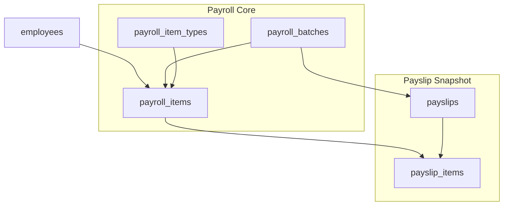
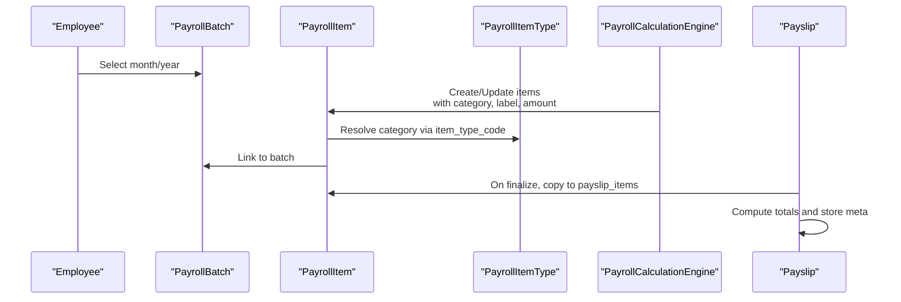
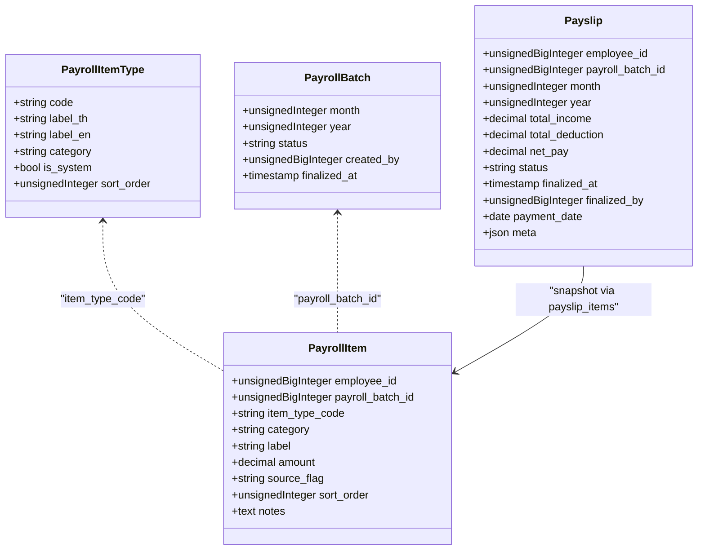
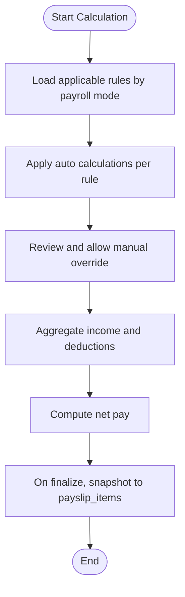
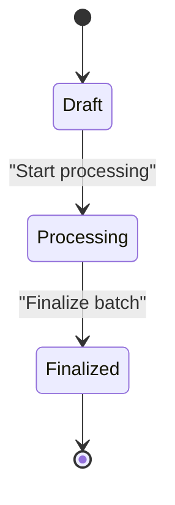
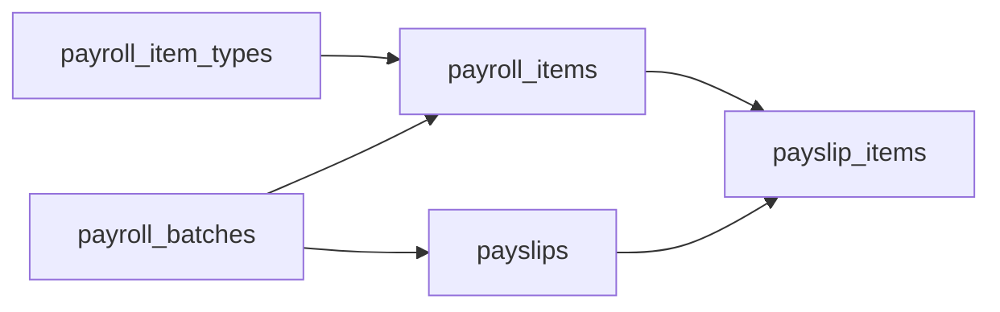

# PayrollItem Entity

<cite>
**Referenced Files in This Document**
- [0001_01_01_000007_create_payroll_tables.php](file://database/migrations/0001_01_01_000007_create_payroll_tables.php)
- [0001_01_01_000009_create_payslips_tables.php](file://database/migrations/0001_01_01_000009_create_payslips_tables.php)
- [AGENTS.md](file://AGENTS.md)
</cite>

## Table of Contents
1. [Introduction](#introduction)
2. [Project Structure](#project-structure)
3. [Core Components](#core-components)
4. [Architecture Overview](#architecture-overview)
5. [Detailed Component Analysis](#detailed-component-analysis)
6. [Dependency Analysis](#dependency-analysis)
7. [Performance Considerations](#performance-considerations)
8. [Troubleshooting Guide](#troubleshooting-guide)
9. [Conclusion](#conclusion)
10. [Appendices](#appendices)

## Introduction
This document provides comprehensive documentation for the PayrollItem entity, focusing on the structure of individual payroll components (income items, deductions, and allowances), classification system, source tracking, calculation methodology, and operational workflows. It explains how PayrollItem relates to payroll batches, employees, and rule configurations, and covers state management, approval workflows, audit trail requirements, validation rules, and practical examples of item types and state transitions.

## Project Structure
The PayrollItem entity is part of the payroll subsystem defined by database migrations and documented business rules. The relevant schema elements include:
- Payroll item types table defining item categories and metadata
- Payroll batches table defining processing periods and statuses
- Payroll items table representing individual income/deduction entries linked to employees and batches
- Payslips and payslip items tables capturing finalized snapshots for reporting and PDF generation

**Diagram sources**
- [0001_01_01_000007_create_payroll_tables.php:11-51](file://database/migrations/0001_01_01_000007_create_payroll_tables.php#L11-L51)
- [0001_01_01_000009_create_payslips_tables.php:11-43](file://database/migrations/0001_01_01_000009_create_payslips_tables.php#L11-L43)

**Section sources**
- [0001_01_01_000007_create_payroll_tables.php:11-51](file://database/migrations/0001_01_01_000007_create_payroll_tables.php#L11-L51)
- [0001_01_01_000009_create_payslips_tables.php:11-43](file://database/migrations/0001_01_01_000009_create_payslips_tables.php#L11-L43)

## Core Components
This section documents the PayrollItem entity and related components, including fields, classifications, and relationships.

- Payroll Item Types
  - Purpose: Define item categories (income, deduction), labels, sort order, and system flags.
  - Key fields: code (unique), category (income/deduction), sort_order, is_system.
  - Relationship: PayrollItems reference item_type_code to inherit category and metadata.

- Payroll Batches
  - Purpose: Represent processing periods (month/year) with status (draft, processing, finalized).
  - Key fields: month, year, status, created_by, finalized_at.
  - Relationship: PayrollItems belong to a PayrollBatch; Payslips optionally reference a PayrollBatch.

- Payroll Items
  - Purpose: Individual income/deduction records for an employee within a batch.
  - Key fields: employee_id, payroll_batch_id, item_type_code, category, label, amount, source_flag, sort_order, notes.
  - Relationships: Foreign keys to employees and payroll_batches; indexed by employee_id and payroll_batch_id.

- Payslips and Payslip Items
  - Purpose: Finalized snapshot of payroll items for a specific month/year and employee.
  - Key fields: employee_id, payroll_batch_id, month, year, total_income, total_deduction, net_pay, status, finalized_at, finalized_by, payment_date, meta.
  - Relationship: Copy of aggregated items stored in payslip_items with category and amount.

**Section sources**
- [0001_01_01_000007_create_payroll_tables.php:11-51](file://database/migrations/0001_01_01_000007_create_payroll_tables.php#L11-L51)
- [0001_01_01_000009_create_payslips_tables.php:11-43](file://database/migrations/0001_01_01_000009_create_payslips_tables.php#L11-L43)
- [AGENTS.md:438-506](file://AGENTS.md#L438-L506)

## Architecture Overview
The PayrollItem lifecycle spans creation, categorization, calculation, review, and finalization. The following diagram maps the major steps and entities involved.

**Diagram sources**
- [0001_01_01_000007_create_payroll_tables.php:35-51](file://database/migrations/0001_01_01_000007_create_payroll_tables.php#L35-L51)
- [0001_01_01_000009_create_payslips_tables.php:11-43](file://database/migrations/0001_01_01_000009_create_payslips_tables.php#L11-L43)
- [AGENTS.md:498-506](file://AGENTS.md#L498-L506)

## Detailed Component Analysis

### PayrollItem Data Model
- Identity and References
  - employee_id: Links to the employee record.
  - payroll_batch_id: Links to the processing batch.
  - item_type_code: Links to payroll_item_types.code to inherit category and metadata.
- Classification and Presentation
  - category: Derived from payroll_item_types.category (income/deduction).
  - label: Human-readable name for the item.
  - sort_order: Controls presentation order within a batch.
- Monetary and Source Tracking
  - amount: Stored as decimal with precision suitable for currency.
  - source_flag: Indicates origin of the value (auto, manual, override, master, rule_applied).
  - notes: Optional field for explanations or reasons.
- Indexing and Integrity
  - Composite index on (employee_id, payroll_batch_id) supports efficient lookups.
  - Cascading delete ensures cleanup when employee or batch is removed.

**Diagram sources**
- [0001_01_01_000007_create_payroll_tables.php:11-51](file://database/migrations/0001_01_01_000007_create_payroll_tables.php#L11-L51)
- [0001_01_01_000009_create_payslips_tables.php:11-43](file://database/migrations/0001_01_01_000009_create_payslips_tables.php#L11-L43)

**Section sources**
- [0001_01_01_000007_create_payroll_tables.php:35-51](file://database/migrations/0001_01_01_000007_create_payroll_tables.php#L35-L51)
- [0001_01_01_000009_create_payslips_tables.php:11-43](file://database/migrations/0001_01_01_000009_create_payslips_tables.php#L11-L43)

### Item Classification System
- Categories
  - income: Adds to total_income on payslip generation.
  - deduction: Subtracts from total_income to compute net_pay.
- Metadata
  - payroll_item_types defines category and sort_order for consistent grouping and ordering across batches.

**Section sources**
- [0001_01_01_000007_create_payroll_tables.php:11-20](file://database/migrations/0001_01_01_000007_create_payroll_tables.php#L11-L20)
- [AGENTS.md:440-444](file://AGENTS.md#L440-L444)

### Source Tracking (Auto/Manual/Override/Master/Rule Applied)
- Purpose: Maintain auditability and transparency of how item amounts originate.
- Flags
  - auto: Generated automatically by rules or system.
  - manual: Entered by user during interactive editing.
  - override: Explicit override of a previously auto-generated value.
  - master: Reflects a master profile value (monthly-only vs. override).
  - rule_applied: Amount derived from applying a configured rule.
- UI and Workflow Implications
  - UI should display source badges and allow users to switch between master, monthly override, manual, and rule-applied states.
  - Users must be able to add notes/reasons for overrides.

**Section sources**
- [0001_01_01_000007_create_payroll_tables.php:43](file://database/migrations/0001_01_01_000007_create_payroll_tables.php#L43)
- [AGENTS.md:498-506](file://AGENTS.md#L498-L506)
- [AGENTS.md:528-546](file://AGENTS.md#L528-L546)

### Calculation Methodology
- Income/Deduction Composition
  - Total income and total deduction are computed from PayrollItem entries categorized as income or deduction respectively.
  - Net pay equals total_income minus total_deduction.
- Rule-Driven Generation
  - Rules engine produces auto amounts for items (e.g., OT, diligence allowance, performance bonus, late deduction, LWOP).
  - Users can override auto values with manual or override flags.
- Snapshot and PDF Rendering
  - On finalize, PayrollItem entries are copied to payslip_items with category and amount, and payslips stores totals and rendering meta for PDF generation.

**Diagram sources**
- [AGENTS.md:454-471](file://AGENTS.md#L454-L471)
- [0001_01_01_000009_create_payslips_tables.php:17-19](file://database/migrations/0001_01_01_000009_create_payslips_tables.php#L17-L19)

**Section sources**
- [AGENTS.md:440-444](file://AGENTS.md#L440-L444)
- [0001_01_01_000009_create_payslips_tables.php:17-19](file://database/migrations/0001_01_01_000009_create_payslips_tables.php#L17-L19)

### Relationship to Payroll Batch, Employee, and Rule Configurations
- Employee linkage
  - Each PayrollItem belongs to a single employee and is scoped to a payroll batch.
- Batch linkage
  - PayrollItems are grouped by batch (month/year) and status (draft, processing, finalized).
- Rule configuration
  - PayrollItemType.code links items to rule definitions; category and sort_order influence aggregation and presentation.

**Section sources**
- [0001_01_01_000007_create_payroll_tables.php:37-40](file://database/migrations/0001_01_01_000007_create_payroll_tables.php#L37-L40)
- [0001_01_01_000007_create_payroll_tables.php:11-20](file://database/migrations/0001_01_01_000007_create_payroll_tables.php#L11-L20)

### Item State Management and Approval Workflows
- Draft vs. Finalized
  - PayrollItem exists in draft state until the batch is finalized.
  - Payslip has a separate status (draft, finalized) and finalized_at timestamp.
- Approval and Finalization
  - Finalization triggers snapshot to payslip_items and stores rendering meta for PDF generation.
- State Transitions
  - Typical flow: draft → processing → finalized.
  - UI states include locked, auto, manual, override, from_master, rule_applied, draft, finalized.

**Diagram sources**
- [0001_01_01_000007_create_payroll_tables.php:26](file://database/migrations/0001_01_01_000007_create_payroll_tables.php#L26)
- [0001_01_01_000009_create_payslips_tables.php:20](file://database/migrations/0001_01_01_000009_create_payslips_tables.php#L20)
- [AGENTS.md:528-538](file://AGENTS.md#L528-L538)

**Section sources**
- [0001_01_01_000007_create_payroll_tables.php:26](file://database/migrations/0001_01_01_000007_create_payroll_tables.php#L26)
- [0001_01_01_000009_create_payslips_tables.php:20](file://database/migrations/0001_01_01_000009_create_payslips_tables.php#L20)
- [AGENTS.md:528-538](file://AGENTS.md#L528-L538)

### Audit Trail Requirements
- What to Track
  - Who changed what, on which entity, for which field, with old/new values, action type, timestamp, and optional reason.
- High-priority Areas
  - Employee salary profile changes
  - Payroll item amount changes
  - Payslip finalize/unfinalize actions
  - Rule changes and module toggle changes
  - Social security configuration changes

**Section sources**
- [AGENTS.md:576-595](file://AGENTS.md#L576-L595)

### Validation Rules and Business Logic Enforcement
- Amount Calculations
  - Ensure total_income and total_deduction are derived from PayrollItem entries with category set correctly.
  - Net pay must equal total_income minus total_deduction.
- Source Verification
  - Enforce that manual/override items carry a reason/notes.
  - Prevent reductions to income by altering base salary; all reductions must be recorded as deductions.
- Business Logic
  - Deduction items must not be hidden from the user interface without explicit indication.
  - Rule changes must be validated against interdependencies and module toggles.

**Section sources**
- [AGENTS.md:562-566](file://AGENTS.md#L562-L566)
- [AGENTS.md:663-672](file://AGENTS.md#L663-L672)

### Examples of Item Types and Scenarios
- Income Items
  - Monthly salary: auto-generated from salary profile; can be overridden monthly.
  - Overtime pay: auto-calculated from OT rules; user may adjust.
  - Performance bonus: rule-applied based on thresholds; subject to approval.
  - Diligence allowance: auto-set under conditions; can be adjusted manually.
- Deductions
  - Late deduction: tiered or fixed per minute; rule-applied.
  - LWOP: day-based or proportional deduction; rule-applied.
  - Social security: calculated from configured rates and ceilings; rule-applied.
- State Transitions
  - Auto → Manual override with notes.
  - Master value → Monthly override.
  - Auto → Rule applied after recalculating.

**Section sources**
- [AGENTS.md:454-471](file://AGENTS.md#L454-L471)
- [AGENTS.md:488-497](file://AGENTS.md#L488-L497)
- [AGENTS.md:513-515](file://AGENTS.md#L513-L515)

## Dependency Analysis
The PayrollItem entity depends on PayrollItemType for classification and metadata, and on PayrollBatch for scoping. Finalization leads to snapshotting into payslip_items and payslips.

**Diagram sources**
- [0001_01_01_000007_create_payroll_tables.php:11-51](file://database/migrations/0001_01_01_000007_create_payroll_tables.php#L11-L51)
- [0001_01_01_000009_create_payslips_tables.php:11-43](file://database/migrations/0001_01_01_000009_create_payslips_tables.php#L11-L43)

**Section sources**
- [0001_01_01_000007_create_payroll_tables.php:11-51](file://database/migrations/0001_01_01_000007_create_payroll_tables.php#L11-L51)
- [0001_01_01_000009_create_payslips_tables.php:11-43](file://database/migrations/0001_01_01_000009_create_payslips_tables.php#L11-L43)

## Performance Considerations
- Indexing
  - Composite index on (employee_id, payroll_batch_id) improves lookup performance for batch-scoped queries.
- Decimal Precision
  - Use decimal(12,2) for monetary fields to avoid floating-point errors and ensure consistent rounding.
- Aggregation Efficiency
  - Pre-aggregate totals during batch processing and snapshot to payslips to minimize runtime computation.
- Audit Logging
  - Keep audit logs normalized and indexed by entity and timestamp for fast retrieval.

[No sources needed since this section provides general guidance]

## Troubleshooting Guide
- Discrepancies Between Auto and Manual Values
  - Verify source_flag and notes for manual/override rows.
  - Confirm rule applicability and effective dates.
- Missing Items in Payslip
  - Check that items were included in the finalized batch and that snapshot occurred.
- Incorrect Totals
  - Validate category assignments (income vs. deduction) and absence of illegal reductions in income.
- Audit Gaps
  - Ensure all state changes and rule modifications are logged with who, what, when, old/new values, and reason.

**Section sources**
- [AGENTS.md:576-595](file://AGENTS.md#L576-L595)
- [AGENTS.md:562-566](file://AGENTS.md#L562-L566)

## Conclusion
The PayrollItem entity is central to the payroll system’s rule-driven, transparent, and auditable processing. Its classification via payroll_item_types, source tracking, and integration with payroll_batches and payslips enable robust calculation, approval, and reporting workflows. Adhering to validation rules and maintaining detailed audit trails ensures compliance and maintainability across diverse payroll modes and configurations.

[No sources needed since this section summarizes without analyzing specific files]

## Appendices
- Glossary
  - Auto: Automatically generated by rules.
  - Manual: User-entered value.
  - Override: User-changed auto value with justification.
  - Master: Base profile value (monthly-only vs. override).
  - Rule Applied: Value derived from a configured rule.

[No sources needed since this section provides general guidance]