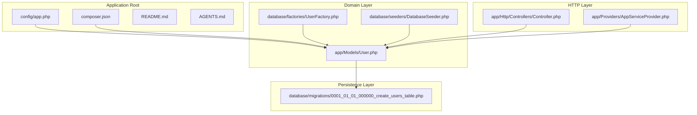
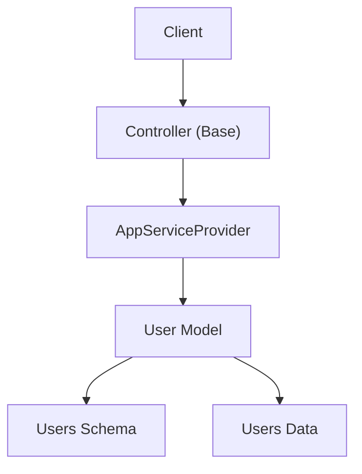
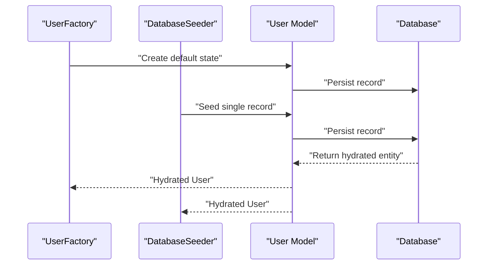
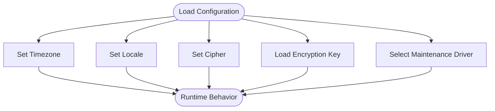
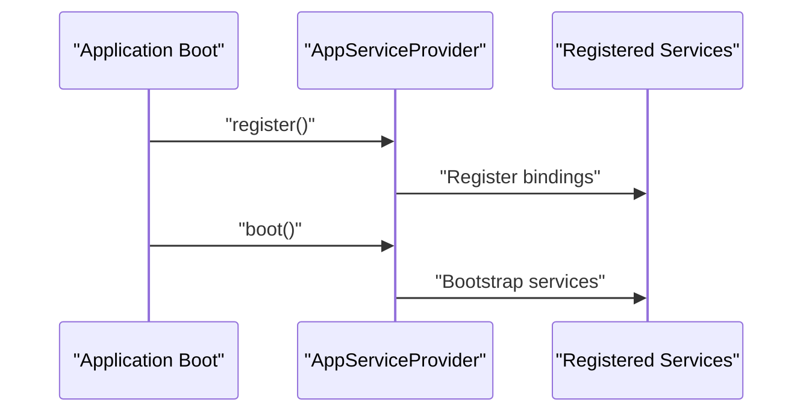
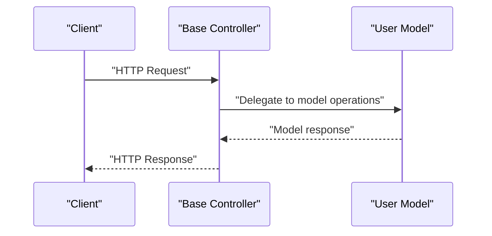
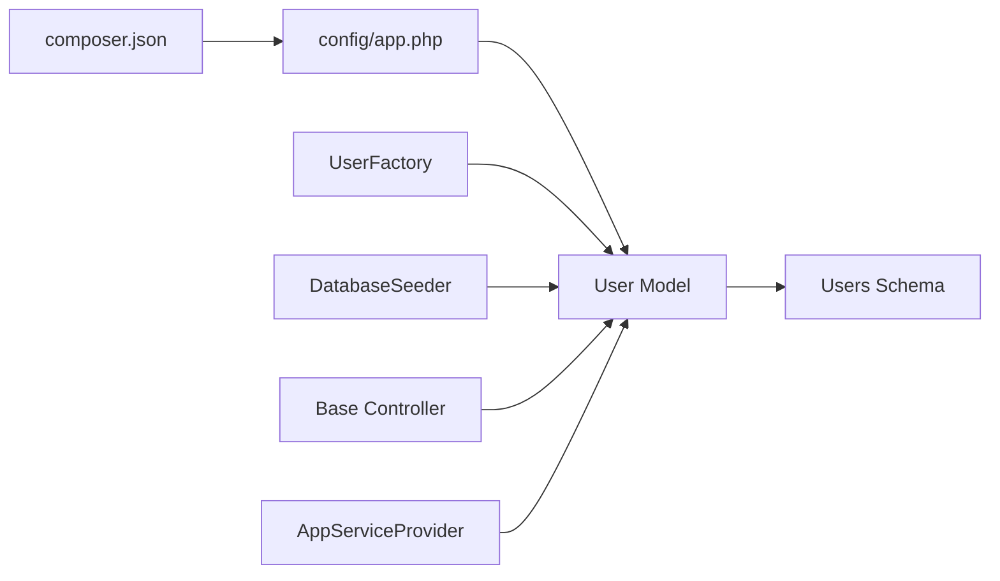

# Data Flow and Processing Patterns

<cite>
**Referenced Files in This Document**
- [AGENTS.md](file://AGENTS.md)
- [README.md](file://README.md)
- [composer.json](file://composer.json)
- [config/app.php](file://config/app.php)
- [app/Http/Controllers/Controller.php](file://app/Http/Controllers/Controller.php)
- [app/Models/User.php](file://app/Models/User.php)
- [app/Providers/AppServiceProvider.php](file://app/Providers/AppServiceProvider.php)
- [database/migrations/0001_01_01_000000_create_users_table.php](file://database/migrations/0001_01_01_000000_create_users_table.php)
- [database/factories/UserFactory.php](file://database/factories/UserFactory.php)
- [database/seeders/DatabaseSeeder.php](file://database/seeders/DatabaseSeeder.php)
</cite>

## Table of Contents
1. [Introduction](#introduction)
2. [Project Structure](#project-structure)
3. [Core Components](#core-components)
4. [Architecture Overview](#architecture-overview)
5. [Detailed Component Analysis](#detailed-component-analysis)
6. [Dependency Analysis](#dependency-analysis)
7. [Performance Considerations](#performance-considerations)
8. [Troubleshooting Guide](#troubleshooting-guide)
9. [Conclusion](#conclusion)

## Introduction
This document explains the data flow patterns and processing logic across the domain model of the Laravel application. It focuses on how data moves from initial entry through persistence and retrieval, and how state is managed during typical operations. The analysis covers master data (domain entities), transaction data (operations that modify state), and result data (outputs derived from processing). It also documents validation pipelines, source flag management, and data lineage tracking, along with performance implications of different data flow architectures.

## Project Structure
The repository hosts a Laravel skeleton application with minimal domain components. The structure emphasizes convention-driven development and separation of concerns:
- Application entry points and configuration live under the root and config directories.
- Domain models reside under app/Models.
- Controllers are under app/Http/Controllers.
- Service providers are under app/Providers.
- Persistence is handled via Eloquent models and database migrations under database/.

**Diagram sources**
- [config/app.php:1-127](file://config/app.php#L1-L127)
- [composer.json:1-86](file://composer.json#L1-L86)
- [app/Models/User.php:1-33](file://app/Models/User.php#L1-L33)
- [database/migrations/0001_01_01_000000_create_users_table.php:1-50](file://database/migrations/0001_01_01_000000_create_users_table.php#L1-L50)
- [database/factories/UserFactory.php:1-46](file://database/factories/UserFactory.php#L1-L46)
- [database/seeders/DatabaseSeeder.php:1-26](file://database/seeders/DatabaseSeeder.php#L1-L26)
- [app/Http/Controllers/Controller.php:1-9](file://app/Http/Controllers/Controller.php#L1-L9)
- [app/Providers/AppServiceProvider.php:1-25](file://app/Providers/AppServiceProvider.php#L1-L25)

**Section sources**
- [README.md:1-59](file://README.md#L1-L59)
- [AGENTS.md](file://AGENTS.md)
- [composer.json:1-86](file://composer.json#L1-L86)
- [config/app.php:1-127](file://config/app.php#L1-L127)

## Core Components
This section outlines the primary components involved in data flow and their roles:
- Domain Model: The User model encapsulates identity, authentication, and notification traits. It defines fillable attributes and hidden fields, and applies type casting for timestamps and hashed passwords.
- Factory: Generates realistic default states for User instances, including hashed passwords and remember tokens.
- Seeder: Seeds the database with initial User records for development and testing.
- Migration: Defines the schema for the users table and related authentication tables, establishing primary keys, uniqueness constraints, and indexes.
- Configuration: Sets application-wide defaults such as timezone, locale, encryption cipher, and maintenance mode driver.
- Base Controller: Provides a foundation for HTTP controllers.
- Service Provider: Registers and boots application services.

Key data flow responsibilities:
- Master data pattern: The User model and its migration define the canonical structure for user identities.
- Transaction data pattern: Factories and seeders represent transactions that create or update user records.
- Result data pattern: Query results from Eloquent return hydrated User instances ready for downstream processing.
- Validation pipeline: Eloquent’s fillable attributes and hidden fields act as implicit validation constraints for mass assignment.
- Source flag management: Factories and seeders act as explicit sources for data creation.
- Data lineage: Migrations establish schema lineage; factories and seeders provide operational lineage.

**Section sources**
- [app/Models/User.php:1-33](file://app/Models/User.php#L1-L33)
- [database/factories/UserFactory.php:1-46](file://database/factories/UserFactory.php#L1-L46)
- [database/seeders/DatabaseSeeder.php:1-26](file://database/seeders/DatabaseSeeder.php#L1-L26)
- [database/migrations/0001_01_01_000000_create_users_table.php:1-50](file://database/migrations/0001_01_01_000000_create_users_table.php#L1-L50)
- [config/app.php:1-127](file://config/app.php#L1-L127)
- [app/Http/Controllers/Controller.php:1-9](file://app/Http/Controllers/Controller.php#L1-L9)
- [app/Providers/AppServiceProvider.php:1-25](file://app/Providers/AppServiceProvider.php#L1-L25)

## Architecture Overview
The system follows a layered architecture:
- Presentation: HTTP controllers (via the base controller) handle requests.
- Application: Service providers register and bootstrap services.
- Domain: Eloquent models encapsulate business entities and state.
- Persistence: Migrations define schema; factories and seeders populate data.

**Diagram sources**
- [app/Http/Controllers/Controller.php:1-9](file://app/Http/Controllers/Controller.php#L1-L9)
- [app/Providers/AppServiceProvider.php:1-25](file://app/Providers/AppServiceProvider.php#L1-L25)
- [app/Models/User.php:1-33](file://app/Models/User.php#L1-L33)
- [database/migrations/0001_01_01_000000_create_users_table.php:1-50](file://database/migrations/0001_01_01_000000_create_users_table.php#L1-L50)

## Detailed Component Analysis

### User Model Data Flow
The User model governs identity and authentication state. Data enters through factories and seeders, persists via Eloquent, and exits as hydrated models for downstream use.

**Diagram sources**
- [database/factories/UserFactory.php:1-46](file://database/factories/UserFactory.php#L1-L46)
- [database/seeders/DatabaseSeeder.php:1-26](file://database/seeders/DatabaseSeeder.php#L1-L26)
- [app/Models/User.php:1-33](file://app/Models/User.php#L1-L33)
- [database/migrations/0001_01_01_000000_create_users_table.php:1-50](file://database/migrations/0001_01_01_000000_create_users_table.php#L1-L50)

Processing logic highlights:
- Mass assignment protection: Fillable attributes restrict which fields can be set en masse.
- Hidden fields: Sensitive fields are hidden from serialization.
- Type casting: Timestamps and hashed passwords are cast appropriately.
- Validation pipeline: Implicit validation occurs through fillable and hidden attributes, complemented by database constraints defined in migrations.

State management patterns:
- Immutable identifiers: The primary key is auto-generated and immutable.
- Timestamps: Created and updated timestamps track entity lifecycle.
- Authentication state: Password hashing and remember tokens maintain session state.

Data transformation processes:
- Creation: Factories transform raw defaults into persisted records.
- Seeding: Seeders transform predefined values into persisted records.
- Retrieval: Queries return hydrated models with applied casts.

Validation pipeline:
- Pre-persistence: Eloquent validates against fillable and hidden attributes.
- Post-persistence: Database constraints enforce uniqueness and integrity.

Source flag management:
- Factories and seeders act as explicit sources for master data creation.
- Operational lineage is tracked by the factory and seeder classes.

Data lineage tracking:
- Schema lineage: Migrations define the canonical structure.
- Operational lineage: Factories and seeders define how records were created.

Audit trail generation:
- Timestamps provide basic auditability for creation and updates.
- No dedicated audit logs are present in the current codebase.

**Section sources**
- [app/Models/User.php:1-33](file://app/Models/User.php#L1-L33)
- [database/factories/UserFactory.php:1-46](file://database/factories/UserFactory.php#L1-L46)
- [database/seeders/DatabaseSeeder.php:1-26](file://database/seeders/DatabaseSeeder.php#L1-L26)
- [database/migrations/0001_01_01_000000_create_users_table.php:1-50](file://database/migrations/0001_01_01_000000_create_users_table.php#L1-L50)

### Configuration and Environment Data Flow
Configuration influences runtime behavior and indirectly affects data handling:
- Timezone and locale impact timestamp formatting and localization.
- Cipher and encryption key affect secure field handling.
- Maintenance mode driver affects availability and error handling.

**Diagram sources**
- [config/app.php:1-127](file://config/app.php#L1-L127)

**Section sources**
- [config/app.php:1-127](file://config/app.php#L1-L127)

### Service Provider Bootstrapping
Service providers register and bootstrap application services, which can influence data handling behavior globally.

**Diagram sources**
- [app/Providers/AppServiceProvider.php:1-25](file://app/Providers/AppServiceProvider.php#L1-L25)

**Section sources**
- [app/Providers/AppServiceProvider.php:1-25](file://app/Providers/AppServiceProvider.php#L1-L25)

### Controller Layer
The base controller provides a foundation for HTTP controllers. While no payroll-specific controllers are present, the controller layer participates in the request-to-model flow.

**Diagram sources**
- [app/Http/Controllers/Controller.php:1-9](file://app/Http/Controllers/Controller.php#L1-L9)
- [app/Models/User.php:1-33](file://app/Models/User.php#L1-L33)

**Section sources**
- [app/Http/Controllers/Controller.php:1-9](file://app/Http/Controllers/Controller.php#L1-L9)

## Dependency Analysis
The application exhibits low coupling and high cohesion:
- Models depend on Eloquent and database schema.
- Factories depend on model definitions and hashing utilities.
- Seeders depend on factories and model creation APIs.
- Configuration influences model casting and application behavior.
- Controllers depend on models for data access.
- Service providers register and bootstrap services.

**Diagram sources**
- [composer.json:1-86](file://composer.json#L1-L86)
- [config/app.php:1-127](file://config/app.php#L1-L127)
- [app/Models/User.php:1-33](file://app/Models/User.php#L1-L33)
- [database/migrations/0001_01_01_000000_create_users_table.php:1-50](file://database/migrations/0001_01_01_000000_create_users_table.php#L1-L50)
- [database/factories/UserFactory.php:1-46](file://database/factories/UserFactory.php#L1-L46)
- [database/seeders/DatabaseSeeder.php:1-26](file://database/seeders/DatabaseSeeder.php#L1-L26)
- [app/Http/Controllers/Controller.php:1-9](file://app/Http/Controllers/Controller.php#L1-L9)
- [app/Providers/AppServiceProvider.php:1-25](file://app/Providers/AppServiceProvider.php#L1-L25)

**Section sources**
- [composer.json:1-86](file://composer.json#L1-L86)
- [config/app.php:1-127](file://config/app.php#L1-L127)

## Performance Considerations
- Data access patterns: Eager loading and selective attribute retrieval can reduce memory footprint and improve throughput.
- Validation overhead: Mass assignment restrictions and database constraints add safety but may increase write latency.
- Encryption costs: Hashing and encryption operations incur CPU overhead; batch operations should minimize repeated hashing.
- Concurrency: Database transactions and migrations should be designed to avoid contention and deadlocks.
- Caching: Consider caching frequently accessed user metadata to reduce database load.
- Indexing: Ensure appropriate indexes on unique fields (e.g., email) to optimize lookups.

[No sources needed since this section provides general guidance]

## Troubleshooting Guide
Common issues and resolutions:
- Authentication failures: Verify password hashing and remember token handling in the model.
- Data integrity errors: Confirm database constraints and unique indexes defined in migrations.
- Serialization issues: Ensure hidden fields are properly configured to prevent sensitive data exposure.
- Configuration drift: Validate timezone, locale, and cipher settings for consistent behavior across environments.
- Service registration problems: Confirm provider registration and boot sequences.

**Section sources**
- [app/Models/User.php:1-33](file://app/Models/User.php#L1-L33)
- [database/migrations/0001_01_01_000000_create_users_table.php:1-50](file://database/migrations/0001_01_01_000000_create_users_table.php#L1-L50)
- [config/app.php:1-127](file://config/app.php#L1-L127)
- [app/Providers/AppServiceProvider.php:1-25](file://app/Providers/AppServiceProvider.php#L1-L25)

## Conclusion
The application demonstrates a clean separation of concerns with clear data flow boundaries between presentation, application, domain, and persistence layers. The User model, factories, and migrations collectively define the master data pattern, while configuration and service providers influence runtime behavior. Current implementations provide implicit validation and basic auditability through timestamps. Extending the system to support complex payroll scenarios would involve introducing specialized models, controllers, and services, along with explicit audit logging and rule engines to manage hybrid modes and cascading effects.