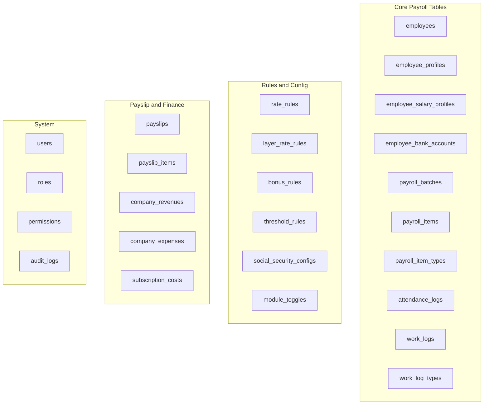
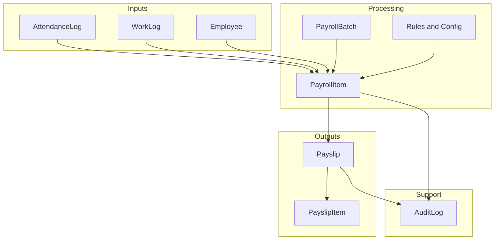
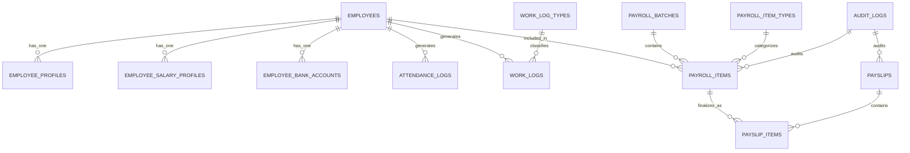
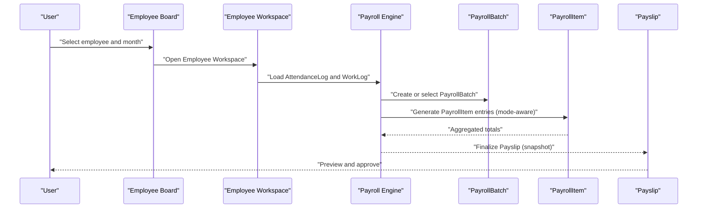
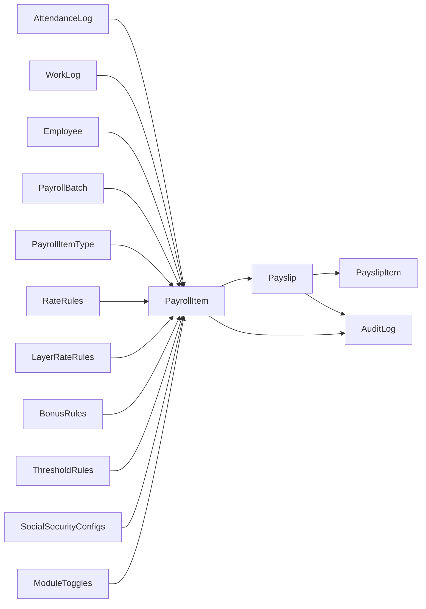

# Domain Model and Entities

<cite>
**Referenced Files in This Document**
- [AGENTS.md](file://AGENTS.md)
</cite>

## Table of Contents
1. [Introduction](#introduction)
2. [Project Structure](#project-structure)
3. [Core Components](#core-components)
4. [Architecture Overview](#architecture-overview)
5. [Detailed Component Analysis](#detailed-component-analysis)
6. [Dependency Analysis](#dependency-analysis)
7. [Performance Considerations](#performance-considerations)
8. [Troubleshooting Guide](#troubleshooting-guide)
9. [Conclusion](#conclusion)
10. [Appendices](#appendices)

## Introduction
This document describes the domain model and entities for the xHR payroll system. It focuses on the core business entities, their responsibilities, data flow patterns, and processing logic. It also documents database schema considerations, field definitions, business rule enforcement, and how different payroll modes influence entity relationships and data storage patterns. The content is derived from the repository’s design guidelines and is intended to be accessible to both technical and non-technical readers.

## Project Structure
The repository defines the payroll system’s domain model and operational guidelines. The domain model emphasizes record-based persistence, single-source-of-truth, rule-driven configuration, dynamic yet auditable editing, and maintainability. The suggested minimal set of database tables is provided, along with conventions for naming, data types, and audit requirements.

**Diagram sources**
- [AGENTS.md:387-435](file://AGENTS.md#L387-L435)

**Section sources**
- [AGENTS.md:121-150](file://AGENTS.md#L121-L150)
- [AGENTS.md:387-435](file://AGENTS.md#L387-L435)

## Core Components
This section outlines the core domain entities and their responsibilities, aligned with the payroll modes and processing logic described in the repository.

- Employee
  - Responsibility: Central identity and employment metadata for workers.
  - Typical fields: personal identifiers, employment status, payroll mode assignment, department/position linkage.
  - Relationship: One-to-one with EmployeeProfile; one-to-one with EmployeeSalaryProfile; one-to-many with AttendanceLog and WorkLog; one-to-one with EmployeeBankAccount; many-to-one with PayrollBatch via PayrollItem.

- EmployeeProfile
  - Responsibility: Stores personal and administrative details linked to Employee.
  - Relationship: One-to-one with Employee; supports audit trail via audit_logs.

- EmployeeSalaryProfile
  - Responsibility: Holds base salary and salary-related configurations per employee.
  - Relationship: One-to-one with Employee; referenced by PayrollItem during calculation.

- EmployeeBankAccount
  - Responsibility: Bank account details for payslip disbursement.
  - Relationship: One-to-one with Employee; referenced by Payslip/PayrollItem.

- PayrollBatch
  - Responsibility: Encapsulates a snapshot of payroll processing for a given period/month.
  - Relationship: Many-to-one with Employee via PayrollItem; many-to-many with PayrollItem through aggregation.

- PayrollItem
  - Responsibility: Individual income/deduction entries for an employee within a batch.
  - Relationship: Many-to-one with Employee, PayrollBatch, and PayrollItemType; aggregates into PayslipItems upon finalization.

- AttendanceLog
  - Responsibility: Records daily attendance events (check-in/out) used for OT, lateness, and LWOP calculations.
  - Relationship: Many-to-one with Employee; contributes to PayrollItem computation.

- WorkLog
  - Responsibility: Records work performed (e.g., freelance tasks) with quantities, rates, and amounts.
  - Relationship: Many-to-one with Employee; many-to-one with WorkLogType; contributes to PayrollItem computation.

- Payslip and PayslipItem
  - Responsibility: Finalized payroll records with income and deduction breakdowns; immutable snapshots after finalization.
  - Relationship: One-to-many between Payslip and PayslipItem; PayslipItems are populated from PayrollItem results upon finalization.

- Rules and Config Entities
  - RateRules, LayerRateRules, BonusRules, ThresholdRules, SocialSecurityConfigs, ModuleToggles: Define rule-driven behavior for payroll calculation and module activation.

- System Entities
  - Users, Roles, Permissions, AuditLogs: Support access control and auditability across the system.

**Section sources**
- [AGENTS.md:132-149](file://AGENTS.md#L132-L149)
- [AGENTS.md:387-416](file://AGENTS.md#L387-L416)
- [AGENTS.md:438-506](file://AGENTS.md#L438-L506)

## Architecture Overview
The payroll system follows a rule-driven, record-based architecture with clear separation of concerns:
- Data is persisted as records, not cell-based spreadsheets.
- Payroll modes determine how PayrollItem values are computed and stored.
- AttendanceLog and WorkLog feed into PayrollItem generation.
- Finalized PayrollItem results become Payslip/PayslipItem snapshots.
- Rules and configs govern calculation logic and module behavior.
- AuditLogs track all changes to sensitive fields.

**Diagram sources**
- [AGENTS.md:123-130](file://AGENTS.md#L123-L130)
- [AGENTS.md:397-416](file://AGENTS.md#L397-L416)
- [AGENTS.md:438-506](file://AGENTS.md#L438-L506)
- [AGENTS.md:576-595](file://AGENTS.md#L576-L595)

## Detailed Component Analysis

### Entity Responsibilities and Data Flow Patterns
- Employee
  - Owns identity and payroll mode; links to profile, salary profile, bank account, attendance/work logs, and payroll items.
  - Data flow: Employee → AttendanceLog/WorkLog → PayrollItem → Payslip/PayslipItem.
- EmployeeProfile
  - Provides personal/admin data; supports audit trail.
- EmployeeSalaryProfile
  - Supplies base salary and salary-related configuration; influences PayrollItem totals.
- EmployeeBankAccount
  - Supplies bank details for payslip disbursement; referenced by Payslip/PayrollItem.
- PayrollBatch
  - Periodic container for payroll results; aggregates PayrollItem entries.
- PayrollItem
  - Income/deduction line items; generated from AttendanceLog, WorkLog, and rules; becomes PayslipItem on finalization.
- AttendanceLog
  - Drives OT, lateness, and LWOP computations; feeds PayrollItem.
- WorkLog
  - Drives freelance and hybrid calculations; feeds PayrollItem.
- Payslip and PayslipItem
  - Immutable snapshot of payroll results; PDF rendered from Payslip/PayslipItem.

**Section sources**
- [AGENTS.md:132-149](file://AGENTS.md#L132-L149)
- [AGENTS.md:397-416](file://AGENTS.md#L397-L416)
- [AGENTS.md:567-573](file://AGENTS.md#L567-L573)

### Payroll Modes and Their Impact on Data Storage
The system supports multiple payroll modes, each influencing how PayrollItem values are calculated and stored:
- monthly_staff: Standard monthly salary plus OT, allowances, bonuses, and deductions.
- freelance_layer: Calculates earnings based on time and layer rates.
- freelance_fixed: Calculates earnings based on quantity and fixed rate.
- youtuber_salary: Similar to monthly_staff with youtuber-specific module toggles.
- youtuber_settlement: Net calculation after income minus expenses.
- custom_hybrid: Allows overrides and mixed calculation logic.

Mode selection affects:
- Which inputs (AttendanceLog vs WorkLog) are considered.
- Which rules apply (OT, allowances, thresholds, SSO).
- How PayrollItem entries are aggregated and stored.

**Section sources**
- [AGENTS.md:123-130](file://AGENTS.md#L123-L130)
- [AGENTS.md:440-487](file://AGENTS.md#L440-L487)

### Business Rules and Processing Logic
Key business rules enforced by the domain model:
- Total income and deductions formulas vary by mode.
- Diligence allowance defaults depend on lateness and LWOP.
- OT rules support minute/hour thresholds and enable flags.
- Late deduction supports fixed-per-minute and tier penalties with grace periods.
- LWOP supports day-based and proportional deductions.
- Freelance modes use duration and rate calculations.
- Social Security is configurable and applied according to effective date and tiers.
- Payslip editing distinguishes master, monthly override, manual item, and rule-generated values.

These rules are stored in dedicated configuration tables and applied during PayrollItem calculation.

**Section sources**
- [AGENTS.md:438-506](file://AGENTS.md#L438-L506)
- [AGENTS.md:387-416](file://AGENTS.md#L387-L416)

### Data Model Relationships
The following diagram shows core entity relationships and cardinalities:

**Diagram sources**
- [AGENTS.md:391-416](file://AGENTS.md#L391-L416)
- [AGENTS.md:576-595](file://AGENTS.md#L576-L595)

### Sample Data Structures and Typical Scenarios
Below are representative structures for key entities. These reflect the repository’s conventions and relationships.

- Employee
  - Fields: id, payroll_mode, department_id, position_id, is_active, timestamps.
  - Relationships: belongsTo EmployeeProfile, EmployeeSalaryProfile, EmployeeBankAccount; hasMany AttendanceLog, WorkLog, PayrollItem.

- EmployeeProfile
  - Fields: id, employee_id (FK), personal details, timestamps.
  - Relationships: belongsTo Employee; audited via AuditLog.

- EmployeeSalaryProfile
  - Fields: id, employee_id (FK), base_salary, effective_from, timestamps.
  - Relationships: belongsTo Employee; influences PayrollItem totals.

- EmployeeBankAccount
  - Fields: id, employee_id (FK), bank_name, account_number, account_name, timestamps.
  - Relationships: belongsTo Employee; referenced by Payslip/PayrollItem.

- PayrollBatch
  - Fields: id, year_month (YYYY-MM), status, created_by, timestamps.
  - Relationships: hasMany PayrollItem.

- PayrollItem
  - Fields: id, payroll_batch_id (FK), employee_id (FK), payroll_item_type, amount, source_flag, notes, timestamps.
  - Relationships: belongsTo Employee, PayrollBatch, PayrollItemType; becomes PayslipItem on finalization.

- AttendanceLog
  - Fields: id, employee_id (FK), log_date, check_in_minutes, check_out_minutes, late_minutes, early_leave_minutes, is_lwop, ot_minutes, timestamps.
  - Relationships: belongsTo Employee; contributes to PayrollItem.

- WorkLog
  - Fields: id, employee_id (FK), work_date, work_log_type_id (FK), quantity, duration_minutes, rate_per_unit, amount, timestamps.
  - Relationships: belongsTo Employee, WorkLogType; contributes to PayrollItem.

- Payslip and PayslipItem
  - Payslip: id, employee_id (FK), payroll_batch_id (FK), net_pay, rendered_meta, finalized_at, timestamps.
  - PayslipItem: id, payslip_id (FK), payroll_item_type, amount, source_flag, notes, timestamps.
  - Relationships: Payslip hasMany PayslipItem; populated from PayrollItem results upon finalization.

- Rules and Config
  - RateRules, LayerRateRules, BonusRules, ThresholdRules, SocialSecurityConfigs, ModuleToggles: define mode-specific calculations and toggles.

- AuditLog
  - Fields: id, actor_id, target_entity, target_field, old_value, new_value, action, reason, created_at.
  - Relationships: Audits PayrollItem and Payslip changes.

**Section sources**
- [AGENTS.md:387-435](file://AGENTS.md#L387-L435)
- [AGENTS.md:438-506](file://AGENTS.md#L438-L506)
- [AGENTS.md:576-595](file://AGENTS.md#L576-L595)

### Sequence of Payroll Processing
The following sequence illustrates how data flows from inputs to final payslips:

**Diagram sources**
- [AGENTS.md:513-515](file://AGENTS.md#L513-L515)
- [AGENTS.md:338-343](file://AGENTS.md#L338-L343)
- [AGENTS.md:567-573](file://AGENTS.md#L567-L573)

## Dependency Analysis
The domain model exhibits clear separation of concerns:
- Inputs (AttendanceLog, WorkLog) feed into PayrollItem.
- PayrollItem depends on Employee, PayrollBatch, and PayrollItemType.
- PayrollItem consolidates into Payslip; PayslipItems are immutable snapshots.
- Rules and configs (RateRules, LayerRateRules, BonusRules, ThresholdRules, SocialSecurityConfigs, ModuleToggles) drive calculation logic.
- AuditLog tracks changes to PayrollItem and Payslip.

**Diagram sources**
- [AGENTS.md:397-416](file://AGENTS.md#L397-L416)
- [AGENTS.md:387-416](file://AGENTS.md#L387-L416)
- [AGENTS.md:576-595](file://AGENTS.md#L576-L595)

**Section sources**
- [AGENTS.md:387-435](file://AGENTS.md#L387-L435)
- [AGENTS.md:576-595](file://AGENTS.md#L576-L595)

## Performance Considerations
- Indexing: Ensure foreign keys and frequently queried columns (e.g., employee_id, payroll_batch_id, year_month) are indexed.
- Partitioning: Consider partitioning PayrollBatch and Payslip by year_month for large datasets.
- Aggregation: Pre-aggregate totals per employee per batch to reduce runtime computation.
- Caching: Cache rule sets and module toggles to minimize repeated reads.
- Audit overhead: Limit audit logging for bulk operations; batch audit writes when feasible.

[No sources needed since this section provides general guidance]

## Troubleshooting Guide
Common issues and resolutions grounded in the repository’s design:
- Incorrect totals after edits
  - Verify source flags and ensure manual overrides are visible and audited.
  - Confirm the correct payroll mode is selected for the employee.
- Missing or incorrect OT/LWOP/allowances
  - Review AttendanceLog entries and OT thresholds; confirm applicable rules are enabled.
- Payslip not reflecting changes
  - Re-run finalization to refresh Payslip/PayslipItem snapshot.
- Audit discrepancies
  - Inspect AuditLog entries for who changed what and when; reconcile with manual overrides.

**Section sources**
- [AGENTS.md:521-527](file://AGENTS.md#L521-L527)
- [AGENTS.md:567-573](file://AGENTS.md#L567-L573)
- [AGENTS.md:576-595](file://AGENTS.md#L576-L595)

## Conclusion
The xHR payroll domain model emphasizes record-based persistence, rule-driven calculation, and auditability. Entities such as Employee, EmployeeProfile, EmployeeSalaryProfile, PayrollBatch, PayrollItem, AttendanceLog, and WorkLog form a cohesive data model that adapts to multiple payroll modes while maintaining data integrity. The suggested schema and conventions support MySQL/phpMyAdmin compatibility, dynamic editing, and future extensibility.

[No sources needed since this section summarizes without analyzing specific files]

## Appendices

### Appendix A: Database Schema Considerations
- Naming conventions: plural snake_case for tables; singular_snake_case for columns; FKs named <entity>_id.
- Data types: use unsigned integers for IDs; decimal for monetary fields; minutes/seconds for durations; timestamps for audit.
- Status flags: status and is_active for lifecycle control.
- phpMyAdmin compatibility: keep migrations and queries straightforward for easy inspection.

**Section sources**
- [AGENTS.md:418-427](file://AGENTS.md#L418-L427)
- [AGENTS.md:428-435](file://AGENTS.md#L428-L435)

### Appendix B: Payroll Modes and Calculation Highlights
- monthly_staff: base salary plus OT, allowances, bonuses, and deductions.
- freelance_layer: duration in minutes multiplied by rate per minute.
- freelance_fixed: quantity multiplied by fixed rate.
- youtuber_salary/settlement: mode-specific toggles and net-income calculations.
- custom_hybrid: supports overrides and mixed logic.

**Section sources**
- [AGENTS.md:123-130](file://AGENTS.md#L123-L130)
- [AGENTS.md:440-487](file://AGENTS.md#L440-L487)