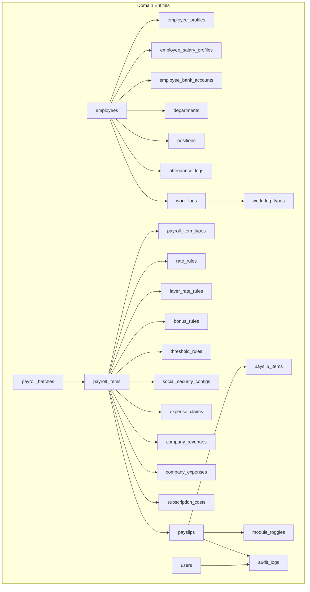
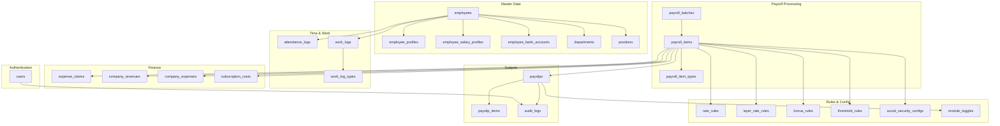
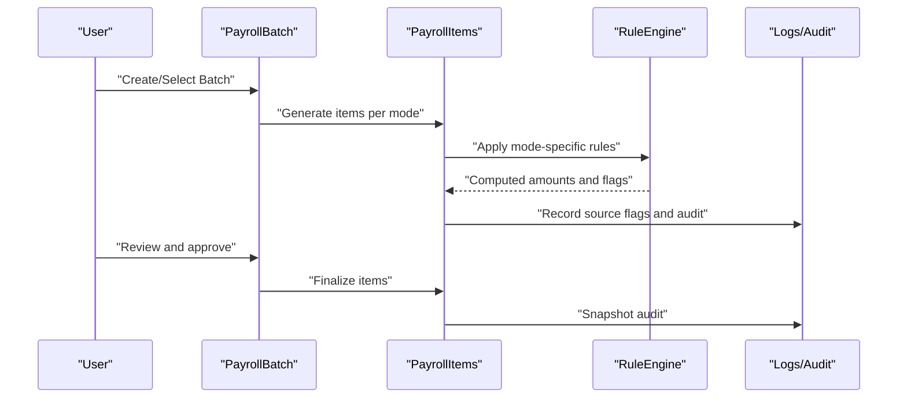
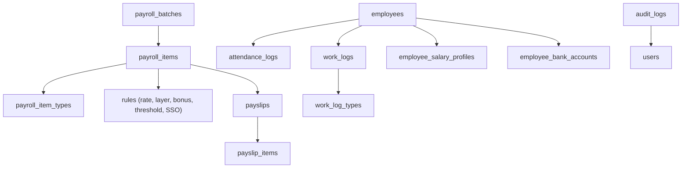

# Entity Relationship Mapping

<cite>
**Referenced Files in This Document**
- [AGENTS.md](file://AGENTS.md)
- [User.php](file://laravel-temp/app/Models/User.php)
- [create_users_table.php](file://laravel-temp/database/migrations/0001_01_01_000000_create_users_table.php)
</cite>

## Table of Contents
1. [Introduction](#introduction)
2. [Project Structure](#project-structure)
3. [Core Components](#core-components)
4. [Architecture Overview](#architecture-overview)
5. [Detailed Component Analysis](#detailed-component-analysis)
6. [Dependency Analysis](#dependency-analysis)
7. [Performance Considerations](#performance-considerations)
8. [Troubleshooting Guide](#troubleshooting-guide)
9. [Conclusion](#conclusion)
10. [Appendices](#appendices)

## Introduction
This document provides a comprehensive entity relationship mapping for the xHR Payroll & Finance System. It documents the domain model, core entities, their relationships, cardinalities, referential integrity rules, and data flow patterns across payroll modes. It also outlines inheritance hierarchies, polymorphic associations, composite entities, validation rules, cascade behaviors, and performance optimization strategies. The goal is to present a clear, maintainable, and scalable schema that supports dynamic data entry, rule-driven calculations, and auditability while remaining compatible with MySQL/phpMyAdmin environments.

## Project Structure
The repository includes a domain-focused guide and a minimal Laravel skeleton. The domain model and database guidelines are defined in the project guide, while the Laravel skeleton demonstrates foundational user/session management. The ERD focuses on the payroll and finance domain entities described in the guide.

**Diagram sources**
- [AGENTS.md](file://AGENTS.md)
- [User.php](file://laravel-temp/app/Models/User.php)
- [create_users_table.php](file://laravel-temp/database/migrations/0001_01_01_000000_create_users_table.php)

**Section sources**
- [AGENTS.md](file://AGENTS.md)
- [User.php](file://laravel-temp/app/Models/User.php)
- [create_users_table.php](file://laravel-temp/database/migrations/0001_01_01_000000_create_users_table.php)

## Core Components
This section defines the core entities and their roles within the xHR system, aligned with the domain model and database guidelines.

- employees: Stores employee identifiers and basic attributes. Links to profiles, salary profiles, bank accounts, departments, positions, and attendance/work logs.
- employee_profiles: Maintains personal and demographic details linked to employees.
- employee_salary_profiles: Stores base salary and salary-related configurations per employee.
- employee_bank_accounts: Stores bank account details per employee for payouts.
- departments: Department taxonomy for organizational structure.
- positions: Position taxonomy for job roles.
- payroll_batches: Batch container for monthly payroll runs.
- payroll_items: Individual income/deduction items generated per payroll mode.
- payroll_item_types: Type taxonomy for payroll items (e.g., salary, overtime, allowance).
- attendance_logs: Attendance records for monthly staff (check-in/out, late minutes, LWOP).
- work_logs: Work logs for freelancers and hybrid modes (date, type, quantity, rate, amount).
- work_log_types: Type taxonomy for work logs.
- rate_rules: Rate configuration rules for freelancers.
- layer_rate_rules: Layered rate rules for tiered calculations.
- bonus_rules: Configurable rules for performance bonuses.
- threshold_rules: Threshold rules for performance-based triggers.
- social_security_configs: Configurable Thailand SSO parameters (rates, ceilings).
- expense_claims: Employee expense claims.
- company_revenues: Revenue entries for financial reporting.
- company_expenses: Company operational expenses.
- subscription_costs: Recurring and fixed business costs.
- payslips: Finalized payslip snapshots with metadata.
- payslip_items: Line items copied from payroll items upon finalization.
- module_toggles: Feature/module enablement flags.
- audit_logs: Audit trail for changes across entities.
- users: Authentication and session management (Laravel skeleton).

**Section sources**
- [AGENTS.md](file://AGENTS.md)
- [User.php](file://laravel-temp/app/Models/User.php)
- [create_users_table.php](file://laravel-temp/database/migrations/0001_01_01_000000_create_users_table.php)

## Architecture Overview
The xHR system follows a rule-driven, record-based architecture with a strong emphasis on auditability and maintainability. The schema enforces referential integrity via foreign keys and supports dynamic editing with explicit source flags and audit logs. Payroll modes are supported through configurable rules and item types, enabling flexible calculations without hardcoding.

**Diagram sources**
- [AGENTS.md](file://AGENTS.md)
- [User.php](file://laravel-temp/app/Models/User.php)
- [create_users_table.php](file://laravel-temp/database/migrations/0001_01_01_000000_create_users_table.php)

## Detailed Component Analysis

### Entity Relationship Diagram (ERD)
The ERD below captures core entities, relationships, cardinalities, and referential integrity rules derived from the domain model and database guidelines.

```mermaid
erDiagram
USERS {
bigint id PK
string name
string email UK
datetime email_verified_at
string password
string remember_token
timestamps timestamps
}
EMPLOYEES {
bigint id PK
string external_id UK
string status
timestamps timestamps
}
EMPLOYEE_PROFILES {
bigint id PK
bigint employee_id FK
string personal_id
string first_name
string last_name
date birth_date
string gender
timestamps timestamps
}
EMPLOYEE_SALARY_PROFILES {
bigint id PK
bigint employee_id FK
decimal base_salary
timestamps timestamps
}
EMPLOYEE_BANK_ACCOUNTS {
bigint id PK
bigint employee_id FK
string bank_name
string account_number
string account_name
timestamps timestamps
}
DEPARTMENTS {
bigint id PK
string code
string name
timestamps timestamps
}
POSITIONS {
bigint id PK
string code
string name
timestamps timestamps
}
ATTENDANCE_LOGS {
bigint id PK
bigint employee_id FK
date log_date
int late_minutes
int early_minutes
boolean is_lwop
timestamps timestamps
}
WORK_LOGS {
bigint id PK
bigint employee_id FK
date work_date
bigint work_log_type_id FK
decimal quantity
decimal rate
decimal amount
timestamps timestamps
}
WORK_LOG_TYPES {
bigint id PK
string code
string name
timestamps timestamps
}
RATE_RULES {
bigint id PK
string code
string name
decimal rate_per_unit
timestamps timestamps
}
LAYER_RATE_RULES {
bigint id PK
string code
string name
decimal threshold
decimal rate_multiplier
timestamps timestamps
}
BONUS_RULES {
bigint id PK
string code
string name
decimal target_value
decimal bonus_amount
timestamps timestamps
}
THRESHOLD_RULES {
bigint id PK
string code
string name
decimal threshold
timestamps timestamps
}
SOCIAL_SECURITY_CONFIGS {
bigint id PK
date effective_from
decimal employee_rate_percent
decimal employer_rate_percent
decimal salary_ceiling
decimal max_monthly_contribution
timestamps timestamps
}
PAYROLL_BATCHES {
bigint id PK
year_month year_month
string status
timestamps timestamps
}
PAYROLL_ITEM_TYPES {
bigint id PK
string code
string name
string category
timestamps timestamps
}
PAYROLL_ITEMS {
bigint id PK
bigint payroll_batch_id FK
bigint employee_id FK
bigint payroll_item_type_id FK
decimal amount
string source_flag
timestamps timestamps
}
EXPENSE_CLAIMS {
bigint id PK
bigint employee_id FK
date claim_date
decimal amount
timestamps timestamps
}
COMPANY_REVENUES {
bigint id PK
date revenue_date
decimal amount
timestamps timestamps
}
COMPANY_EXPENSES {
bigint id PK
date expense_date
decimal amount
timestamps timestamps
}
SUBSCRIPTION_COSTS {
bigint id PK
date cost_date
decimal amount
timestamps timestamps
}
MODULE_TOGGLES {
bigint id PK
string module_name
boolean is_enabled
timestamps timestamps
}
PAYSLIPS {
bigint id PK
bigint employee_id FK
year_month year_month
decimal total_income
decimal total_deduction
decimal net_pay
json render_meta
timestamps timestamps
}
PAYSLIP_ITEMS {
bigint id PK
bigint payslip_id FK
bigint payroll_item_id FK
decimal amount
string source_flag
timestamps timestamps
}
AUDIT_LOGS {
bigint id PK
bigint user_id FK
string entity_type
bigint entity_id
string field_name
text old_value
text new_value
string action
timestamps timestamps
}
EMPLOYEES ||--o{ EMPLOYEE_PROFILES : "has_one"
EMPLOYEES ||--o{ EMPLOYEE_SALARY_PROFILES : "has_one"
EMPLOYEES ||--o{ EMPLOYEE_BANK_ACCOUNTS : "has_one"
EMPLOYEES ||--o{ ATTENDANCE_LOGS : "has_many"
EMPLOYEES ||--o{ WORK_LOGS : "has_many"
DEPARTMENTS ||--o{ EMPLOYEES : "has_many"
POSITIONS ||--o{ EMPLOYEES : "has_many"
WORK_LOGS }o--|| WORK_LOG_TYPES : "type"
PAYROLL_ITEMS }o--|| PAYROLL_ITEM_TYPES : "type"
PAYROLL_ITEMS }o--|| PAYROLL_BATCHES : "batch"
PAYSLIP_ITEMS }o--|| PAYSLIPS : "snapshot"
PAYSLIP_ITEMS }o--|| PAYROLL_ITEMS : "source_item"
AUDIT_LOGS }o--|| USERS : "performed_by"
EMPLOYEES ||--o{ PAYROLL_ITEMS : "generates"
EMPLOYEES ||--o{ EXPENSE_CLAIMS : "claims"
EMPLOYEES ||--o{ PAYSLIPS : "receives"
```

**Diagram sources**
- [AGENTS.md](file://AGENTS.md)
- [User.php](file://laravel-temp/app/Models/User.php)
- [create_users_table.php](file://laravel-temp/database/migrations/0001_01_01_000000_create_users_table.php)

### Relationship Cardinalities and Referential Integrity
- One-to-one
  - employees ↔ employee_profiles
  - employees ↔ employee_salary_profiles
  - employees ↔ employee_bank_accounts
- One-to-many
  - departments → employees
  - positions → employees
  - employees → attendance_logs
  - employees → work_logs
  - employees → expense_claims
  - employees → payslips
  - payroll_batches → payroll_items
  - payslips → payslip_items
- Many-to-one
  - work_logs → work_log_types
  - payroll_items → payroll_item_types
  - payroll_items → employees
  - payslip_items → payslips
  - payslip_items → payroll_items
  - audit_logs → users
- Composite and Polymorphic Associations
  - payroll_items represent composite results combining multiple rule-driven calculations; they do not form a strict inheritance hierarchy but encapsulate polymorphic item categories via payroll_item_types.

**Section sources**
- [AGENTS.md](file://AGENTS.md)

### Data Flow Patterns Across Payroll Modes
The system supports multiple payroll modes through configurable rules and item types. The typical flow is:

**Diagram sources**
- [AGENTS.md](file://AGENTS.md)

### Inheritance Hierarchies and Polymorphic Associations
- Inheritance: Not explicitly modeled as class inheritance in the schema; payroll item types serve as a taxonomy that categorizes items by function (income/deduction) and mode.
- Polymorphic Associations: payroll_items act as a polymorphic container for diverse item types; the association is resolved via payroll_item_types.

**Section sources**
- [AGENTS.md](file://AGENTS.md)

### Composite Entities
- payslips: Composite entity formed by aggregating payslip_items.
- payslip_items: Composite line items derived from payroll_items at finalization.
- payroll_items: Composite results of rule-driven calculations across multiple inputs (attendance, work logs, thresholds, rates).

**Section sources**
- [AGENTS.md](file://AGENTS.md)

### Relationship Validation Rules and Cascade Behaviors
- Referential Integrity
  - Foreign keys enforce referential integrity across entities (e.g., payroll_items.employee_id references employees.id).
- Validation Rules
  - Monetary fields use precise decimal types to prevent rounding errors.
  - Status flags and timestamps ensure consistent lifecycle tracking.
  - Unique constraints on identifiers (e.g., employee external_id) prevent duplicates.
- Cascade Behaviors
  - Soft deletes are recommended for entities where historical tracking is required (e.g., employees, payslips).
  - On delete actions for master data (e.g., employees) should be restricted or cascaded with careful audit logging to preserve audit trails.

**Section sources**
- [AGENTS.md](file://AGENTS.md)

### Performance Optimization Strategies
- Indexing
  - Add indexes on frequently filtered columns: employees.external_id, payroll_batches.year_month, payroll_items.employee_id, payslips.employee_id, audit_logs.entity_type.
- Partitioning
  - Partition payroll_batches and payslips by year_month for efficient historical queries.
- Denormalization
  - Store computed totals (e.g., payslips.total_income) to avoid expensive joins during PDF generation.
- Caching
  - Cache rule configurations (rate_rules, layer_rate_rules, bonus_rules) to reduce repeated reads.
- Query Strategies
  - Use batched processing for large payroll runs.
  - Prefer selective column retrieval in reports and previews.

**Section sources**
- [AGENTS.md](file://AGENTS.md)

### Examples of Common Query Patterns and Join Strategies
- Payslip Preview
  - Join payslips with payslip_items and payroll_items to display income/deduction breakdowns.
- Employee Payroll Summary
  - Join employees with payroll_items and payroll_item_types to summarize monthly earnings and deductions.
- Audit Trail
  - Join audit_logs with users to show who changed what and when.
- Rule Validation
  - Join payroll_items with applicable rule tables (rate_rules, layer_rate_rules, bonus_rules) to validate applied rules.

**Section sources**
- [AGENTS.md](file://AGENTS.md)

## Dependency Analysis
The following diagram highlights dependencies among major components and their relationships.

**Diagram sources**
- [AGENTS.md](file://AGENTS.md)
- [User.php](file://laravel-temp/app/Models/User.php)
- [create_users_table.php](file://laravel-temp/database/migrations/0001_01_01_000000_create_users_table.php)

**Section sources**
- [AGENTS.md](file://AGENTS.md)
- [User.php](file://laravel-temp/app/Models/User.php)
- [create_users_table.php](file://laravel-temp/database/migrations/0001_01_01_000000_create_users_table.php)

## Performance Considerations
- Use appropriate data types for monetary and temporal fields to minimize storage and improve precision.
- Apply indexing strategies tailored to frequent queries (e.g., employee lookups, batch filtering).
- Consider partitioning large tables by time periods to optimize scanning and retention policies.
- Cache rule configurations and frequently accessed metadata to reduce database load.
- Batch process payroll computations and limit concurrent writes to avoid contention.

[No sources needed since this section provides general guidance]

## Troubleshooting Guide
- Duplicate Employee Identifiers
  - Verify unique constraints on employee external_id and resolve conflicts before data ingestion.
- Missing Payroll Items
  - Confirm that payroll_item_types and rule configurations are correctly set for the selected payroll mode.
- Audit Gaps
  - Ensure audit_logs capture all critical changes and that user context is recorded for traceability.
- Payslip Discrepancies
  - Compare payslip_items against payroll_items and review applied rule configurations to identify discrepancies.

**Section sources**
- [AGENTS.md](file://AGENTS.md)

## Conclusion
The xHR system’s entity relationship model emphasizes clarity, auditability, and extensibility. By enforcing referential integrity, leveraging configurable rules, and structuring composite entities appropriately, the system supports dynamic payroll processing across multiple modes while maintaining compliance and performance. The ERD and associated patterns provide a blueprint for implementation and future enhancements.

[No sources needed since this section summarizes without analyzing specific files]

## Appendices
- Data Types and Constraints
  - Monetary fields: decimal with sufficient precision.
  - Durations: integers for minutes/seconds.
  - Enum-like values: use codes with descriptive names for maintainability.
- Naming Conventions
  - Plural table names, snake_case, primary key id, foreign keys <entity>_id, status flags status/is_active, date fields *_date, duration fields *_minutes/*_seconds.

**Section sources**
- [AGENTS.md](file://AGENTS.md)