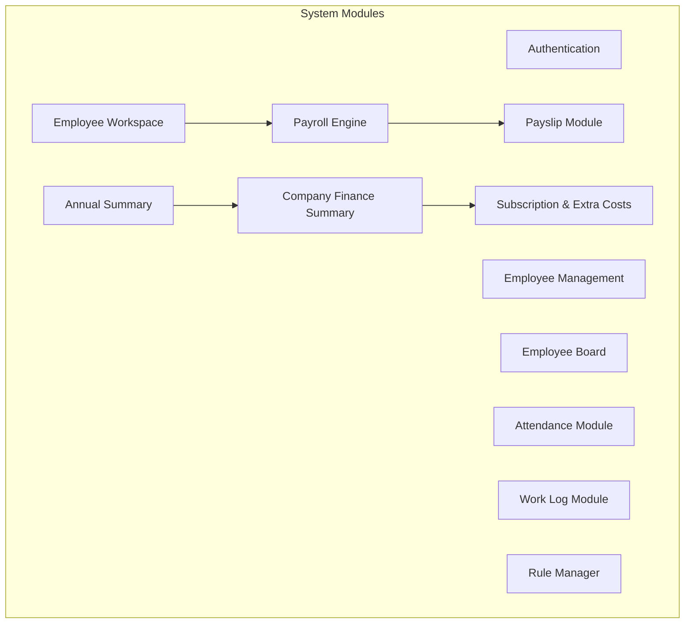
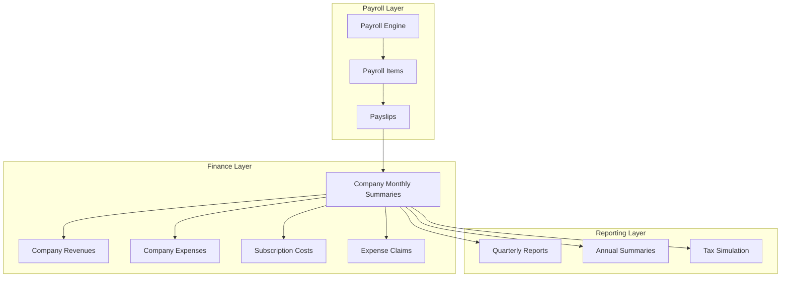
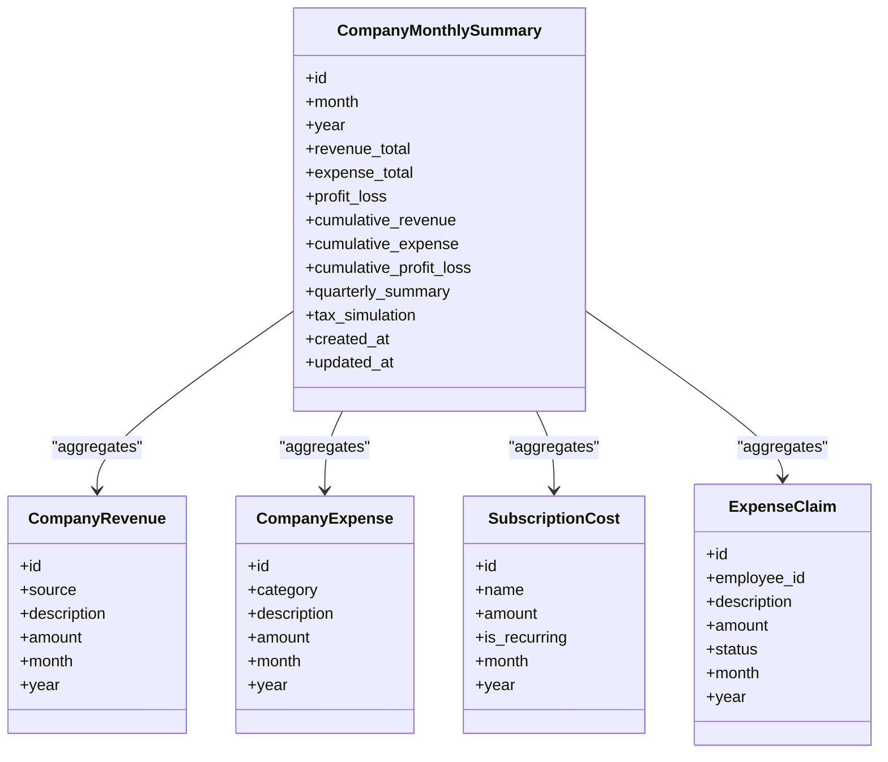
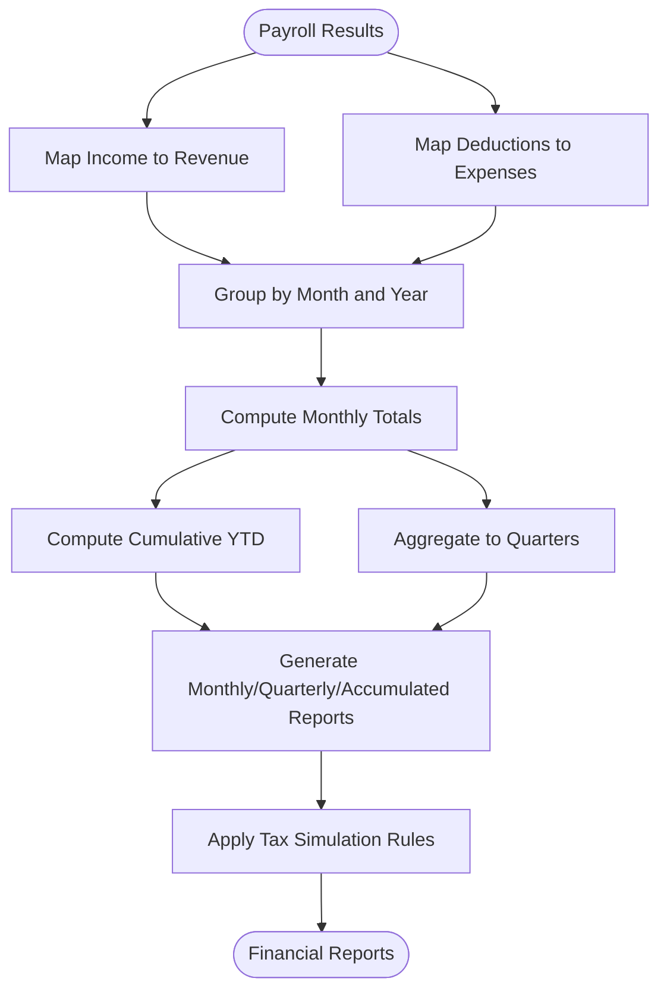
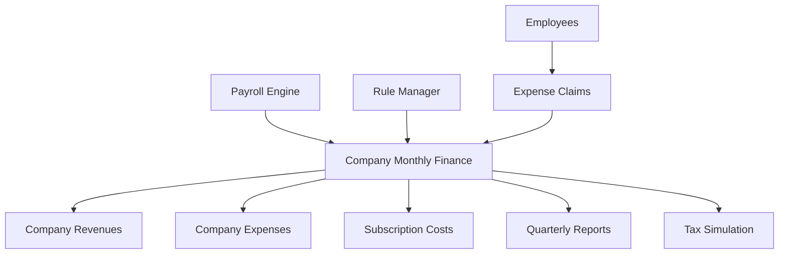

# Company Monthly Financial Summary

<cite>
**Referenced Files in This Document**
- [AGENTS.md](file://AGENTS.md)
- [0001_01_01_000010_create_company_finance_tables.php](file://database/migrations/0001_01_01_000010_create_company_finance_tables.php)
</cite>

## Table of Contents
1. [Introduction](#introduction)
2. [Project Structure](#project-structure)
3. [Core Components](#core-components)
4. [Architecture Overview](#architecture-overview)
5. [Detailed Component Analysis](#detailed-component-analysis)
6. [Dependency Analysis](#dependency-analysis)
7. [Performance Considerations](#performance-considerations)
8. [Troubleshooting Guide](#troubleshooting-guide)
9. [Conclusion](#conclusion)
10. [Appendices](#appendices)

## Introduction
This document explains the Company Monthly Financial Summary functionality within the xHR Payroll & Finance System. It focuses on how payroll results are aggregated into company financial statements, including revenue, expenses, profit/loss calculations, and cumulative tracking. It also covers quarterly reporting capabilities, tax simulation features, and integration points with external accounting systems. The documentation outlines the data aggregation process that consolidates individual payroll results into consolidated financial reports, provides examples of financial reporting workflows, and documents audit trail requirements for compliance with Thai accounting standards.

## Project Structure
The repository defines the high-level system and module requirements for payroll and finance. The Company Finance Summary module is explicitly outlined as part of the required modules and includes revenue, expenses, profit/loss, cumulative tracking, quarterly reporting, and tax simulation.

**Section sources**
- [AGENTS.md:286-384](file://AGENTS.md#L286-L384)

## Core Components
The Company Finance Summary module encompasses:
- Revenue tracking: income sources and descriptions with monthly/yearly granularity
- Expenses tracking: categorized business expenses and monthly/yearly aggregation
- Profit/Loss computation: derived from aggregated revenue minus aggregated expenses
- Cumulative tracking: year-to-date financial metrics
- Quarterly reporting: grouping monthly data into quarters for reporting periods
- Tax simulation: configurable tax rules aligned with Thai accounting standards

These components are supported by dedicated database tables for revenues, expenses, subscriptions, and expense claims, enabling structured financial reporting and auditability.

**Section sources**
- [AGENTS.md:367-375](file://AGENTS.md#L367-L375)
- [0001_01_01_000010_create_company_finance_tables.php:11-58](file://database/migrations/0001_01_01_000010_create_company_finance_tables.php#L11-L58)

## Architecture Overview
The financial reporting architecture integrates payroll results with company finance records. Payroll outcomes feed into revenue and expense categories, which are then aggregated monthly and rolled up into quarterly and annual summaries. Tax simulation leverages configurable rules aligned with Thai SSO and tax regulations.

**Diagram sources**
- [AGENTS.md:338-352](file://AGENTS.md#L338-L352)
- [AGENTS.md:367-375](file://AGENTS.md#L367-L375)
- [0001_01_01_000010_create_company_finance_tables.php:11-58](file://database/migrations/0001_01_01_000010_create_company_finance_tables.php#L11-L58)

## Detailed Component Analysis

### Company Monthly Summaries Entity
The Company Monthly Summaries entity consolidates monthly financial data derived from payroll and operational entries. It serves as the central aggregation point for:
- Revenue: income sources recorded per month and year
- Expenses: categorized business expenses recorded per month and year
- Profit/Loss: computed as total revenue minus total expenses
- Cumulative: year-to-date totals for balance sheet-style tracking
- Quarterly: grouped aggregations for reporting cycles
- Tax simulation: configurable tax computations aligned with Thai standards

**Diagram sources**
- [0001_01_01_000010_create_company_finance_tables.php:11-58](file://database/migrations/0001_01_01_000010_create_company_finance_tables.php#L11-L58)

**Section sources**
- [AGENTS.md:367-375](file://AGENTS.md#L367-L375)
- [0001_01_01_000010_create_company_finance_tables.php:11-58](file://database/migrations/0001_01_01_000010_create_company_finance_tables.php#L11-L58)

### Data Aggregation Workflow
The system aggregates payroll results into consolidated financial reports through the following steps:
- Extract monthly payroll outcomes (income and deductions) from payslips and payroll items
- Map income to revenue categories and deductions to expense categories
- Group by month and year for temporal alignment
- Compute monthly totals and roll up to cumulative year-to-date figures
- Generate quarterly summaries by grouping three consecutive months
- Apply tax simulation rules configured in the Rule Manager module

[No sources needed since this diagram shows conceptual workflow, not actual code structure]

### Quarterly Reporting Capabilities
Quarterly reporting groups monthly financial data into quarters (Q1: Jan-Mar, Q2: Apr-Jun, Q3: Jul-Sep, Q4: Oct-Dec). The system computes:
- Quarterly revenue and expense totals
- Quarterly profit/loss
- Comparative trends across quarters
- Supporting detail by month for drill-down analysis

[No sources needed since this section provides general guidance]

### Tax Simulation Features
Tax simulation aligns with Thai accounting standards and SSO regulations:
- Configurable tax rates and thresholds
- Employment and employer contribution calculations
- Effective date-based rule application
- Audit trail for rule changes affecting tax computations

[No sources needed since this section provides general guidance]

### Integration with External Accounting Systems
Integration supports:
- Export of monthly and quarterly financial reports
- Structured data formats for accounting software ingestion
- Audit logs and snapshots for compliance verification
- Expense claim approvals synchronized with accounting workflows

[No sources needed since this section provides general guidance]

## Dependency Analysis
The Company Finance Summary depends on:
- Payroll engine outputs (payslips and payroll items)
- Rule Manager configurations (SSO, tax, and bonus rules)
- Employee and expense claim data for accurate categorization
- Audit logs for compliance and traceability

**Diagram sources**
- [AGENTS.md:338-352](file://AGENTS.md#L338-L352)
- [AGENTS.md:367-375](file://AGENTS.md#L367-L375)
- [0001_01_01_000010_create_company_finance_tables.php:11-58](file://database/migrations/0001_01_01_000010_create_company_finance_tables.php#L11-L58)

**Section sources**
- [AGENTS.md:338-352](file://AGENTS.md#L338-L352)
- [AGENTS.md:367-375](file://AGENTS.md#L367-L375)
- [0001_01_01_000010_create_company_finance_tables.php:11-58](file://database/migrations/0001_01_01_000010_create_company_finance_tables.php#L11-L58)

## Performance Considerations
- Index monthly/yearly fields on revenue and expense tables to optimize aggregation queries
- Batch process monthly payroll results to reduce real-time computation overhead
- Cache frequently accessed quarterly and annual summaries
- Partition large historical datasets by year for efficient querying

[No sources needed since this section provides general guidance]

## Troubleshooting Guide
Common issues and resolutions:
- Discrepancies between payroll totals and financial summaries: verify mapping rules and ensure all income/deduction items are included
- Incorrect quarterly aggregations: confirm month boundaries and quarter grouping logic
- Audit trail gaps: review audit log configuration and ensure all edits trigger logging
- Tax simulation errors: validate effective dates and rule updates in the Rule Manager

[No sources needed since this section provides general guidance]

## Conclusion
The Company Monthly Financial Summary module provides a robust framework for transforming payroll results into comprehensive financial reports. By structuring revenue and expense data with monthly/yearly granularity, computing profit/loss, maintaining cumulative totals, and supporting quarterly and tax simulations, the system enables accurate financial reporting and compliance with Thai accounting standards. Integration with the payroll engine, rule manager, and audit logs ensures transparency, traceability, and scalability.

## Appendices
- Example reporting workflows:
  - Monthly payroll processing → revenue and expense mapping → monthly totals → cumulative YTD → quarterly aggregation → tax simulation → financial reports
- Compliance requirements:
  - Maintain audit logs for all financial changes
  - Store rule configurations with effective dates
  - Export structured reports for external accounting systems

[No sources needed since this section provides general guidance]