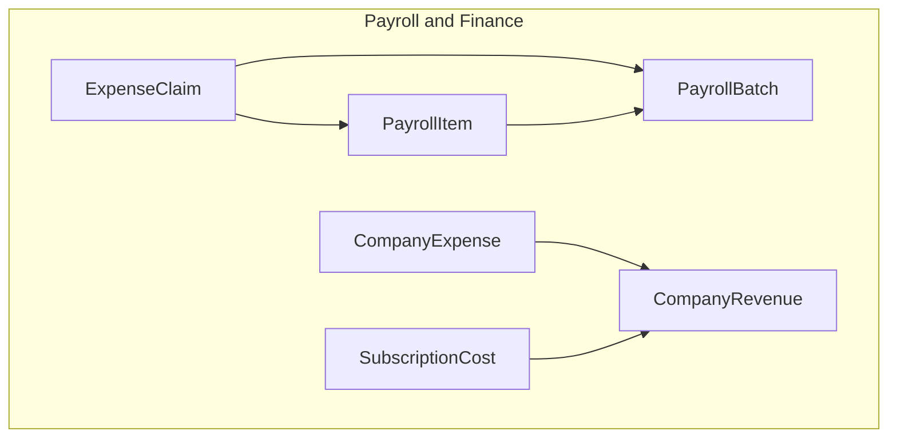
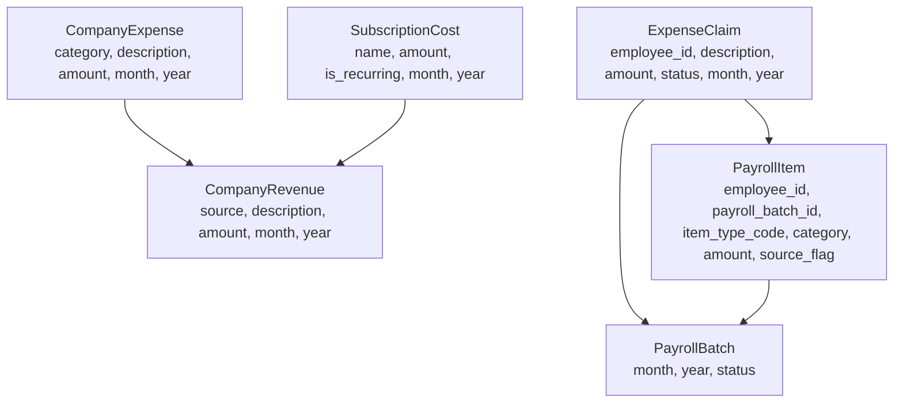
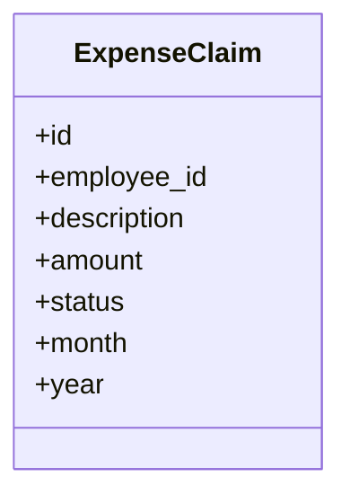
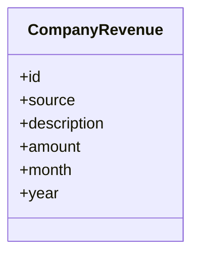
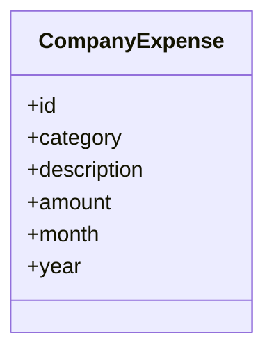
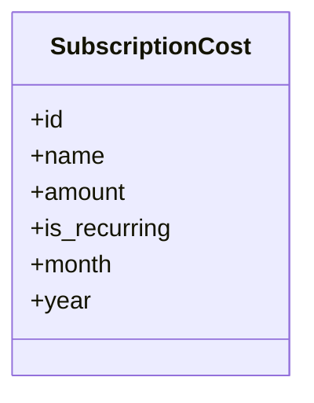
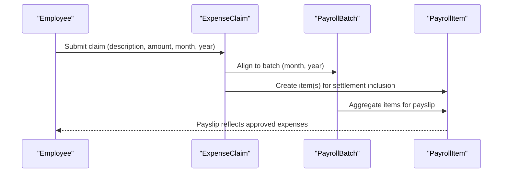
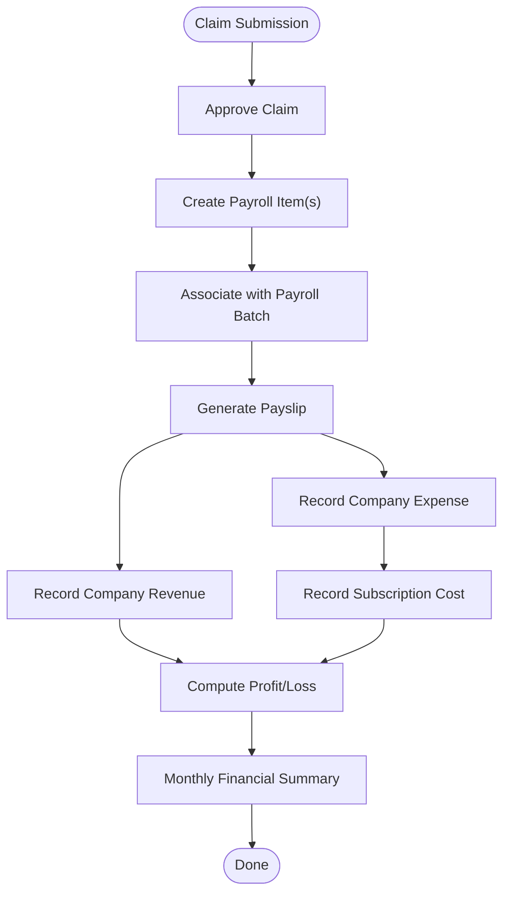
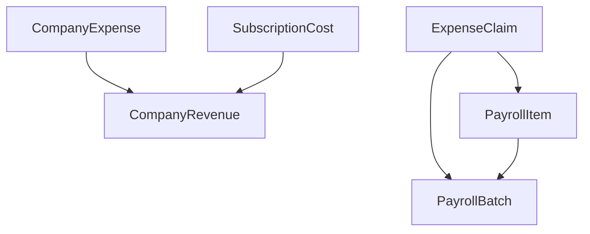

# Expense Claim and Company Financial Entities

<cite>
**Referenced Files in This Document**
- [AGENTS.md](file://AGENTS.md)
- [0001_01_01_000010_create_company_finance_tables.php](file://database/migrations/0001_01_01_000010_create_company_finance_tables.php)
- [0001_01_01_000007_create_payroll_tables.php](file://database/migrations/0001_01_01_000007_create_payroll_tables.php)
</cite>

## Table of Contents
1. [Introduction](#introduction)
2. [Project Structure](#project-structure)
3. [Core Components](#core-components)
4. [Architecture Overview](#architecture-overview)
5. [Detailed Component Analysis](#detailed-component-analysis)
6. [Dependency Analysis](#dependency-analysis)
7. [Performance Considerations](#performance-considerations)
8. [Troubleshooting Guide](#troubleshooting-guide)
9. [Conclusion](#conclusion)
10. [Appendices](#appendices)

## Introduction
This document explains the ExpenseClaim, CompanyRevenue, CompanyExpense, and SubscriptionCost entities that underpin comprehensive financial tracking in the xHR Payroll & Finance System. It details how expense claims integrate with payroll processing—particularly for freelancer and YouTuber/Talent settlement modes—and documents the company financial tracking system covering revenue recognition, expense categorization, and subscription cost management. It also outlines how expenses flow from claim approval through company expense tracking to profit/loss calculation and how these entities relate to payslip generation.

## Project Structure
The financial and payroll domains are defined by database migrations and documented capabilities in the project’s specification. The relevant schema elements are:
- ExpenseClaim: Tracks employee expense submissions with status and monthly aggregation.
- CompanyRevenue: Records income sources with amounts and monthly/yearly tagging.
- CompanyExpense: Categorizes operational expenses and aggregates by month/year.
- SubscriptionCost: Manages recurring and fixed-cost subscriptions with monthly/yearly attribution.

These entities are part of a broader payroll and finance ecosystem that supports multiple payroll modes, including freelancer and YouTuber settlement, and produces payslips and company financial summaries.

**Diagram sources**
- [0001_01_01_000010_create_company_finance_tables.php:47-58](file://database/migrations/0001_01_01_000010_create_company_finance_tables.php#L47-L58)
- [0001_01_01_000010_create_company_finance_tables.php:11-21](file://database/migrations/0001_01_01_000010_create_company_finance_tables.php#L11-L21)
- [0001_01_01_000010_create_company_finance_tables.php:23-33](file://database/migrations/0001_01_01_000010_create_company_finance_tables.php#L23-L33)
- [0001_01_01_000010_create_company_finance_tables.php:35-45](file://database/migrations/0001_01_01_000010_create_company_finance_tables.php#L35-L45)
- [0001_01_01_000007_create_payroll_tables.php:22-33](file://database/migrations/0001_01_01_000007_create_payroll_tables.php#L22-L33)
- [0001_01_01_000007_create_payroll_tables.php:35-51](file://database/migrations/0001_01_01_000007_create_payroll_tables.php#L35-L51)

**Section sources**
- [AGENTS.md:121-150](file://AGENTS.md#L121-L150)
- [AGENTS.md:367-382](file://AGENTS.md#L367-L382)
- [0001_01_01_000010_create_company_finance_tables.php:1-69](file://database/migrations/0001_01_01_000010_create_company_finance_tables.php#L1-L69)
- [0001_01_01_000007_create_payroll_tables.php:1-61](file://database/migrations/0001_01_01_000007_create_payroll_tables.php#L1-L61)

## Core Components
This section defines the four financial entities and their roles in the system.

- ExpenseClaim
  - Purpose: Capture employee expense submissions with description, amount, and status.
  - Monthly aggregation: Supports month and year fields for reporting and batch processing alignment.
  - Status lifecycle: pending, approved, rejected.
  - Relationship: Tied to employees and can influence payroll outcomes for freelancer and YouTuber settlement modes.

- CompanyRevenue
  - Purpose: Track income sources with amount, optional description, and monthly/yearly tagging.
  - Use: Forms the numerator for profit/loss calculations and company financial summaries.

- CompanyExpense
  - Purpose: Record operational expenses with category (e.g., dubbing, subscription, game, software, other), description, amount, and monthly/yearly tagging.
  - Use: Forms the denominator for profit/loss calculations and supports expense categorization for analysis.

- SubscriptionCost
  - Purpose: Manage recurring and fixed subscription costs with monthly/yearly attribution.
  - Use: Included in company expense tracking and contributes to monthly financial summaries.

**Section sources**
- [0001_01_01_000010_create_company_finance_tables.php:47-58](file://database/migrations/0001_01_01_000010_create_company_finance_tables.php#L47-L58)
- [0001_01_01_000010_create_company_finance_tables.php:23-33](file://database/migrations/0001_01_01_000010_create_company_finance_tables.php#L23-L33)
- [0001_01_01_000010_create_company_finance_tables.php:11-21](file://database/migrations/0001_01_01_000010_create_company_finance_tables.php#L11-L21)
- [0001_01_01_000010_create_company_finance_tables.php:35-45](file://database/migrations/0001_01_01_000010_create_company_finance_tables.php#L35-L45)

## Architecture Overview
The financial entities integrate with the payroll system to support settlement calculations and payslip generation. The following diagram illustrates how ExpenseClaim connects to payroll batches and items, and how CompanyRevenue, CompanyExpense, and SubscriptionCost contribute to company financial summaries.

**Diagram sources**
- [0001_01_01_000010_create_company_finance_tables.php:47-58](file://database/migrations/0001_01_01_000010_create_company_finance_tables.php#L47-L58)
- [0001_01_01_000010_create_company_finance_tables.php:11-21](file://database/migrations/0001_01_01_000010_create_company_finance_tables.php#L11-L21)
- [0001_01_01_000010_create_company_finance_tables.php:23-33](file://database/migrations/0001_01_01_000010_create_company_finance_tables.php#L23-L33)
- [0001_01_01_000010_create_company_finance_tables.php:35-45](file://database/migrations/0001_01_01_000010_create_company_finance_tables.php#L35-L45)
- [0001_01_01_000007_create_payroll_tables.php:22-33](file://database/migrations/0001_01_01_000007_create_payroll_tables.php#L22-L33)
- [0001_01_01_000007_create_payroll_tables.php:35-51](file://database/migrations/0001_01_01_000007_create_payroll_tables.php#L35-L51)

## Detailed Component Analysis

### ExpenseClaim Entity
- Purpose: Capture employee expense submissions with status and monthly aggregation.
- Fields and constraints:
  - employee_id: foreign key to employees.
  - description: textual description of the expense.
  - amount: monetary value stored as decimal with two decimals.
  - status: lifecycle with default pending; transitions to approved or rejected.
  - month, year: for monthly grouping and reporting.
- Integration with payroll:
  - Approved claims can feed into settlement calculations for freelancer and YouTuber/Talent modes.
  - Claims align with payroll batches by month/year for batch processing and payslip inclusion.

**Diagram sources**
- [0001_01_01_000010_create_company_finance_tables.php:47-58](file://database/migrations/0001_01_01_000010_create_company_finance_tables.php#L47-L58)

**Section sources**
- [0001_01_01_000010_create_company_finance_tables.php:47-58](file://database/migrations/0001_01_01_000010_create_company_finance_tables.php#L47-L58)
- [AGENTS.md:484-487](file://AGENTS.md#L484-L487)

### CompanyRevenue Entity
- Purpose: Record income sources with amount and monthly/yearly tagging.
- Fields and constraints:
  - source: identifier or label for the revenue source.
  - description: optional description for clarity.
  - amount: monetary value stored as decimal with two decimals.
  - month, year: for monthly aggregation and financial statements.
- Role in financial tracking:
  - Supplies total revenue for profit/loss computation and company financial summaries.

**Diagram sources**
- [0001_01_01_000010_create_company_finance_tables.php:23-33](file://database/migrations/0001_01_01_000010_create_company_finance_tables.php#L23-L33)

**Section sources**
- [0001_01_01_000010_create_company_finance_tables.php:23-33](file://database/migrations/0001_01_01_000010_create_company_finance_tables.php#L23-L33)
- [AGENTS.md:367-375](file://AGENTS.md#L367-L375)

### CompanyExpense Entity
- Purpose: Track operational expenses with category and monthly aggregation.
- Fields and constraints:
  - category: categorical classification (e.g., dubbing, subscription, game, software, other).
  - description: textual description of the expense.
  - amount: monetary value stored as decimal with two decimals.
  - month, year: for monthly aggregation and financial statements.
- Role in financial tracking:
  - Supplies total expenses for profit/loss computation and supports categorization for analysis.

**Diagram sources**
- [0001_01_01_000010_create_company_finance_tables.php:11-21](file://database/migrations/0001_01_01_000010_create_company_finance_tables.php#L11-L21)

**Section sources**
- [0001_01_01_000010_create_company_finance_tables.php:11-21](file://database/migrations/0001_01_01_000010_create_company_finance_tables.php#L11-L21)
- [AGENTS.md:376-382](file://AGENTS.md#L376-L382)

### SubscriptionCost Entity
- Purpose: Manage recurring and fixed subscription costs with monthly/yearly attribution.
- Fields and constraints:
  - name: identifier or label for the subscription.
  - amount: monetary value stored as decimal with two decimals.
  - is_recurring: boolean flag indicating recurring nature.
  - month, year: for monthly aggregation and financial summaries.
- Role in financial tracking:
  - Included in company expense tracking and contributes to monthly financial summaries.

**Diagram sources**
- [0001_01_01_000010_create_company_finance_tables.php:35-45](file://database/migrations/0001_01_01_000010_create_company_finance_tables.php#L35-L45)

**Section sources**
- [0001_01_01_000010_create_company_finance_tables.php:35-45](file://database/migrations/0001_01_01_000010_create_company_finance_tables.php#L35-L45)
- [AGENTS.md:376-382](file://AGENTS.md#L376-L382)

### Payroll Integration and Payslip Generation
- ExpenseClaim and payroll:
  - Approved expense claims can be included in settlement calculations for freelancer and YouTuber/Talent modes.
  - Claims align with payroll batches by month/year to ensure proper inclusion in payslip generation.
- Payroll batching:
  - Payroll batches capture month, year, and status for processing and finalization.
  - Payroll items reference employees and batches, supporting income/deduction aggregation and payslip creation.

**Diagram sources**
- [0001_01_01_000010_create_company_finance_tables.php:47-58](file://database/migrations/0001_01_01_000010_create_company_finance_tables.php#L47-L58)
- [0001_01_01_000007_create_payroll_tables.php:22-33](file://database/migrations/0001_01_01_000007_create_payroll_tables.php#L22-L33)
- [0001_01_01_000007_create_payroll_tables.php:35-51](file://database/migrations/0001_01_01_000007_create_payroll_tables.php#L35-L51)
- [AGENTS.md:484-487](file://AGENTS.md#L484-L487)

**Section sources**
- [0001_01_01_000007_create_payroll_tables.php:22-33](file://database/migrations/0001_01_01_000007_create_payroll_tables.php#L22-L33)
- [0001_01_01_000007_create_payroll_tables.php:35-51](file://database/migrations/0001_01_01_000007_create_payroll_tables.php#L35-L51)
- [AGENTS.md:484-487](file://AGENTS.md#L484-L487)

### Financial Workflow Integration: From Claim Approval to Profit/Loss
This workflow shows how expenses move from claim approval through company expense tracking to profit/loss calculation.

**Diagram sources**
- [0001_01_01_000010_create_company_finance_tables.php:47-58](file://database/migrations/0001_01_01_000010_create_company_finance_tables.php#L47-L58)
- [0001_01_01_000010_create_company_finance_tables.php:11-21](file://database/migrations/0001_01_01_000010_create_company_finance_tables.php#L11-L21)
- [0001_01_01_000010_create_company_finance_tables.php:23-33](file://database/migrations/0001_01_01_000010_create_company_finance_tables.php#L23-L33)
- [0001_01_01_000010_create_company_finance_tables.php:35-45](file://database/migrations/0001_01_01_000010_create_company_finance_tables.php#L35-L45)
- [0001_01_01_000007_create_payroll_tables.php:22-33](file://database/migrations/0001_01_01_000007_create_payroll_tables.php#L22-L33)
- [0001_01_01_000007_create_payroll_tables.php:35-51](file://database/migrations/0001_01_01_000007_create_payroll_tables.php#L35-L51)

**Section sources**
- [AGENTS.md:367-375](file://AGENTS.md#L367-L375)
- [AGENTS.md:484-487](file://AGENTS.md#L484-L487)

## Dependency Analysis
The following diagram maps dependencies among the financial entities and payroll components.

**Diagram sources**
- [0001_01_01_000010_create_company_finance_tables.php:47-58](file://database/migrations/0001_01_01_000010_create_company_finance_tables.php#L47-L58)
- [0001_01_01_000010_create_company_finance_tables.php:11-21](file://database/migrations/0001_01_01_000010_create_company_finance_tables.php#L11-L21)
- [0001_01_01_000010_create_company_finance_tables.php:23-33](file://database/migrations/0001_01_01_000010_create_company_finance_tables.php#L23-L33)
- [0001_01_01_000010_create_company_finance_tables.php:35-45](file://database/migrations/0001_01_01_000010_create_company_finance_tables.php#L35-L45)
- [0001_01_01_000007_create_payroll_tables.php:22-33](file://database/migrations/0001_01_01_000007_create_payroll_tables.php#L22-L33)
- [0001_01_01_000007_create_payroll_tables.php:35-51](file://database/migrations/0001_01_01_000007_create_payroll_tables.php#L35-L51)

**Section sources**
- [0001_01_01_000010_create_company_finance_tables.php:11-69](file://database/migrations/0001_01_01_000010_create_company_finance_tables.php#L11-L69)
- [0001_01_01_000007_create_payroll_tables.php:11-61](file://database/migrations/0001_01_01_000007_create_payroll_tables.php#L11-L61)

## Performance Considerations
- Indexing: Monthly/yearly fields are indexed on CompanyExpense, CompanyRevenue, SubscriptionCost, and ExpenseClaim to optimize aggregation queries.
- Monetary storage: Decimal fields with two decimals ensure consistent precision for financial computations.
- Foreign keys: Proper foreign keys maintain referential integrity between payroll batches, items, and employees.
- Reporting: Monthly grouping enables efficient rollup for payslip generation and company financial summaries.

[No sources needed since this section provides general guidance]

## Troubleshooting Guide
- Claim status lifecycle:
  - Ensure claims progress from pending to approved or rejected; unresolved pending claims can delay payroll processing.
- Monthly alignment:
  - Verify month and year fields match payroll batches to avoid missing claims in payslips.
- Expense categorization:
  - Confirm categories align with business classifications for accurate expense tracking and reporting.
- Revenue and expense reconciliation:
  - Ensure all income and expenses are recorded with correct months/years to compute accurate profit/loss.

**Section sources**
- [0001_01_01_000010_create_company_finance_tables.php:47-58](file://database/migrations/0001_01_01_000010_create_company_finance_tables.php#L47-L58)
- [0001_01_01_000010_create_company_finance_tables.php:11-21](file://database/migrations/0001_01_01_000010_create_company_finance_tables.php#L11-L21)
- [0001_01_01_000010_create_company_finance_tables.php:23-33](file://database/migrations/0001_01_01_000010_create_company_finance_tables.php#L23-L33)
- [0001_01_01_000010_create_company_finance_tables.php:35-45](file://database/migrations/0001_01_01_000010_create_company_finance_tables.php#L35-L45)

## Conclusion
The ExpenseClaim, CompanyRevenue, CompanyExpense, and SubscriptionCost entities form the backbone of the xHR Payroll & Finance System’s financial tracking. They integrate with the payroll system to support settlement calculations for freelancer and YouTuber/Talent modes, align with monthly payroll batches, and contribute to company financial summaries and profit/loss computation. Proper indexing, categorization, and lifecycle management ensure accurate and efficient financial reporting.

[No sources needed since this section summarizes without analyzing specific files]

## Appendices
- Additional payroll modes and capabilities are documented in the project specification, including freelancer layer and fixed rates, monthly staff, and YouTuber settlement formulas.

**Section sources**
- [AGENTS.md:123-131](file://AGENTS.md#L123-L131)
- [AGENTS.md:472-487](file://AGENTS.md#L472-L487)