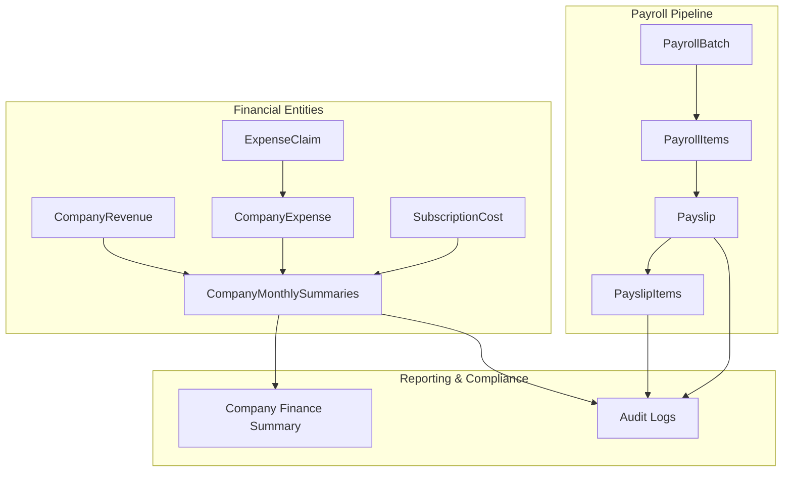
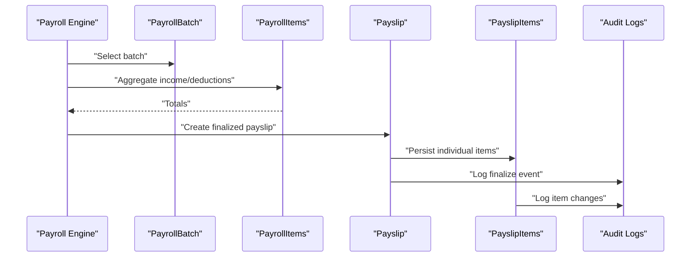
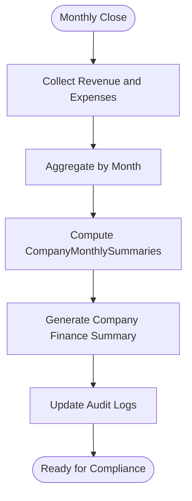
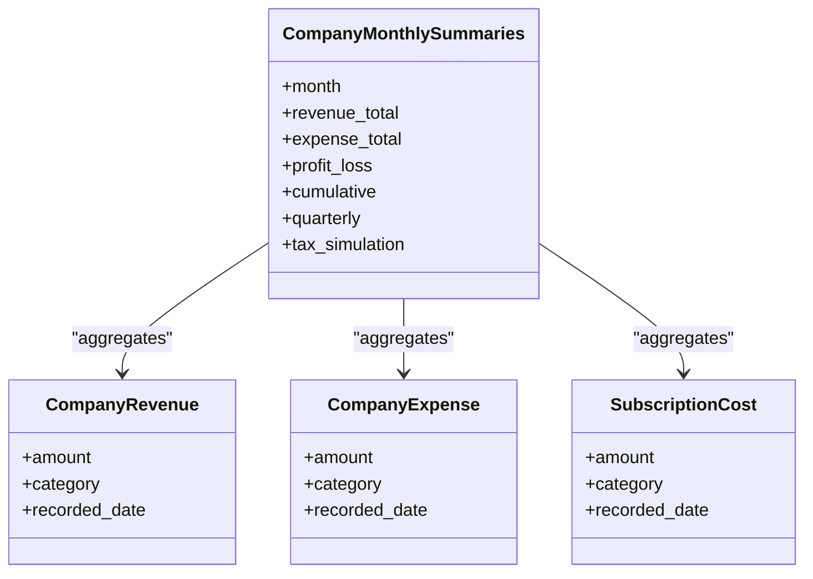
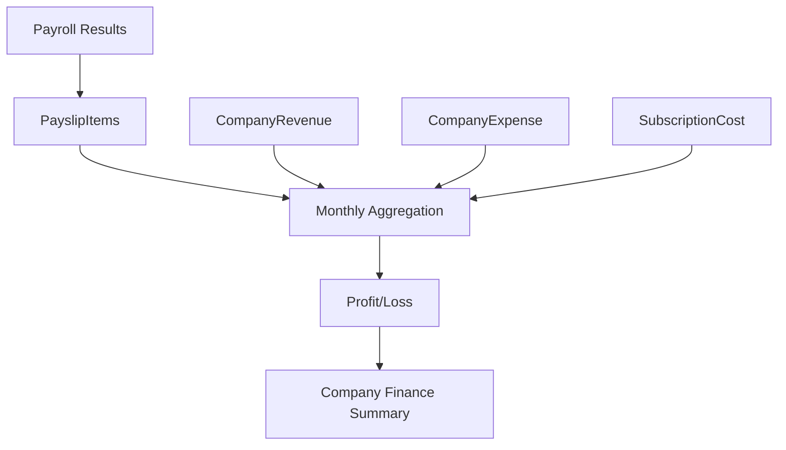
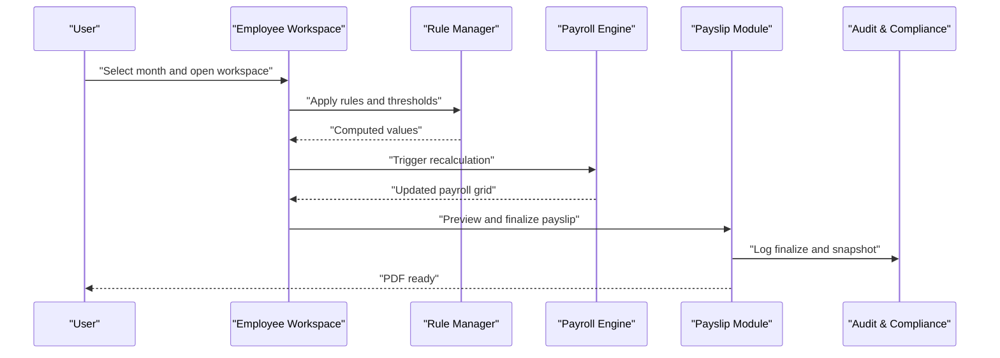
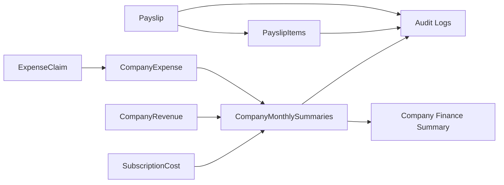

# Financial and Reporting Entities

<cite>
**Referenced Files in This Document**
- [AGENTS.md](file://AGENTS.md)
</cite>

## Table of Contents
1. [Introduction](#introduction)
2. [Project Structure](#project-structure)
3. [Core Components](#core-components)
4. [Architecture Overview](#architecture-overview)
5. [Detailed Component Analysis](#detailed-component-analysis)
6. [Dependency Analysis](#dependency-analysis)
7. [Performance Considerations](#performance-considerations)
8. [Troubleshooting Guide](#troubleshooting-guide)
9. [Conclusion](#conclusion)
10. [Appendices](#appendices)

## Introduction
This document explains the financial management entities and their roles in payroll processing, financial reporting, and compliance. It focuses on how Payslip, PayslipItems, ExpenseClaim, CompanyRevenue, CompanyExpense, SubscriptionCost, and CompanyMonthlySummaries support financial statements and audit trails. It also describes how payroll results integrate with revenue recognition, expense tracking, and profit/loss calculations, and outlines financial data aggregation and reporting requirements.

## Project Structure
The repository defines a comprehensive payroll and finance system with explicit modules and database guidelines. The financial entities are part of the core domain model and are designed to be record-based, rule-driven, and audit-enabled.

Key modules and responsibilities:
- Payroll Engine: calculates payroll by mode, aggregates income/deductions, and produces a payroll result snapshot.
- Rule Manager: manages attendance, OT, bonus, threshold, layer rate, SSO, and tax rules.
- Payslip Module: previews, finalizes, exports PDF, and regenerates from finalized data only by permission.
- Company Finance Summary: reports revenue, expenses, profit/loss, cumulative, quarterly, and tax simulation.
- Subscription & Extra Costs: tracks recurring software, fixed costs, equipment, dubbing, and other business expenses.
- Audit & Compliance: logs all significant changes and maintains rollback capability.

These modules and entities collectively support financial reporting and compliance by ensuring a single source of truth, maintaining audit trails, and enabling accurate financial statements.

**Section sources**
- [AGENTS.md:121-150](file://AGENTS.md#L121-L150)
- [AGENTS.md:286-382](file://AGENTS.md#L286-L382)
- [AGENTS.md:385-435](file://AGENTS.md#L385-L435)
- [AGENTS.md:438-505](file://AGENTS.md#L438-L505)
- [AGENTS.md:576-595](file://AGENTS.md#L576-L595)

## Core Components
This section documents the financial entities and their relationships to payroll results and financial statements.

- Payslip
  - Purpose: Stores finalized payroll results and metadata for PDF generation.
  - Relationship: Aggregates income and deductions from PayslipItems; used as the authoritative source for payslip rendering.
  - Compliance: Snapshot rule ensures immutable payslip data after finalization.

- PayslipItems
  - Purpose: Individual income and deduction entries associated with a Payslip.
  - Relationship: Each PayslipItem contributes to total income/deduction and supports audit tagging (auto/manual/override/master).

- ExpenseClaim
  - Purpose: Tracks employee expense claims submitted against company policies.
  - Relationship: Supports expense tracking and reconciliation with CompanyExpense and CompanyMonthlySummaries.

- CompanyRevenue
  - Purpose: Records revenue streams for financial statements.
  - Relationship: Used in CompanyMonthlySummaries to compute monthly P&L and tax simulations.

- CompanyExpense
  - Purpose: Records business expenses for financial statements.
  - Relationship: Used in CompanyMonthlySummaries to compute monthly P&L and tax simulations.

- SubscriptionCost
  - Purpose: Tracks recurring and fixed business costs (software, equipment, etc.).
  - Relationship: Included in CompanyMonthlySummaries as part of operating expenses.

- CompanyMonthlySummaries
  - Purpose: Aggregates monthly financial data for P&L, cumulative, quarterly, and tax simulation.
  - Relationship: Drives Company Finance Summary and informs financial reporting.

These entities form the backbone of financial reporting and compliance, ensuring accurate revenue recognition, expense tracking, and profit/loss computation.

**Section sources**
- [AGENTS.md:144-149](file://AGENTS.md#L144-L149)
- [AGENTS.md:387-416](file://AGENTS.md#L387-L416)
- [AGENTS.md:549-574](file://AGENTS.md#L549-L574)
- [AGENTS.md:6.11:367-375](file://AGENTS.md#L367-L375)

## Architecture Overview
The system follows a record-based, rule-driven architecture with a strong emphasis on auditability and maintainability. The financial entities are integrated into the payroll pipeline and financial reporting modules.

**Diagram sources**
- [AGENTS.md:387-416](file://AGENTS.md#L387-L416)
- [AGENTS.md:367-375](file://AGENTS.md#L367-L375)
- [AGENTS.md:576-595](file://AGENTS.md#L576-L595)

## Detailed Component Analysis

### Payslip and PayslipItems
- Purpose: Finalized payroll results with immutable snapshot and detailed income/deduction breakdown.
- Data flow:
  - Payroll engine computes income and deductions.
  - Payslip captures totals and rendering metadata.
  - PayslipItems capture individual entries with source flags (auto/manual/override/master).
- Compliance:
  - Snapshot rule ensures payslips cannot be altered after finalization.
  - Audit logs track who finalized, edited, or regenerated payslips.

**Diagram sources**
- [AGENTS.md:338-343](file://AGENTS.md#L338-L343)
- [AGENTS.md:549-574](file://AGENTS.md#L549-L574)
- [AGENTS.md:576-595](file://AGENTS.md#L576-L595)

**Section sources**
- [AGENTS.md:549-574](file://AGENTS.md#L549-L574)
- [AGENTS.md:576-595](file://AGENTS.md#L576-L595)

### ExpenseClaim, CompanyRevenue, CompanyExpense, SubscriptionCost
- ExpenseClaim: Tracks employee expense submissions and supports reconciliation with CompanyExpense.
- CompanyRevenue: Captures revenue streams for monthly financial summaries.
- CompanyExpense: Captures operational expenses for monthly financial summaries.
- SubscriptionCost: Captures recurring and fixed business costs included in monthly summaries.

**Diagram sources**
- [AGENTS.md:376-382](file://AGENTS.md#L376-L382)
- [AGENTS.md:367-375](file://AGENTS.md#L367-L375)
- [AGENTS.md:576-595](file://AGENTS.md#L576-L595)

**Section sources**
- [AGENTS.md:376-382](file://AGENTS.md#L376-L382)
- [AGENTS.md:367-375](file://AGENTS.md#L367-L375)
- [AGENTS.md:576-595](file://AGENTS.md#L576-L595)

### CompanyMonthlySummaries
- Purpose: Monthly aggregation of financial data for P&L, cumulative, quarterly, and tax simulation.
- Inputs: CompanyRevenue, CompanyExpense, SubscriptionCost, and derived payroll results.
- Outputs: Company Finance Summary and audit trail updates.

**Diagram sources**
- [AGENTS.md:367-375](file://AGENTS.md#L367-L375)
- [AGENTS.md:387-416](file://AGENTS.md#L387-L416)

**Section sources**
- [AGENTS.md:367-375](file://AGENTS.md#L367-L375)
- [AGENTS.md:387-416](file://AGENTS.md#L387-L416)

### Payroll Results to Financial Statements
- Revenue Recognition:
  - CompanyRevenue feeds monthly revenue totals for P&L computation.
- Expense Tracking:
  - CompanyExpense and SubscriptionCost feed monthly expense totals.
  - PayslipItems contribute to payroll-related expense tracking when aggregated into monthly summaries.
- Profit/Loss Calculation:
  - Monthly P&L equals revenue minus expenses.
  - Cumulative and quarterly summaries support trend analysis and tax simulation.

**Diagram sources**
- [AGENTS.md:440-444](file://AGENTS.md#L440-L444)
- [AGENTS.md:367-375](file://AGENTS.md#L367-L375)
- [AGENTS.md:387-416](file://AGENTS.md#L387-L416)

**Section sources**
- [AGENTS.md:440-444](file://AGENTS.md#L440-L444)
- [AGENTS.md:367-375](file://AGENTS.md#L367-L375)
- [AGENTS.md:387-416](file://AGENTS.md#L387-L416)

### Financial Workflow Integration with Payroll Processing
- Employee Workspace:
  - Month selector, summary cards, main payroll grid, detail inspector, payslip preview, and audit timeline.
- Payroll Entry Flow:
  - Edit grid, recalculate, preview slip, save, finalize.
- Rule Manager:
  - Attendance, OT, bonus, threshold, layer rate, SSO, tax rules, and module toggles.
- Audit & Compliance:
  - Logs who changed what, old/new values, action, timestamp, and optional reason.

**Diagram sources**
- [AGENTS.md:508-546](file://AGENTS.md#L508-L546)
- [AGENTS.md:338-353](file://AGENTS.md#L338-L353)
- [AGENTS.md:576-595](file://AGENTS.md#L576-L595)

**Section sources**
- [AGENTS.md:508-546](file://AGENTS.md#L508-L546)
- [AGENTS.md:338-353](file://AGENTS.md#L338-L353)
- [AGENTS.md:576-595](file://AGENTS.md#L576-L595)

## Dependency Analysis
The financial entities depend on each other and on the payroll pipeline to produce accurate financial statements and maintain audit trails.

**Diagram sources**
- [AGENTS.md:387-416](file://AGENTS.md#L387-L416)
- [AGENTS.md:367-375](file://AGENTS.md#L367-L375)
- [AGENTS.md:576-595](file://AGENTS.md#L576-L595)

**Section sources**
- [AGENTS.md:387-416](file://AGENTS.md#L387-L416)
- [AGENTS.md:367-375](file://AGENTS.md#L367-L375)
- [AGENTS.md:576-595](file://AGENTS.md#L576-L595)

## Performance Considerations
- Use decimal types for monetary fields to avoid precision errors.
- Index foreign keys and frequently queried columns (e.g., month, employee_id).
- Prefer batch operations for payroll aggregation and monthly summaries.
- Store immutable snapshots for payslips to reduce recomputation overhead.
- Maintain phpMyAdmin compatibility for basic queries and debugging.

[No sources needed since this section provides general guidance]

## Troubleshooting Guide
Common issues and resolutions:
- Incorrect totals in payslips:
  - Verify source flags (auto/manual/override/master) and ensure snapshot rule is enforced.
  - Check audit logs for recent edits.
- Missing revenue or expense data:
  - Confirm monthly aggregation includes all relevant CompanyRevenue and CompanyExpense entries.
  - Validate SubscriptionCost entries are categorized correctly.
- Audit trail gaps:
  - Review Audit Logs for who, what, when, and why changes occurred.
  - Ensure high-priority audit areas (salary profile, payroll item amounts, rule changes) are covered.

**Section sources**
- [AGENTS.md:576-595](file://AGENTS.md#L576-L595)
- [AGENTS.md:549-574](file://AGENTS.md#L549-L574)

## Conclusion
The financial management entities—Payslip, PayslipItems, ExpenseClaim, CompanyRevenue, CompanyExpense, SubscriptionCost, and CompanyMonthlySummaries—are integral to accurate payroll processing, financial reporting, and compliance. They ensure revenue recognition, expense tracking, and profit/loss computation while preserving audit trails and enabling robust financial summaries.

[No sources needed since this section summarizes without analyzing specific files]

## Appendices
- Database conventions:
  - Use plural snake_case for table names.
  - Primary key id, foreign keys <entity>_id.
  - Status flags status, is_active.
  - Dates *_date, durations *_minutes/*_seconds.
  - Monetary fields decimal(12,2) or larger.
  - Percentage fields decimal(5,2) or consistent fractions.

**Section sources**
- [AGENTS.md:418-427](file://AGENTS.md#L418-L427)