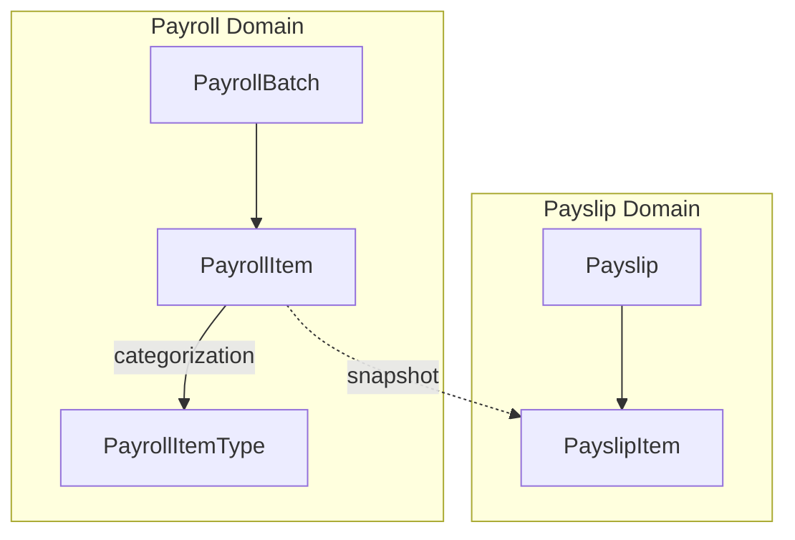
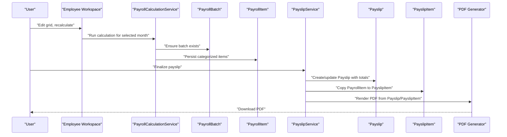
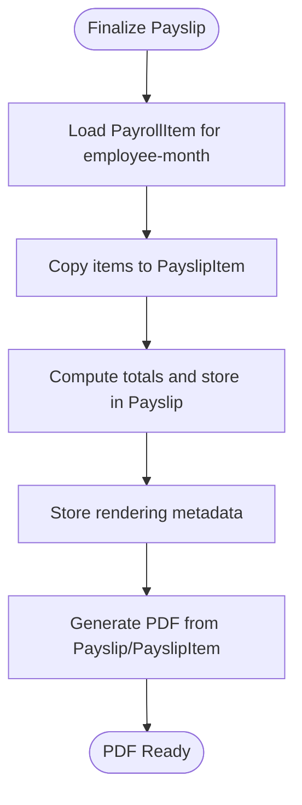
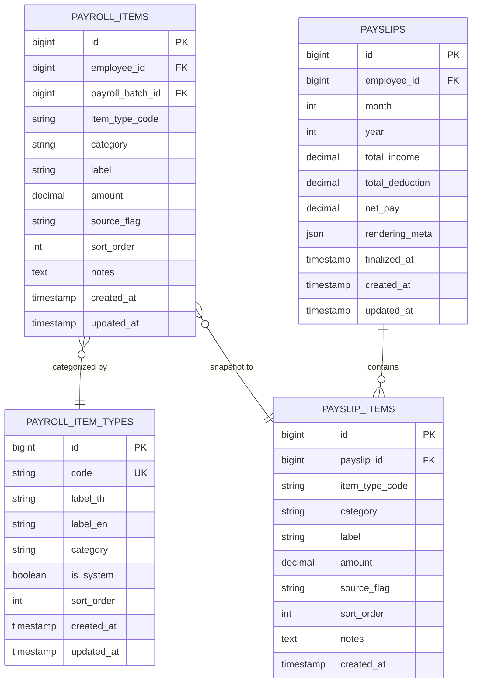
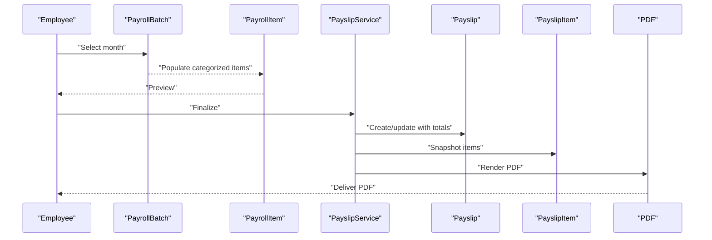

# Payslip and Payroll Item Entities

<cite>
**Referenced Files in This Document**
- [AGENTS.md](file://AGENTS.md)
- [0001_01_01_000007_create_payroll_tables.php](file://database/migrations/0001_01_01_000007_create_payroll_tables.php)
</cite>

## Table of Contents
1. [Introduction](#introduction)
2. [Project Structure](#project-structure)
3. [Core Components](#core-components)
4. [Architecture Overview](#architecture-overview)
5. [Detailed Component Analysis](#detailed-component-analysis)
6. [Dependency Analysis](#dependency-analysis)
7. [Performance Considerations](#performance-considerations)
8. [Troubleshooting Guide](#troubleshooting-guide)
9. [Conclusion](#conclusion)
10. [Appendices](#appendices)

## Introduction
This document describes the Payslip and PayslipItems entities that underpin payroll output generation. It explains the payslip structure, the payslip_items snapshot mechanism, and the PDF generation process. It also documents the payslip_items table structure, income and deduction categorization, and the relationship to payroll_items. The document emphasizes the critical rule that reductions must appear in deductions, not as base salary reductions in the income section.

## Project Structure
The repository defines the domain model and database schema guidelines that include the Payslip and PayslipItems entities. The payroll domain is composed of:
- PayrollBatch: batch-level container for payroll calculations
- PayrollItem: transactional items produced during calculation
- Payslip: finalized snapshot of payroll for a single employee-month
- PayslipItem: immutable copy of items used for PDF rendering and audit

**Diagram sources**
- [AGENTS.md: 132-149:132-149](file://AGENTS.md#L132-L149)
- [0001_01_01_000007_create_payroll_tables.php: 11-51:11-51](file://database/migrations/0001_01_01_000007_create_payroll_tables.php#L11-L51)

**Section sources**
- [AGENTS.md: 132-149:132-149](file://AGENTS.md#L132-L149)
- [0001_01_01_000007_create_payroll_tables.php: 11-51:11-51](file://database/migrations/0001_01_01_000007_create_payroll_tables.php#L11-L51)

## Core Components
- PayrollItemType: defines item types with category (income or deduction), sort order, and localization labels. These types drive categorization of PayrollItem entries.
- PayrollItem: holds calculated or manually entered items for an employee within a payroll batch. Fields include employee reference, batch reference, item type code, category, label, amount, source flag, sort order, and notes.
- Payslip: represents a finalized payroll output for an employee-month. It stores totals and rendering metadata for PDF generation.
- PayslipItem: immutable snapshot of PayrollItem entries at the time of finalization, ensuring audit trail integrity and reproducible PDFs.

Key business rules:
- Critical rule: reductions must appear in deductions, not as base salary reductions in income.
- Snapshot rule: upon finalization, items are copied to payslip_items, totals are stored, and rendering metadata is captured for PDF generation.

**Section sources**
- [AGENTS.md: 10.2](file://AGENTS.md#L10.2)
- [AGENTS.md: 10.3](file://AGENTS.md#L10.3)
- [0001_01_01_000007_create_payroll_tables.php: 11-51:11-51](file://database/migrations/0001_01_01_000007_create_payroll_tables.php#L11-L51)

## Architecture Overview
The payslip workflow transforms calculated payroll items into a finalized, immutable snapshot used for PDF generation and audit.

**Diagram sources**
- [AGENTS.md: 5.3](file://AGENTS.md#L5.3)
- [AGENTS.md: 5.5](file://AGENTS.md#L5.5)
- [AGENTS.md: 10.1](file://AGENTS.md#L10.1)
- [AGENTS.md: 10.3](file://AGENTS.md#L10.3)

## Detailed Component Analysis

### Payslip Structure
A payslip comprises:
- Company header
- Employee details
- Month and payment date
- Account/bank information
- Left column: incomes
- Right column: deductions
- Totals
- Signatures

Rendering must be driven by the immutable snapshot (Payslip and PayslipItem) to ensure consistency and auditability.

**Section sources**
- [AGENTS.md: 10.1](file://AGENTS.md#L10.1)
- [AGENTS.md: 5.5](file://AGENTS.md#L5.5)

### Payslip Finalization Workflow
Finalization copies PayrollItem entries into PayslipItem, captures totals, and stores rendering metadata. PDF generation relies exclusively on the snapshot to prevent drift between the rendered document and the authoritative record.

**Diagram sources**
- [AGENTS.md: 10.3](file://AGENTS.md#L10.3)
- [AGENTS.md: 5.5](file://AGENTS.md#L5.5)

**Section sources**
- [AGENTS.md: 10.3](file://AGENTS.md#L10.3)
- [AGENTS.md: 5.5](file://AGENTS.md#L5.5)

### Payslip Items Snapshot and Audit Trail
- Snapshot: On finalization, PayrollItem rows become PayslipItem rows with identical categorization and amounts.
- Audit trail: Changes to PayrollItem are audited; the final PDF references the immutable Payslip/PayslipItem snapshot, preserving historical accuracy.

**Diagram sources**
- [0001_01_01_000007_create_payroll_tables.php: 11-51:11-51](file://database/migrations/0001_01_01_000007_create_payroll_tables.php#L11-L51)
- [AGENTS.md: 413-414:413-414](file://AGENTS.md#L413-L414)

**Section sources**
- [0001_01_01_000007_create_payroll_tables.php: 11-51:11-51](file://database/migrations/0001_01_01_000007_create_payroll_tables.php#L11-L51)
- [AGENTS.md: 413-414:413-414](file://AGENTS.md#L413-L414)

### Payslip Data Flow Example
End-to-end flow from payroll calculation to final document output:
- Employee selection and month selection
- Calculation engine aggregates PayrollItem entries by category (income vs deduction)
- User previews payslip
- Finalization triggers snapshot creation (PayrollItem → PayslipItem) and totals capture
- PDF generator renders the payslip using the immutable snapshot
- Downloaded PDF reflects the finalized state

**Diagram sources**
- [AGENTS.md: 5.3](file://AGENTS.md#L5.3)
- [AGENTS.md: 5.5](file://AGENTS.md#L5.5)
- [AGENTS.md: 10.3](file://AGENTS.md#L10.3)

**Section sources**
- [AGENTS.md: 5.3](file://AGENTS.md#L5.3)
- [AGENTS.md: 5.5](file://AGENTS.md#L5.5)
- [AGENTS.md: 10.3](file://AGENTS.md#L10.3)

### Critical Rule: Reductions in Deductions
- Do not reduce base salary by decreasing income amounts.
- Use deduction items to reflect reductions such as late penalties, cash advances, or LWOP.

**Section sources**
- [AGENTS.md: 10.2](file://AGENTS.md#L10.2)

## Dependency Analysis
- PayrollItem depends on PayrollItemType for categorization and display ordering.
- Payslip depends on PayslipItem for immutable rendering.
- PDF generation depends on Payslip and PayslipItem to avoid live computation.

**Diagram sources**
- [0001_01_01_000007_create_payroll_tables.php: 11-51:11-51](file://database/migrations/0001_01_01_000007_create_payroll_tables.php#L11-L51)
- [AGENTS.md: 5.5](file://AGENTS.md#L5.5)

**Section sources**
- [0001_01_01_000007_create_payroll_tables.php: 11-51:11-51](file://database/migrations/0001_01_01_000007_create_payroll_tables.php#L11-L51)
- [AGENTS.md: 5.5](file://AGENTS.md#L5.5)

## Performance Considerations
- Use appropriate indexing on employee-month combinations for fast aggregation and snapshot retrieval.
- Keep rendering metadata minimal and normalized to reduce storage overhead.
- Prefer batch operations for snapshotting PayrollItem to PayslipItem to minimize round trips.

## Troubleshooting Guide
Common issues and resolutions:
- PDF shows unexpected totals: verify that finalization copied the correct PayrollItem set to PayslipItem and that totals were recalculated at finalize time.
- Discrepancy after edits: confirm that subsequent edits update PayrollItem and that a new finalization is performed to refresh the snapshot.
- Sorting anomalies: ensure PayrollItemType.sort_order and PayrollItem.sort_order are correctly maintained.

**Section sources**
- [AGENTS.md: 5.5](file://AGENTS.md#L5.5)
- [0001_01_01_000007_create_payroll_tables.php: 11-51:11-51](file://database/migrations/0001_01_01_000007_create_payroll_tables.php#L11-L51)

## Conclusion
The Payslip and PayslipItems entities provide a robust, audit-friendly foundation for payroll output. By enforcing the snapshot rule and keeping reductions in deductions, the system ensures accurate, reproducible payslips and reliable financial reporting.

## Appendices
- Audit logging requirements emphasize capturing who changed what, old/new values, action, timestamp, and optional reasons for high-priority areas including salary profiles, payroll item amounts, and payslip finalize/unfinalize actions.

**Section sources**
- [AGENTS.md: 576-596:576-596](file://AGENTS.md#L576-L596)