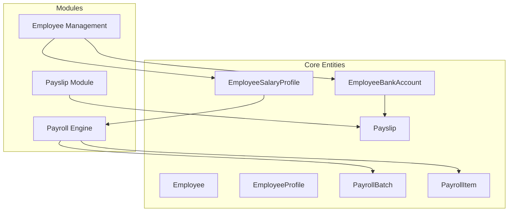
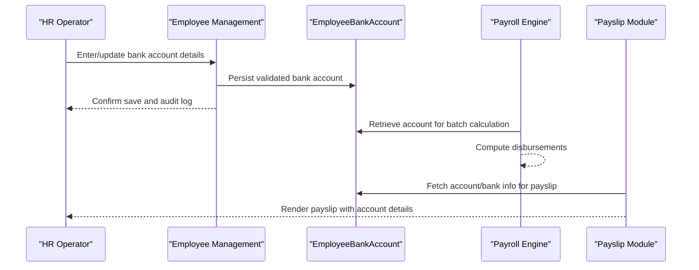
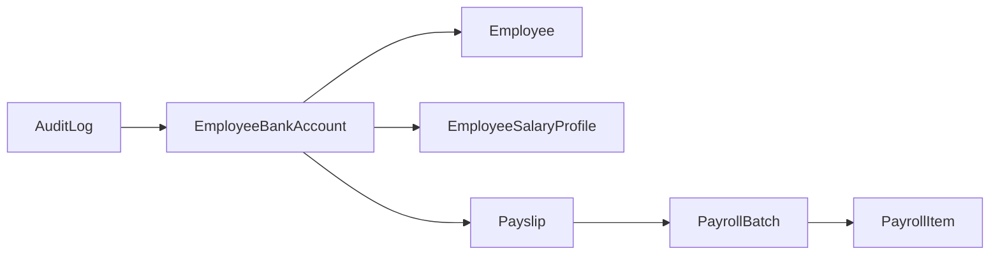

# Bank Account Configuration

<cite>
**Referenced Files in This Document**
- [AGENTS.md](file://AGENTS.md)
</cite>

## Table of Contents
1. [Introduction](#introduction)
2. [Project Structure](#project-structure)
3. [Core Components](#core-components)
4. [Architecture Overview](#architecture-overview)
5. [Detailed Component Analysis](#detailed-component-analysis)
6. [Dependency Analysis](#dependency-analysis)
7. [Performance Considerations](#performance-considerations)
8. [Troubleshooting Guide](#troubleshooting-guide)
9. [Conclusion](#conclusion)

## Introduction
This document explains the bank account configuration functionality for employees within the xHR Payroll & Finance System. It focuses on how bank account information is modeled, configured, validated, and integrated with payroll disbursement. The content is derived from the project’s domain model and guidelines, ensuring alignment with the system’s design principles and database conventions.

## Project Structure
The system is designed around a set of core entities and modules. Bank account configuration is part of the employee management module and integrates with payroll computation and payslip generation.

**Diagram sources**
- [AGENTS.md:132-150](file://AGENTS.md#L132-L150)
- [AGENTS.md:294-301](file://AGENTS.md#L294-L301)
- [AGENTS.md:338-343](file://AGENTS.md#L338-L343)
- [AGENTS.md:354-359](file://AGENTS.md#L354-L359)

**Section sources**
- [AGENTS.md:132-150](file://AGENTS.md#L132-L150)
- [AGENTS.md:294-301](file://AGENTS.md#L294-L301)
- [AGENTS.md:338-343](file://AGENTS.md#L338-L343)
- [AGENTS.md:354-359](file://AGENTS.md#L354-L359)

## Core Components
- EmployeeBankAccount: Stores employee bank account details used for payroll disbursement.
- Employee: Links to profiles and bank accounts.
- EmployeeProfile: Holds personal and employment-related attributes.
- EmployeeSalaryProfile: Contains compensation and payroll mode configuration.
- Payslip: Includes account/bank information for payment distribution.
- PayrollBatch and PayrollItem: Drive disbursement computation and snapshotting.

Key integration points:
- Bank account data feeds into payslip rendering and disbursement logic.
- Audit logs track changes to bank account records.

**Section sources**
- [AGENTS.md:132-150](file://AGENTS.md#L132-L150)
- [AGENTS.md:395](file://AGENTS.md#L395)
- [AGENTS.md:556](file://AGENTS.md#L556)
- [AGENTS.md:578-587](file://AGENTS.md#L578-L587)

## Architecture Overview
Bank account configuration participates in the payroll lifecycle as follows:
- Employee Management captures and validates bank account entries.
- Payroll Engine computes payouts and references bank account records.
- Payslip Module renders account/bank details for payment distribution.
- Audit tracks all changes to bank account data.

**Diagram sources**
- [AGENTS.md:294-301](file://AGENTS.md#L294-L301)
- [AGENTS.md:338-343](file://AGENTS.md#L338-L343)
- [AGENTS.md:354-359](file://AGENTS.md#L354-L359)
- [AGENTS.md:556](file://AGENTS.md#L556)

## Detailed Component Analysis

### EmployeeBankAccount Entity
Purpose:
- Store employee bank account information required for direct deposit.
- Support auditability and status tracking.

Fields and conventions:
- Follows database conventions: plural snake_case table names, unsigned bigInteger foreign keys, decimal amounts, and standardized suffixes for dates and durations.
- Uses status flags and timestamps for lifecycle tracking.
- Integrates with audit logs for compliance.

Relationships:
- Tightly coupled to Employee and EmployeeProfile.
- Consumed by PayrollItem and Payslip for disbursement and rendering.

Validation and verification:
- Validation occurs during entry and update in Employee Management.
- Verification workflows are supported by audit logs and state flags.

Direct deposit integration:
- Account details are rendered on payslips for payment distribution.
- Disbursement computation references bank account records.

**Section sources**
- [AGENTS.md:136](file://AGENTS.md#L136)
- [AGENTS.md:395](file://AGENTS.md#L395)
- [AGENTS.md:418-427](file://AGENTS.md#L418-L427)
- [AGENTS.md:556](file://AGENTS.md#L556)
- [AGENTS.md:578-587](file://AGENTS.md#L578-L587)

### Bank Account Types and Status Tracking
Configuration options:
- Account types: modeled conceptually as part of bank account metadata.
- Status tracking: supports active/inactive states and audit references.

Change procedures:
- Updates are governed by audit logs and state flags.
- UI states indicate whether values are locked, auto-calculated, manually overridden, or rule-applied.

**Section sources**
- [AGENTS.md:422-423](file://AGENTS.md#L422-L423)
- [AGENTS.md:529-538](file://AGENTS.md#L529-L538)
- [AGENTS.md:578-587](file://AGENTS.md#L578-L587)

### Validation and Verification Workflows
Validation:
- Performed in Employee Management when entering or updating bank account information.
- Enforced via form requests and service-level validation.

Verification:
- Verification processes are supported by audit logs and state flags.
- Audit logs capture who changed what, old/new values, and timestamps.

Common banking scenarios:
- Account updates: tracked via audit logs and state flags.
- Bank transfers: represented by payroll disbursement computation and payslip rendering.
- Account verification: supported by audit trail and state indicators.

**Section sources**
- [AGENTS.md:578-587](file://AGENTS.md#L578-L587)
- [AGENTS.md:529-538](file://AGENTS.md#L529-L538)

### Payslip Integration
Rendering:
- Payslips include account/bank information for payment distribution.
- Rendering is snapshot-based after finalization.

Integration with payroll:
- Disbursement computation references bank account records.
- Payroll items aggregate income and deductions; bank account data ensures accurate payment routing.

**Section sources**
- [AGENTS.md:556](file://AGENTS.md#L556)
- [AGENTS.md:567-573](file://AGENTS.md#L567-L573)
- [AGENTS.md:338-343](file://AGENTS.md#L338-L343)

## Dependency Analysis
Bank account configuration interacts with several modules and entities:

Observations:
- EmployeeBankAccount depends on Employee and EmployeeSalaryProfile for context.
- Payslip consumes bank account data for rendering.
- AuditLog provides traceability across changes.

**Diagram sources**
- [AGENTS.md:132-150](file://AGENTS.md#L132-L150)
- [AGENTS.md:395](file://AGENTS.md#L395)
- [AGENTS.md:556](file://AGENTS.md#L556)
- [AGENTS.md:578-587](file://AGENTS.md#L578-L587)

**Section sources**
- [AGENTS.md:132-150](file://AGENTS.md#L132-L150)
- [AGENTS.md:395](file://AGENTS.md#L395)
- [AGENTS.md:556](file://AGENTS.md#L556)
- [AGENTS.md:578-587](file://AGENTS.md#L578-L587)

## Performance Considerations
- Keep bank account queries indexed by employee and status to optimize lookup during payroll runs.
- Use snapshots for payslip rendering to avoid recalculating account details repeatedly.
- Apply soft deletes cautiously for audit compliance while maintaining query performance.

## Troubleshooting Guide
Common issues and resolutions:
- Missing account details on payslips:
  - Verify EmployeeBankAccount exists and is marked active.
  - Confirm audit logs show recent updates and state transitions.
- Disbursement errors:
  - Review payroll batch and item records for mismatches with bank account data.
  - Check audit logs for unauthorized changes.
- Audit discrepancies:
  - Cross-reference AuditLog entries for field-level changes and timestamps.

Preventive measures:
- Enforce validation at entry/update points.
- Maintain clear state flags and UI indicators for bank account records.

**Section sources**
- [AGENTS.md:578-587](file://AGENTS.md#L578-L587)
- [AGENTS.md:529-538](file://AGENTS.md#L529-L538)

## Conclusion
Bank account configuration in the xHR system is centered on the EmployeeBankAccount entity, integrated tightly with employee profiles, payroll computation, and payslip rendering. The design emphasizes validation, auditability, and clear state management to support reliable direct deposit disbursements and compliance reporting.