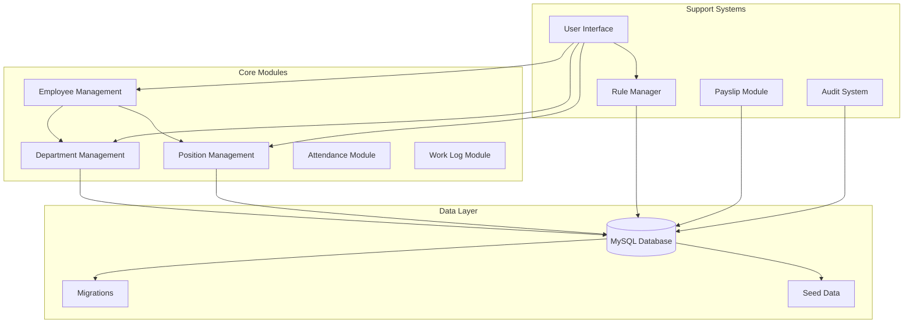
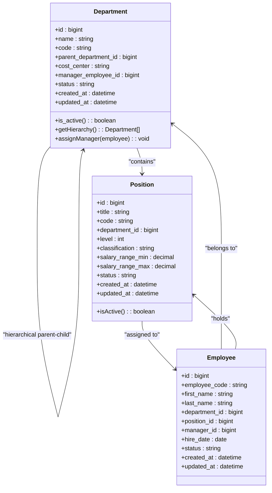
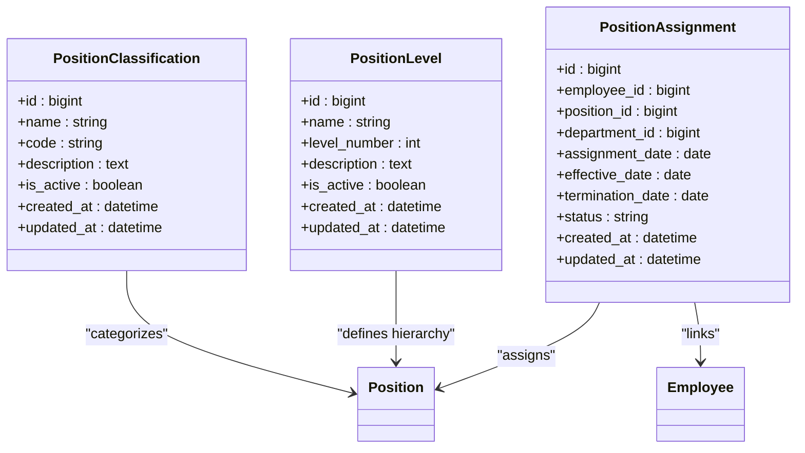
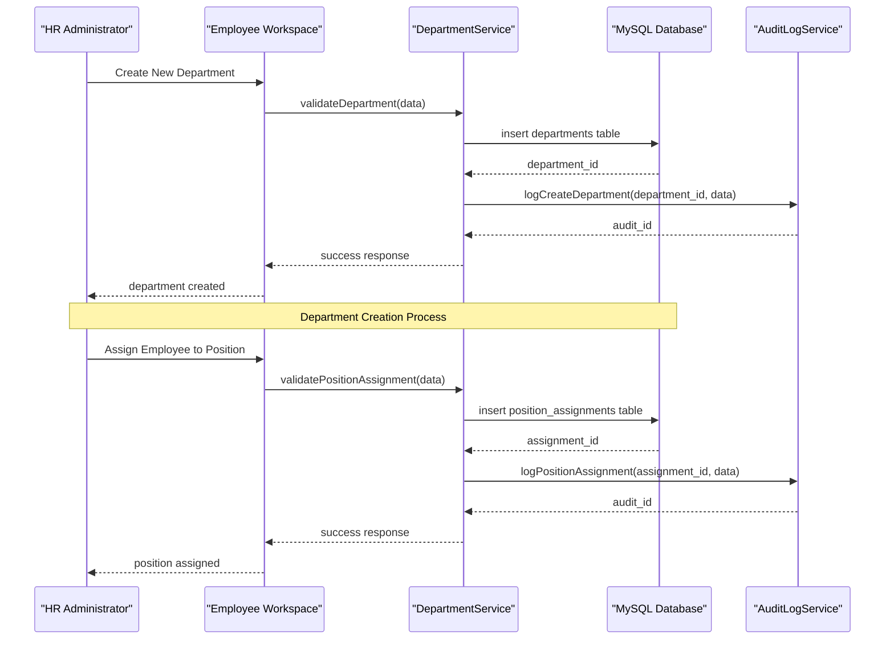
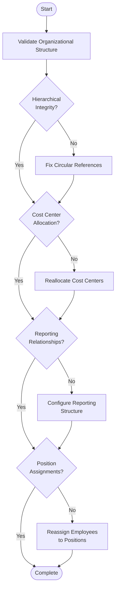
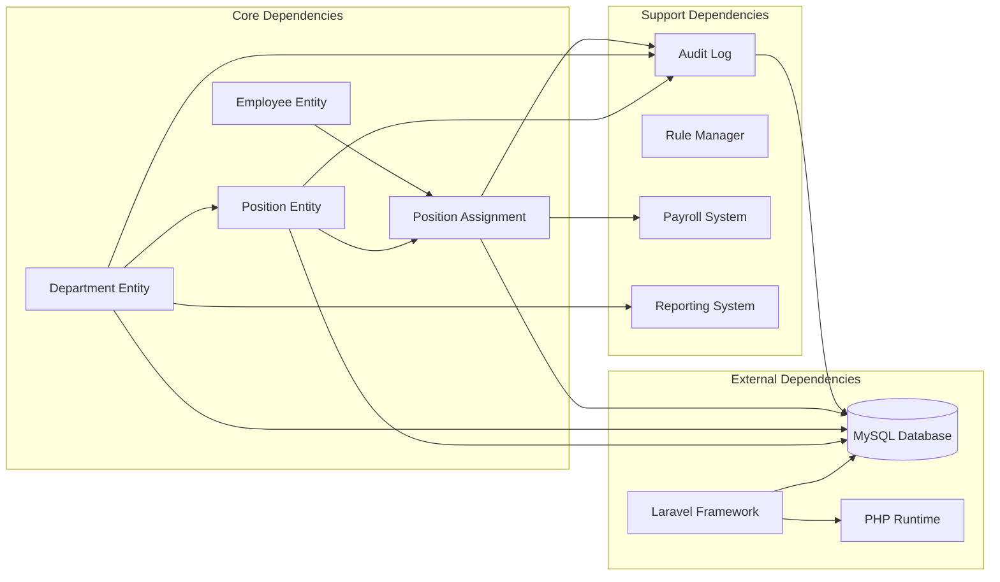
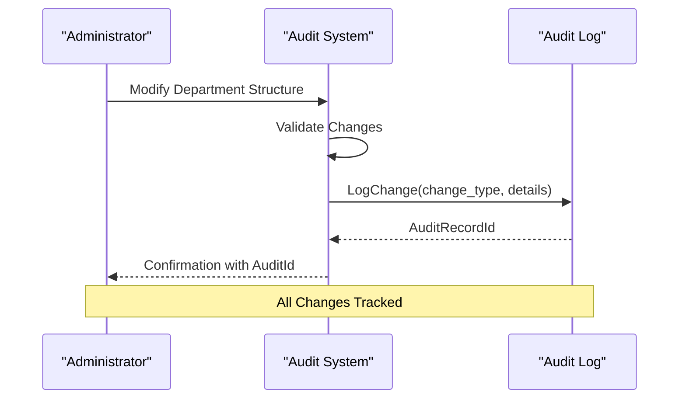

# Department and Position Management

<cite>
**Referenced Files in This Document**
- [AGENTS.md](file://AGENTS.md)
- [เอกสารเงินเดือน_Copy ข้อมูล.xlsx](file://เอกสารเงินเดือน_Copy ข้อมูล.xlsx)
</cite>

## Table of Contents
1. [Introduction](#introduction)
2. [Project Structure](#project-structure)
3. [Core Components](#core-components)
4. [Architecture Overview](#architecture-overview)
5. [Detailed Component Analysis](#detailed-component-analysis)
6. [Dependency Analysis](#dependency-analysis)
7. [Performance Considerations](#performance-considerations)
8. [Troubleshooting Guide](#troubleshooting-guide)
9. [Conclusion](#conclusion)

## Introduction

The Department and Position Management functionality is a critical component of the xHR Payroll & Finance System, designed to replace traditional Excel-based organizational management with a robust, database-driven solution. This system provides comprehensive organizational structure management capabilities including department creation, position assignment, hierarchical relationships, and reporting structure configurations.

The system follows modern PHP/Laravel development principles while maintaining MySQL/phpMyAdmin compatibility, ensuring scalability and maintainability for enterprise organizations. The implementation emphasizes dynamic but controlled editing, single source of truth principles, and comprehensive audit trails.

## Project Structure

The xHR system is structured around several key modules that work together to manage organizational data effectively:

**Diagram sources**
- [AGENTS.md:286-382](file://AGENTS.md#L286-L382)

The system architecture separates concerns through distinct modules while maintaining data integrity and audit capabilities. Each module operates independently yet integrates seamlessly through shared database tables and common service layers.

**Section sources**
- [AGENTS.md:286-382](file://AGENTS.md#L286-L382)
- [AGENTS.md:622-647](file://AGENTS.md#L622-L647)

## Core Components

### Department Management System

The Department Management component handles organizational structure creation and maintenance:

**Diagram sources**
- [AGENTS.md:396-397](file://AGENTS.md#L396-L397)

### Position Classification System

The Position Management component provides flexible classification and hierarchy:

**Diagram sources**
- [AGENTS.md:397](file://AGENTS.md#L397)

**Section sources**
- [AGENTS.md:387-416](file://AGENTS.md#L387-L416)
- [AGENTS.md:294-301](file://AGENTS.md#L294-L301)

## Architecture Overview

The Department and Position Management system follows a modular architecture with clear separation of concerns:

**Diagram sources**
- [AGENTS.md:294-301](file://AGENTS.md#L294-L301)
- [AGENTS.md:576-595](file://AGENTS.md#L576-L595)

The system ensures data integrity through comprehensive validation, audit trails, and transactional operations. All changes are tracked and can be reverted if necessary.

**Section sources**
- [AGENTS.md:385-435](file://AGENTS.md#L385-L435)
- [AGENTS.md:576-595](file://AGENTS.md#L576-L595)

## Detailed Component Analysis

### Department Data Model

The Department entity serves as the foundation for organizational structure:

| Field | Type | Description | Validation Rules |
|-------|------|-------------|------------------|
| id | bigint | Unique identifier | Auto-increment, PK |
| name | string | Department name | Required, unique, max 255 chars |
| code | string | Department code | Required, unique, max 50 chars |
| parent_department_id | bigint | Parent department reference | FK to departments.id, nullable |
| cost_center | string | Cost center allocation | Required, max 100 chars |
| manager_employee_id | bigint | Department head reference | FK to employees.id, nullable |
| status | string | Active/inactive status | Enum: active, inactive, suspended |
| created_at | datetime | Record creation timestamp | Timestamp |
| updated_at | datetime | Last modification timestamp | Timestamp |

**Validation Rules:**
- Hierarchical validation prevents circular references
- Cost center uniqueness enforced per organization
- Manager assignment validated against employee records
- Status transitions audited automatically

### Position Data Model

The Position entity defines roles and responsibilities within departments:

| Field | Type | Description | Validation Rules |
|-------|------|-------------|------------------|
| id | bigint | Unique identifier | Auto-increment, PK |
| title | string | Position title | Required, unique, max 255 chars |
| code | string | Position code | Required, unique, max 50 chars |
| department_id | bigint | Department assignment | FK to departments.id, required |
| level | int | Position hierarchy level | Required, 1-50 range |
| classification | string | Position category | Required, enum classification |
| salary_range_min | decimal | Minimum salary | Required, >= 0 |
| salary_range_max | decimal | Maximum salary | Required, >= salary_range_min |
| status | string | Active/inactive status | Enum: active, inactive, retired |
| created_at | datetime | Record creation timestamp | Timestamp |
| updated_at | datetime | Last modification timestamp | Timestamp |

**Validation Rules:**
- Salary range validation ensures logical consistency
- Level hierarchy prevents conflicts within departments
- Classification system supports reporting requirements
- Status tracking maintains historical accuracy

### Reporting Structure Configuration

The system supports flexible reporting hierarchies through multiple relationship types:

**Diagram sources**
- [AGENTS.md:294-301](file://AGENTS.md#L294-L301)

**Section sources**
- [AGENTS.md:387-416](file://AGENTS.md#L387-L416)
- [AGENTS.md:294-301](file://AGENTS.md#L294-L301)

### Configuration Options

The system provides extensive configuration options for organizational management:

#### Department Configuration
- **Hierarchical Structure**: Multi-level department nesting with automatic hierarchy validation
- **Cost Center Assignment**: Financial tracking through cost center allocation
- **Manager Assignment**: Department head designation with reporting chain establishment
- **Status Management**: Active/inactive/suspended status with audit trail

#### Position Configuration
- **Classification System**: Role categorization for reporting and compliance
- **Level Hierarchy**: Position level definition for career progression tracking
- **Salary Range Management**: Competitive compensation band setting
- **Department Assignment**: Position binding to specific organizational units

#### Reporting Configuration
- **Hierarchical Reporting**: Automatic reporting chain generation
- **Cost Center Tracking**: Financial accountability through cost centers
- **Performance Metrics**: Position-based performance tracking
- **Audit Trail**: Comprehensive change history for compliance

**Section sources**
- [AGENTS.md:387-416](file://AGENTS.md#L387-L416)
- [AGENTS.md:438-506](file://AGENTS.md#L438-L506)

## Dependency Analysis

The Department and Position Management system has well-defined dependencies that ensure maintainability and scalability:

**Diagram sources**
- [AGENTS.md:387-416](file://AGENTS.md#L387-L416)
- [AGENTS.md:576-595](file://AGENTS.md#L576-L595)

The dependency graph shows clear separation of concerns with minimal circular dependencies. The system maintains loose coupling between modules while ensuring necessary integrations for complete functionality.

**Section sources**
- [AGENTS.md:387-416](file://AGENTS.md#L387-L416)
- [AGENTS.md:576-595](file://AGENTS.md#L576-L595)

## Performance Considerations

The Department and Position Management system incorporates several performance optimization strategies:

### Database Optimization
- **Index Strategy**: Strategic indexing on frequently queried fields (department_id, position_id, status)
- **Query Optimization**: Efficient joins and subqueries for hierarchical data retrieval
- **Caching Strategy**: Position hierarchy caching for frequently accessed organizational charts
- **Partitioning**: Large organization support through table partitioning strategies

### Application Performance
- **Lazy Loading**: Hierarchical data loaded on-demand rather than pre-loading entire organization
- **Batch Operations**: Bulk operations for mass department/position updates
- **Connection Pooling**: Optimized database connection management
- **Memory Management**: Efficient object lifecycle management for large datasets

### Scalability Features
- **Horizontal Scaling**: Support for multiple organization instances
- **Load Balancing**: Session and state management for distributed deployments
- **Asynchronous Processing**: Background jobs for heavy operations like bulk imports
- **Monitoring**: Built-in performance metrics and alerting

## Troubleshooting Guide

### Common Issues and Solutions

#### Department Creation Failures
**Symptoms**: Department creation fails with validation errors
**Causes**: 
- Duplicate department code
- Invalid parent department reference
- Circular hierarchy detection
- Cost center allocation conflicts

**Solutions**:
1. Verify department code uniqueness in the system
2. Check parent department existence and hierarchy validity
3. Review cost center allocation rules
4. Validate hierarchical structure integrity

#### Position Assignment Problems
**Symptoms**: Unable to assign positions to employees
**Causes**:
- Position not active or retired
- Department-position mismatch
- Salary range violations
- Employee status conflicts

**Solutions**:
1. Activate target position if inactive
2. Verify department-position compatibility
3. Check salary range alignment with employee profile
4. Confirm employee employment status

#### Reporting Chain Issues
**Symptoms**: Incorrect reporting relationships
**Causes**:
- Circular reporting references
- Missing manager assignments
- Position hierarchy conflicts
- Department reorganization impacts

**Solutions**:
1. Audit reporting chain for circular references
2. Assign managers to all positions as needed
3. Rebuild position hierarchy after major changes
4. Update reporting relationships post-organization restructuring

### Audit and Compliance

The system maintains comprehensive audit trails for all organizational changes:

**Diagram sources**
- [AGENTS.md:576-595](file://AGENTS.md#L576-L595)

**Section sources**
- [AGENTS.md:576-595](file://AGENTS.md#L576-L595)

## Conclusion

The Department and Position Management functionality provides a comprehensive solution for modern organizational structure management. By replacing traditional Excel-based approaches with a robust, database-driven system, the xHR platform delivers:

- **Scalability**: Support for growing organizations with complex hierarchies
- **Integration**: Seamless connection with payroll, reporting, and financial systems
- **Compliance**: Complete audit trails and regulatory compliance support
- **Maintainability**: Clean architecture with clear separation of concerns
- **Flexibility**: Configurable rules and adaptable to various organizational structures

The system's emphasis on dynamic but controlled editing, single source of truth principles, and comprehensive validation ensures reliable operation while maintaining the flexibility needed for diverse organizational requirements. The implementation provides a solid foundation for enterprise-grade human resources and payroll management.

Future enhancements could include advanced analytics capabilities, integration with external HRIS systems, and expanded reporting features to support complex organizational structures and compliance requirements.