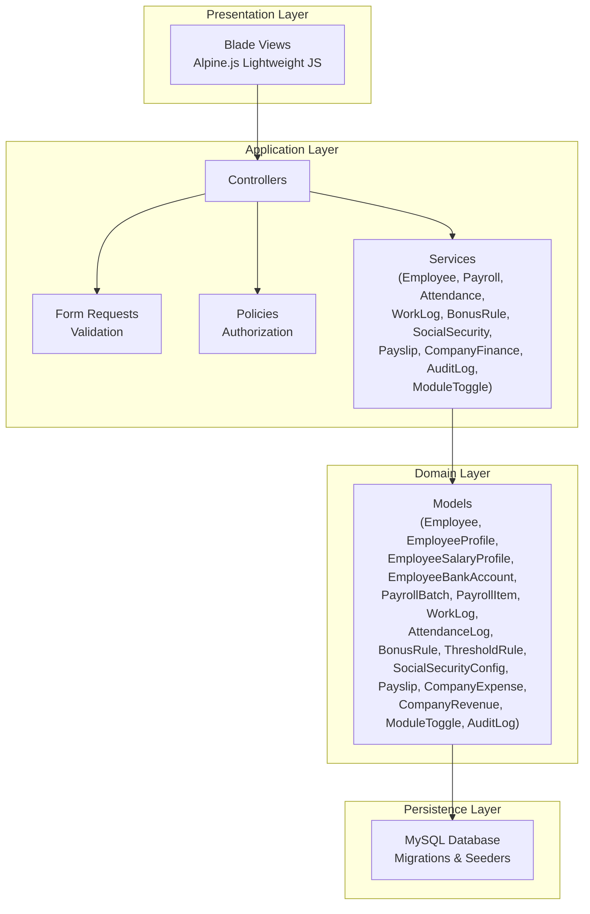
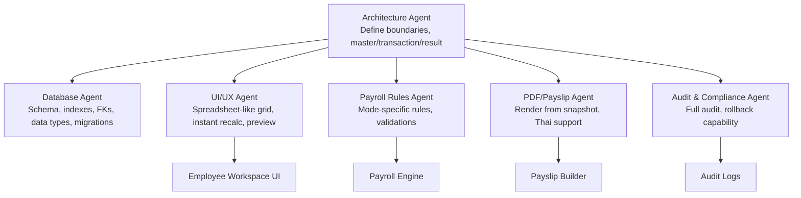
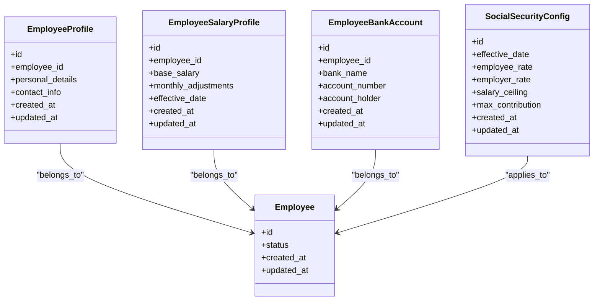
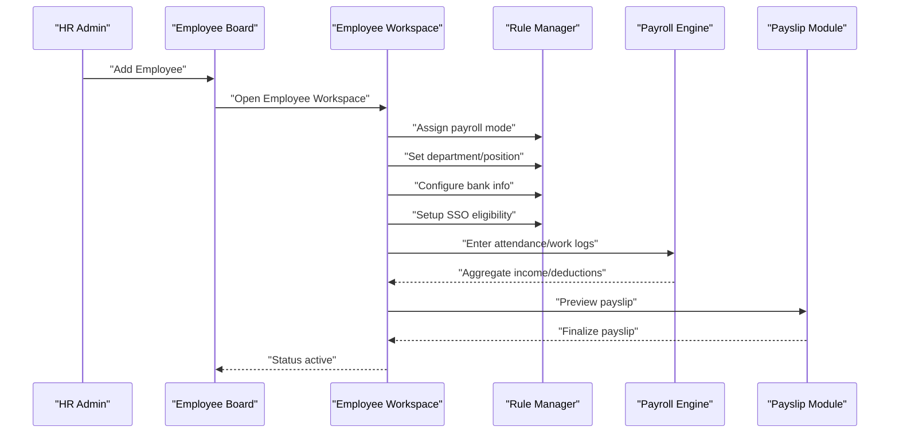
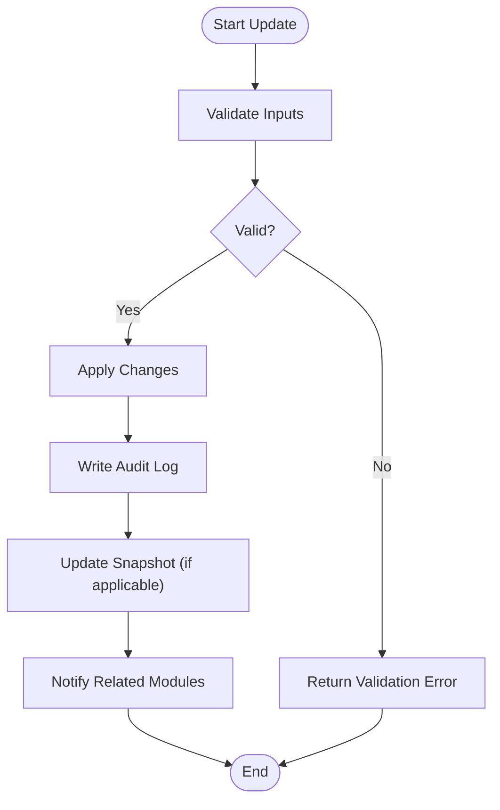
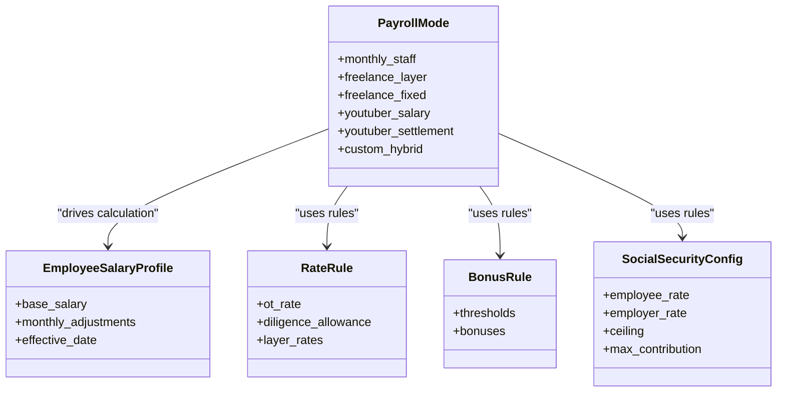
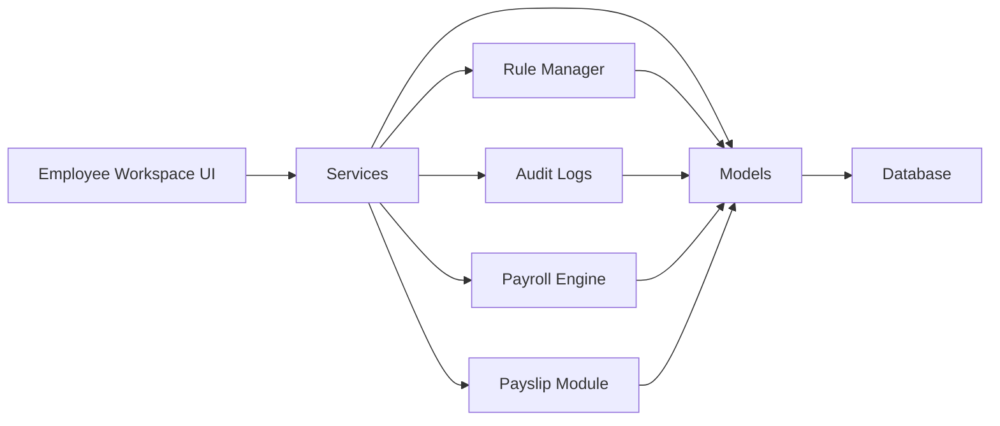

# Employee Management System

<cite>
**Referenced Files in This Document**
- [AGENTS.md](file://AGENTS.md)
</cite>

## Table of Contents
1. [Introduction](#introduction)
2. [Project Structure](#project-structure)
3. [Core Components](#core-components)
4. [Architecture Overview](#architecture-overview)
5. [Detailed Component Analysis](#detailed-component-analysis)
6. [Dependency Analysis](#dependency-analysis)
7. [Performance Considerations](#performance-considerations)
8. [Troubleshooting Guide](#troubleshooting-guide)
9. [Conclusion](#conclusion)

## Introduction
This document describes the employee management system functionality for a payroll and HR platform. It covers employee profile management, onboarding workflows, profile updates, status changes, payroll mode assignment, salary structure setup, role-based access control, and integration with payroll calculation processes. The system emphasizes dynamic, rule-driven data entry with auditability and maintainability.

## Project Structure
The system follows a modular, Laravel-oriented structure with clear separation of concerns:
- Models: Core domain entities and relationships
- Services: Business logic for payroll calculation, attendance, work logs, bonuses, social security, payslip generation, company finance, audit logging, and module toggles
- Controllers: Minimal HTTP entry points
- Requests: Validation via form requests
- Policies: Authorization policies
- Views: Blade templates with lightweight JavaScript for dynamic grids
- Migrations and Seeders: Database schema and initial data
- Tests: Calculation tests, SSO tests, layer rate tests, payslip snapshot tests, and audit logging tests

**Diagram sources**
- [AGENTS.md](file://AGENTS.md)

**Section sources**
- [AGENTS.md](file://AGENTS.md)

## Core Components
The system defines core entities and modules that collectively manage employees and payroll:

- Core Entities
  - Employee: Primary record for an individual worker
  - EmployeeProfile: Personal and contact details
  - EmployeeSalaryProfile: Base salary and monthly adjustments
  - EmployeeBankAccount: Bank account details for payouts
  - PayrollBatch: Monthly batch for payroll processing
  - PayrollItem: Income/deduction entries linked to payroll mode
  - WorkLog: Work records for freelancers and hybrids
  - AttendanceLog: Daily attendance and OT/LWOP flags
  - BonusRule: Configurable performance bonus rules
  - ThresholdRule: Performance thresholds for bonuses
  - SocialSecurityConfig: Thailand SSO configuration
  - Payslip: Generated pay stubs with snapshot
  - ExpenseClaim: Employee expense claims
  - CompanyExpense/CompanyRevenue: Financial records
  - ModuleToggle: Feature toggles
  - AuditLog: Full audit trail

- Modules
  - Authentication: Login/logout, role/permission
  - Employee Management: Add/edit/activate/deactivate, assign payroll mode, department/position, bank info, SSO eligibility
  - Employee Board: Grid/list, search, filter, add, open workspace
  - Employee Workspace: Main UI with month selector, summary cards, payroll grid, detail inspector, payslip preview, audit timeline
  - Attendance Module: Check-in/out, late minutes, early leave, OT enabled, LWOP flag
  - Work Log Module: Date, work type, qty/minutes/seconds, layer, rate, amount
  - Payroll Engine: Calculate by payroll mode, aggregate income/deductions, support manual override, produce snapshot
  - Rule Manager: Attendance, OT, bonus, threshold, layer rate, SSO, tax, module toggles
  - Payslip Module: Preview, finalize, export PDF, regenerate from finalized data only by permission
  - Annual Summary: 12-month view, employee summary, annual totals, export
  - Company Finance Summary: Revenue, expenses, P&L, cumulative, quarterly, tax simulation
  - Subscription & Extra Costs: Recurring software, fixed costs, equipment, dubbing, other business expenses

**Section sources**
- [AGENTS.md](file://AGENTS.md)

## Architecture Overview
The system adheres to a layered architecture with strict separation of concerns:
- Record-based design: All logic is stored as records, not cell positions
- Single Source of Truth: Master data tables define authoritative values
- Rule-driven: Business formulas and configurations live in rules tables
- Audit-ability: Every significant change is logged
- Maintainability: Easy addition of payroll modes, rules, and reports

**Diagram sources**
- [AGENTS.md](file://AGENTS.md)

## Detailed Component Analysis

### Employee Profile Management
Employee profile management encompasses personal information, employment status tracking, department and position assignments, bank account configurations, and social security eligibility setup.

- Personal Information
  - Managed via EmployeeProfile entity
  - Fields include personal details and contact information
  - Updated through Employee Management module

- Employment Status Tracking
  - Status flags and activation controls
  - Activate/deactivate workflows
  - Status change audit logging

- Department and Position Assignments
  - Department and Position entities
  - Assignment during onboarding and updates
  - Filter and search by role/status/mode in Employee Board

- Bank Account Configurations
  - EmployeeBankAccount entity
  - Bank details for salary disbursement
  - Validation and audit on changes

- Social Security Eligibility Setup
  - SocialSecurityConfig entity
  - Thailand-specific SSO configuration
  - Configurable rates, ceilings, and effective dates

**Diagram sources**
- [AGENTS.md](file://AGENTS.md)

**Section sources**
- [AGENTS.md](file://AGENTS.md)

### Employee Onboarding Workflow
The onboarding process integrates profile creation, status initialization, payroll mode assignment, department/position assignment, bank account setup, and SSO eligibility configuration.

**Diagram sources**
- [AGENTS.md](file://AGENTS.md)

**Section sources**
- [AGENTS.md](file://AGENTS.md)

### Profile Update Processes and Status Change Management
Profile updates and status changes are governed by strict validation and audit logging.

- Profile Updates
  - Inline editing in Employee Workspace
  - Validation and permission control
  - Source flags: auto/manual/override/master
  - Audit log captures changes

- Status Changes
  - Activate/deactivate workflows
  - Audit logging for status transitions
  - Impact on payroll mode and snapshots

**Diagram sources**
- [AGENTS.md](file://AGENTS.md)

**Section sources**
- [AGENTS.md](file://AGENTS.md)

### Payroll Mode Assignment and Salary Structure Setup
Payroll modes drive calculation logic and structure. The system supports multiple modes with configurable rules.

- Payroll Modes
  - monthly_staff
  - freelance_layer
  - freelance_fixed
  - youtuber_salary
  - youtuber_settlement
  - custom_hybrid

- Salary Structure Setup
  - Base salary in EmployeeSalaryProfile
  - Monthly adjustments and effective dates
  - Rule-driven calculations for allowances, bonuses, deductions

- Rule Manager
  - Attendance rules
  - OT rules
  - Bonus rules
  - Threshold rules
  - Layer rate rules
  - SSO rules
  - Tax rules
  - Module toggles

**Diagram sources**
- [AGENTS.md](file://AGENTS.md)

**Section sources**
- [AGENTS.md](file://AGENTS.md)

### Role-Based Access Control
Access control ensures only authorized users can perform sensitive actions.

- Roles and Permissions
  - Users mapped to roles
  - Permission checks for payroll, rule changes, payslip finalize/regenerate
  - Policy enforcement across modules

- Audit Coverage
  - High-priority audit areas include salary profile changes, payroll item amounts, payslip edits/finalize, rule changes, module toggle changes, SSO config changes

**Section sources**
- [AGENTS.md](file://AGENTS.md)

### Integration with Payroll Calculation Processes
Payroll calculation integrates attendance, work logs, rules, and snapshots.

- Attendance Integration
  - AttendanceLog captures daily presence, late minutes, early leave, OT enablement, LWOP flags

- Work Log Integration
  - WorkLog for freelancers and hybrids with date, work type, qty/minutes/seconds, layer, rate, amount

- Payroll Engine
  - Calculate by payroll mode
  - Aggregate income/deductions
  - Support manual override
  - Produce payroll result snapshot

- Payslip Integration
  - Preview payslip
  - Finalize payslip
  - Export PDF
  - Regenerate from finalized data only by permission

**Section sources**
- [AGENTS.md](file://AGENTS.md)

## Dependency Analysis
The system maintains clean dependencies across layers and modules.

**Diagram sources**
- [AGENTS.md](file://AGENTS.md)

**Section sources**
- [AGENTS.md](file://AGENTS.md)

## Performance Considerations
- Use unsigned big integers for foreign keys to optimize joins
- Store monetary fields as decimal with sufficient precision
- Use integer minutes/seconds for time durations
- Prefer soft deletes for entities requiring historical audit
- Maintain indexes on frequently filtered columns (status, payroll mode, effective dates)
- Keep business logic out of views and controllers; encapsulate in services
- Use transactions for critical operations to ensure atomicity

[No sources needed since this section provides general guidance]

## Troubleshooting Guide
Common issues and resolutions:

- Validation Failures
  - Ensure all required fields are present and formatted correctly
  - Use FormRequest validation and service-level validation

- Audit Logging Gaps
  - Verify audit logging is enabled for high-priority areas
  - Confirm permissions allow audit coverage

- Payslip Discrepancies
  - Check source flags and manual overrides
  - Review rule changes and module toggles
  - Rebuild snapshot after finalization

- Payroll Mode Mismatches
  - Confirm payroll mode assignment aligns with employee category
  - Validate rule configurations for the selected mode

**Section sources**
- [AGENTS.md](file://AGENTS.md)

## Conclusion
The employee management system provides a robust, rule-driven framework for managing employee profiles, onboarding, updates, status changes, payroll modes, salary structures, and integration with payroll calculations. Its modular design, strong auditability, and maintainability enable scalable enhancements while ensuring compliance and accuracy.