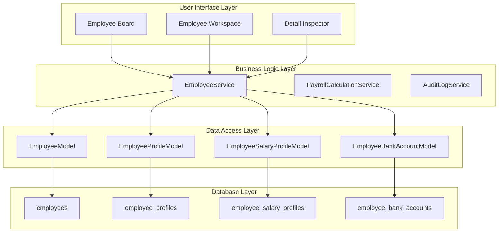
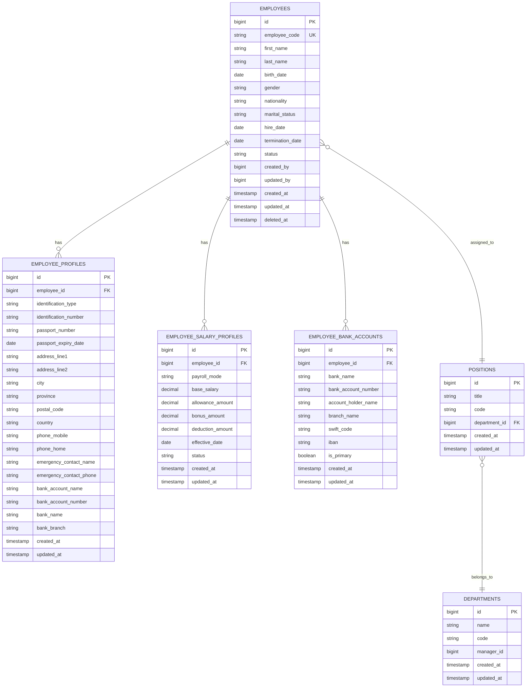
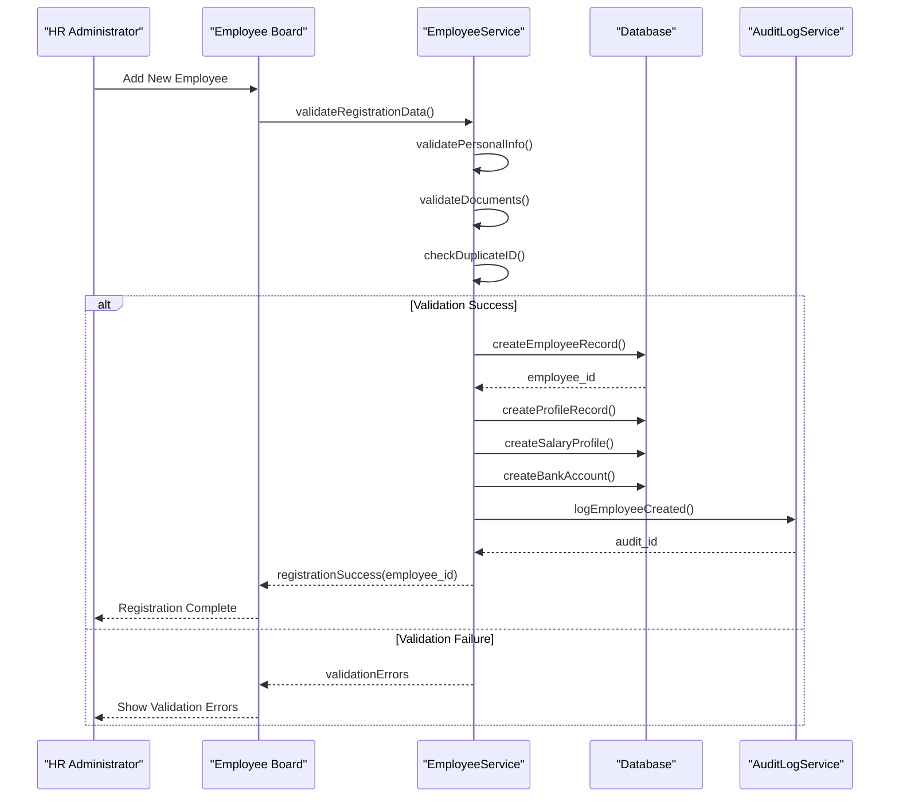
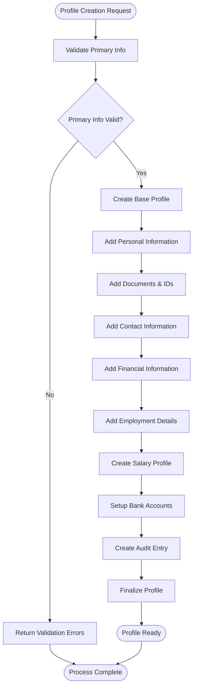
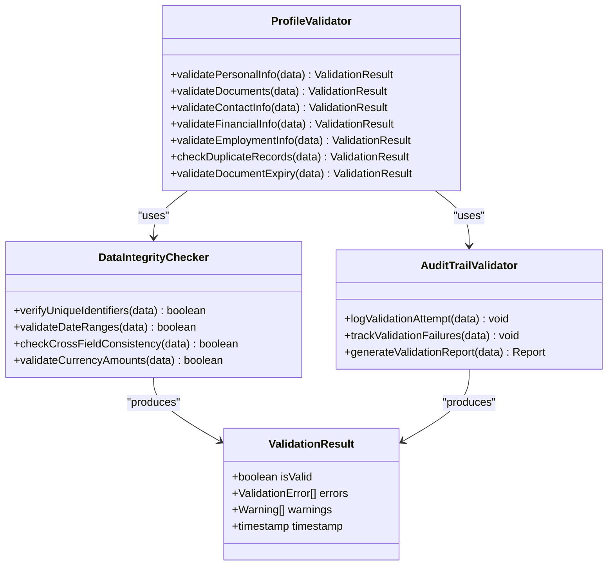
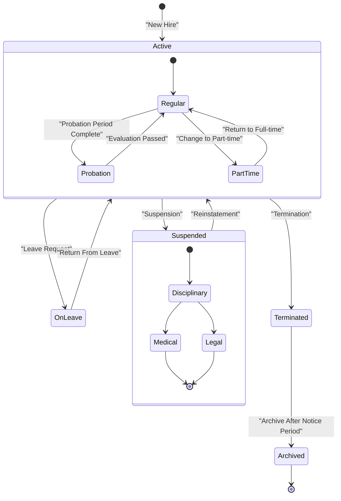
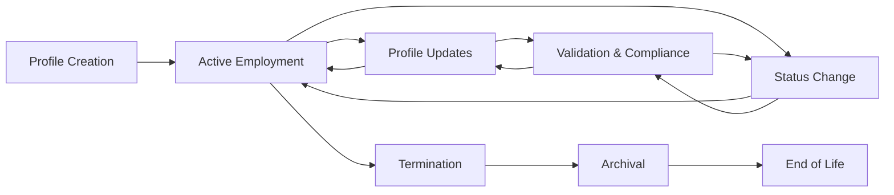
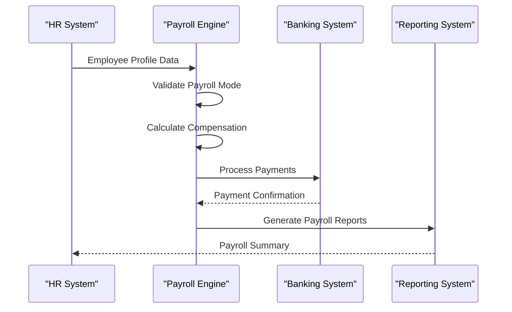

# Employee Profile Management

<cite>
**Referenced Files in This Document**
- [AGENTS.md](file://AGENTS.md)
</cite>

## Table of Contents
1. [Introduction](#introduction)
2. [System Architecture](#system-architecture)
3. [Core Data Model](#core-data-model)
4. [Employee Registration Process](#employee-registration-process)
5. [Profile Creation Workflow](#profile-creation-workflow)
6. [Profile Validation System](#profile-validation-system)
7. [Employment Status Tracking](#employment-status-tracking)
8. [Profile Lifecycle Management](#profile-lifecycle-management)
9. [Configuration Options](#configuration-options)
10. [Integration Scenarios](#integration-scenarios)
11. [Common Use Cases](#common-use-cases)
12. [Troubleshooting Guide](#troubleshooting-guide)
13. [Conclusion](#conclusion)

## Introduction

The Employee Profile Management system is a comprehensive component of the xHR Payroll & Finance System designed to replace traditional Excel-based employee management with a robust, database-driven solution. This system provides structured employee data capture, validation, and lifecycle management while maintaining auditability and compliance requirements.

The system follows modern PHP development principles with Laravel framework support, emphasizing rule-driven architecture, dynamic data entry, and maintainability. It serves as the foundation for payroll processing, benefits administration, and comprehensive employee data management.

## System Architecture

The Employee Profile Management system operates within a broader payroll ecosystem with clear separation of concerns and modular architecture.

**Diagram sources**
- [AGENTS.md:132-149](file://AGENTS.md#L132-L149)
- [AGENTS.md:387-416](file://AGENTS.md#L387-L416)

The architecture ensures that employee data flows through validated business logic before reaching the database, maintaining data integrity and audit trails throughout the system.

## Core Data Model

The employee profile system is built around several interconnected entities that capture comprehensive employee information and employment details.

### Primary Entities

**Diagram sources**
- [AGENTS.md:387-416](file://AGENTS.md#L387-L416)

### Core Field Specifications

The system defines comprehensive field structures for different aspects of employee information:

**Personal Information Fields:**
- Full name components (first_name, last_name)
- Date of birth and age calculation
- Gender and nationality
- Marital status and dependents
- Contact preferences and emergency contacts

**Identification and Documentation:**
- National ID or equivalent identification
- Passport information with expiry tracking
- Address verification and residency status
- Tax identification numbers

**Contact and Communication:**
- Mobile and home phone numbers
- Emergency contact relationships
- Preferred communication channels

**Financial and Banking:**
- Multiple bank account support
- Primary account designation
- Account holder verification
- International banking formats (SWIFT/IBAN)

**Section sources**
- [AGENTS.md:387-416](file://AGENTS.md#L387-L416)

## Employee Registration Process

The employee registration process follows a structured workflow designed to capture comprehensive information while maintaining validation standards and audit trails.

### Registration Workflow

**Diagram sources**
- [AGENTS.md:294-301](file://AGENTS.md#L294-L301)
- [AGENTS.md:508-515](file://AGENTS.md#L508-L515)

### Registration Requirements

The registration process enforces strict validation rules:

**Required Information:**
- Unique employee identifier
- Legal name and date of birth
- Primary identification document
- Basic contact information
- Employment start date

**Document Verification:**
- Validity checks for identification documents
- Passport expiry monitoring
- Address verification requirements
- Bank account validation

**Section sources**
- [AGENTS.md:294-301](file://AGENTS.md#L294-L301)

## Profile Creation Workflow

The profile creation process extends beyond basic registration to establish comprehensive employee records suitable for payroll processing and benefits administration.

### Multi-Tier Profile Architecture

**Diagram sources**
- [AGENTS.md:132-149](file://AGENTS.md#L132-L149)
- [AGENTS.md:392-395](file://AGENTS.md#L392-L395)

### Profile Components

Each employee profile consists of multiple interconnected components:

**Basic Profile Information:**
- Personal identification and demographics
- Contact preferences and emergency contacts
- Document expiration tracking
- Photo upload capabilities

**Employment Profile:**
- Department and position assignments
- Payroll mode selection
- Employment status tracking
- Benefits enrollment details

**Financial Profile:**
- Multiple bank account management
- Tax withholding allowances
- Deduction authorization forms
- Payment method preferences

**Section sources**
- [AGENTS.md:392-395](file://AGENTS.md#L392-L395)

## Profile Validation System

The validation system ensures data integrity through comprehensive checking mechanisms applied at multiple stages of the profile lifecycle.

### Validation Architecture

**Diagram sources**
- [AGENTS.md:576-595](file://AGENTS.md#L576-L595)

### Validation Rules

**Personal Information Validation:**
- Age verification against employment eligibility
- Name format validation and cultural appropriateness
- Gender and identity document matching
- Nationality and residency status alignment

**Document Validation:**
- Expiration date checking and renewal reminders
- Document authenticity verification
- Cross-reference validation with government databases
- Duplicate document detection

**Financial Validation:**
- Bank account number verification
- SWIFT/BIC code validation for international transfers
- Tax ID number format validation
- Multiple account conflict resolution

**Employment Validation:**
- Payroll mode eligibility verification
- Department-position compatibility
- Supervisor assignment validation
- Benefits package matching

**Section sources**
- [AGENTS.md:576-595](file://AGENTS.md#L576-L595)

## Employment Status Tracking

The system maintains comprehensive employment status tracking to support payroll processing, benefits administration, and compliance reporting.

### Status Management

**Diagram sources**
- [AGENTS.md:297-298](file://AGENTS.md#L297-L298)

### Status Categories

**Active Employment:**
- Regular full-time employees
- Part-time employees
- Probationary employees
- Seasonal workers

**Inactive Employment:**
- On leave (vacation, sick leave, maternity/paternity)
- Suspension (disciplinary or medical)
- Temporary absence
- Retired employees

**Termination:**
- Voluntary resignation
- Involuntary termination
- Retirement
- Death

**Section sources**
- [AGENTS.md:297-298](file://AGENTS.md#L297-L298)

## Profile Lifecycle Management

The profile lifecycle encompasses the complete journey of an employee record from initial creation through termination and archival.

### Lifecycle Stages

**Diagram sources**
- [AGENTS.md:576-595](file://AGENTS.md#L576-L595)

### Lifecycle Events

**Creation Events:**
- New hire onboarding
- Transfer from another company
- Rehiring former employee

**Maintenance Events:**
- Personal information updates
- Employment status changes
- Payroll configuration updates
- Benefits enrollment changes

**Transition Events:**
- Promotion or demotion
- Department transfer
- Payroll mode change
- Termination processing

**Archival Events:**
- Data retention compliance
- Privacy regulations compliance
- Historical reporting requirements

**Section sources**
- [AGENTS.md:576-595](file://AGENTS.md#L576-L595)

## Configuration Options

The system provides extensive configuration options to accommodate different organizational needs and regulatory requirements.

### Profile Field Configuration

**Customizable Fields:**
- Additional personal information fields
- Department-specific requirements
- Position-level configurations
- Location-based compliance needs

**Display Configuration:**
- Field visibility by role
- Required vs. optional field designation
- Conditional field display
- Field grouping and organization

**Validation Configuration:**
- Custom validation rules
- Field-specific business rules
- Cross-field validation dependencies
- Regulatory compliance requirements

### Status Indicator Configuration

**Status Categories:**
- Configurable status types
- Status color coding
- Status transition rules
- Status-specific workflows

**Workflow Configuration:**
- Approval routing for status changes
- Notification triggers for status updates
- Audit trail customization
- Reporting filters by status

### Section sources**
- [AGENTS.md:61-74](file://AGENTS.md#L61-L74)

## Integration Scenarios

The Employee Profile Management system integrates seamlessly with various organizational systems and external services.

### Payroll System Integration

**Diagram sources**
- [AGENTS.md:338-343](file://AGENTS.md#L338-L343)

### External System Integrations

**Government Systems:**
- Social security contributions
- Tax filing requirements
- Labor law compliance
- Statistical reporting

**Benefits Administration:**
- Health insurance integration
- Retirement fund contributions
- Leave management systems
- Professional development tracking

**Communication Systems:**
- Email notifications
- SMS alerts
- Mobile app synchronization
- Portal integrations

### Section sources**
- [AGENTS.md:338-343](file://AGENTS.md#L338-L343)

## Common Use Cases

The system supports numerous common scenarios encountered in HR and payroll management.

### Employee Onboarding

**Onboarding Workflow:**
1. Initial registration with basic information
2. Document submission and verification
3. Profile completion and approval
4. Payroll setup and configuration
5. Access provisioning and training

**Key Features:**
- Automated welcome communications
- Checklist-based completion tracking
- Manager notification workflows
- Compliance verification

### Profile Updates

**Update Scenarios:**
- Personal information changes (marriage, address, dependents)
- Employment status updates (promotions, transfers)
- Financial information modifications (bank accounts)
- Benefits enrollment changes

**Processing Workflow:**
- Change request submission
- Approval workflow configuration
- Effective date management
- Audit trail maintenance

### Status Changes

**Status Transition Management:**
- Leave request processing and approval
- Suspension and reinstatement procedures
- Termination and exit interview coordination
- Rehire and reactivation processes

**Automation Features:**
- Automatic benefit enrollment changes
- Payroll adjustment calculations
- Access revocation and restoration
- Communication notifications

### Data Migration

**Migration Strategies:**
- Bulk data import from legacy systems
- Field mapping and transformation
- Duplicate detection and resolution
- Validation and quality assurance

**Migration Tools:**
- CSV import wizard
- Field mapping interface
- Validation reports
- Rollback capabilities

## Troubleshooting Guide

Common issues and their solutions in the Employee Profile Management system.

### Data Validation Issues

**Problem:** Profile fails validation during creation
**Solution:** Review validation messages, correct field formats, ensure all required fields are completed

**Problem:** Duplicate employee identification detected
**Solution:** Verify identification number uniqueness, check for existing records, resolve conflicts

**Problem:** Document expiration date validation fails
**Solution:** Ensure documents are valid and not expired, update expiry dates, provide replacement documents

### Integration Problems

**Problem:** Payroll system not receiving profile updates
**Solution:** Check integration connectivity, verify data mapping, review error logs, test API connections

**Problem:** Bank payment processing failures
**Solution:** Validate bank account information, check account status, verify payment formats, contact bank support

**Problem:** Reporting system not displaying updated data
**Solution:** Refresh data caches, verify report configurations, check data synchronization, review permissions

### Performance Issues

**Problem:** Slow profile loading times
**Solution:** Optimize database queries, implement indexing strategies, review memory usage, consider caching

**Problem:** High system resource consumption
**Solution:** Monitor concurrent user sessions, optimize batch processing, review memory allocation, upgrade hardware

**Section sources**
- [AGENTS.md:663-672](file://AGENTS.md#L663-L672)

## Conclusion

The Employee Profile Management system provides a comprehensive foundation for modern HR and payroll operations. Its rule-driven architecture, comprehensive validation system, and flexible configuration options enable organizations to maintain accurate employee records while supporting complex payroll processing requirements.

The system's emphasis on auditability, compliance, and maintainability ensures long-term sustainability and adaptability to changing business needs. By following the established patterns and utilizing the provided configuration options, organizations can implement efficient employee profile management processes that integrate seamlessly with broader HR and financial systems.

The modular design and clear separation of concerns facilitate future enhancements and extensions, supporting continued innovation in employee management capabilities while maintaining data integrity and regulatory compliance.