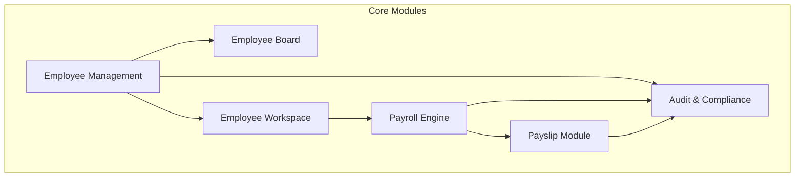
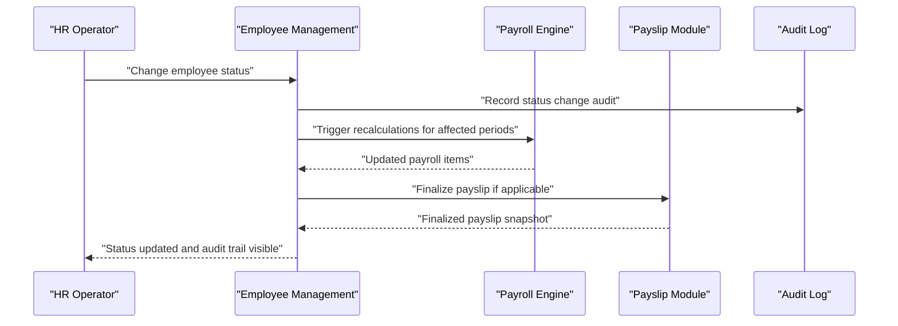
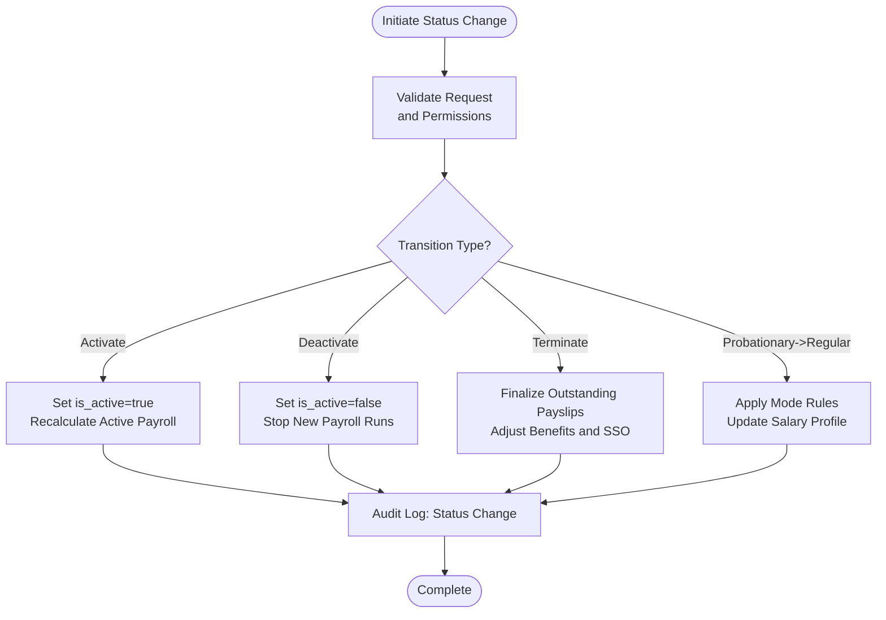
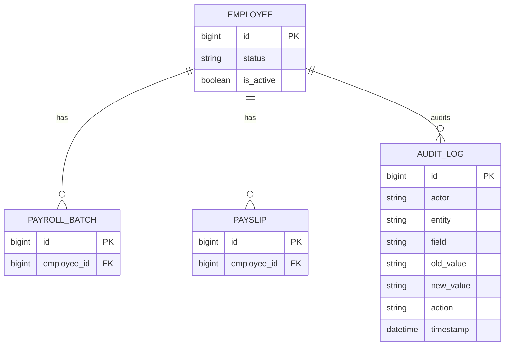
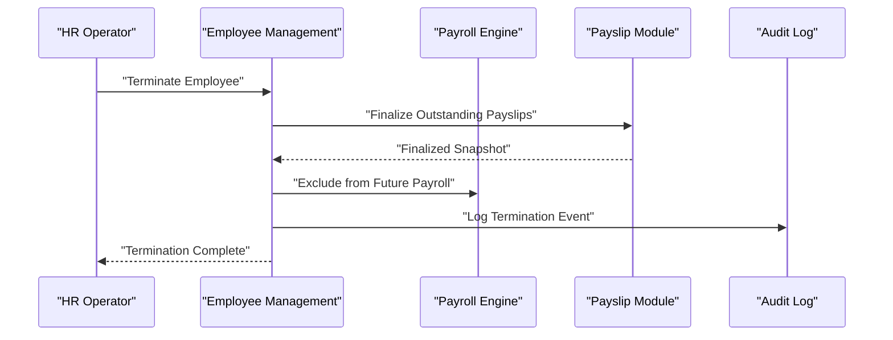
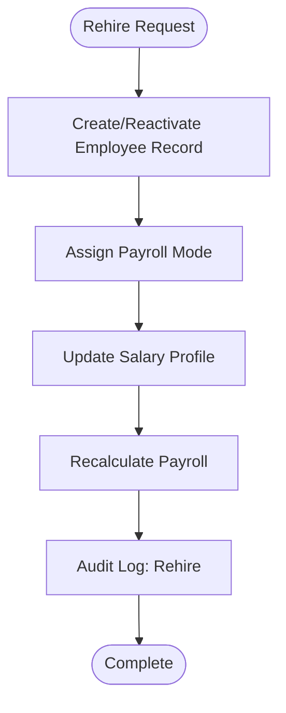
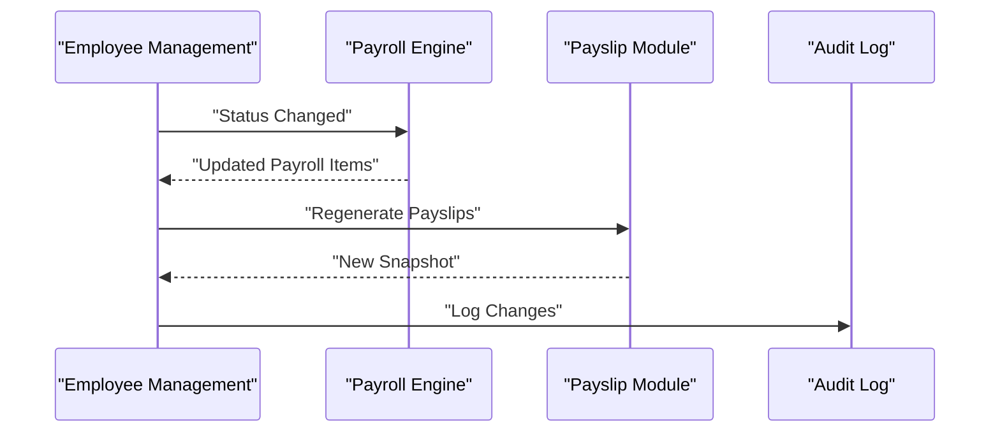
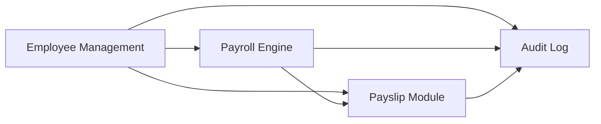

# Employment Status Tracking

<cite>
**Referenced Files in This Document**
- [AGENTS.md](file://AGENTS.md)
</cite>

## Table of Contents
1. [Introduction](#introduction)
2. [Project Structure](#project-structure)
3. [Core Components](#core-components)
4. [Architecture Overview](#architecture-overview)
5. [Detailed Component Analysis](#detailed-component-analysis)
6. [Dependency Analysis](#dependency-analysis)
7. [Performance Considerations](#performance-considerations)
8. [Troubleshooting Guide](#troubleshooting-guide)
9. [Conclusion](#conclusion)

## Introduction
This document describes the employment status tracking functionality for the xHR Payroll & Finance System. It explains how employee status is modeled, how status transitions are governed, and how audit and compliance requirements are met. It also outlines configuration options for status types, transition rules, and notifications, and provides practical workflows for common scenarios such as termination and rehiring. Finally, it explains how status changes integrate with payroll calculation and payslip generation.

## Project Structure
The repository defines a comprehensive set of modules and guidelines for building a payroll and finance system. The employment status tracking capability is embedded within the broader Employee Management and Payroll domains, with explicit audit and rule-driven design principles.

**Diagram sources**
- [AGENTS.md](file://AGENTS.md)

**Section sources**
- [AGENTS.md](file://AGENTS.md)

## Core Components
- Employee and Employee Profile: Core entities that hold personal and employment metadata, including status flags.
- Payroll Modes: Defines how status impacts compensation calculations (e.g., monthly staff, freelance modes).
- Payroll Items and Payroll Batch: Aggregate income and deductions; status affects eligibility and calculation rules.
- Payslip and Payslip Items: Finalized snapshots of earnings and deductions; status changes may trigger recalculations or restrictions.
- Audit Logs: Required for all status changes and related payroll adjustments.

Key conventions and flags:
- Status flags: status and is_active are standardized flags used across entities.
- Audit logging: Every material change must be audited with who, what, field, old/new values, action, timestamp, and optional reason.

**Section sources**
- [AGENTS.md](file://AGENTS.md)

## Architecture Overview
The employment lifecycle is managed through a combination of:
- Status flags on employee records
- Payroll mode selection affecting how status influences compensation
- Rule-driven calculation engine applying thresholds, allowances, and deductions
- Audit logging capturing all changes
- Payslip generation from finalized payroll results

**Diagram sources**
- [AGENTS.md](file://AGENTS.md)

## Detailed Component Analysis

### Status Types and Flags
- Standard flags:
  - status: general employment status indicator
  - is_active: boolean activation flag
- These flags are consistently applied across core entities and are required for filtering and reporting.

Practical implications:
- Filtering by status/mode is supported in the Employee Board.
- UI states include draft, finalized, and other states that complement status flags.

**Section sources**
- [AGENTS.md](file://AGENTS.md)

### Status Transition Workflows
- Activation/Deactivation:
  - Supported via Employee Management controls.
  - Triggers recalculations for affected payroll batches and updates payslip eligibility.
- Probationary to Regular:
  - Governed by payroll mode-specific rules and thresholds.
  - Requires audit logging of transition and any salary profile changes.
- Termination:
  - Terminated employees are excluded from future active payroll runs.
  - Finalization of outstanding payslips occurs prior to termination.
  - Social security and benefit calculations are adjusted accordingly.

**Diagram sources**
- [AGENTS.md](file://AGENTS.md)

### Approval Processes
- Permission control is required for editing and approving status changes.
- Audit logs capture who performed the action and when, enabling traceability and compliance review.

**Section sources**
- [AGENTS.md](file://AGENTS.md)

### Audit Trail Requirements
- Must-log fields include actor, entity, field, old/new values, action, timestamp, and optional reason.
- High-priority audit areas include employee status changes, salary profile changes, and payroll item edits.

**Diagram sources**
- [AGENTS.md](file://AGENTS.md)

### Configuration Options
- Status Types:
  - Define status values (e.g., active, inactive, probationary, terminated) and map them to payroll eligibility.
- Transition Rules:
  - Configure allowed transitions (e.g., probationary->regular, active->inactive) and prerequisites (e.g., performance thresholds).
- Notification Triggers:
  - Configure notifications for status changes (e.g., email/SMS) and audit alerts for sensitive changes.
- Payroll Mode Impact:
  - Adjust how each mode treats status (e.g., inactive employees excluded from monthly staff payroll).

**Section sources**
- [AGENTS.md](file://AGENTS.md)

### Practical Scenarios

#### Employee Termination Procedure
- Steps:
  - Approve termination in Employee Management.
  - Finalize any outstanding payslips.
  - Stop new payroll runs for the employee.
  - Adjust social security and benefits accordingly.
- Audit:
  - Capture termination event with reason and timestamp.
- Payroll Integration:
  - Exclude terminated employee from future payroll batches.
  - Ensure final payslip snapshot reflects finalization.

**Diagram sources**
- [AGENTS.md](file://AGENTS.md)

#### Rehiring Process
- Steps:
  - Create or reactivate employee record.
  - Assign payroll mode and update salary profile.
  - Recalculate historical and future payroll as needed.
- Audit:
  - Log rehire and any profile changes.
- Payroll Integration:
  - Resume payroll runs according to mode rules.

**Diagram sources**
- [AGENTS.md](file://AGENTS.md)

#### Status Validation Requirements
- Validation ensures:
  - Allowed transitions are enforced.
  - Required approvals are present.
  - Payroll impact is calculated and reflected in payslips.
- UI states help users understand the current state and available actions.

**Section sources**
- [AGENTS.md](file://AGENTS.md)

### Integration with Payroll Calculation Systems
- Payroll calculation depends on:
  - Employee status (active/inactive/probationary/terminated)
  - Payroll mode (monthly staff, freelance, etc.)
  - Salary profile and rule configurations
- When status changes:
  - Trigger recalculations for affected periods.
  - Regenerate payslips where applicable.
  - Maintain audit trail of all changes.

**Diagram sources**
- [AGENTS.md](file://AGENTS.md)

## Dependency Analysis
- Employee Management depends on:
  - Payroll Engine for recalculations
  - Payslip Module for finalization
  - Audit Log for compliance
- Payroll Engine depends on:
  - Employee records and salary profiles
  - Rule configurations
- Payslip Module depends on:
  - Finalized payroll items
  - Audit snapshots for immutability

**Diagram sources**
- [AGENTS.md](file://AGENTS.md)

**Section sources**
- [AGENTS.md](file://AGENTS.md)

## Performance Considerations
- Keep status-related queries indexed on status and is_active flags.
- Batch payroll recalculations during off-hours when possible.
- Limit audit log writes to essential events to reduce overhead.
- Use snapshots for payslips to avoid recomputation.

## Troubleshooting Guide
- Status not updating:
  - Verify permissions and approval steps.
  - Confirm audit logs for the change.
- Payroll not recalculated:
  - Check payroll mode and batch status.
  - Review audit logs for errors or missing approvals.
- Payslip not finalizing:
  - Ensure all prerequisite statuses are resolved.
  - Confirm snapshot integrity and audit trail.

**Section sources**
- [AGENTS.md](file://AGENTS.md)

## Conclusion
The employment status tracking system is designed around clear status flags, strict audit logging, and rule-driven payroll calculations. By configuring status types, transition rules, and notifications, organizations can automate and govern status changes while maintaining compliance and accurate payroll outcomes. Integration with the Payroll Engine and Payslip Module ensures that status changes propagate correctly across the system.