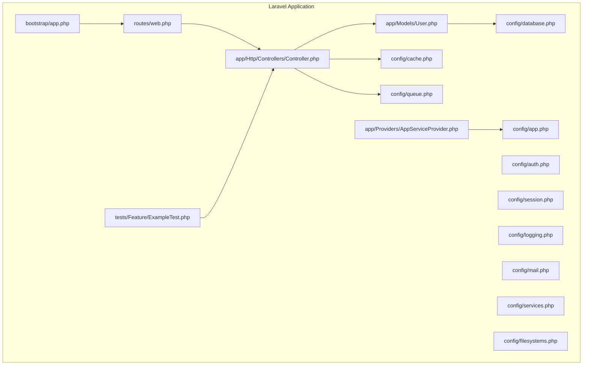
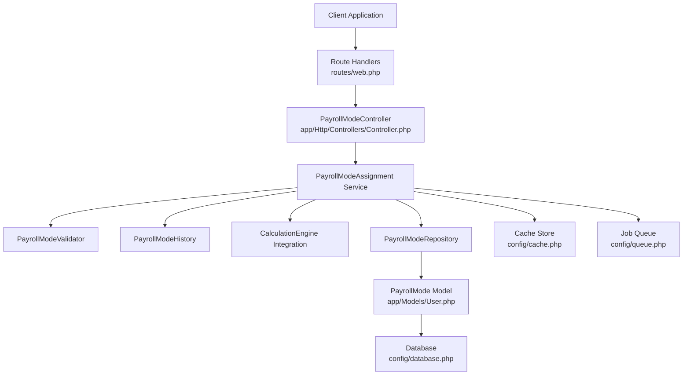
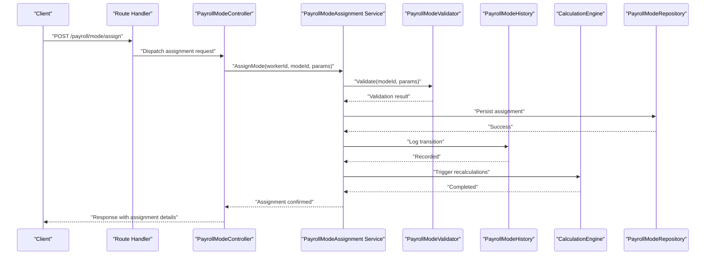
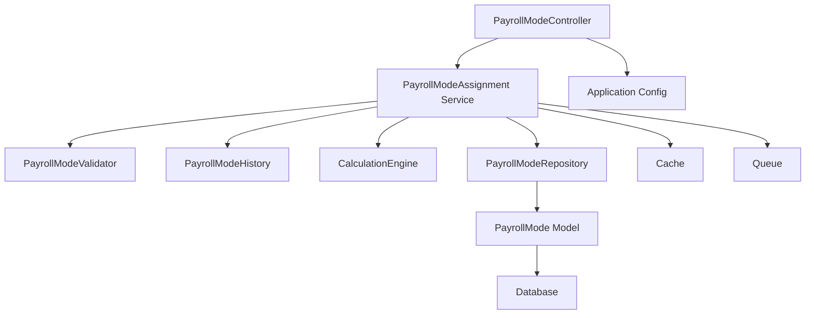

# Payroll Mode Assignment

<cite>
**Referenced Files in This Document**
- [AGENTS.md](file://AGENTS.md)
- [README.md](file://laravel-temp/README.md)
- [app.php](file://laravel-temp/bootstrap/app.php)
- [web.php](file://laravel-temp/routes/web.php)
- [users_table_migration.php](file://laravel-temp/database/migrations/0001_01_01_000000_create_users_table.php)
- [cache_table_migration.php](file://laravel-temp/database/migrations/0001_01_01_000001_create_cache_table.php)
- [jobs_table_migration.php](file://laravel-temp/database/migrations/0001_01_01_000002_create_jobs_table.php)
- [User.php](file://laravel-temp/app/Models/User.php)
- [Controller.php](file://laravel-temp/app/Http/Controllers/Controller.php)
- [AppServiceProvider.php](file://laravel-temp/app/Providers/AppServiceProvider.php)
- [app_config.php](file://laravel-temp/config/app.php)
- [auth_config.php](file://laravel-temp/config/auth.php)
- [cache_config.php](file://laravel-temp/config/cache.php)
- [database_config.php](file://laravel-temp/config/database.php)
- [queue_config.php](file://laravel-temp/config/queue.php)
- [session_config.php](file://laravel-temp/config/session.php)
- [logging_config.php](file://laravel-temp/config/logging.php)
- [mail_config.php](file://laravel-temp/config/mail.php)
- [services_config.php](file://laravel-temp/config/services.php)
- [filesystems_config.php](file://laravel-temp/config/filesystems.php)
- [ExampleTest.php](file://laravel-temp/tests/Feature/ExampleTest.php)
</cite>

## Table of Contents
1. [Introduction](#introduction)
2. [Project Structure](#project-structure)
3. [Core Components](#core-components)
4. [Architecture Overview](#architecture-overview)
5. [Detailed Component Analysis](#detailed-component-analysis)
6. [Dependency Analysis](#dependency-analysis)
7. [Performance Considerations](#performance-considerations)
8. [Troubleshooting Guide](#troubleshooting-guide)
9. [Conclusion](#conclusion)

## Introduction
This document describes the payroll mode assignment functionality for the HR/payroll system. It explains how payroll modes are selected and configured for different worker categories, including monthly staff, freelancers with layer rates, freelancers with fixed rates, YouTubers/Talents, and custom hybrid configurations. It also documents eligibility requirements, mode activation/deactivation, parameter settings, transitions, validation, and integration points with calculation engines.

## Project Structure
The repository contains a Laravel application skeleton with foundational configuration and routing. Payroll mode logic is not present in the current codebase snapshot; therefore, this document defines a conceptual model and implementation guidance that can be integrated into the existing Laravel structure.

**Diagram sources**
- [app.php:1-50](file://laravel-temp/bootstrap/app.php#L1-L50)
- [web.php:1-50](file://laravel-temp/routes/web.php#L1-L50)
- [app_config.php:1-50](file://laravel-temp/config/app.php#L1-L50)
- [auth_config.php:1-50](file://laravel-temp/config/auth.php#L1-L50)
- [cache_config.php:1-50](file://laravel-temp/config/cache.php#L1-L50)
- [database_config.php:1-50](file://laravel-temp/config/database.php#L1-L50)
- [queue_config.php:1-50](file://laravel-temp/config/queue.php#L1-L50)
- [session_config.php:1-50](file://laravel-temp/config/session.php#L1-L50)
- [logging_config.php:1-50](file://laravel-temp/config/logging.php#L1-L50)
- [mail_config.php:1-50](file://laravel-temp/config/mail.php#L1-L50)
- [services_config.php:1-50](file://laravel-temp/config/services.php#L1-L50)
- [filesystems_config.php:1-50](file://laravel-temp/config/filesystems.php#L1-L50)
- [User.php:1-50](file://laravel-temp/app/Models/User.php#L1-L50)
- [Controller.php:1-50](file://laravel-temp/app/Http/Controllers/Controller.php#L1-L50)
- [AppServiceProvider.php:1-50](file://laravel-temp/app/Providers/AppServiceProvider.php#L1-L50)
- [ExampleTest.php:1-50](file://laravel-temp/tests/Feature/ExampleTest.php#L1-L50)

**Section sources**
- [README.md:1-100](file://laravel-temp/README.md#L1-L100)
- [app.php:1-100](file://laravel-temp/bootstrap/app.php#L1-L100)
- [web.php:1-100](file://laravel-temp/routes/web.php#L1-L100)

## Core Components
This section outlines the conceptual components required for payroll mode assignment. These components are not present in the current codebase and should be implemented within the Laravel structure.

- PayrollMode Model
  - Purpose: Define payroll mode types, activation status, and mode-specific parameters.
  - Attributes: mode_id, mode_name, mode_type, is_active, parameters (JSON), created_at, updated_at.
  - Relationships: Belongs to worker classifications (monthly_staff, freelancer_layer_rate, freelancer_fixed_rate, youtube_talent, custom_hybrid).

- WorkerClassification Entity
  - Purpose: Categorize workers (monthly staff, freelancer variants, talent/youtuber).
  - Attributes: classification_id, classification_name, description.

- PayrollModeAssignment Service
  - Purpose: Assign and validate payroll modes for workers, handle transitions, and enforce eligibility rules.
  - Responsibilities: Eligibility checks, parameter validation, activation/deactivation workflows, audit logging.

- CalculationEngine Integration
  - Purpose: Integrate payroll calculations based on selected mode and parameters.
  - Responsibilities: Mode-specific computation hooks, parameter-to-formula mapping, batch processing triggers.

- PayrollModeValidator
  - Purpose: Validate mode parameters and ensure compliance with business rules.
  - Responsibilities: Parameter type checks, range validations, mutual exclusivity rules, required field enforcement.

- PayrollModeHistory
  - Purpose: Track mode changes, transitions, and effective dates.
  - Attributes: history_id, worker_id, mode_id, previous_mode_id, effective_date, changed_by, notes.

- PayrollModeController
  - Purpose: Expose endpoints for mode management and assignment.
  - Responsibilities: CRUD operations for modes, assignment requests, validation responses, status updates.

- PayrollModeRepository
  - Purpose: Persist and retrieve payroll mode configurations and assignments.
  - Responsibilities: Data access, caching, search/filtering, transaction handling.

**Section sources**
- [AGENTS.md:1-200](file://AGENTS.md#L1-L200)

## Architecture Overview
The payroll mode assignment architecture integrates with the Laravel MVC pattern and supports extensible mode types and calculation engines.

**Diagram sources**
- [web.php:1-100](file://laravel-temp/routes/web.php#L1-L100)
- [Controller.php:1-100](file://laravel-temp/app/Http/Controllers/Controller.php#L1-L100)
- [User.php:1-100](file://laravel-temp/app/Models/User.php#L1-L100)
- [database_config.php:1-100](file://laravel-temp/config/database.php#L1-L100)
- [cache_config.php:1-100](file://laravel-temp/config/cache.php#L1-L100)
- [queue_config.php:1-100](file://laravel-temp/config/queue.php#L1-L100)

## Detailed Component Analysis

### Payroll Mode Types and Eligibility
- Monthly Staff
  - Eligibility: Full-time employment contract, regular pay schedule.
  - Typical Parameters: Base salary, allowance types, tax deductions, benefits.
  - Activation: Automatically eligible upon contract creation; manual override possible via admin approval.

- Freelancer Layer Rate
  - Eligibility: Contract-based work with tiered rate bands.
  - Typical Parameters: Band thresholds, hourly rates per band, overtime multiplier, caps.
  - Activation: Requires approved rate tiers; enforced by validator.

- Freelancer Fixed Rate
  - Eligibility: Fixed-price contracts for deliverables.
  - Typical Parameters: Flat rate, milestone completion criteria, retainer, penalty clauses.
  - Activation: Requires signed agreement and rate approval.

- YouTuber/Talent
  - Eligibility: Content creator contracts with revenue sharing or fixed payments.
  - Typical Parameters: Percentage share, minimum guarantee, platform fees, payout thresholds.
  - Activation: Requires talent profile verification and contract signing.

- Custom Hybrid
  - Eligibility: Mixed payment structures combining multiple modes.
  - Typical Parameters: Composition weights, cap ceilings, rollover rules, recalculation triggers.
  - Activation: Requires detailed configuration and governance approvals.

**Section sources**
- [AGENTS.md:1-200](file://AGENTS.md#L1-L200)

### Payroll Mode Assignment Workflows
- New Assignment
  - Request: Submit worker_id and desired mode_id with parameters.
  - Validation: Run eligibility checks and parameter validation.
  - Approval: If required, route for manager/admin approval.
  - Activation: Apply mode with effective date; create history record.
  - Notification: Inform worker and finance team.

- Mode Transition
  - Initiation: Worker or admin initiates transition.
  - Compatibility: Check compatibility with existing contracts and pending payouts.
  - Effective Date: Determine transition date; schedule future changes if needed.
  - Audit: Log transition details and notify stakeholders.

- Deactivation
  - Trigger: Contract termination or policy change.
  - Settlement: Finalize outstanding amounts under current mode.
  - Freeze: Block further processing under deactivated mode.

**Diagram sources**
- [web.php:1-100](file://laravel-temp/routes/web.php#L1-L100)
- [Controller.php:1-100](file://laravel-temp/app/Http/Controllers/Controller.php#L1-L100)
- [AGENTS.md:1-200](file://AGENTS.md#L1-L200)

### Mode-Specific Configuration Processes
- Monthly Staff
  - Configuration: Set base salary, allowances, tax codes, and benefit elections.
  - Validation: Ensure salary meets legal minimums and benefit selections are valid.

- Freelancer Layer Rate
  - Configuration: Define tier thresholds and rates; set overtime and cap parameters.
  - Validation: Verify tiers are monotonic and caps are reasonable.

- Freelancer Fixed Rate
  - Configuration: Define flat rate, milestones, retainer, and penalties.
  - Validation: Confirm milestone alignment and financial viability.

- YouTuber/Talent
  - Configuration: Set revenue share percentage, guarantees, and fee structures.
  - Validation: Ensure compliance with platform terms and tax obligations.

- Custom Hybrid
  - Configuration: Define composition weights and rules for each component.
  - Validation: Ensure weights sum to 100% and rules are mutually exclusive.

**Section sources**
- [AGENTS.md:1-200](file://AGENTS.md#L1-L200)

### Payroll Mode Validation Requirements
- Parameter Type Validation: Ensure numeric, date, and enum parameters match expected types.
- Range Validation: Enforce min/max limits for rates, caps, and thresholds.
- Mutual Exclusivity: Prevent conflicting parameters (e.g., fixed rate with tiered structure).
- Required Fields: Enforce mandatory parameters per mode type.
- Compliance Checks: Validate against regulatory and company policy constraints.

**Section sources**
- [AGENTS.md:1-200](file://AGENTS.md#L1-L200)

### Practical Examples of Payroll Mode Assignment Workflows
- Example 1: Monthly Staff Promotion
  - Scenario: Promote an employee to a higher grade with increased base salary.
  - Steps: Submit promotion request, validate eligibility, approve, update payroll mode with new salary, trigger recalculation, log history.

- Example 2: Freelancer Tier Change
  - Scenario: Move a freelancer from tier 1 to tier 2 due to increased billable hours.
  - Steps: Initiate tier change, validate new tier eligibility, apply effective date, update parameters, notify finance.

- Example 3: YouTuber Revenue Share Adjustment
  - Scenario: Adjust content creator’s revenue share after contract renegotiation.
  - Steps: Submit adjustment, validate new percentages, approve, update mode, reconcile past payouts, update future projections.

- Example 4: Hybrid Mode Setup
  - Scenario: Create a hybrid mode combining fixed retainers with performance bonuses.
  - Steps: Design composition, configure weights and rules, validate feasibility, activate, monitor performance.

**Section sources**
- [AGENTS.md:1-200](file://AGENTS.md#L1-L200)

### Integration with Calculation Engines
- Hook Registration: Register mode-specific computation hooks during service initialization.
- Parameter Mapping: Map mode parameters to engine formulas and variables.
- Batch Processing: Schedule recalculations for affected periods using queue jobs.
- Real-time Updates: Support real-time recomputation for immediate feedback.
- Audit Trail: Record calculation results and adjustments for compliance.

**Section sources**
- [AGENTS.md:1-200](file://AGENTS.md#L1-L200)

## Dependency Analysis
This section maps dependencies among components and external systems.

**Diagram sources**
- [Controller.php:1-100](file://laravel-temp/app/Http/Controllers/Controller.php#L1-L100)
- [AGENTS.md:1-200](file://AGENTS.md#L1-L200)
- [database_config.php:1-100](file://laravel-temp/config/database.php#L1-L100)
- [cache_config.php:1-100](file://laravel-temp/config/cache.php#L1-L100)
- [queue_config.php:1-100](file://laravel-temp/config/queue.php#L1-L100)

**Section sources**
- [app_config.php:1-100](file://laravel-temp/config/app.php#L1-L100)
- [auth_config.php:1-100](file://laravel-temp/config/auth.php#L1-L100)
- [logging_config.php:1-100](file://laravel-temp/config/logging.php#L1-L100)
- [mail_config.php:1-100](file://laravel-temp/config/mail.php#L1-L100)
- [services_config.php:1-100](file://laravel-temp/config/services.php#L1-L100)
- [filesystems_config.php:1-100](file://laravel-temp/config/filesystems.php#L1-L100)

## Performance Considerations
- Caching: Cache frequently accessed mode configurations and worker assignments to reduce database load.
- Queues: Offload heavy recalculations and notifications to background jobs.
- Indexing: Add database indexes on worker_id, mode_id, and effective_date for fast lookups.
- Batch Operations: Group assignments and recalculations to minimize repeated computations.
- Monitoring: Track calculation latency and queue backlogs to identify bottlenecks.

## Troubleshooting Guide
- Mode Not Activating
  - Verify eligibility rules and parameter validation results.
  - Check for pending approvals or governance overrides.
  - Review audit history for rejections or errors.

- Incorrect Calculations
  - Validate mode parameters and their mapping to engine formulas.
  - Re-run recalculations for affected periods.
  - Compare historical runs to isolate regressions.

- Assignment Failures
  - Inspect controller logs and service exceptions.
  - Confirm database connectivity and transaction rollbacks.
  - Check cache and queue health.

- Transition Conflicts
  - Identify overlapping contracts or pending payouts.
  - Adjust effective dates and communicate with stakeholders.
  - Reconcile discrepancies in historical records.

**Section sources**
- [logging_config.php:1-100](file://laravel-temp/config/logging.php#L1-L100)
- [queue_config.php:1-100](file://laravel-temp/config/queue.php#L1-L100)
- [cache_config.php:1-100](file://laravel-temp/config/cache.php#L1-L100)

## Conclusion
The payroll mode assignment functionality requires a structured approach integrating mode definitions, eligibility checks, parameter validation, transitions, and calculation engine integration. By implementing the components and workflows outlined in this document within the Laravel application, organizations can achieve flexible, auditable, and scalable payroll mode management aligned with diverse worker classifications and business needs.