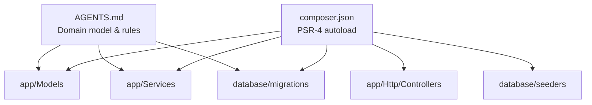
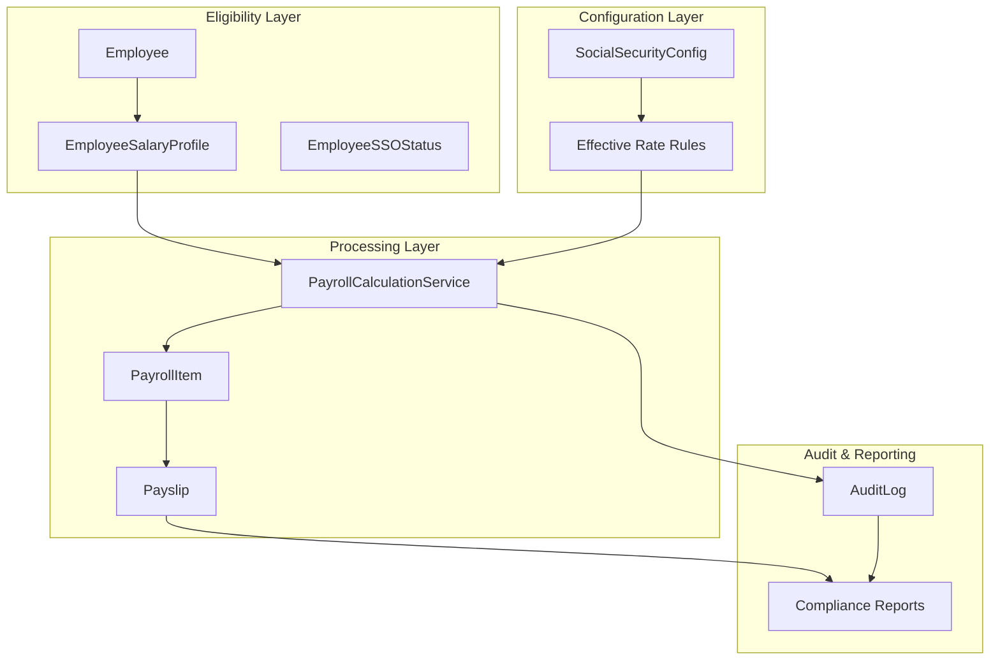
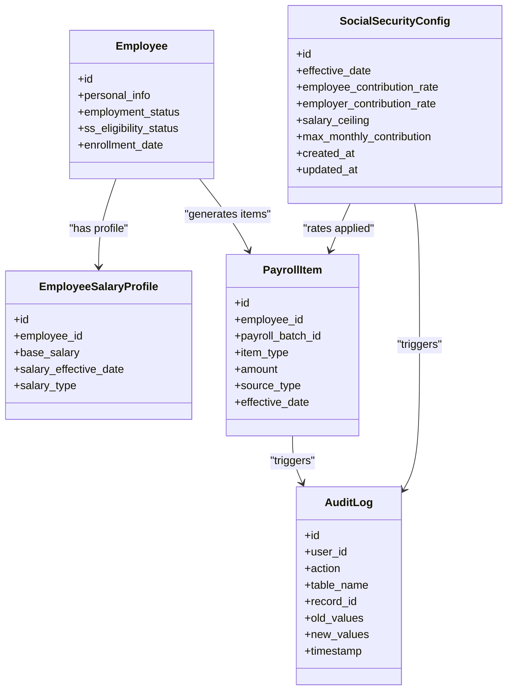
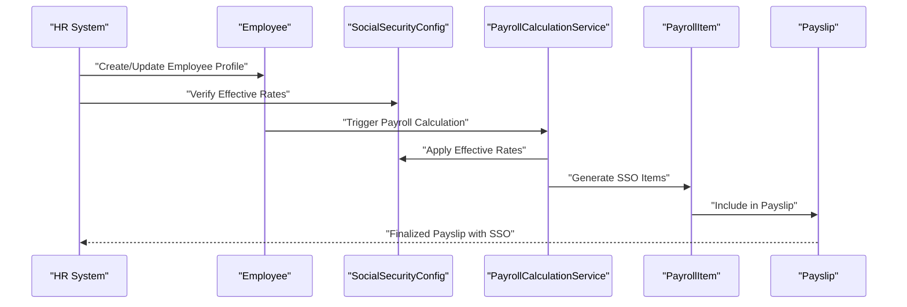
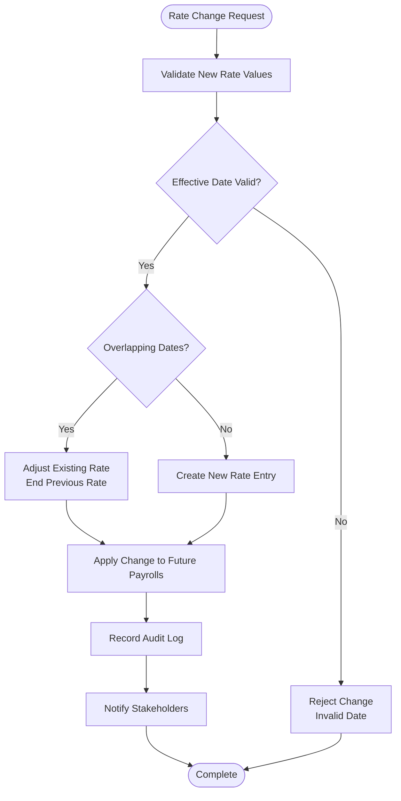
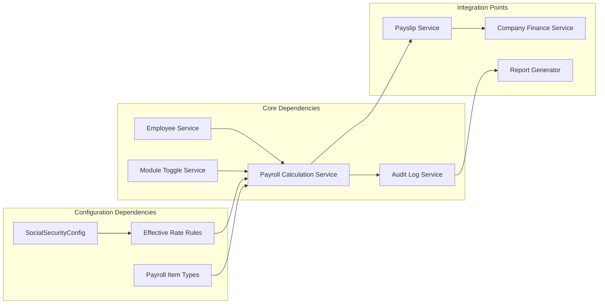

# Social Security Eligibility Setup

<cite>
**Referenced Files in This Document**
- [AGENTS.md](file://AGENTS.md)
- [README.md](file://README.md)
- [composer.json](file://composer.json)
</cite>

## Table of Contents
1. [Introduction](#introduction)
2. [Project Structure](#project-structure)
3. [Core Components](#core-components)
4. [Architecture Overview](#architecture-overview)
5. [Detailed Component Analysis](#detailed-component-analysis)
6. [Dependency Analysis](#dependency-analysis)
7. [Performance Considerations](#performance-considerations)
8. [Troubleshooting Guide](#troubleshooting-guide)
9. [Conclusion](#conclusion)

## Introduction
This document provides comprehensive guidance for implementing Thailand social security eligibility setup within the xHR Payroll & Finance System. It explains configuration of employee and employer contribution rates, salary ceiling settings, effective date management, enrollment processes, eligibility validation, and compliance requirements. It also covers integration with payroll calculation systems, common scenarios such as enrollment procedures, rate changes, and compliance reporting, along with practical setup workflows.

## Project Structure
The repository follows a Laravel application structure with PSR-4 autoloading and standard directories for models, services, controllers, migrations, and seeders. The project emphasizes rule-driven configuration, auditability, and dynamic data entry aligned with payroll modes and social security rules.

**Diagram sources**
- [composer.json:21-32](file://composer.json#L21-L32)
- [AGENTS.md:121-149](file://AGENTS.md#L121-L149)

**Section sources**
- [composer.json:1-86](file://composer.json#L1-L86)
- [AGENTS.md:121-149](file://AGENTS.md#L121-L149)

## Core Components
The social security configuration is governed by the domain model and business rules defined in the project documentation. The key components relevant to Thailand social security eligibility include:

- SocialSecurityConfig: Central configuration table for Thailand social security parameters
- Employee: Individual worker records linked to eligibility and contribution settings
- EmployeeSalaryProfile: Base salary and related profile used for contribution calculations
- PayrollItem: Payroll items that include social security deductions or contributions
- Payslip: Finalized pay statements that reflect social security calculations
- AuditLog: Comprehensive audit trail for all configuration and calculation changes

Key configuration parameters supported by the system include:
- Employee contribution rate
- Employer contribution rate
- Salary ceiling
- Maximum monthly contribution
- Effective date management for rate changes

These parameters are designed to be configurable and changeable over time, with audit logging and compliance reporting capabilities.

**Section sources**
- [AGENTS.md:143-144](file://AGENTS.md#L143-L144)
- [AGENTS.md:408](file://AGENTS.md#L408)
- [AGENTS.md:488-497](file://AGENTS.md#L488-L497)
- [AGENTS.md:588-594](file://AGENTS.md#L588-L594)

## Architecture Overview
The Thailand social security setup integrates with the broader payroll system through rule-driven configuration and dynamic calculation. The architecture supports:

- Rule-driven configuration stored in database tables
- Effective date-based rate management
- Dynamic calculation during payroll processing
- Audit logging for compliance reporting
- Integration with payslip generation and company financial summaries

**Diagram sources**
- [AGENTS.md:143-144](file://AGENTS.md#L143-L144)
- [AGENTS.md:408](file://AGENTS.md#L408)
- [AGENTS.md:642](file://AGENTS.md#L642)

## Detailed Component Analysis

### Social Security Configuration Management
The system manages Thailand social security through a dedicated configuration entity with the following characteristics:

- Configurable contribution rates for employees and employers
- Adjustable salary ceilings with effective date tracking
- Maximum monthly contribution limits
- Historical rate tracking for compliance reporting

**Diagram sources**
- [AGENTS.md:143-144](file://AGENTS.md#L143-L144)
- [AGENTS.md:408](file://AGENTS.md#L408)
- [AGENTS.md:488-497](file://AGENTS.md#L488-L497)

### Enrollment and Eligibility Validation Process
The enrollment process follows these steps:

1. **Eligibility Determination**: Employee employment status and contract type determine SSO eligibility
2. **Enrollment Date Tracking**: Effective enrollment date recorded for contribution calculations
3. **Rate Application**: Applicable social security rates applied based on effective dates
4. **Contribution Calculation**: Employee and employer contributions calculated from salary profiles
5. **Payroll Integration**: Social security items integrated into monthly payroll processing

**Diagram sources**
- [AGENTS.md:301](file://AGENTS.md#L301)
- [AGENTS.md:642](file://AGENTS.md#L642)

### Rate Change Management Workflow
The system supports effective date-based rate changes with the following workflow:

**Diagram sources**
- [AGENTS.md:488-497](file://AGENTS.md#L488-L497)
- [AGENTS.md:588-594](file://AGENTS.md#L588-L594)

### Compliance and Reporting Requirements
The system maintains comprehensive audit trails for social security configurations:

- All rate changes logged with old/new values
- Effective date changes tracked
- Employee enrollment modifications recorded
- Payroll items reflecting SSO calculations audited
- Compliance reports generated for regulatory requirements

**Section sources**
- [AGENTS.md:488-497](file://AGENTS.md#L488-L497)
- [AGENTS.md:588-594](file://AGENTS.md#L588-L594)

## Dependency Analysis
The social security functionality integrates with several core system components:

**Diagram sources**
- [AGENTS.md:636-646](file://AGENTS.md#L636-L646)
- [AGENTS.md:408](file://AGENTS.md#L408)

**Section sources**
- [AGENTS.md:636-646](file://AGENTS.md#L636-L646)
- [AGENTS.md:408](file://AGENTS.md#L408)

## Performance Considerations
- Database indexing on effective_date and employee_id for efficient rate lookups
- Batch processing for historical rate updates
- Caching of current effective rates for frequently accessed payroll calculations
- Optimized queries for compliance reporting with proper filtering by date ranges
- Asynchronous processing for large-scale rate change notifications

## Troubleshooting Guide
Common issues and resolutions:

**Rate Calculation Errors**
- Verify effective date ordering in configuration
- Check for overlapping rate entries
- Confirm salary profile alignment with SSO eligibility

**Enrollment Issues**
- Validate employee employment status
- Ensure proper enrollment date recording
- Check salary profile effective dates

**Audit and Compliance Problems**
- Review audit log entries for missing changes
- Verify compliance report date ranges
- Confirm proper notification of stakeholders

**Section sources**
- [AGENTS.md:588-594](file://AGENTS.md#L588-L594)

## Conclusion
The xHR Payroll & Finance System provides a comprehensive framework for Thailand social security eligibility setup through rule-driven configuration, effective date management, and robust audit capabilities. The modular architecture ensures flexibility for rate changes, compliance reporting, and integration with payroll calculation systems. By following the documented workflows and maintaining proper audit trails, organizations can ensure accurate social security calculations while meeting regulatory requirements.