# Company Finance Tracking

<cite>
**Referenced Files in This Document**
- [AGENTS.md](file://AGENTS.md)
</cite>

## Table of Contents
1. [Introduction](#introduction)
2. [Project Structure](#project-structure)
3. [Core Components](#core-components)
4. [Architecture Overview](#architecture-overview)
5. [Detailed Component Analysis](#detailed-component-analysis)
6. [Dependency Analysis](#dependency-analysis)
7. [Performance Considerations](#performance-considerations)
8. [Troubleshooting Guide](#troubleshooting-guide)
9. [Conclusion](#conclusion)
10. [Appendices](#appendices)

## Introduction
This document describes the company finance tracking system designed to manage revenue, expenses, subscription costs, and profit/loss reporting. It covers financial data models, monthly aggregation, cumulative calculations, quarterly reporting, tax simulation, financial summary generation, P&L calculations, and integration with payroll processing. The system emphasizes a rule-driven, audit-enabled, and maintainable architecture aligned with a PHP/Laravel stack and MySQL-backed schema.

## Project Structure
The repository provides a comprehensive specification and design guide for the system. The key deliverables include:
- Project structure and folder layout guidance
- Database schema and conventions
- Core modules and responsibilities
- Business rules and UI/UX expectations
- Audit and compliance requirements
- Coding standards and testing guidance

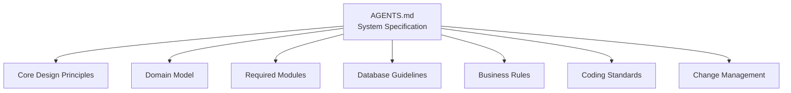

**Section sources**
- [AGENTS.md:1-721](file://AGENTS.md#L1-L721)

## Core Components
The finance tracking system is composed of several core components that handle payroll, revenue, expenses, subscriptions, and financial summaries. These components are designed to be modular, rule-driven, and audit-enabled.

- Revenue Management
  - Tracks company revenues through dedicated records with monetary fields and audit references.
- Expense Tracking
  - Manages company expenses and expense claims with categorization and approval workflows.
- Subscription Cost Management
  - Handles recurring and fixed costs, equipment, dubbing, and other business expenses.
- Profit/Loss Reporting
  - Generates monthly, cumulative, and quarterly financial summaries with tax simulation capabilities.
- Payroll Integration
  - Integrates payroll results into company finance summaries, ensuring accurate reflection of labor costs.

**Section sources**
- [AGENTS.md:367-382](file://AGENTS.md#L367-L382)
- [AGENTS.md:438-506](file://AGENTS.md#L438-L506)
- [AGENTS.md:643-646](file://AGENTS.md#L643-L646)

## Architecture Overview
The system follows a layered architecture with clear separation of concerns:
- Data layer: MySQL schema with strict conventions for monetary fields, timestamps, and audit references.
- Service layer: Business logic encapsulated in service classes for payroll calculation, rule management, and financial aggregation.
- Presentation layer: Blade templates with lightweight JavaScript for dynamic, spreadsheet-like editing while maintaining backend structure and audit trails.
- Integration layer: Automated workflows for monthly aggregation, cumulative calculations, and quarterly reporting.

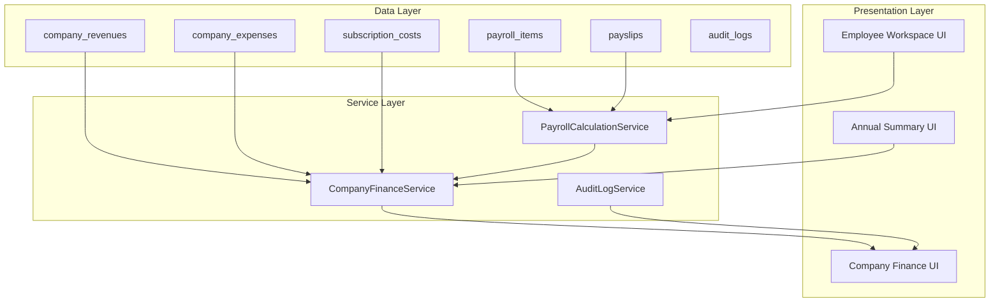

**Diagram sources**
- [AGENTS.md:387-417](file://AGENTS.md#L387-L417)
- [AGENTS.md:636-647](file://AGENTS.md#L636-L647)

**Section sources**
- [AGENTS.md:387-417](file://AGENTS.md#L387-L417)
- [AGENTS.md:636-647](file://AGENTS.md#L636-L647)

## Detailed Component Analysis

### Financial Data Models
The system defines core financial entities with standardized schema conventions:
- Monetary fields use precise decimal types to ensure accuracy.
- Timestamps, status flags, and soft deletes are consistently applied.
- Foreign keys follow a consistent naming convention for referential integrity.

Key entities and their roles:
- company_revenues: Records revenue entries with amounts, dates, and categories.
- company_expenses: Tracks expenses with categorization and approval metadata.
- subscription_costs: Manages recurring and fixed subscription-related costs.
- payroll_items and payslips: Provide the basis for labor cost inclusion in financial summaries.

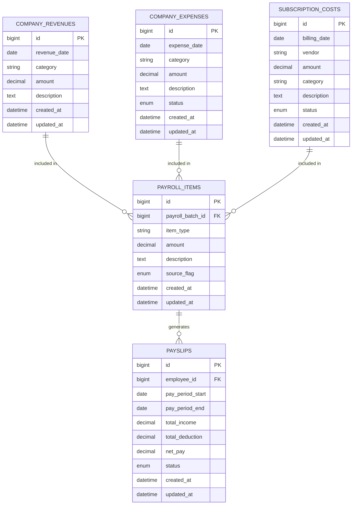

**Diagram sources**
- [AGENTS.md:387-417](file://AGENTS.md#L387-L417)
- [AGENTS.md:418-427](file://AGENTS.md#L418-L427)

**Section sources**
- [AGENTS.md:387-417](file://AGENTS.md#L387-L417)
- [AGENTS.md:418-427](file://AGENTS.md#L418-L427)

### Monthly Financial Aggregation
Monthly aggregation consolidates revenue, expenses, and payroll-derived costs into company_monthly_summaries. The process ensures:
- Accurate monthly totals for income and expenses.
- Labor costs derived from payroll_items and payslips.
- Audit trail maintained through audit_logs.

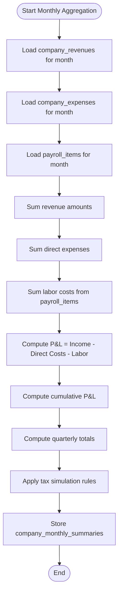

**Section sources**
- [AGENTS.md:367-375](file://AGENTS.md#L367-L375)
- [AGENTS.md:438-444](file://AGENTS.md#L438-L444)

### Cumulative Calculations
Cumulative calculations track year-to-date performance by:
- Maintaining running totals across months.
- Incorporating prior periods’ balances.
- Ensuring consistency with monthly P&L computations.

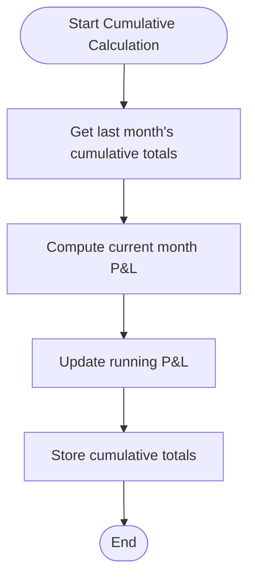

**Section sources**
- [AGENTS.md:367-375](file://AGENTS.md#L367-L375)

### Quarterly Reporting
Quarterly reporting aggregates three consecutive months:
- Computes QTD totals for income, expenses, and P&L.
- Supports tax simulation adjustments per quarter.
- Provides drill-down to monthly details.

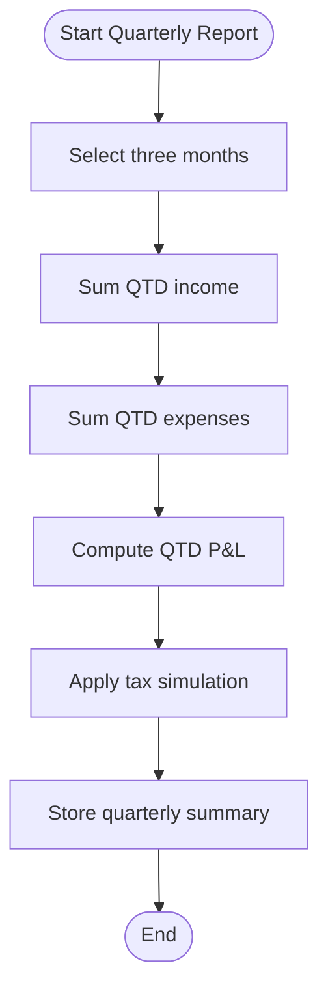

**Section sources**
- [AGENTS.md:367-375](file://AGENTS.md#L367-L375)

### Tax Simulation Features
Tax simulation integrates configurable rules to estimate tax impacts:
- Configurable thresholds, rates, and brackets.
- Applies to monthly and quarterly totals.
- Maintains audit trail for rule changes and recalculations.

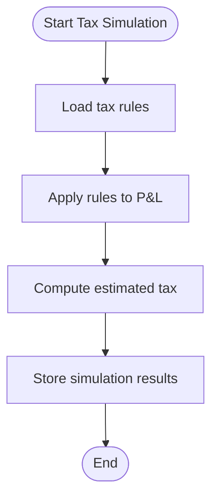

**Section sources**
- [AGENTS.md:351](file://AGENTS.md#L351)
- [AGENTS.md:367-375](file://AGENTS.md#L367-L375)

### Financial Summary Generation
Financial summaries compile:
- Revenue, direct expenses, and labor costs.
- Monthly, cumulative, and quarterly views.
- Tax simulation outputs.
- Audit references for transparency.

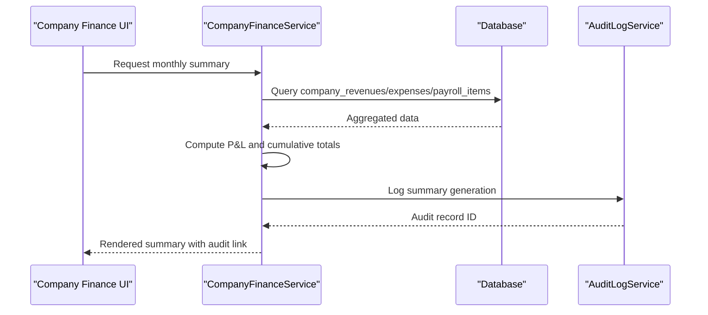

**Diagram sources**
- [AGENTS.md:367-375](file://AGENTS.md#L367-L375)
- [AGENTS.md:643-645](file://AGENTS.md#L643-L645)

**Section sources**
- [AGENTS.md:367-375](file://AGENTS.md#L367-L375)
- [AGENTS.md:643-645](file://AGENTS.md#L643-L645)

### Payroll Integration with Finance
Payroll integration ensures labor costs are accurately reflected:
- Payroll items feed into company finances.
- Payslips snapshot ensures historical stability.
- Audit logs track changes impacting financial summaries.

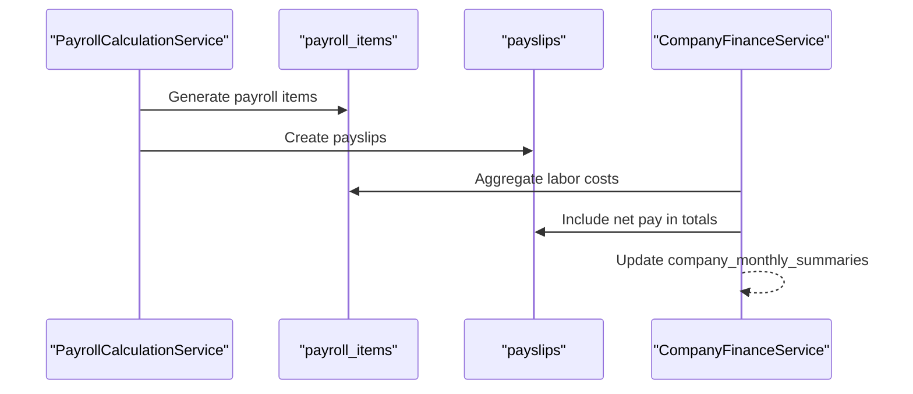

**Diagram sources**
- [AGENTS.md:338-343](file://AGENTS.md#L338-L343)
- [AGENTS.md:413-414](file://AGENTS.md#L413-L414)
- [AGENTS.md:643-646](file://AGENTS.md#L643-L646)

**Section sources**
- [AGENTS.md:338-343](file://AGENTS.md#L338-L343)
- [AGENTS.md:413-414](file://AGENTS.md#L413-L414)
- [AGENTS.md:643-646](file://AGENTS.md#L643-L646)

### company_monthly_summaries Table Structure
The company_monthly_summaries table captures consolidated financial metrics per month:
- Identifies the pay period and status.
- Stores aggregated income, direct expenses, labor costs, and computed P&L.
- Maintains cumulative totals and audit references.

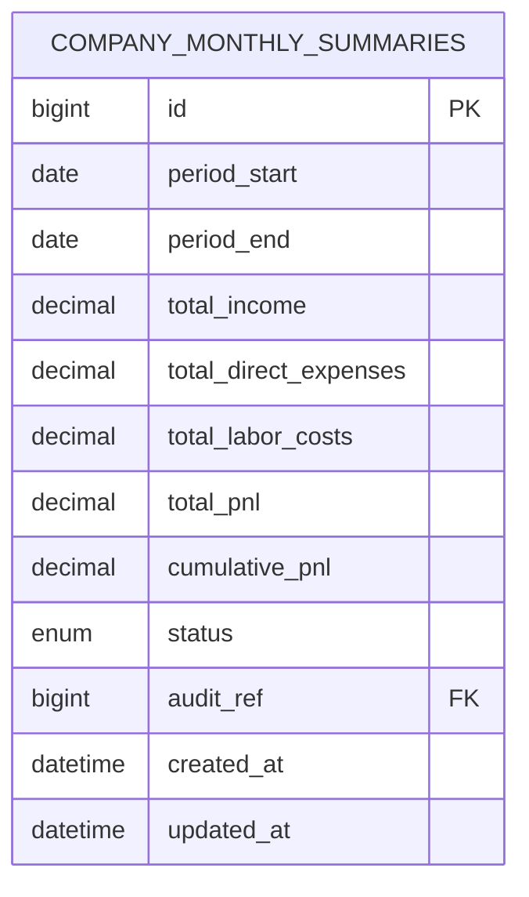

**Diagram sources**
- [AGENTS.md:59](file://AGENTS.md#L59)
- [AGENTS.md:367-375](file://AGENTS.md#L367-L375)

**Section sources**
- [AGENTS.md:59](file://AGENTS.md#L59)
- [AGENTS.md:367-375](file://AGENTS.md#L367-L375)

### Automated Financial Reporting Workflows
Automated workflows orchestrate monthly, cumulative, and quarterly reporting:
- Triggered by payroll processing completion.
- Validate data completeness and consistency.
- Generate and store summaries with audit logs.

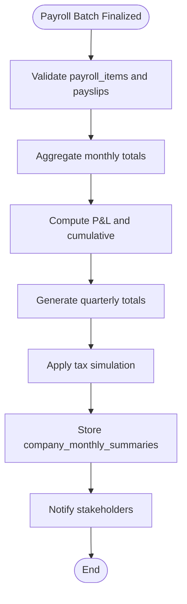

**Section sources**
- [AGENTS.md:367-375](file://AGENTS.md#L367-L375)
- [AGENTS.md:576-595](file://AGENTS.md#L576-L595)

## Dependency Analysis
The system exhibits clear module boundaries and minimal coupling:
- Payroll engine depends on rule manager and data models.
- Company finance service depends on payroll items, expenses, and revenue.
- Audit service is cross-cutting, supporting all modules.

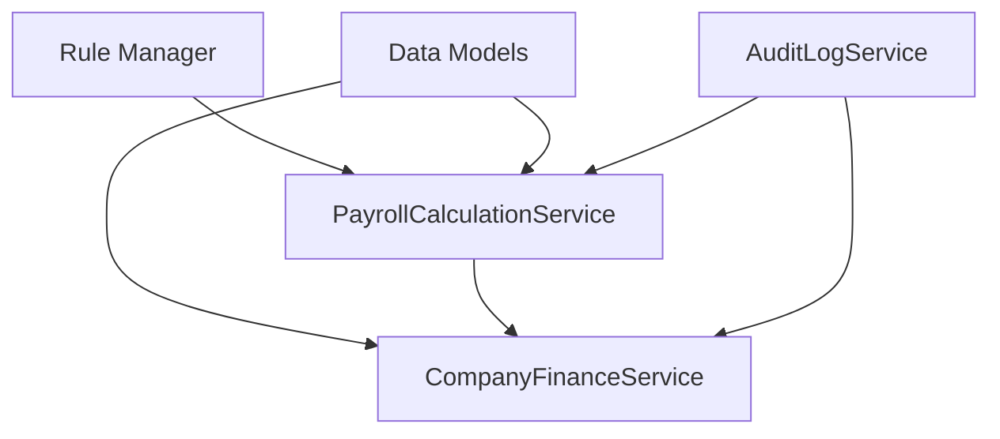

**Diagram sources**
- [AGENTS.md:344-353](file://AGENTS.md#L344-L353)
- [AGENTS.md:636-647](file://AGENTS.md#L636-L647)

**Section sources**
- [AGENTS.md:344-353](file://AGENTS.md#L344-L353)
- [AGENTS.md:636-647](file://AGENTS.md#L636-L647)

## Performance Considerations
- Use indexed foreign keys and date ranges for efficient monthly aggregation.
- Batch payroll item processing to reduce transaction overhead.
- Cache frequently accessed rule configurations to minimize repeated reads.
- Optimize audit log writes by batching and asynchronous processing where feasible.

## Troubleshooting Guide
Common issues and resolutions:
- Inconsistent totals: Verify that payroll items and payslips align with company_monthly_summaries and re-run aggregation.
- Audit discrepancies: Review audit_logs for changes to rules, payroll items, or financial entries.
- Tax simulation errors: Confirm tax rules are correctly configured and applied during aggregation.

**Section sources**
- [AGENTS.md:576-595](file://AGENTS.md#L576-L595)
- [AGENTS.md:351](file://AGENTS.md#L351)

## Conclusion
The company finance tracking system provides a robust, rule-driven framework for revenue management, expense tracking, subscription cost control, and profit/loss reporting. Its modular architecture, strict schema conventions, and comprehensive audit capabilities ensure maintainability, accuracy, and compliance. Integration with payroll processing guarantees that labor costs are accurately reflected in financial summaries, enabling reliable monthly, cumulative, and quarterly reporting with tax simulation.

## Appendices
- Minimum deliverables include project structure, database schema, migrations, seed data, model relationships, payroll services, rule manager, UI components, payslip builder, audit logs, annual summary, and company finance summary.

**Section sources**
- [AGENTS.md:675-690](file://AGENTS.md#L675-L690)