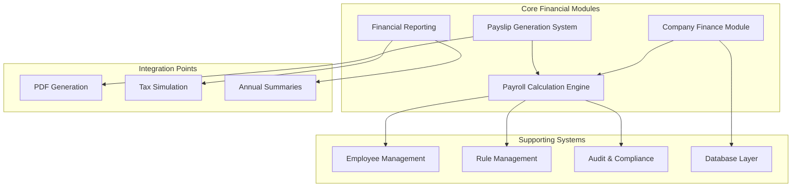
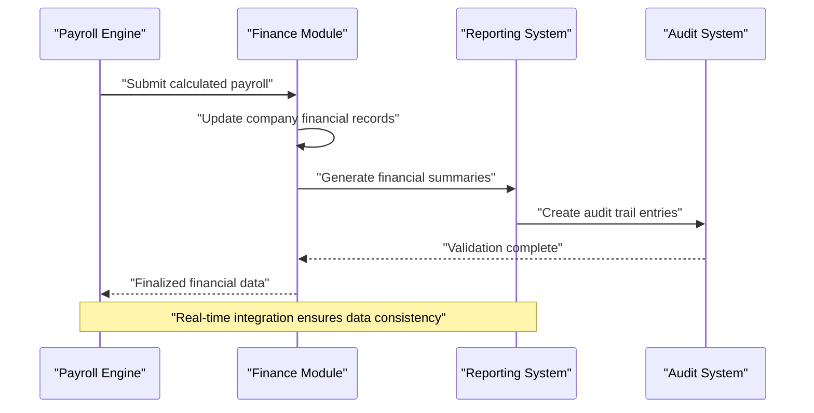
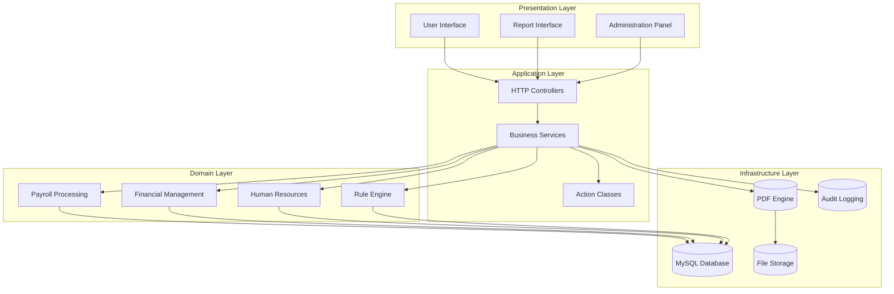
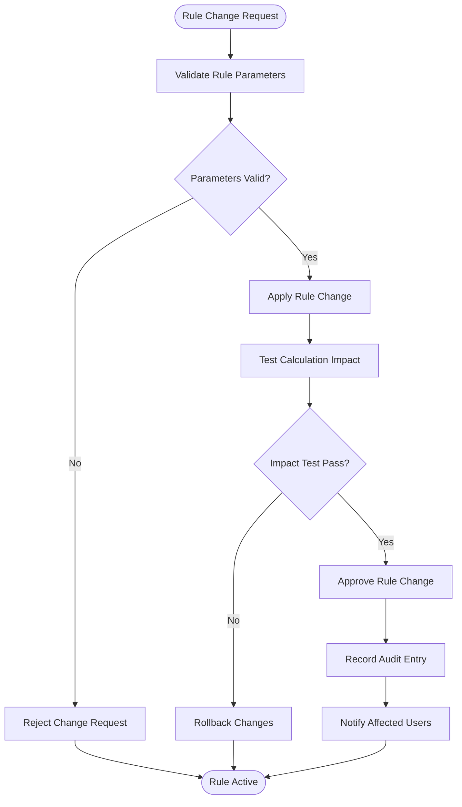
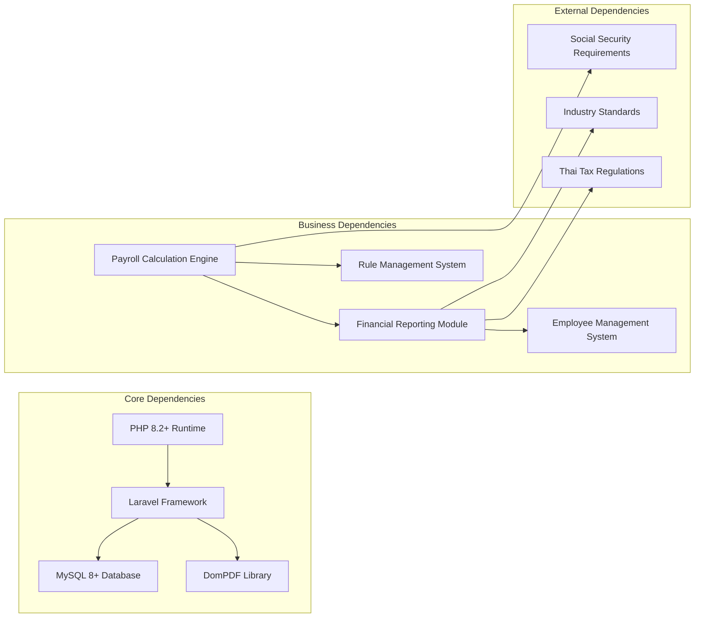

# Financial Management

<cite>
**Referenced Files in This Document**
- [AGENTS.md](file://AGENTS.md)
</cite>

## Table of Contents
1. [Introduction](#introduction)
2. [Project Structure](#project-structure)
3. [Core Components](#core-components)
4. [Architecture Overview](#architecture-overview)
5. [Detailed Component Analysis](#detailed-component-analysis)
6. [Dependency Analysis](#dependency-analysis)
7. [Performance Considerations](#performance-considerations)
8. [Troubleshooting Guide](#troubleshooting-guide)
9. [Conclusion](#conclusion)

## Introduction

The xHR Payroll & Finance System is a comprehensive financial management solution designed to replace traditional Excel-based payroll and accounting systems. This system manages both individual employee payroll processing and company-wide financial tracking, providing automated payslip generation, revenue management, expense tracking, subscription cost management, and profit/loss reporting capabilities.

The system follows modern PHP development practices with Laravel framework integration, MySQL database backend, and DomPDF-based PDF generation. It emphasizes rule-driven automation, auditability, and maintainability while preserving the familiar spreadsheet-like user experience.

## Project Structure

The financial management system is organized around several key modules that work together to provide comprehensive financial oversight:

**Diagram sources**
- [AGENTS.md:121-150](file://AGENTS.md#L121-L150)
- [AGENTS.md:385-435](file://AGENTS.md#L385-L435)

**Section sources**
- [AGENTS.md:121-150](file://AGENTS.md#L121-L150)
- [AGENTS.md:385-435](file://AGENTS.md#L385-L435)

## Core Components

### Company Finance Module

The company finance module serves as the central hub for tracking organizational financial health through multiple interconnected subsystems:

#### Revenue Management
- **Company Revenue Tracking**: Systematic recording and categorization of all business income streams
- **Multi-source Income Integration**: Consolidation of various revenue types including sales, services, and investment income
- **Real-time Revenue Monitoring**: Live dashboards showing current month performance against targets
- **Revenue Forecasting**: Automated projections based on historical trends and current pipeline

#### Expense Tracking
- **Operational Expense Management**: Comprehensive tracking of day-to-day business expenses
- **Departmental Cost Allocation**: Granular expense categorization by business unit or project
- **Approval Workflow Integration**: Automated routing for expense approvals based on thresholds
- **Vendor Management**: Centralized vendor information and payment tracking

#### Subscription Cost Management
- **Recurring Cost Tracking**: Systematic monitoring of software subscriptions, memberships, and service agreements
- **Cost Optimization Analysis**: Regular evaluation of subscription value versus cost
- **Renewal Management**: Automated reminders for upcoming renewals and contract reviews
- **Budget Integration**: Direct linking to departmental budgets for cost control

#### Profit/Loss Reporting
- **Monthly P&L Statements**: Automated generation of profit and loss statements
- **Quarterly Financial Reviews**: Structured reporting for management analysis
- **Cumulative Performance Tracking**: Long-term trend analysis and variance reporting
- **Departmental Profitability**: Breakdown of profitability by business segment

**Section sources**
- [AGENTS.md:367-382](file://AGENTS.md#L367-L382)
- [AGENTS.md:438-497](file://AGENTS.md#L438-L497)

### Payslip Generation System

The payslip generation system provides automated, compliant payroll processing with robust audit capabilities:

#### Structure Components
- **Company Header Information**: Official company branding and identification details
- **Employee Personal Details**: Complete employee information including bank account details
- **Pay Period Specification**: Clear indication of pay period covered
- **Payment Date Tracking**: Automatic calculation and display of payment scheduling
- **Income Classification**: Detailed breakdown of all earnings components
- **Deduction Organization**: Systematic presentation of all applicable deductions
- **Total Calculation Summary**: Clear net pay computation with supporting details
- **Signature Verification**: Secure signature fields for approval and compliance

#### PDF Creation Workflow
- **DomPDF Integration**: Seamless conversion from structured data to printable PDF format
- **Template Management**: Configurable layouts that match organizational standards
- **Multi-language Support**: Thai language support for local compliance requirements
- **Quality Assurance**: Automated validation of PDF output before distribution

#### Snapshot Mechanism
- **Finalization Protection**: Immutable storage of payslip data upon finalization
- **Historical Reference**: Complete preservation of calculation basis for audit trails
- **Change Prevention**: Locking mechanism preventing unauthorized modifications to finalized records
- **Reference Integrity**: Maintaining data consistency for future reference and reconciliation

#### Finalization Process
- **Authorization Workflow**: Multi-level approval process for payslip finalization
- **Audit Trail Creation**: Comprehensive logging of all actions leading to finalization
- **Distribution Automation**: Streamlined notification and delivery to relevant stakeholders
- **Compliance Verification**: Validation against regulatory requirements before finalization

**Section sources**
- [AGENTS.md:549-574](file://AGENTS.md#L549-L574)
- [AGENTS.md:245-256](file://AGENTS.md#L245-L256)

### Financial Reporting Capabilities

The system provides comprehensive reporting infrastructure supporting various analytical needs:

#### Annual Summaries
- **12-Month View**: Complete year-long perspective on individual employee financial performance
- **Summary Cards**: High-level performance indicators and trend analysis
- **Export Functionality**: Multiple format exports for external reporting requirements
- **Customizable Metrics**: Flexible reporting parameters for different stakeholder needs

#### Tax Simulation Features
- **Automated Tax Calculation**: Integration with current tax regulations and rates
- **Scenario Planning**: Ability to model different tax situations and their impacts
- **Compliance Validation**: Built-in checks ensuring tax calculations meet regulatory requirements
- **Historical Analysis**: Tracking of tax obligations over multiple periods

#### Compliance Reporting Requirements
- **Regulatory Alignment**: Automatic adaptation to changing tax and labor law requirements
- **Standardized Templates**: Pre-configured reports meeting industry and government requirements
- **Audit Preparation**: Ready-to-use documentation for external audits and inspections
- **Documentation Management**: Centralized storage of all compliance-related materials

**Section sources**
- [AGENTS.md:360-375](file://AGENTS.md#L360-L375)
- [AGENTS.md:576-595](file://AGENTS.md#L576-L595)

### Integration Between Payroll Calculations and Financial Summaries

The system ensures seamless integration between payroll processing and financial reporting:

**Diagram sources**
- [AGENTS.md:338-353](file://AGENTS.md#L338-L353)
- [AGENTS.md:642-646](file://AGENTS.md#L642-L646)

**Section sources**
- [AGENTS.md:338-353](file://AGENTS.md#L338-L353)
- [AGENTS.md:642-646](file://AGENTS.md#L642-L646)

## Architecture Overview

The financial management system follows a modular architecture designed for scalability and maintainability:

**Diagram sources**
- [AGENTS.md:622-647](file://AGENTS.md#L622-L647)
- [AGENTS.md:102-118](file://AGENTS.md#L102-L118)

The architecture emphasizes separation of concerns with clear boundaries between presentation, business logic, and data persistence layers. This design enables independent development and testing of each component while maintaining system coherence.

**Section sources**
- [AGENTS.md:622-647](file://AGENTS.md#L622-L647)
- [AGENTS.md:102-118](file://AGENTS.md#L102-L118)

## Detailed Component Analysis

### Payroll Modes and Calculation Engine

The system supports six distinct payroll modes, each with specific calculation rules and integration points:

#### Monthly Staff Mode
- **Base Salary Integration**: Direct incorporation of established salary structures
- **Overtime Processing**: Automated calculation of overtime pay with configurable rates
- **Allowance Management**: Systematic handling of performance and attendance allowances
- **Deduction Coordination**: Integrated calculation of mandatory and voluntary deductions

#### Freelance Modes
- **Layer Rate Calculation**: Dynamic pricing based on work duration and complexity tiers
- **Fixed Rate Processing**: Straightforward calculation for predetermined work packages
- **Time Tracking Integration**: Direct correlation between logged work hours and compensation

#### Content Creator Modes
- **Salary-Based Compensation**: Traditional monthly salary structure adapted for creator economics
- **Settlement Processing**: Final payment calculation based on completed content and expenses
- **Performance Incentives**: Integration of performance-based bonuses and royalties

**Section sources**
- [AGENTS.md:123-131](file://AGENTS.md#L123-L131)
- [AGENTS.md:440-487](file://AGENTS.md#L440-L487)

### Rule Management System

The rule management system provides centralized control over all financial calculation parameters:

**Diagram sources**
- [AGENTS.md:438-506](file://AGENTS.md#L438-L506)

The rule engine supports dynamic configuration of:
- Overtime calculation parameters
- Performance bonus thresholds
- Social security contribution rates
- Tax bracket configurations
- Departmental budget allocations

**Section sources**
- [AGENTS.md:438-506](file://AGENTS.md#L438-L506)

### Audit and Compliance Framework

The system maintains comprehensive audit trails for all financial transactions and rule changes:

#### Audit Coverage Areas
- **Employee Profile Changes**: Complete history of salary adjustments and position changes
- **Payroll Item Modifications**: Detailed logs of all payroll calculation changes
- **Payslip Finalization Events**: Timestamped records of payslip approval and distribution
- **Rule Configuration Updates**: Complete audit trail of all financial rule modifications
- **Module Toggle Operations**: History of feature activation and deactivation

#### Compliance Features
- **Regulatory Alignment**: Automatic updates to reflect changing tax and labor laws
- **Standardized Reporting**: Pre-built templates for regulatory reporting requirements
- **Documentation Management**: Centralized storage of all compliance-related materials
- **Access Control**: Role-based permissions ensuring appropriate data access levels

**Section sources**
- [AGENTS.md:576-595](file://AGENTS.md#L576-L595)
- [AGENTS.md:196-221](file://AGENTS.md#L196-L221)

## Dependency Analysis

The financial management system exhibits well-defined dependencies that support maintainability and extensibility:

**Diagram sources**
- [AGENTS.md:104-110](file://AGENTS.md#L104-L110)
- [AGENTS.md:636-646](file://AGENTS.md#L636-L646)

The dependency structure ensures that:
- Technology stack requirements are clearly defined and documented
- Business logic remains independent of specific technology choices
- External regulatory requirements are integrated through configurable rules
- System extensibility is maintained through well-defined interfaces

**Section sources**
- [AGENTS.md:104-110](file://AGENTS.md#L104-L110)
- [AGENTS.md:636-646](file://AGENTS.md#L636-L646)

## Performance Considerations

The system is designed with performance optimization in mind across multiple operational scenarios:

### Scalability Factors
- **Database Indexing Strategy**: Optimized indexing for frequently queried payroll and financial data
- **Caching Mechanisms**: Strategic caching of rule configurations and commonly accessed financial data
- **Batch Processing**: Efficient handling of large-scale payroll processing during peak periods
- **Memory Management**: Optimized memory usage for large report generation and PDF creation

### Processing Efficiency
- **Parallel Calculation**: Concurrent processing of multiple payroll items where safe and appropriate
- **Lazy Loading**: On-demand loading of detailed financial data to reduce initial page load times
- **Incremental Updates**: Targeted updates that minimize database write operations
- **Compression Techniques**: Efficient storage and transmission of financial documents

### Resource Optimization
- **Connection Pooling**: Efficient database connection management for high-volume operations
- **Background Processing**: Asynchronous handling of PDF generation and report creation
- **Storage Optimization**: Efficient file storage and retrieval for generated documents
- **Network Efficiency**: Optimized API calls and reduced data transfer between components

## Troubleshooting Guide

Common issues and their resolution strategies:

### Payslip Generation Problems
- **PDF Rendering Failures**: Verify DomPDF configuration and memory limits
- **Missing Data Issues**: Check snapshot integrity and data synchronization
- **Formatting Problems**: Review template configuration and font availability
- **Permission Errors**: Validate user roles and access permissions

### Financial Reporting Issues
- **Data Inconsistencies**: Run reconciliation procedures and verify data integrity
- **Calculation Errors**: Review rule configurations and apply validation tests
- **Performance Degradation**: Optimize database queries and implement appropriate indexing
- **Export Failures**: Check file system permissions and storage capacity

### System Maintenance
- **Audit Log Overflow**: Implement log rotation and archiving procedures
- **Rule Conflicts**: Use validation tools to identify conflicting rule configurations
- **Integration Failures**: Verify API connectivity and authentication credentials
- **Backup Restoration**: Test backup procedures and verify data integrity after restoration

**Section sources**
- [AGENTS.md:663-672](file://AGENTS.md#L663-L672)
- [AGENTS.md:576-595](file://AGENTS.md#L576-L595)

## Conclusion

The xHR Payroll & Finance System represents a comprehensive solution for modern financial management needs. By combining spreadsheet-like usability with enterprise-grade data integrity and compliance capabilities, the system provides organizations with the tools necessary for effective financial oversight.

Key strengths of the system include its rule-driven architecture that eliminates hardcoded business logic, its comprehensive audit trail supporting regulatory compliance, and its modular design enabling easy maintenance and extension. The integration between payroll calculations and financial summaries ensures that operational activities feed directly into strategic financial reporting.

The system's adherence to modern development practices, including service-oriented architecture, comprehensive testing strategies, and maintainable code organization, positions it well for continued evolution as business requirements change. The emphasis on Thailand-specific compliance requirements, particularly around social security and tax regulations, demonstrates the system's commitment to meeting local business needs while maintaining international best practices.

For organizations seeking to move beyond Excel-based financial management, this system provides a robust foundation for automated, auditable, and scalable financial operations that support both day-to-day payroll processing and long-term strategic financial planning.