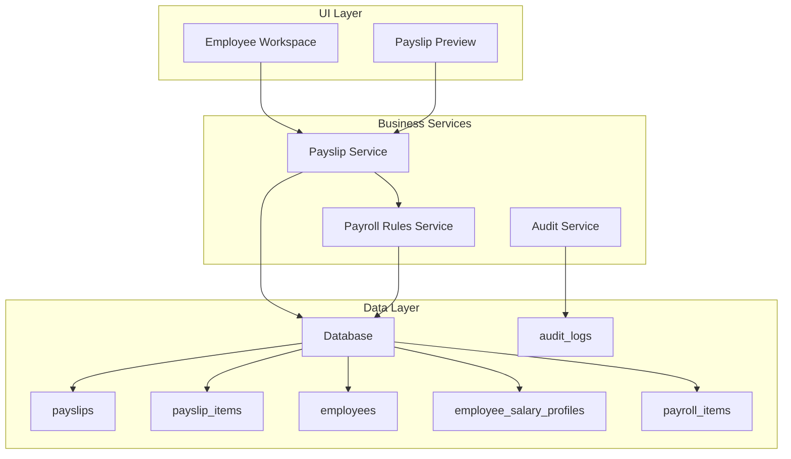
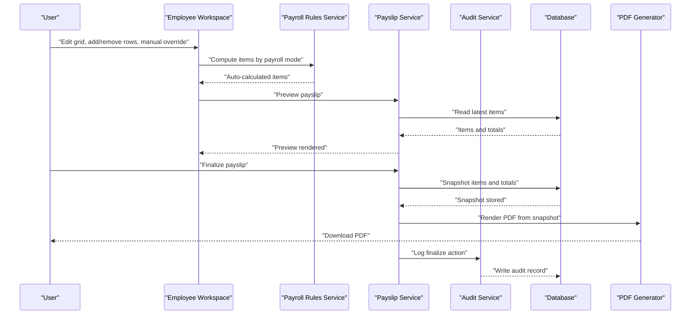
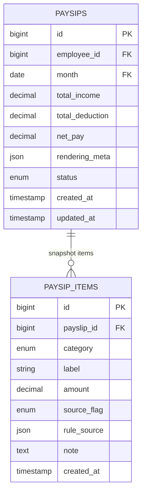
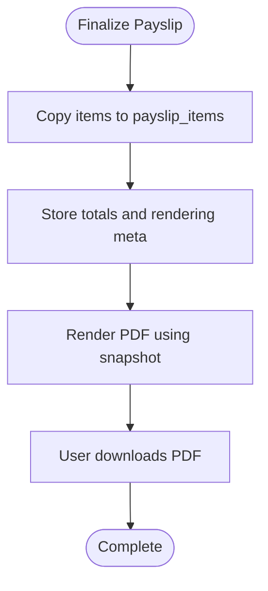
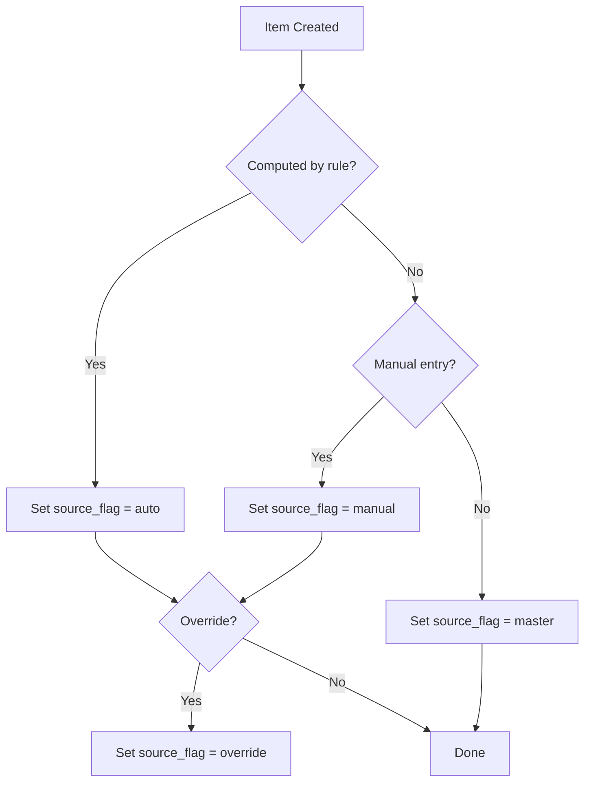
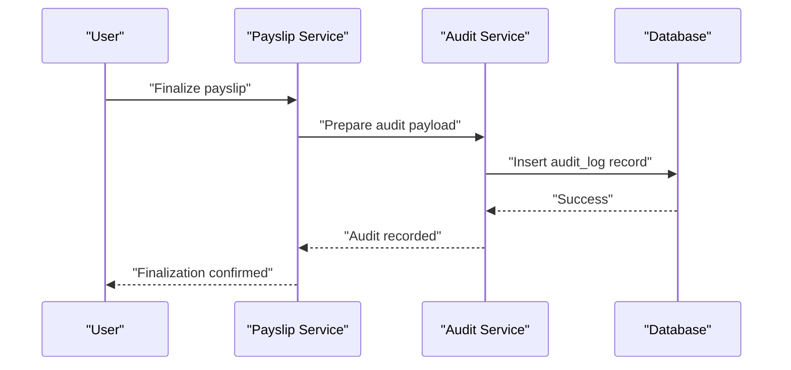
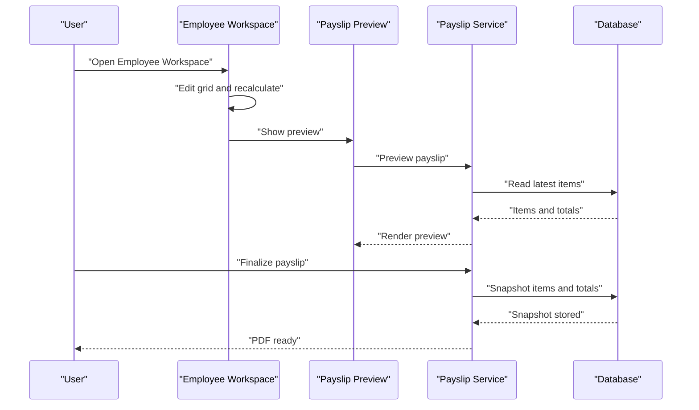
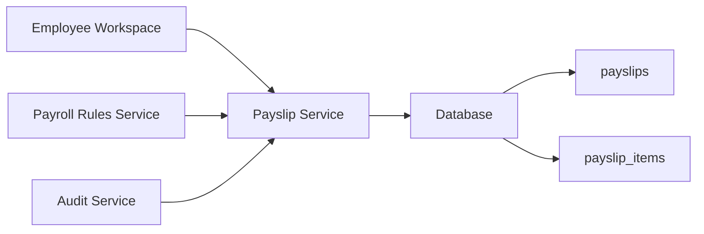

# Payslip Generation System

<cite>
**Referenced Files in This Document**
- [AGENTS.md](file://AGENTS.md)
</cite>

## Table of Contents
1. [Introduction](#introduction)
2. [Project Structure](#project-structure)
3. [Core Components](#core-components)
4. [Architecture Overview](#architecture-overview)
5. [Detailed Component Analysis](#detailed-component-analysis)
6. [Dependency Analysis](#dependency-analysis)
7. [Performance Considerations](#performance-considerations)
8. [Troubleshooting Guide](#troubleshooting-guide)
9. [Conclusion](#conclusion)
10. [Appendices](#appendices)

## Introduction
This document describes the payslip generation system as defined by the project’s design principles and requirements. It focuses on the payslip structure, PDF creation workflow, snapshot mechanism, and finalization process. It also documents the payslip data model (payslips and payslip_items), the source flag system (auto, manual, override, master), audit trail requirements, and the payslip preview and finalization workflow.

## Project Structure
The repository provides a comprehensive specification for the payslip system. The structure is defined around domain-driven principles and Laravel-style organization. The key modules and responsibilities relevant to payslips include:
- Employee Workspace: dynamic grid for payroll entry, preview, and finalization
- Payslip Module: preview, finalize, and PDF export
- Audit & Compliance: audit logs for all critical changes
- Rule Manager: configurable rules for payroll modes and calculations
- Database Agent: schema design and migrations for core entities

**Diagram sources**
- [AGENTS.md:228-244](file://AGENTS.md#L228-L244)
- [AGENTS.md:354-359](file://AGENTS.md#L354-L359)
- [AGENTS.md:549-573](file://AGENTS.md#L549-L573)
- [AGENTS.md:576-595](file://AGENTS.md#L576-L595)

**Section sources**
- [AGENTS.md:228-244](file://AGENTS.md#L228-L244)
- [AGENTS.md:354-359](file://AGENTS.md#L354-L359)
- [AGENTS.md:549-573](file://AGENTS.md#L549-L573)
- [AGENTS.md:576-595](file://AGENTS.md#L576-L595)

## Core Components
- Payslip data model: payslips and payslip_items tables
- Payslip rendering and PDF generation via DomPDF/Snappy
- Snapshot rule: copy finalized items and metadata for immutable PDFs
- Source flag system: auto, manual, override, master
- Audit trail: who, what, field, old/new value, action, timestamp, reason
- Preview and finalization workflow

**Section sources**
- [AGENTS.md:549-573](file://AGENTS.md#L549-L573)
- [AGENTS.md:576-595](file://AGENTS.md#L576-L595)
- [AGENTS.md:104-110](file://AGENTS.md#L104-L110)

## Architecture Overview
The payslip generation system follows a rule-driven, record-based architecture with clear separation of concerns:
- Employee Workspace: collects payroll data and allows manual overrides
- Payroll Rules Service: computes amounts based on configured rules and payroll modes
- Payslip Service: aggregates items, applies snapshot rule, and renders PDF
- Audit Service: logs all changes for compliance and traceability
- Database: stores master data, transactional items, and immutable snapshots

**Diagram sources**
- [AGENTS.md:513-514](file://AGENTS.md#L513-L514)
- [AGENTS.md:567-572](file://AGENTS.md#L567-L572)
- [AGENTS.md:252-255](file://AGENTS.md#L252-L255)

## Detailed Component Analysis

### Payslip Data Model
The payslip data model consists of two tables:
- payslips: holds the payslip header, totals, and rendering metadata
- payslip_items: holds the immutable snapshot of items at finalization

Key relationships:
- payslips.id references payslip_items.payslip_id
- Each payslip_item belongs to a single payslip
- Items are copied during finalization to ensure immutability

**Diagram sources**
- [AGENTS.md:567-572](file://AGENTS.md#L567-L572)
- [AGENTS.md:387-416](file://AGENTS.md#L387-L416)

**Section sources**
- [AGENTS.md:567-572](file://AGENTS.md#L567-L572)
- [AGENTS.md:387-416](file://AGENTS.md#L387-L416)

### Payslip Rendering and PDF Workflow
- Rendering must read from the immutable snapshot (payslips and payslip_items)
- PDF generation uses DomPDF or Snappy
- Rendering metadata is stored with the payslip to preserve layout and formatting

**Diagram sources**
- [AGENTS.md:567-572](file://AGENTS.md#L567-L572)
- [AGENTS.md:104-110](file://AGENTS.md#L104-L110)

**Section sources**
- [AGENTS.md:567-572](file://AGENTS.md#L567-L572)
- [AGENTS.md:104-110](file://AGENTS.md#L104-L110)

### Source Flag System
The system enforces transparency and traceability by tagging each item with a source flag:
- auto: generated by rules
- manual: entered manually by user
- override: manual override of auto value
- master: from master profile (e.g., base salary)

These flags are displayed in the grid and inspector to inform users of the origin and state of each item.

**Diagram sources**
- [AGENTS.md:528-537](file://AGENTS.md#L528-L537)
- [AGENTS.md:539-545](file://AGENTS.md#L539-L545)

**Section sources**
- [AGENTS.md:528-537](file://AGENTS.md#L528-L537)
- [AGENTS.md:539-545](file://AGENTS.md#L539-L545)

### Audit Trail Requirements
All critical changes must be audited with:
- who performed the action
- what entity was changed
- what field was changed
- old and new values
- action type
- timestamp
- optional reason

High-priority audit areas include:
- employee salary profile
- payroll item amount
- payslip finalize/unfinalize
- rule changes
- module toggle changes
- SSO config changes

**Diagram sources**
- [AGENTS.md:576-595](file://AGENTS.md#L576-L595)

**Section sources**
- [AGENTS.md:576-595](file://AGENTS.md#L576-L595)

### Payslip Preview and Finalization Workflow
The end-to-end workflow is:
- Employee Workspace: edit grid, inline editing, add/remove/duplicate rows, recalculate
- Preview: immediate preview of the payslip
- Save: persist intermediate state
- Finalize: snapshot items and totals, render PDF, update status

**Diagram sources**
- [AGENTS.md:513-514](file://AGENTS.md#L513-L514)
- [AGENTS.md:567-572](file://AGENTS.md#L567-L572)

**Section sources**
- [AGENTS.md:513-514](file://AGENTS.md#L513-L514)
- [AGENTS.md:567-572](file://AGENTS.md#L567-L572)

### Critical Rule: Prevent Reducing Payments by Modifying Base Salary
The system enforces a critical rule:
- If a reduction is needed, it must appear on the deduction side
- Do not reduce income by silently lowering base salary

This ensures financial integrity and compliance.

**Section sources**
- [AGENTS.md:562-566](file://AGENTS.md#L562-L566)

## Dependency Analysis
The payslip module depends on:
- Employee Workspace for data entry and previews
- Payroll Rules Service for computation
- Audit Service for logging
- Database for persistence and snapshots

**Diagram sources**
- [AGENTS.md:354-359](file://AGENTS.md#L354-L359)
- [AGENTS.md:513-514](file://AGENTS.md#L513-L514)
- [AGENTS.md:567-572](file://AGENTS.md#L567-L572)

**Section sources**
- [AGENTS.md:354-359](file://AGENTS.md#L354-L359)
- [AGENTS.md:513-514](file://AGENTS.md#L513-L514)
- [AGENTS.md:567-572](file://AGENTS.md#L567-L572)

## Performance Considerations
- Keep rendering logic in the service layer; avoid heavy computation in views
- Use batch operations for snapshotting items
- Index payslips.employee_id and payslips.month for efficient queries
- Cache rendering metadata for frequently accessed payslips
- Use transactions for finalization to ensure atomicity

[No sources needed since this section provides general guidance]

## Troubleshooting Guide
Common issues and resolutions:
- PDF not rendering: verify snapshot exists and rendering_meta is present
- Discrepancy between preview and final PDF: confirm snapshot was created during finalization
- Audit gaps: ensure all edits trigger audit records
- Source flag confusion: review grid inspector to confirm auto/manual/override/master flags

**Section sources**
- [AGENTS.md:567-572](file://AGENTS.md#L567-L572)
- [AGENTS.md:576-595](file://AGENTS.md#L576-L595)
- [AGENTS.md:539-545](file://AGENTS.md#L539-L545)

## Conclusion
The payslip generation system is designed around immutability, transparency, and auditability. The snapshot rule guarantees that finalized payslips remain unchanged, while the source flag system and audit trail provide full traceability. The modular architecture separates concerns across the Employee Workspace, Payroll Rules Service, Payslip Service, and Audit Service, enabling maintainability and extensibility.

[No sources needed since this section summarizes without analyzing specific files]

## Appendices
- Minimum deliverables include project structure, database schema, migrations, seed data, model relationships, payroll services, rule manager, employee workspace UI, payslip builder + PDF, audit logs, annual summary, and company finance summary.

**Section sources**
- [AGENTS.md:675-690](file://AGENTS.md#L675-L690)