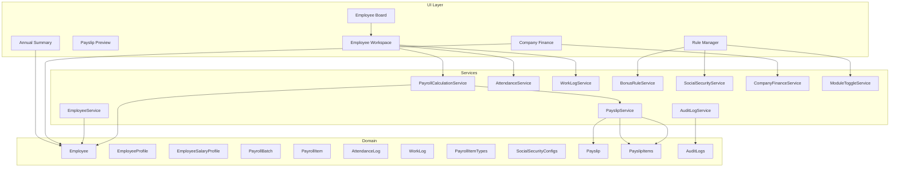
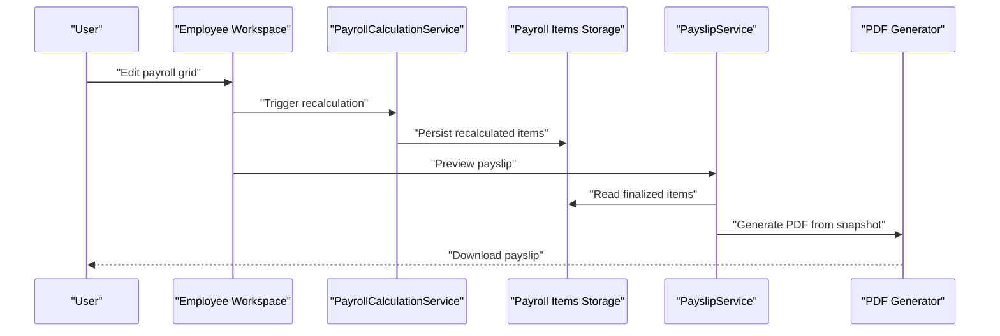
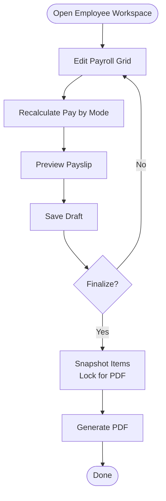
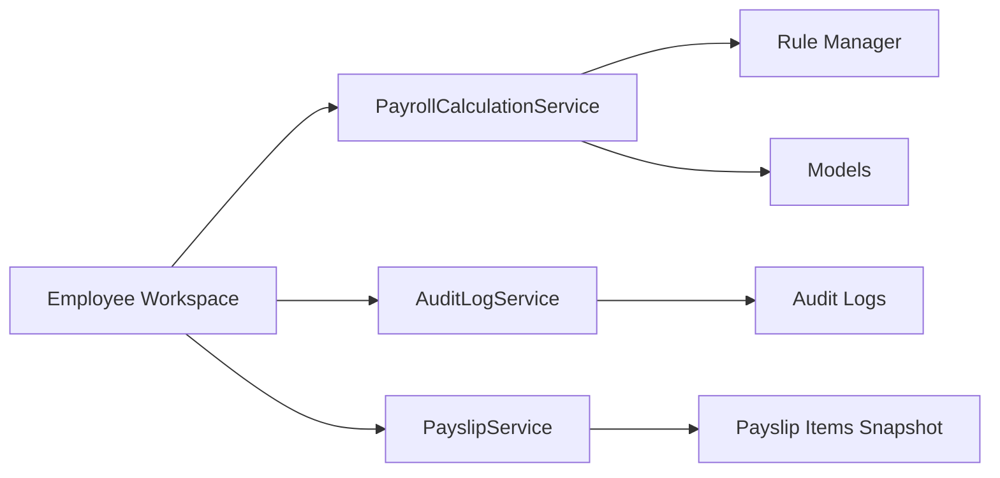

# Minimum Deliverables and Definition of Done

<cite>
**Referenced Files in This Document**
- [AGENTS.md](file://AGENTS.md)
</cite>

## Table of Contents
1. [Introduction](#introduction)
2. [Project Structure](#project-structure)
3. [Core Components](#core-components)
4. [Architecture Overview](#architecture-overview)
5. [Detailed Component Analysis](#detailed-component-analysis)
6. [Dependency Analysis](#dependency-analysis)
7. [Performance Considerations](#performance-considerations)
8. [Troubleshooting Guide](#troubleshooting-guide)
9. [Conclusion](#conclusion)
10. [Appendices](#appendices)

## Introduction
This document defines the minimum deliverables and the definition of done for the xHR Payroll & Finance System. It consolidates the project’s foundational principles, technology constraints, domain model, module requirements, database guidelines, business rules, dynamic UI behavior, payslip requirements, audit requirements, coding standards, folder structure guidance, change management rules, anti-patterns, and acceptance criteria. The goal is to ensure a robust, maintainable, and rule-driven payroll and finance platform aligned with real-world organizational needs.

## Project Structure
The repository currently contains a single specification document that outlines the system’s design, responsibilities, and requirements. The recommended Laravel-style folder structure is provided to guide development organization.

- Recommended Laravel layout:
  - app/Models
  - app/Services
  - app/Actions
  - app/Enums or app/Support
  - app/Http/Controllers
  - app/Http/Requests
  - app/Policies
  - resources/views
  - database/migrations
  - database/seeders

- Suggested service layer:
  - EmployeeService
  - PayrollCalculationService
  - AttendanceService
  - WorkLogService
  - BonusRuleService
  - SocialSecurityService
  - PayslipService
  - CompanyFinanceService
  - AuditLogService
  - ModuleToggleService

**Section sources**
- [AGENTS.md:622-647](file://AGENTS.md#L622-L647)

## Core Components
The system is composed of multiple specialized agents responsible for architecture, database design, payroll rules, UI/UX, PDF/payslip rendering, audit/compliance, and refactoring. These roles define responsibilities and guardrails to prevent common pitfalls and ensure maintainability.

- Architecture Agent: Defines system boundaries and prevents cell-based thinking.
- Database Agent: Designs schema, indexes, foreign keys, data types, migrations, and ensures phpMyAdmin compatibility.
- Payroll Rules Agent: Creates configurable rules per payroll mode and validates interdependencies.
- UI/UX Agent: Implements spreadsheet-like UX with inline editing, instant recalculation, and clear state indicators.
- PDF/Payslip Agent: Renders payslips from verified snapshots and generates PDFs.
- Audit & Compliance Agent: Logs meaningful audit events and supports rollback capability.
- Refactor Agent: Maintains simplicity, reduces duplication, and separates reusable services.

**Section sources**
- [AGENTS.md:158-283](file://AGENTS.md#L158-L283)

## Architecture Overview
The system follows a rule-driven, record-based architecture with clear separation of concerns. The UI enables dynamic data entry while enforcing auditability and controlled editing. Payroll calculations are performed by dedicated services, and payslips are generated from verified snapshots.

**Diagram sources**
- [AGENTS.md:228-244](file://AGENTS.md#L228-L244)
- [AGENTS.md:338-359](file://AGENTS.md#L338-L359)
- [AGENTS.md:387-417](file://AGENTS.md#L387-L417)

**Section sources**
- [AGENTS.md:222-244](file://AGENTS.md#L222-L244)
- [AGENTS.md:338-359](file://AGENTS.md#L338-L359)
- [AGENTS.md:387-417](file://AGENTS.md#L387-L417)

## Detailed Component Analysis

### 1) Project Structure
- Purpose: Establish a PHP-first, MySQL-friendly, rule-driven, and maintainable foundation.
- Requirements:
  - PHP 8.2+, Laravel preferred, MySQL 8+, phpMyAdmin-compatible schema.
  - Blade + lightweight JS stack.
  - PDF generation via DomPDF or Snappy.
  - Avoid spreadsheets-as-database, magic numbers in views, business logic in views, scattered query logic, and overengineering.

**Section sources**
- [AGENTS.md:102-118](file://AGENTS.md#L102-L118)

### 2) Database Schema
- Minimum tables include users, roles, permissions, employees, employee profiles, payroll batches/items, attendance/work logs, rate/threshold/bonus rules, social security configs, expense claims, company revenues/expenses, subscription costs, payslips/items, module toggles, and audit logs.
- Conventions:
  - Plural snake_case table names, primary key id, foreign key <entity>_id, status flags status/is_active, *_date for dates, *_minutes/*_seconds for durations, decimal(12,2) for amounts, consistent percentage scale.
- phpMyAdmin compatibility:
  - Easy table inspection, readable field names, minimal reliance on advanced DB features, migrations remain functional, basic queries debuggable.

**Section sources**
- [AGENTS.md:387-417](file://AGENTS.md#L387-L417)
- [AGENTS.md:418-435](file://AGENTS.md#L418-L435)

### 3) Migrations
- Responsibility: Database Agent designs schema, indexes, foreign keys, data types, and migrations.
- Requirements:
  - Use unsignedBigInteger/bigint unsigned for main FKs.
  - Monetary fields use decimal(12,2)+.
  - Durations use integer minutes/seconds.
  - Avoid overly rigid enums; keep room for future expansion.
  - Include timestamps, status columns, soft deletes where appropriate, and audit references.

**Section sources**
- [AGENTS.md:175-195](file://AGENTS.md#L175-L195)

### 4) Seed Data
- Responsibility: Populate initial configuration data for rules, toggles, departments, positions, and other static/reference data.
- Goal: Enable immediate testing and demonstration of payroll modes and rule sets.

**Section sources**
- [AGENTS.md:286-382](file://AGENTS.md#L286-L382)

### 5) Model Relationships
- Core entities include Employee, EmployeeProfile, EmployeeSalaryProfile, EmployeeBankAccount, PayrollBatch, PayrollItem, WorkLog, AttendanceLog, BonusRule, ThresholdRule, SocialSecurityConfig, Payslip, ExpenseClaim, CompanyExpense, CompanyRevenue, ModuleToggle, and AuditLog.
- Relationships:
  - Employees link to profiles, salary profiles, bank accounts, and payroll records.
  - Payroll items connect to payroll batches and item types.
  - Payslips snapshot finalized items for immutable PDF generation.
  - Audit logs track changes across entities.

**Section sources**
- [AGENTS.md:132-149](file://AGENTS.md#L132-L149)

### 6) Payroll Services
- Responsibilities:
  - Calculate pay by payroll mode (monthly_staff, freelance_layer, freelance_fixed, youtuber_salary, youtuber_settlement, custom_hybrid).
  - Aggregate income/deductions, support manual overrides, and produce payroll result snapshots.
- Rules covered:
  - Monthly staff: base salary, OT, diligence allowance, performance bonus, other income; deductions include cash advance, late deduction, LWOP, SSO, other deduction.
  - Diligence allowance: configurable default when no lateness/LWOP.
  - OT: minute/hour-based, thresholds, enable flag.
  - Late deduction: fixed per minute or tiered with grace period.
  - LWOP: day-based or proportional.
  - Freelance layer: duration_minutes = minute + (second/60); amount = duration_minutes * rate_per_minute.
  - Freelance fixed: amount = quantity * fixed_rate.
  - Youtuber salary: similar to monthly staff with module-specific toggles.
  - Youtuber settlement: net = total_income - total_expense.
  - Social Security (Thailand): configurable rates, salary ceiling, max monthly contribution.

**Section sources**
- [AGENTS.md:440-497](file://AGENTS.md#L440-L497)

### 7) Rule Manager
- Responsibilities:
  - Manage attendance rules, OT rules, bonus rules, threshold rules, layer rate rules, SSO rules, tax rules, and module toggles.
- Requirements:
  - Keep formulas and rules in config/rules tables; avoid hardcoding critical values.
  - Validate interdependencies across rules and modes.

**Section sources**
- [AGENTS.md:344-352](file://AGENTS.md#L344-L352)
- [AGENTS.md:196-221](file://AGENTS.md#L196-L221)

### 8) Employee Workspace UI
- Responsibilities:
  - Provide a single-page interface for payroll entry with header, month selector, summary cards, main payroll grid, detail inspector, payslip preview, and audit timeline.
- UX:
  - Inline editing, add/remove/duplicate rows, dropdown types/categories, auto amount calculation, manual override, recalculation, and source badges.
- Field states:
  - locked, auto, manual, override, from_master, rule_applied, draft, finalized.

**Section sources**
- [AGENTS.md:310-321](file://AGENTS.md#L310-L321)
- [AGENTS.md:513-546](file://AGENTS.md#L513-L546)

### 9) Payslip Builder + PDF
- Responsibilities:
  - Render payslips from verified data and export PDFs.
- Requirements:
  - Read from payslips and payslip_items; never compute live in views.
  - Snapshot items upon finalization to prevent post-change alterations.
  - Preserve company branding and Thai language support.

**Section sources**
- [AGENTS.md:245-256](file://AGENTS.md#L245-L256)
- [AGENTS.md:549-574](file://AGENTS.md#L549-L574)

### 10) Audit Logs
- Responsibilities:
  - Log meaningful audit events for compliance and rollback capability.
- Required fields:
  - Who, what entity, what field, old value, new value, action, timestamp, optional reason.
- High-priority audit areas:
  - Employee salary profile changes, payroll item amounts, payslip finalize/unfinalize, rule changes, module toggle changes, SSO config changes.

**Section sources**
- [AGENTS.md:576-595](file://AGENTS.md#L576-L595)

### 11) Annual Summary
- Responsibilities:
  - Replace macro-driven reporting with a 12-month view, employee summary, annual totals, and export capability.

**Section sources**
- [AGENTS.md:360-366](file://AGENTS.md#L360-L366)

### 12) Company Finance Summary
- Responsibilities:
  - Replace financial summary spreadsheets with revenue, expenses, profit/loss, cumulative, quarterly, and tax simulation.

**Section sources**
- [AGENTS.md:367-375](file://AGENTS.md#L367-L375)

## Architecture Overview
The system architecture emphasizes separation of concerns, rule-driven computation, and auditability. The UI enables dynamic, spreadsheet-like editing while ensuring data integrity and immutability for payslips.

**Diagram sources**
- [AGENTS.md:513-515](file://AGENTS.md#L513-L515)
- [AGENTS.md:338-343](file://AGENTS.md#L338-L343)
- [AGENTS.md:567-573](file://AGENTS.md#L567-L573)

## Detailed Component Analysis

### Payroll Calculation Flow
- Entry flow: Employee Workspace → Edit Grid → Recalculate → Preview Slip → Save → Finalize.
- Grid capabilities: add/remove/duplicate rows, inline editing, dropdown categories, auto calculation, manual override, recalculation, and source badges.

**Diagram sources**
- [AGENTS.md:513-515](file://AGENTS.md#L513-L515)
- [AGENTS.md:517-527](file://AGENTS.md#L517-L527)

**Section sources**
- [AGENTS.md:513-527](file://AGENTS.md#L513-L527)

### Audit Trail Requirements
- Must-log fields: actor, entity, field, old/new values, action, timestamp, optional reason.
- High-priority areas: salary profile, payroll item amounts, payslip lifecycle, rule/module/SSO changes.

**Section sources**
- [AGENTS.md:578-595](file://AGENTS.md#L578-L595)

### Coding Standards and Anti-Patterns
- Standards:
  - Service classes for business logic, thin controllers, FormRequest/service validation, transactions for critical operations, avoid God Classes.
  - Clear naming: domain-aligned class names, action-oriented method names, enum-like constants.
- Anti-patterns:
  - Cell-based logic, computing pay in views, hardcoding legal values, duplicating logic across services, using names as keys, treating reports as source of truth, live PDF computation, hiding manual overrides.

**Section sources**
- [AGENTS.md:598-620](file://AGENTS.md#L598-L620)
- [AGENTS.md:663-672](file://AGENTS.md#L663-L672)

## Dependency Analysis
The system relies on a cohesive set of services and models. Payroll services depend on rule managers and configuration tables. The UI interacts with services and persists stateful payroll items. Audit logs capture changes across entities, and PDF generation depends on finalized snapshots.

**Diagram sources**
- [AGENTS.md:338-359](file://AGENTS.md#L338-L359)
- [AGENTS.md:576-595](file://AGENTS.md#L576-L595)
- [AGENTS.md:567-573](file://AGENTS.md#L567-L573)

**Section sources**
- [AGENTS.md:338-359](file://AGENTS.md#L338-L359)
- [AGENTS.md:576-595](file://AGENTS.md#L576-L595)

## Performance Considerations
- Maintainability first: design for easy extension of payroll modes, rules, and reports.
- Data types and indexing: use unsigned big integers for FKs, decimal precision for money, and appropriate indices for frequent joins.
- Transactions: wrap critical operations to ensure atomicity.
- Audit overhead: minimize logging cost by focusing on high-priority changes and batching where feasible.

[No sources needed since this section provides general guidance]

## Troubleshooting Guide
Common issues and resolutions:
- Incorrect calculations:
  - Verify rule configurations and mode assignments.
  - Confirm snapshot correctness for finalized payslips.
- Audit gaps:
  - Ensure all high-priority changes are logged with required fields.
- UI inconsistencies:
  - Check grid state badges and source flags.
- PDF discrepancies:
  - Confirm PDF generation reads from snapshot data.

**Section sources**
- [AGENTS.md:578-595](file://AGENTS.md#L578-L595)
- [AGENTS.md:567-573](file://AGENTS.md#L567-L573)

## Conclusion
The xHR Payroll & Finance System is designed to replace legacy spreadsheet-based workflows with a maintainable, rule-driven, and auditable platform. The minimum deliverables and definition of done outlined here provide a clear roadmap to achieve a production-ready system that supports multiple payroll modes, dynamic UI, accurate calculations, PDF generation, comprehensive reporting, and strong auditability.

[No sources needed since this section summarizes without analyzing specific files]

## Appendices

### Acceptance Criteria and Quality Gates
- Employee onboarding:
  - Add/edit/deactivate employees; assign payroll mode, department/position, bank info, and SSO eligibility.
- Payroll mode assignment:
  - Assign and validate payroll modes per employee.
- Single-page salary entry:
  - Inline editing, add/remove/duplicate rows, dropdown categories, auto calculation, manual override, recalculation, and source badges.
- Accurate calculations across all modes:
  - Monthly staff, freelance layer, freelance fixed, youtuber salary/settlement, and SSO according to configured rules.
- SSO compliance:
  - Configurable Thailand SSO rates, ceilings, and effective dates.
- PDF generation:
  - Payslips generated from verified snapshots; supports Thai language and company branding.
- Reporting capabilities:
  - Annual summary (12-month view, employee summary, annual totals) and company finance summary (revenue, expenses, P&L, cumulative, quarterly, tax simulation).
- Audit trails:
  - Comprehensive logs capturing who changed what, old/new values, action, timestamp, and optional reason; high-priority areas covered.
- Future maintainability:
  - Clean separation of concerns, service-oriented architecture, rule-driven design, and adherence to coding standards.

**Section sources**
- [AGENTS.md:288-382](file://AGENTS.md#L288-L382)
- [AGENTS.md:438-497](file://AGENTS.md#L438-L497)
- [AGENTS.md:549-574](file://AGENTS.md#L549-L574)
- [AGENTS.md:576-595](file://AGENTS.md#L576-L595)
- [AGENTS.md:598-620](file://AGENTS.md#L598-L620)