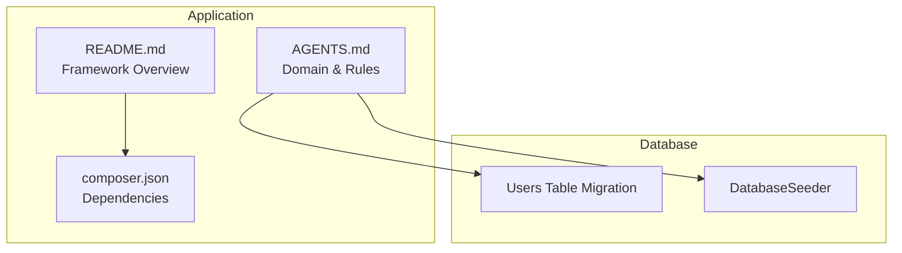
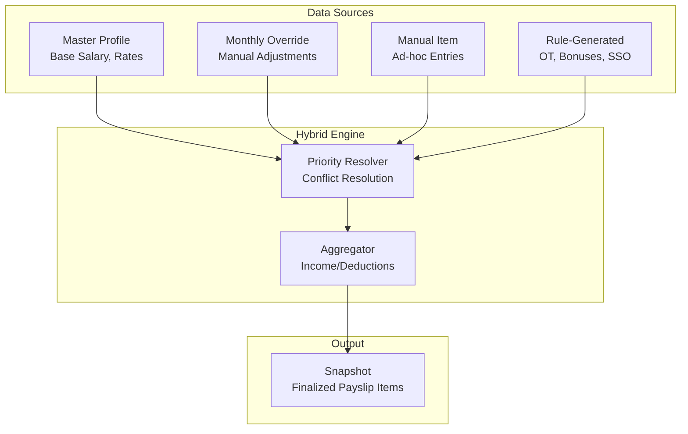
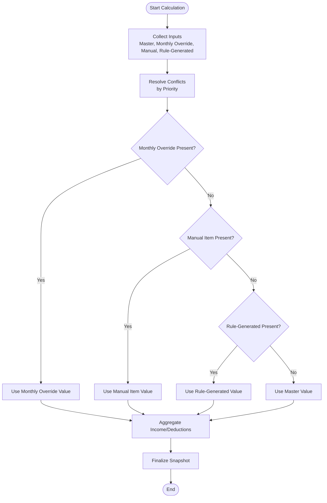
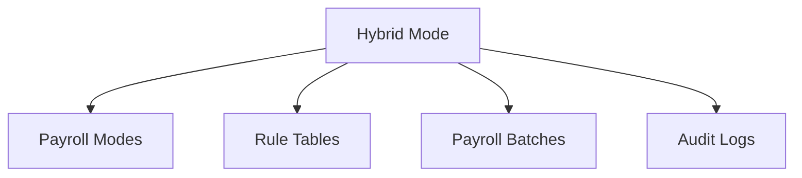

# Custom Hybrid Payroll

<cite>
**Referenced Files in This Document**
- [AGENTS.md](file://AGENTS.md)
- [README.md](file://README.md)
- [composer.json](file://composer.json)
- [0001_01_01_000000_create_users_table.php](file://database/migrations/0001_01_01_000000_create_users_table.php)
- [DatabaseSeeder.php](file://database/seeders/DatabaseSeeder.php)
</cite>

## Table of Contents
1. [Introduction](#introduction)
2. [Project Structure](#project-structure)
3. [Core Components](#core-components)
4. [Architecture Overview](#architecture-overview)
5. [Detailed Component Analysis](#detailed-component-analysis)
6. [Dependency Analysis](#dependency-analysis)
7. [Performance Considerations](#performance-considerations)
8. [Troubleshooting Guide](#troubleshooting-guide)
9. [Conclusion](#conclusion)
10. [Appendices](#appendices)

## Introduction
This document explains the custom hybrid payroll mode designed to combine multiple calculation approaches within a single employee’s compensation structure. It focuses on how the system mixes different payroll calculation methods, the override mechanisms, priority rules for different calculation sources, and conflict resolution strategies. It also provides practical examples, configuration requirements, and best practices for implementing custom hybrid combinations.

## Project Structure
The repository provides a Laravel-based foundation with a clear separation of concerns and a rule-driven payroll design. The payroll system is documented to support multiple modes, including a dedicated hybrid mode that enables mixing calculation sources and applying overrides.

**Diagram sources**
- [AGENTS.md:123-131](file://AGENTS.md#L123-L131)
- [README.md:10-28](file://README.md#L10-L28)
- [composer.json:8-13](file://composer.json#L8-L13)
- [0001_01_01_000000_create_users_table.php:14-22](file://database/migrations/0001_01_01_000000_create_users_table.php#L14-L22)
- [DatabaseSeeder.php:16-24](file://database/seeders/DatabaseSeeder.php#L16-L24)

**Section sources**
- [AGENTS.md:123-131](file://AGENTS.md#L123-L131)
- [README.md:10-28](file://README.md#L10-L28)
- [composer.json:8-13](file://composer.json#L8-L13)
- [0001_01_01_000000_create_users_table.php:14-22](file://database/migrations/0001_01_01_000000_create_users_table.php#L14-L22)
- [DatabaseSeeder.php:16-24](file://database/seeders/DatabaseSeeder.php#L16-L24)

## Core Components
The hybrid payroll mode is part of a broader set of payroll modes and relies on a rule-driven architecture with explicit source flags and states to manage overrides and conflicts.

Key capabilities and concepts:
- Payroll modes: The system defines multiple modes, including a hybrid mode intended for mixing calculation approaches.
- Source flags and states: Fields carry explicit source indicators to track whether values originate from master data, monthly overrides, manual entries, or rule-generated computations.
- Rule-driven calculations: Business rules are stored in configuration tables and applied consistently across modes.
- Audit and snapshot: Payroll results are snapshotted upon finalization to maintain auditability and reproducibility.

These elements collectively enable flexible, transparent, and auditable hybrid compensation structures.

**Section sources**
- [AGENTS.md:123-131](file://AGENTS.md#L123-L131)
- [AGENTS.md:87](file://AGENTS.md#L87)
- [AGENTS.md:500-504](file://AGENTS.md#L500-L504)
- [AGENTS.md:529-537](file://AGENTS.md#L529-L537)
- [AGENTS.md:567-573](file://AGENTS.md#L567-L573)

## Architecture Overview
The hybrid payroll architecture centers on a rule-driven calculation engine that aggregates income and deductions from multiple sources. It applies priority rules to resolve conflicts and ensures transparency through source flags and states.

**Diagram sources**
- [AGENTS.md:500-504](file://AGENTS.md#L500-L504)
- [AGENTS.md:529-537](file://AGENTS.md#L529-L537)
- [AGENTS.md:567-573](file://AGENTS.md#L567-L573)

## Detailed Component Analysis

### Hybrid Payroll Mode: Purpose and Scope
The hybrid mode allows combining multiple calculation methods within a single employee’s payroll. It supports mixing:
- Monthly staff formulas (base salary, overtime, allowances)
- Freelance layer and fixed-rate calculations
- Performance thresholds and bonuses
- Social security contributions
- Manual adjustments and ad-hoc items

This flexibility is essential for employees whose compensation includes diverse components (e.g., salary plus freelance work plus performance incentives).

**Section sources**
- [AGENTS.md:125-129](file://AGENTS.md#L125-L129)
- [AGENTS.md:203-215](file://AGENTS.md#L203-L215)

### Override Mechanisms and Source Flags
To manage mixed sources and prevent unintended overrides, the system uses explicit source flags and states:
- Master value: Base configuration from the employee’s profile or rate rules.
- Monthly override: Adjustments scoped to a specific payroll batch.
- Manual item: Ad-hoc entries added by users.
- Rule-generated: Values computed automatically from configured rules.

UI states further clarify the nature of each field or row:
- locked, auto, manual, override, from_master, rule_applied, draft, finalized.

These flags and states provide visibility into how each value was derived and enable controlled editing.

**Section sources**
- [AGENTS.md:87](file://AGENTS.md#L87)
- [AGENTS.md:500-504](file://AGENTS.md#L500-L504)
- [AGENTS.md:529-537](file://AGENTS.md#L529-L537)

### Priority Rules for Calculation Sources
Priority rules govern how conflicting values are resolved when multiple sources contribute to the same payroll item. The recommended priority order is:
1. Monthly override: Overrides take precedence within a payroll batch.
2. Manual item: Explicit user additions are honored after overrides.
3. Rule-generated: Automatically computed values follow manual entries.
4. Master value: Defaults from master configuration apply when nothing else is present.

This hierarchy ensures that user intent is respected while preserving system defaults.

**Diagram sources**
- [AGENTS.md:500-504](file://AGENTS.md#L500-L504)
- [AGENTS.md:529-537](file://AGENTS.md#L529-L537)
- [AGENTS.md:567-573](file://AGENTS.md#L567-L573)

### Conflict Resolution Strategies
Conflicts arise when multiple sources attempt to set the same payroll item. The system resolves them using the priority order described above. Additional strategies include:
- Disallowing reductions to income via hidden base salary adjustments; all reductions must appear in deductions.
- Maintaining a single source of truth for core data to minimize ambiguity.
- Enforcing validation and audit logging for all changes.

These safeguards protect accuracy and compliance.

**Section sources**
- [AGENTS.md:500-504](file://AGENTS.md#L500-L504)
- [AGENTS.md:563-566](file://AGENTS.md#L563-L566)
- [AGENTS.md:50](file://AGENTS.md#L50)

### Common Hybrid Scenarios
Below are typical hybrid scenarios and how to configure them:

- Scenario A: Monthly staff with freelance layer earnings
  - Use monthly staff formulas for base components.
  - Add freelance layer work logs and apply layer rate rules.
  - Apply performance thresholds and bonuses as rule-generated items.
  - Use manual items for any special adjustments.

- Scenario B: Hybrid salary plus fixed freelance work
  - Base salary from master profile.
  - Add fixed-rate freelance items as manual entries.
  - Compute OT and allowances via rules.
  - Apply monthly overrides for exceptional adjustments.

- Scenario C: Part-time hybrid with SSO and performance
  - Use master rates for partial-month calculations.
  - Add performance bonus via threshold rules.
  - Apply SSO according to configured rules.
  - Use overrides sparingly and document reasons.

Best practices:
- Keep overrides minimal and well-documented.
- Prefer rule-generated values for recurring items.
- Use manual items only for truly exceptional cases.
- Maintain audit logs for all changes.

**Section sources**
- [AGENTS.md:203-215](file://AGENTS.md#L203-L215)
- [AGENTS.md:440-444](file://AGENTS.md#L440-L444)
- [AGENTS.md:472-480](file://AGENTS.md#L472-L480)
- [AGENTS.md:488-497](file://AGENTS.md#L488-L497)

### Configuration Requirements
To implement hybrid payroll effectively, configure the following:

- Payroll mode selection
  - Assign the hybrid mode to employees requiring mixed calculations.

- Rate and rule configuration
  - Define layer rate rules, threshold rules, OT rules, and SSO configurations.
  - Store formulas and parameters in rule tables for reuse.

- Data sources
  - Maintain accurate master profiles (base salary, rates).
  - Track work logs for freelance components.
  - Use payroll batches to scope monthly overrides.

- UI and states
  - Enable inline editing and instant recalculation.
  - Display source badges and field states for transparency.

- Audit and compliance
  - Log all changes with who, what, when, old/new values, and reason.
  - Snapshot finalized payslips for immutable records.

**Section sources**
- [AGENTS.md:298](file://AGENTS.md#L298)
- [AGENTS.md:344-352](file://AGENTS.md#L344-L352)
- [AGENTS.md:398-416](file://AGENTS.md#L398-L416)
- [AGENTS.md:508-546](file://AGENTS.md#L508-L546)
- [AGENTS.md:578-594](file://AGENTS.md#L578-L594)
- [AGENTS.md:567-573](file://AGENTS.md#L567-L573)

### Best Practices for Implementing Custom Hybrid Combinations
- Separate concerns: Keep master data, monthly overrides, manual items, and rule-generated values distinct.
- Favor rule-driven logic: Encapsulate formulas in rules to ensure consistency and easy updates.
- Minimize overrides: Use overrides only when necessary and always justify with audit logs.
- Validate inputs: Enforce constraints to prevent illegal reductions to income and maintain compliance.
- Test thoroughly: Cover edge cases, priority interactions, and snapshot behavior with targeted tests.

**Section sources**
- [AGENTS.md:196-221](file://AGENTS.md#L196-L221)
- [AGENTS.md:612-619](file://AGENTS.md#L612-L619)
- [AGENTS.md:563-566](file://AGENTS.md#L563-L566)

## Dependency Analysis
The hybrid payroll mode depends on:
- Core payroll modes and rule tables for calculation logic.
- Payroll batches to scope monthly overrides.
- Audit logs to track changes and ensure compliance.
- UI states and badges to communicate source and status.

**Diagram sources**
- [AGENTS.md:123-131](file://AGENTS.md#L123-L131)
- [AGENTS.md:344-352](file://AGENTS.md#L344-L352)
- [AGENTS.md:398-416](file://AGENTS.md#L398-L416)
- [AGENTS.md:578-594](file://AGENTS.md#L578-L594)

**Section sources**
- [AGENTS.md:123-131](file://AGENTS.md#L123-L131)
- [AGENTS.md:344-352](file://AGENTS.md#L344-L352)
- [AGENTS.md:398-416](file://AGENTS.md#L398-L416)
- [AGENTS.md:578-594](file://AGENTS.md#L578-L594)

## Performance Considerations
- Keep rule sets concise and indexed to reduce computation overhead.
- Use batch processing for large-scale recalculations.
- Cache frequently accessed rule configurations.
- Avoid redundant recalculations by tracking dirty states in the UI.

[No sources needed since this section provides general guidance]

## Troubleshooting Guide
Common issues and resolutions:
- Unexpected value origin
  - Verify source flags and UI states to confirm whether a value came from master, override, manual, or rule-generated.
- Conflicting adjustments
  - Review the priority order and ensure overrides are scoped to the correct payroll batch.
- Illegal reduction to income
  - Ensure any decreases appear as deductions, not as hidden base salary changes.
- Audit gaps
  - Confirm that all changes are logged with sufficient detail for traceability.

**Section sources**
- [AGENTS.md:500-504](file://AGENTS.md#L500-L504)
- [AGENTS.md:529-537](file://AGENTS.md#L529-L537)
- [AGENTS.md:563-566](file://AGENTS.md#L563-L566)
- [AGENTS.md:578-594](file://AGENTS.md#L578-L594)

## Conclusion
The custom hybrid payroll mode enables organizations to combine multiple calculation approaches within a single employee’s compensation structure. By leveraging explicit source flags, a clear priority hierarchy, and rule-driven logic, the system ensures transparency, accuracy, and compliance. Proper configuration, disciplined override usage, and strong audit practices are essential to realize the benefits of hybrid payroll effectively.

[No sources needed since this section summarizes without analyzing specific files]

## Appendices
- Example references for implementation planning
  - Payroll modes and rule tables: [AGENTS.md:123-131](file://AGENTS.md#L123-L131), [AGENTS.md:344-352](file://AGENTS.md#L344-L352)
  - UI states and badges: [AGENTS.md:529-537](file://AGENTS.md#L529-L537)
  - Audit logging: [AGENTS.md:578-594](file://AGENTS.md#L578-L594)
  - Snapshot rule: [AGENTS.md:567-573](file://AGENTS.md#L567-L573)

[No sources needed since this section provides general guidance]