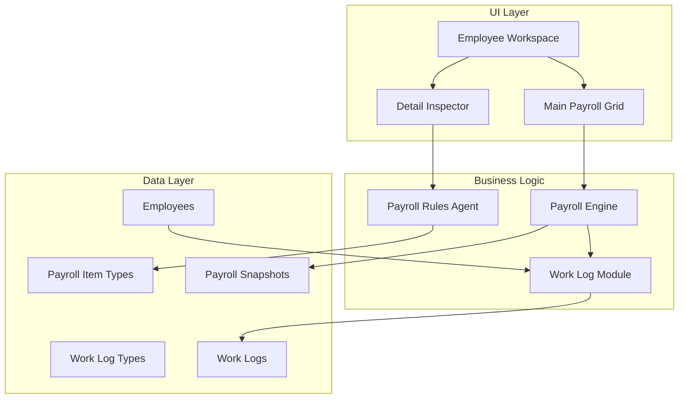
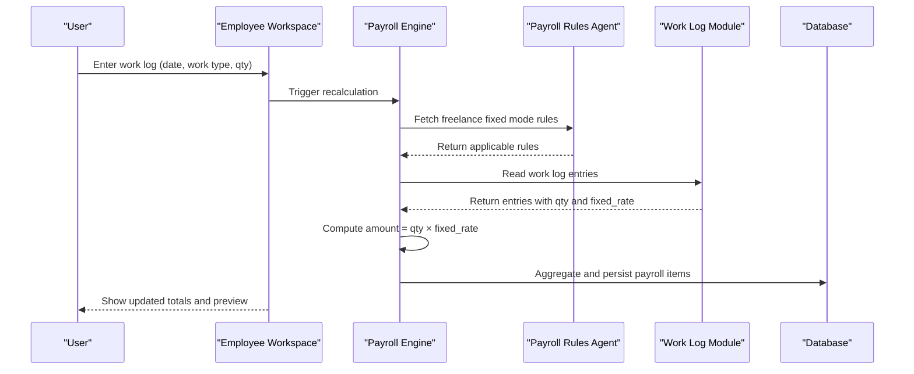
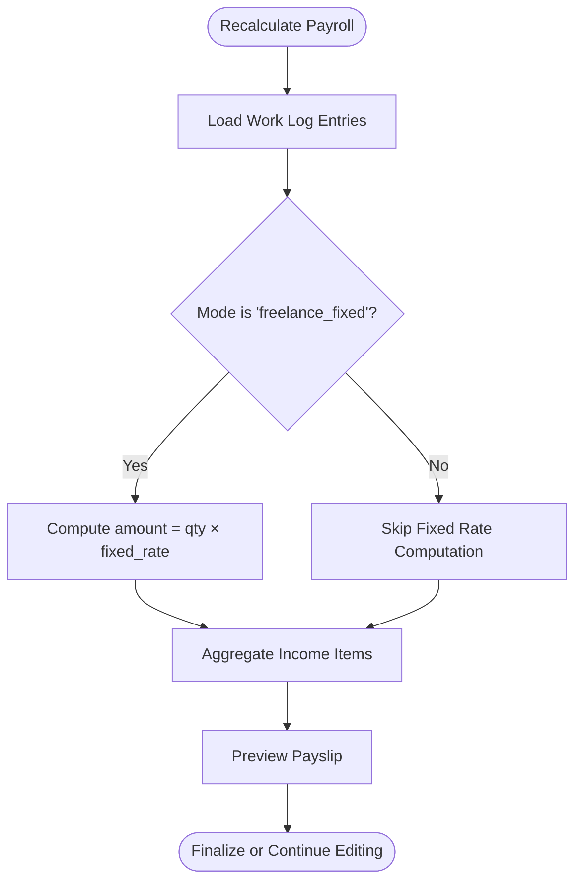
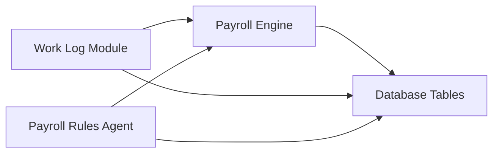

# Freelance Fixed Rate Payroll

<cite>
**Referenced Files in This Document**
- [AGENTS.md](file://AGENTS.md)
</cite>

## Table of Contents
1. [Introduction](#introduction)
2. [Project Structure](#project-structure)
3. [Core Components](#core-components)
4. [Architecture Overview](#architecture-overview)
5. [Detailed Component Analysis](#detailed-component-analysis)
6. [Dependency Analysis](#dependency-analysis)
7. [Performance Considerations](#performance-considerations)
8. [Troubleshooting Guide](#troubleshooting-guide)
9. [Conclusion](#conclusion)

## Introduction
This document describes the freelance fixed rate payroll calculation system within the xHR Payroll & Finance System. It explains the straightforward formula: amount equals quantity multiplied by a fixed rate. The system supports predetermined compensation structures for freelancers, integrates with the work log module for time and task tracking, and enforces business rules through configurable payroll modes and rule managers.

## Project Structure
The system is designed around a rule-driven architecture with clear separation of concerns:
- Payroll Modes define calculation approaches per employee category
- Work Log captures time-based tasks and quantities
- Payroll Engine computes results per mode
- Rule Manager defines and validates configurable business rules
- UI/UX provides a spreadsheet-like interface with dynamic editing and instant recalculation

**Diagram sources**
- [AGENTS.md: 310-343:310-343](file://AGENTS.md#L310-L343)
- [AGENTS.md: 329-337:329-337](file://AGENTS.md#L329-L337)
- [AGENTS.md: 338-343:338-343](file://AGENTS.md#L338-L343)
- [AGENTS.md: 392-403:392-403](file://AGENTS.md#L392-L403)

**Section sources**
- [AGENTS.md: 121-131:121-131](file://AGENTS.md#L121-L131)
- [AGENTS.md: 310-343:310-343](file://AGENTS.md#L310-L343)
- [AGENTS.md: 385-417:385-417](file://AGENTS.md#L385-L417)

## Core Components
- Payroll Modes: The system supports multiple modes including freelance fixed, which uses a simple multiplication formula for compensation.
- Work Log Module: Captures work performed by freelancers with fields for date, work type, quantity, and derived amount.
- Payroll Engine: Computes pay according to selected payroll mode and aggregates income/deductions.
- Rule Manager: Defines and validates configurable rules for each payroll mode, preventing hardcoded values and ensuring auditability.

Key formula for freelance fixed rate:
- amount = quantity × fixed_rate

This mode is ideal for predetermined compensation structures where the freelancer’s pay depends on measurable units (e.g., number of items produced, hours logged, or tasks completed).

**Section sources**
- [AGENTS.md: 123-130:123-130](file://AGENTS.md#L123-L130)
- [AGENTS.md: 329-337:329-337](file://AGENTS.md#L329-L337)
- [AGENTS.md: 338-343:338-343](file://AGENTS.md#L338-L343)
- [AGENTS.md: 477-480:477-480](file://AGENTS.md#L477-L480)

## Architecture Overview
The freelance fixed rate mode operates within a broader payroll architecture:
- Users enter work log entries in the Employee Workspace grid
- The system applies the freelance fixed formula during recalculation
- Results are aggregated into payroll items and can be previewed or finalized into payslips

**Diagram sources**
- [AGENTS.md: 310-343:310-343](file://AGENTS.md#L310-L343)
- [AGENTS.md: 329-337:329-337](file://AGENTS.md#L329-L337)
- [AGENTS.md: 477-480:477-480](file://AGENTS.md#L477-L480)

## Detailed Component Analysis

### Freelance Fixed Rate Mode
- Purpose: Calculate compensation using a predetermined fixed rate per unit of quantity.
- Inputs:
  - Quantity: measured in the unit appropriate for the work type (e.g., hours, items, tasks)
  - Fixed Rate: configured per work type or employee profile
- Formula: amount = quantity × fixed_rate
- Output: A single income item representing the fixed-rate compensation for the period.

Validation and business rules:
- The system prevents hardcoding rates in services; rates must be configurable via rule manager.
- The mode is validated alongside other payroll modes to ensure consistent behavior and auditability.

Integration with work log:
- The work log module supplies quantity and work type metadata.
- The fixed rate is applied consistently across entries of the same work type.

**Section sources**
- [AGENTS.md: 477-480:477-480](file://AGENTS.md#L477-L480)
- [AGENTS.md: 329-337:329-337](file://AGENTS.md#L329-L337)
- [AGENTS.md: 338-343:338-343](file://AGENTS.md#L338-L343)
- [AGENTS.md: 196-221:196-221](file://AGENTS.md#L196-L221)

### Work Log Module and Quantity Tracking
- Fields captured:
  - Date: when the work occurred
  - Work Type: categorizes the activity (e.g., transcription, editing, translation)
  - Quantity: numeric measure of effort (e.g., minutes, items, tasks)
  - Amount: computed by the payroll engine using the applicable mode
- Integration:
  - Entries feed directly into the payroll calculation pipeline for freelance fixed mode.
  - The module supports inline editing, recalculation, and audit logging.

Examples of work types commonly using fixed rates:
- Transcription projects (per item processed)
- Video editing tasks (per video edited)
- Translation assignments (per word or segment)
- Content creation (per article or post)

Quantity tracking mechanisms:
- Quantity is stored as a numeric field aligned with the chosen work type unit.
- The system supports automatic recalculation when quantity or fixed rate changes.

**Section sources**
- [AGENTS.md: 329-337:329-337](file://AGENTS.md#L329-L337)
- [AGENTS.md: 392-403:392-403](file://AGENTS.md#L392-L403)
- [AGENTS.md: 516-527:516-527](file://AGENTS.md#L516-L527)

### Payroll Engine and Calculation Flow
- Role: Applies the correct calculation logic per payroll mode and aggregates results.
- For freelance fixed:
  - Reads work log entries grouped by work type
  - Multiplies quantity by the configured fixed rate
  - Produces income items for inclusion in payslips
- Manual override and audit:
  - Supports manual adjustments with clear source flags
  - Maintains audit trail for all changes

**Diagram sources**
- [AGENTS.md: 338-343:338-343](file://AGENTS.md#L338-L343)
- [AGENTS.md: 477-480:477-480](file://AGENTS.md#L477-L480)

**Section sources**
- [AGENTS.md: 338-343:338-343](file://AGENTS.md#L338-L343)
- [AGENTS.md: 477-480:477-480](file://AGENTS.md#L477-L480)

### Rule Manager and Business Rule Validation
- Responsibilities:
  - Define and manage rules for each payroll mode
  - Prevent hardcoded values and ensure configuration-driven behavior
  - Validate interdependencies across rules
- For freelance fixed:
  - Fixed rates must be defined via rule manager
  - Mode selection and rule application are audited
- Audit and compliance:
  - All rule changes are tracked with who, what, when, and why

**Section sources**
- [AGENTS.md: 196-221:196-221](file://AGENTS.md#L196-L221)
- [AGENTS.md: 576-595:576-595](file://AGENTS.md#L576-L595)

## Dependency Analysis
The freelance fixed rate system depends on:
- Work Log Module for quantity and work type inputs
- Payroll Rules Agent for mode-specific configuration
- Payroll Engine for computation and aggregation
- Database tables for persistence and audit

**Diagram sources**
- [AGENTS.md: 329-337:329-337](file://AGENTS.md#L329-L337)
- [AGENTS.md: 338-343:338-343](file://AGENTS.md#L338-L343)
- [AGENTS.md: 392-403:392-403](file://AGENTS.md#L392-L403)

**Section sources**
- [AGENTS.md: 329-337:329-337](file://AGENTS.md#L329-L337)
- [AGENTS.md: 338-343:338-343](file://AGENTS.md#L338-L343)
- [AGENTS.md: 392-403:392-403](file://AGENTS.md#L392-L403)

## Performance Considerations
- Prefer batch recalculation for large datasets to minimize repeated computations.
- Store computed amounts in the work log to avoid recomputing when unrelated fields change.
- Use indexed fields for work type and date to optimize filtering and grouping.
- Keep fixed rate configurations centralized to reduce lookup overhead.

## Troubleshooting Guide
Common issues and resolutions:
- Zero or missing amounts:
  - Verify quantity is recorded and greater than zero
  - Confirm fixed rate is configured for the work type
- Incorrect totals:
  - Check that the correct payroll mode is selected
  - Review manual overrides and their source flags
- Audit discrepancies:
  - Inspect audit logs for rule changes and manual edits
  - Ensure all modifications are traceable with reasons

**Section sources**
- [AGENTS.md: 576-595:576-595](file://AGENTS.md#L576-L595)
- [AGENTS.md: 528-538:528-538](file://AGENTS.md#L528-L538)

## Conclusion
The freelance fixed rate payroll mode provides a simple yet powerful mechanism for predetermined compensation. By combining a straightforward formula with robust work log integration, configurable rules, and strong audit controls, the system ensures accurate, transparent, and maintainable payroll processing for freelancers.