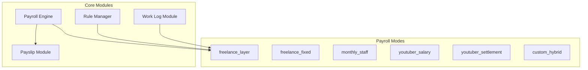
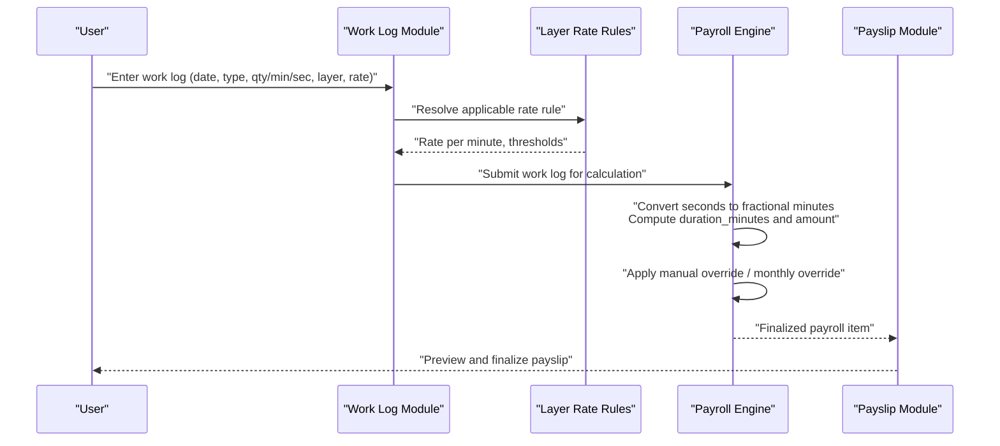
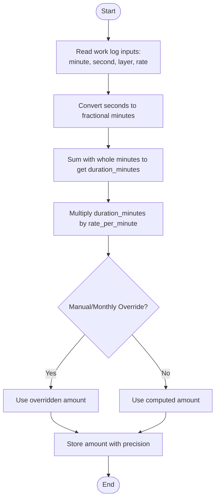
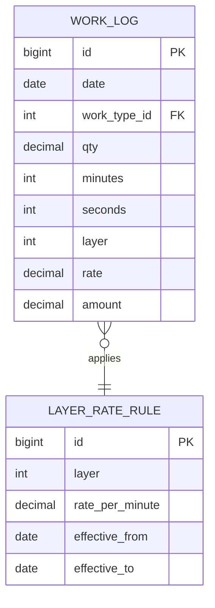
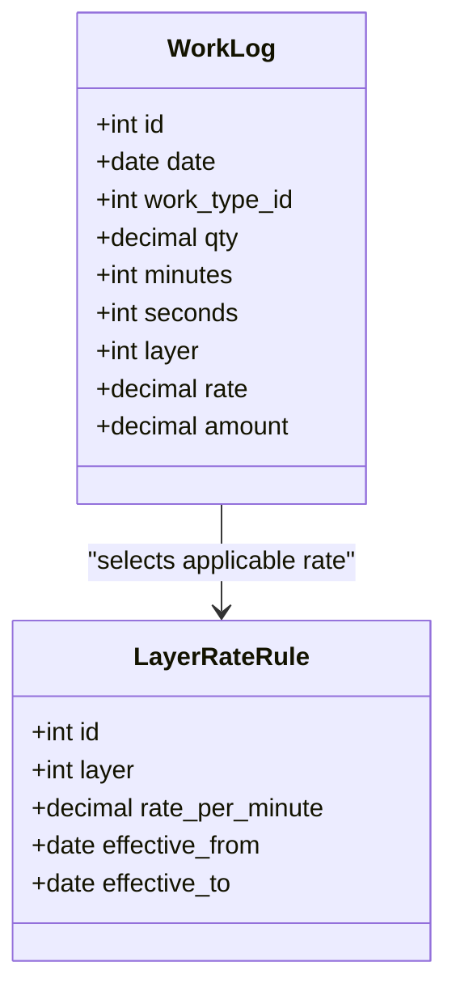
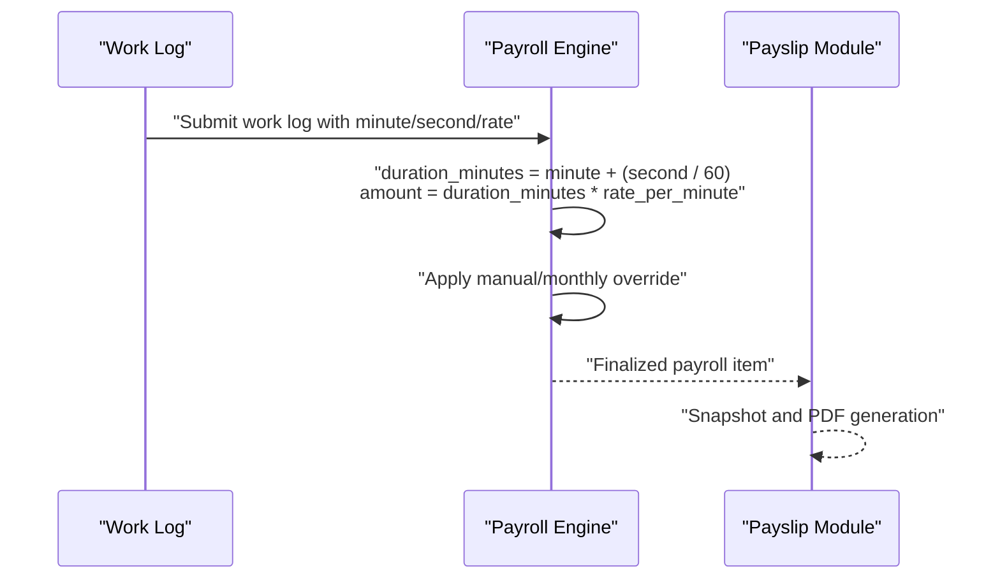

# Freelance Layer Rate Payroll

<cite>
**Referenced Files in This Document**
- [AGENTS.md](file://AGENTS.md)
</cite>

## Table of Contents
1. [Introduction](#introduction)
2. [Project Structure](#project-structure)
3. [Core Components](#core-components)
4. [Architecture Overview](#architecture-overview)
5. [Detailed Component Analysis](#detailed-component-analysis)
6. [Dependency Analysis](#dependency-analysis)
7. [Performance Considerations](#performance-considerations)
8. [Troubleshooting Guide](#troubleshooting-guide)
9. [Conclusion](#conclusion)
10. [Appendices](#appendices)

## Introduction
This document describes the freelance layer rate payroll calculation system within the xHR Payroll & Finance System. It explains the standard formulas used for time-based compensation, how work logs integrate with rate configurations, and how the system supports configurable precision and edge-case handling. The focus is on the freelance layer mode, which computes earnings from recorded work durations and per-minute rates.

## Project Structure
The repository provides a comprehensive specification and design guide for the payroll system. The freelance layer rate calculation is part of the broader payroll modes and integrates with work logs and rate configuration tables.

**Diagram sources**
- [AGENTS.md:123-131](file://AGENTS.md#L123-L131)
- [AGENTS.md:329-337](file://AGENTS.md#L329-L337)
- [AGENTS.md:344-353](file://AGENTS.md#L344-L353)
- [AGENTS.md:338-343](file://AGENTS.md#L338-L343)
- [AGENTS.md:354-359](file://AGENTS.md#L354-L359)

**Section sources**
- [AGENTS.md:121-150](file://AGENTS.md#L121-L150)
- [AGENTS.md:286-383](file://AGENTS.md#L286-L383)

## Core Components
- Freelance Layer Mode: Implements time-based compensation using minute-precision durations and per-minute rates.
- Work Log Module: Captures daily work entries with date, work type, quantities, minutes, seconds, layer, rate, and computed amount.
- Rate Configuration: Stores configurable layer rate rules and related parameters for calculation.
- Payroll Engine: Orchestrates calculation, aggregation, and result snapshotting for payslips.

Key behaviors:
- Duration conversion: Converts seconds to fractional minutes and sums with whole minutes.
- Amount computation: Multiplies duration in minutes by the applicable per-minute rate.
- Precision: Monetary amounts are stored with sufficient precision to avoid truncation errors.
- Auditability: All edits and calculations are tracked with source flags and audit logs.

**Section sources**
- [AGENTS.md:472-476](file://AGENTS.md#L472-L476)
- [AGENTS.md:329-337](file://AGENTS.md#L329-L337)
- [AGENTS.md:344-353](file://AGENTS.md#L344-L353)
- [AGENTS.md:338-343](file://AGENTS.md#L338-L343)
- [AGENTS.md:498-505](file://AGENTS.md#L498-L505)
- [AGENTS.md:576-596](file://AGENTS.md#L576-L596)

## Architecture Overview
The freelance layer calculation follows a rule-driven, configurable pipeline:
- Inputs: Work log records (date, work type, qty/minutes/seconds, layer, rate).
- Configuration: Layer rate rules define applicable rates and thresholds.
- Processing: Convert time to minutes, compute amount, apply overrides/manual adjustments.
- Outputs: Payroll items and payslip snapshots.

**Diagram sources**
- [AGENTS.md:329-337](file://AGENTS.md#L329-L337)
- [AGENTS.md:344-353](file://AGENTS.md#L344-L353)
- [AGENTS.md:338-343](file://AGENTS.md#L338-L343)
- [AGENTS.md:354-359](file://AGENTS.md#L354-L359)

## Detailed Component Analysis

### Standard Formula and Calculation Methodology
The freelance layer calculation uses two core formulas:
- Duration conversion: duration_minutes = minute + (second / 60)
- Earnings computation: amount = duration_minutes × rate_per_minute

Processing steps:
1. Convert raw seconds to fractional minutes and sum with whole minutes.
2. Multiply the resulting duration by the per-minute rate.
3. Apply any manual or monthly overrides to arrive at the final amount.
4. Persist the amount with appropriate precision and track the calculation source.

**Diagram sources**
- [AGENTS.md:472-476](file://AGENTS.md#L472-L476)
- [AGENTS.md:498-505](file://AGENTS.md#L498-L505)

**Section sources**
- [AGENTS.md:472-476](file://AGENTS.md#L472-L476)
- [AGENTS.md:498-505](file://AGENTS.md#L498-L505)

### Work Log Integration
The Work Log Module captures daily work entries with the following fields:
- Date: Reference date for the work log.
- Work Type: Category/type of work performed.
- Quantity: Optional unit count (e.g., number of tasks).
- Minutes: Whole minutes component of duration.
- Seconds: Fractional seconds component of duration.
- Layer: Layer identifier used to select applicable rate rule.
- Rate: Per-minute rate applied to the duration.
- Amount: Computed amount for the entry.

Integration highlights:
- The module supports inline editing, instant recalculation, and manual overrides.
- The UI displays source flags to indicate whether values are auto-calculated, manually entered, or overridden.

**Diagram sources**
- [AGENTS.md:329-337](file://AGENTS.md#L329-L337)
- [AGENTS.md:404-405](file://AGENTS.md#L404-L405)

**Section sources**
- [AGENTS.md:329-337](file://AGENTS.md#L329-L337)
- [AGENTS.md:344-353](file://AGENTS.md#L344-L353)

### Rate Configuration and Rule Management
Layer rate rules define how per-minute rates are applied:
- Layer identifiers: Group work entries by layer for rate selection.
- Effective date range: Control rate changes over time.
- Rate per minute: Configurable amount per minute of work.

Rule manager responsibilities:
- Maintain layer rate rules.
- Validate interdependencies between rules.
- Support toggling and module-specific configurations.

**Diagram sources**
- [AGENTS.md:404-405](file://AGENTS.md#L404-L405)
- [AGENTS.md:329-337](file://AGENTS.md#L329-L337)

**Section sources**
- [AGENTS.md:344-353](file://AGENTS.md#L344-L353)
- [AGENTS.md:404-405](file://AGENTS.md#L404-L405)

### Payroll Engine and Payslip Integration
The Payroll Engine orchestrates calculation and produces a snapshot for the payslip:
- Calculate earnings per work log entry.
- Aggregate income and deductions.
- Support manual overrides and monthly adjustments.
- Finalize payslip items and export PDFs.

**Diagram sources**
- [AGENTS.md:338-343](file://AGENTS.md#L338-L343)
- [AGENTS.md:354-359](file://AGENTS.md#L354-L359)
- [AGENTS.md:472-476](file://AGENTS.md#L472-L476)

**Section sources**
- [AGENTS.md:338-343](file://AGENTS.md#L338-L343)
- [AGENTS.md:354-359](file://AGENTS.md#L354-L359)
- [AGENTS.md:472-476](file://AGENTS.md#L472-L476)

## Dependency Analysis
The freelance layer calculation depends on:
- Work Log Module for inputs (date, work type, qty, minutes, seconds, layer, rate).
- Layer Rate Rules for selecting the applicable per-minute rate.
- Payroll Engine for processing and aggregation.
- Payslip Module for finalization and PDF export.

**Diagram sources**
- [AGENTS.md:329-337](file://AGENTS.md#L329-L337)
- [AGENTS.md:344-353](file://AGENTS.md#L344-L353)
- [AGENTS.md:338-343](file://AGENTS.md#L338-L343)
- [AGENTS.md:354-359](file://AGENTS.md#L354-L359)

**Section sources**
- [AGENTS.md:329-337](file://AGENTS.md#L329-L337)
- [AGENTS.md:344-353](file://AGENTS.md#L344-L353)
- [AGENTS.md:338-343](file://AGENTS.md#L338-L343)
- [AGENTS.md:354-359](file://AGENTS.md#L354-L359)

## Performance Considerations
- Prefer minute-level storage for durations to minimize floating-point arithmetic overhead.
- Use decimal fields with sufficient precision for monetary amounts to avoid rounding errors during aggregation.
- Index layer rate rules by effective date ranges to optimize lookup performance.
- Batch process work log entries to reduce repeated rule lookups.

[No sources needed since this section provides general guidance]

## Troubleshooting Guide
Common issues and resolutions:
- Incorrect amount after editing: Verify that manual or monthly overrides are intended and visible via source flags.
- Unexpected rounding: Confirm that seconds are converted to fractional minutes before multiplication by the per-minute rate.
- Misapplied rate: Check the effective date range and layer association of the selected rate rule.
- Audit discrepancies: Review audit logs for changes to work log entries, rate rules, and payslip modifications.

**Section sources**
- [AGENTS.md:498-505](file://AGENTS.md#L498-L505)
- [AGENTS.md:576-596](file://AGENTS.md#L576-L596)

## Conclusion
The freelance layer rate payroll system provides a configurable, rule-driven framework for time-based compensation. By converting seconds to fractional minutes, applying per-minute rates, and supporting manual overrides, it ensures accurate and auditable calculations. Integration with work logs and rate rules enables flexible configuration across layers and time periods.

[No sources needed since this section summarizes without analyzing specific files]

## Appendices

### Configuration Examples
- Work Categories: Define work types and layers to group entries by category and layer.
- Rate Structures: Set per-minute rates with effective date ranges to reflect rate changes over time.
- Calculation Precision: Configure monetary fields with sufficient precision to prevent rounding errors.

**Section sources**
- [AGENTS.md:329-337](file://AGENTS.md#L329-L337)
- [AGENTS.md:404-405](file://AGENTS.md#L404-L405)
- [AGENTS.md:424-426](file://AGENTS.md#L424-L426)