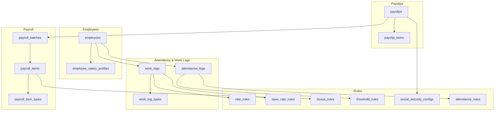
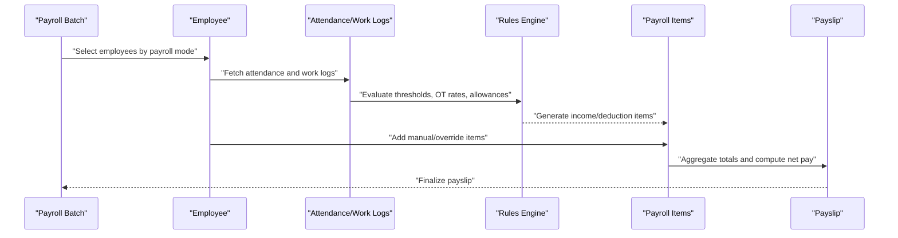
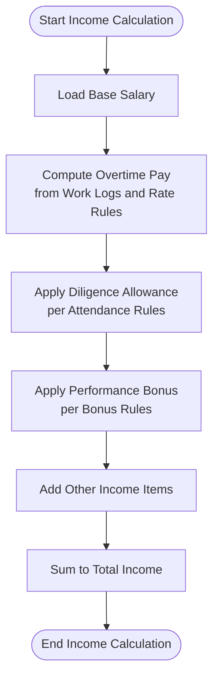
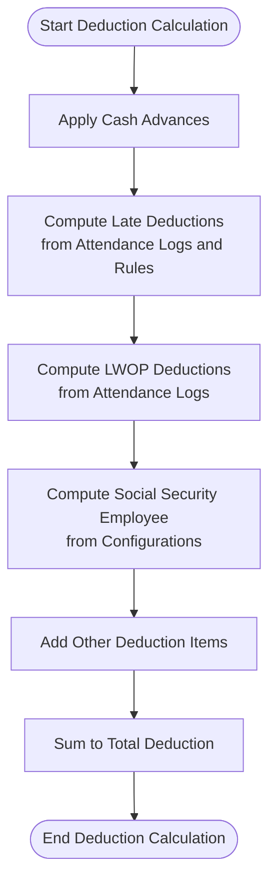
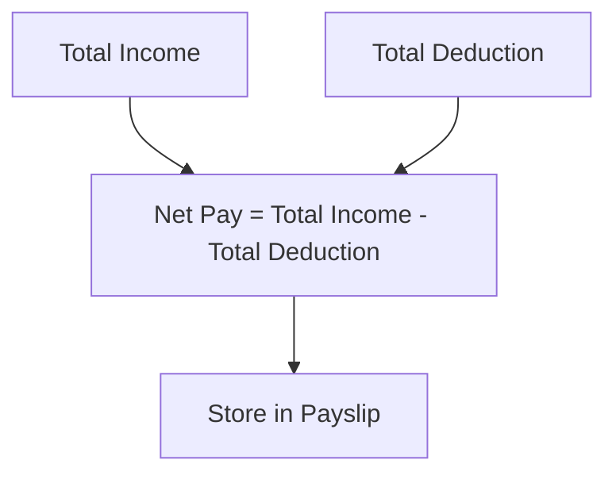
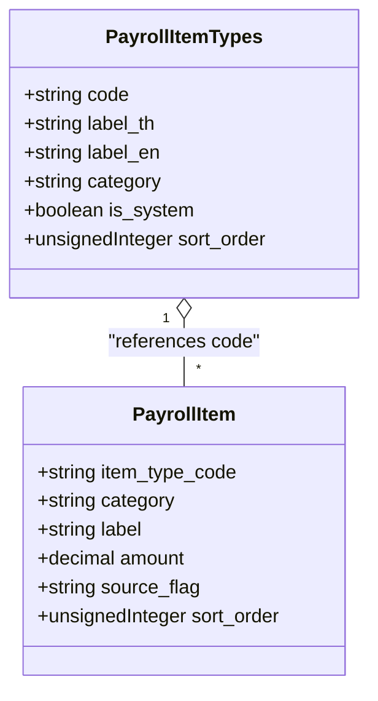
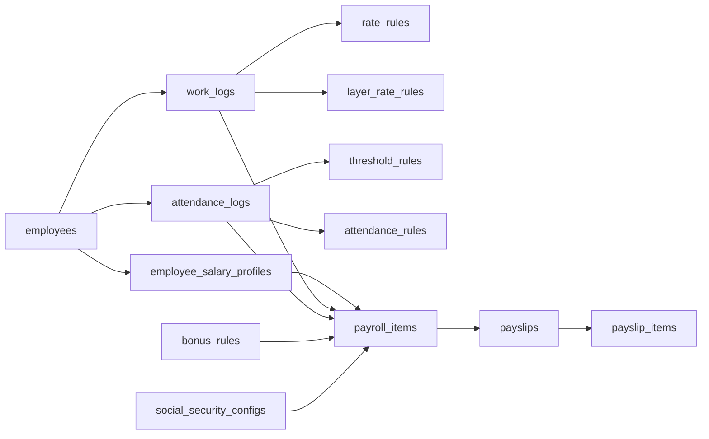

# Basic Calculation Formula

<cite>
**Referenced Files in This Document**
- [AGENTS.md](file://AGENTS.md)
- [0001_01_01_000005_create_employees_tables.php](file://database/migrations/0001_01_01_000005_create_employees_tables.php)
- [0001_01_01_000006_create_attendance_worklogs_tables.php](file://database/migrations/0001_01_01_000006_create_attendance_worklogs_tables.php)
- [0001_01_01_000007_create_payroll_tables.php](file://database/migrations/0001_01_01_000007_create_payroll_tables.php)
- [0001_01_01_000008_create_rules_config_tables.php](file://database/migrations/0001_01_01_000008_create_rules_config_tables.php)
- [0001_01_01_000009_create_payslips_tables.php](file://database/migrations/0001_01_01_000009_create_payslips_tables.php)
</cite>

## Table of Contents
1. [Introduction](#introduction)
2. [Project Structure](#project-structure)
3. [Core Components](#core-components)
4. [Architecture Overview](#architecture-overview)
5. [Detailed Component Analysis](#detailed-component-analysis)
6. [Dependency Analysis](#dependency-analysis)
7. [Performance Considerations](#performance-considerations)
8. [Troubleshooting Guide](#troubleshooting-guide)
9. [Conclusion](#conclusion)

## Introduction
This document explains the fundamental monthly staff payroll calculation formula implemented in the system. It documents the core equations, the roles of each component, and how manual overrides and rule-generated values interact during payroll processing. The goal is to make the payroll computation transparent and auditable while supporting configurable business rules.

## Project Structure
The payroll system is organized around database-first design with migrations defining core entities and their relationships. The structure supports:
- Employee profiles and payroll modes
- Attendance and work logs
- Payroll batches and items
- Payslips and payslip items
- Rules for overtime, diligence, bonuses, thresholds, and social security

**Diagram sources**
- [0001_01_01_000005_create_employees_tables.php:11-60](file://database/migrations/0001_01_01_000005_create_employees_tables.php#L11-L60)
- [0001_01_01_000006_create_attendance_worklogs_tables.php:11-60](file://database/migrations/0001_01_01_000006_create_attendance_worklogs_tables.php#L11-L60)
- [0001_01_01_000007_create_payroll_tables.php:11-51](file://database/migrations/0001_01_01_000007_create_payroll_tables.php#L11-L51)
- [0001_01_01_000008_create_rules_config_tables.php:11-78](file://database/migrations/0001_01_01_000008_create_rules_config_tables.php#L11-L78)
- [0001_01_01_000009_create_payslips_tables.php:11-43](file://database/migrations/0001_01_01_000009_create_payslips_tables.php#L11-L43)

**Section sources**
- [0001_01_01_000005_create_employees_tables.php:11-60](file://database/migrations/0001_01_01_000005_create_employees_tables.php#L11-L60)
- [0001_01_01_000006_create_attendance_worklogs_tables.php:11-60](file://database/migrations/0001_01_01_000006_create_attendance_worklogs_tables.php#L11-L60)
- [0001_01_01_000007_create_payroll_tables.php:11-51](file://database/migrations/0001_01_01_000007_create_payroll_tables.php#L11-L51)
- [0001_01_01_000008_create_rules_config_tables.php:11-78](file://database/migrations/0001_01_01_000008_create_rules_config_tables.php#L11-L78)
- [0001_01_01_000009_create_payslips_tables.php:11-43](file://database/migrations/0001_01_01_000009_create_payslips_tables.php#L11-L43)

## Core Components
This section documents the core payroll components and their roles in the calculation chain for monthly staff.

- Base salary
  - Defined in the employee salary profile and serves as the fixed monthly compensation.
  - Used as the foundation for income calculations.

- Overtime pay
  - Derived from work logs and rate rules or layer rate rules.
  - Supports fixed or layered rates per minute/hour.

- Diligence allowance
  - Configurable allowance applied when attendance criteria are met (e.g., zero late minutes and zero LWOP days).
  - Defaults and thresholds are governed by attendance rules and threshold rules.

- Performance bonus
  - Applied conditionally based on bonus rules configured for performance or attendance metrics.

- Other income
  - Additional income items captured as payroll items with category “income”.

- Cash advance
  - A deduction item representing advances given to employees.

- Late deduction
  - Calculated from attendance logs and configured in attendance rules or threshold rules.

- LWOP deduction
  - Deduction computed proportionally based on leave without pay days recorded in attendance logs.

- Social security employee
  - Computed from social security configurations based on effective date and applicable rates.

- Other deduction
  - Additional deduction items captured as payroll items with category “deduction”.

Net pay is derived as total income minus total deduction.

**Section sources**
- [AGENTS.md:440-446](file://AGENTS.md#L440-L446)
- [0001_01_01_000005_create_employees_tables.php:49-60](file://database/migrations/0001_01_01_000005_create_employees_tables.php#L49-L60)
- [0001_01_01_000006_create_attendance_worklogs_tables.php:11-29](file://database/migrations/0001_01_01_000006_create_attendance_worklogs_tables.php#L11-L29)
- [0001_01_01_000008_create_rules_config_tables.php:11-78](file://database/migrations/0001_01_01_000008_create_rules_config_tables.php#L11-L78)
- [0001_01_01_000007_create_payroll_tables.php:35-51](file://database/migrations/0001_01_01_000007_create_payroll_tables.php#L35-L51)
- [0001_01_01_000009_create_payslips_tables.php:11-31](file://database/migrations/0001_01_01_000009_create_payslips_tables.php#L11-L31)

## Architecture Overview
The payroll calculation pipeline aggregates data from multiple sources and applies configurable rules to produce standardized payroll items and payslips.

**Diagram sources**
- [0001_01_01_000005_create_employees_tables.php:11-33](file://database/migrations/0001_01_01_000005_create_employees_tables.php#L11-L33)
- [0001_01_01_000006_create_attendance_worklogs_tables.php:11-29](file://database/migrations/0001_01_01_000006_create_attendance_worklogs_tables.php#L11-L29)
- [0001_01_01_000008_create_rules_config_tables.php:11-78](file://database/migrations/0001_01_01_000008_create_rules_config_tables.php#L11-L78)
- [0001_01_01_000007_create_payroll_tables.php:35-51](file://database/migrations/0001_01_01_000007_create_payroll_tables.php#L35-L51)
- [0001_01_01_000009_create_payslips_tables.php:11-31](file://database/migrations/0001_01_01_000009_create_payslips_tables.php#L11-L31)

## Detailed Component Analysis

### Income Components
- Base salary
  - Determined from the current salary profile for the employee.
  - Forms the baseline for monthly income.

- Overtime pay
  - Computed from work logs using either fixed rate rules or layered rate rules.
  - Supports minute-level precision for accurate OT calculations.

- Diligence allowance
  - Applied when attendance criteria are satisfied (e.g., no late minutes and no LWOP days).
  - Configurable via attendance rules and threshold rules.

- Performance bonus
  - Conditionally added based on bonus rules aligned with performance or attendance conditions.

- Other income
  - Captured as additional income items in payroll items.

**Diagram sources**
- [0001_01_01_000005_create_employees_tables.php:49-60](file://database/migrations/0001_01_01_000005_create_employees_tables.php#L49-L60)
- [0001_01_01_000006_create_attendance_worklogs_tables.php:40-60](file://database/migrations/0001_01_01_000006_create_attendance_worklogs_tables.php#L40-L60)
- [0001_01_01_000008_create_rules_config_tables.php:11-46](file://database/migrations/0001_01_01_000008_create_rules_config_tables.php#L11-L46)
- [0001_01_01_000007_create_payroll_tables.php:35-51](file://database/migrations/0001_01_01_000007_create_payroll_tables.php#L35-L51)

**Section sources**
- [AGENTS.md:440-450](file://AGENTS.md#L440-L450)
- [0001_01_01_000005_create_employees_tables.php:49-60](file://database/migrations/0001_01_01_000005_create_employees_tables.php#L49-L60)
- [0001_01_01_000006_create_attendance_worklogs_tables.php:40-60](file://database/migrations/0001_01_01_000006_create_attendance_worklogs_tables.php#L40-L60)
- [0001_01_01_000008_create_rules_config_tables.php:11-46](file://database/migrations/0001_01_01_000008_create_rules_config_tables.php#L11-L46)
- [0001_01_01_000007_create_payroll_tables.php:35-51](file://database/migrations/0001_01_01_000007_create_payroll_tables.php#L35-L51)

### Deduction Components
- Cash advance
  - Recorded as a deduction item in payroll items.

- Late deduction
  - Derived from attendance logs and configured thresholds or attendance rules.

- LWOP deduction
  - Computed proportionally from attendance logs indicating days without pay.

- Social security employee
  - Calculated from social security configurations with effective dates and rates.

- Other deduction
  - Additional deduction items captured in payroll items.

**Diagram sources**
- [0001_01_01_000006_create_attendance_worklogs_tables.php:11-29](file://database/migrations/0001_01_01_000006_create_attendance_worklogs_tables.php#L11-L29)
- [0001_01_01_000008_create_rules_config_tables.php:60-78](file://database/migrations/0001_01_01_000008_create_rules_config_tables.php#L60-L78)
- [0001_01_01_000007_create_payroll_tables.php:35-51](file://database/migrations/0001_01_01_000007_create_payroll_tables.php#L35-L51)
- [0001_01_01_000009_create_payslips_tables.php:11-31](file://database/migrations/0001_01_01_000009_create_payslips_tables.php#L11-L31)

**Section sources**
- [AGENTS.md:441-446](file://AGENTS.md#L441-L446)
- [0001_01_01_000006_create_attendance_worklogs_tables.php:11-29](file://database/migrations/0001_01_01_000006_create_attendance_worklogs_tables.php#L11-L29)
- [0001_01_01_000008_create_rules_config_tables.php:60-78](file://database/migrations/0001_01_01_000008_create_rules_config_tables.php#L60-L78)
- [0001_01_01_000007_create_payroll_tables.php:35-51](file://database/migrations/0001_01_01_000007_create_payroll_tables.php#L35-L51)
- [0001_01_01_000009_create_payslips_tables.php:11-31](file://database/migrations/0001_01_01_000009_create_payslips_tables.php#L11-L31)

### Net Pay Calculation
Net pay equals total income minus total deduction. This value is stored in the payslip and finalized after all items are aggregated.

**Diagram sources**
- [AGENTS.md:440-446](file://AGENTS.md#L440-L446)
- [0001_01_01_000009_create_payslips_tables.php:17-19](file://database/migrations/0001_01_01_000009_create_payslips_tables.php#L17-L19)

**Section sources**
- [AGENTS.md:440-446](file://AGENTS.md#L440-L446)
- [0001_01_01_000009_create_payslips_tables.php:17-19](file://database/migrations/0001_01_01_000009_create_payslips_tables.php#L17-L19)

### Manual Overrides and Rule-Generated Values
The system distinguishes multiple sources for each payroll item to support transparency and control:
- Auto: generated by system rules
- Manual: entered by users
- Override: replaces auto-calculated values
- Master: original computed value before overrides
- Rule applied: outcome of applying threshold or bonus rules

These flags are stored in payroll items and influence how totals are computed and audited.

**Diagram sources**
- [0001_01_01_000007_create_payroll_tables.php:35-51](file://database/migrations/0001_01_01_000007_create_payroll_tables.php#L35-L51)
- [0001_01_01_000007_create_payroll_tables.php:11-20](file://database/migrations/0001_01_01_000007_create_payroll_tables.php#L11-L20)

**Section sources**
- [AGENTS.md:498-505](file://AGENTS.md#L498-L505)
- [0001_01_01_000007_create_payroll_tables.php:35-51](file://database/migrations/0001_01_01_000007_create_payroll_tables.php#L35-L51)

## Dependency Analysis
The following diagram shows how core entities depend on each other to compute payroll:

**Diagram sources**
- [0001_01_01_000005_create_employees_tables.php:11-60](file://database/migrations/0001_01_01_000005_create_employees_tables.php#L11-L60)
- [0001_01_01_000006_create_attendance_worklogs_tables.php:11-60](file://database/migrations/0001_01_01_000006_create_attendance_worklogs_tables.php#L11-L60)
- [0001_01_01_000008_create_rules_config_tables.php:11-78](file://database/migrations/0001_01_01_000008_create_rules_config_tables.php#L11-L78)
- [0001_01_01_000007_create_payroll_tables.php:35-51](file://database/migrations/0001_01_01_000007_create_payroll_tables.php#L35-L51)
- [0001_01_01_000009_create_payslips_tables.php:11-43](file://database/migrations/0001_01_01_000009_create_payslips_tables.php#L11-L43)

**Section sources**
- [0001_01_01_000005_create_employees_tables.php:11-60](file://database/migrations/0001_01_01_000005_create_employees_tables.php#L11-L60)
- [0001_01_01_000006_create_attendance_worklogs_tables.php:11-60](file://database/migrations/0001_01_01_000006_create_attendance_worklogs_tables.php#L11-L60)
- [0001_01_01_000008_create_rules_config_tables.php:11-78](file://database/migrations/0001_01_01_000008_create_rules_config_tables.php#L11-L78)
- [0001_01_01_000007_create_payroll_tables.php:35-51](file://database/migrations/0001_01_01_000007_create_payroll_tables.php#L35-L51)
- [0001_01_01_000009_create_payslips_tables.php:11-43](file://database/migrations/0001_01_01_000009_create_payslips_tables.php#L11-L43)

## Performance Considerations
- Use indexed columns for frequent queries (e.g., employee_id, month/year, log_date).
- Aggregate totals at batch level to minimize repeated computations.
- Store decimal amounts with appropriate precision to avoid rounding errors.
- Apply soft deletes selectively to reduce maintenance overhead.

## Troubleshooting Guide
- Verify employee payroll mode alignment with intended calculation rules.
- Confirm attendance logs are present and properly indexed for the target period.
- Review threshold rules and bonus rules for correct metric operators and values.
- Ensure social security configurations are effective for the selected month/year.
- Audit payroll items’ source flags to distinguish auto-generated versus manual/override entries.

**Section sources**
- [0001_01_01_000005_create_employees_tables.php:11-33](file://database/migrations/0001_01_01_000005_create_employees_tables.php#L11-L33)
- [0001_01_01_000006_create_attendance_worklogs_tables.php:11-29](file://database/migrations/0001_01_01_000006_create_attendance_worklogs_tables.php#L11-L29)
- [0001_01_01_000008_create_rules_config_tables.php:48-78](file://database/migrations/0001_01_01_000008_create_rules_config_tables.php#L48-L78)
- [0001_01_01_000007_create_payroll_tables.php:35-51](file://database/migrations/0001_01_01_000007_create_payroll_tables.php#L35-L51)
- [0001_01_01_000009_create_payslips_tables.php:11-31](file://database/migrations/0001_01_01_000009_create_payslips_tables.php#L11-L31)

## Conclusion
The monthly staff payroll calculation follows a clear, configurable formula with explicit income and deduction categories. The system’s design separates rule-driven computation from manual overrides, enabling transparency and auditability. By leveraging structured data models and rule sets, the system supports scalable and maintainable payroll processing.