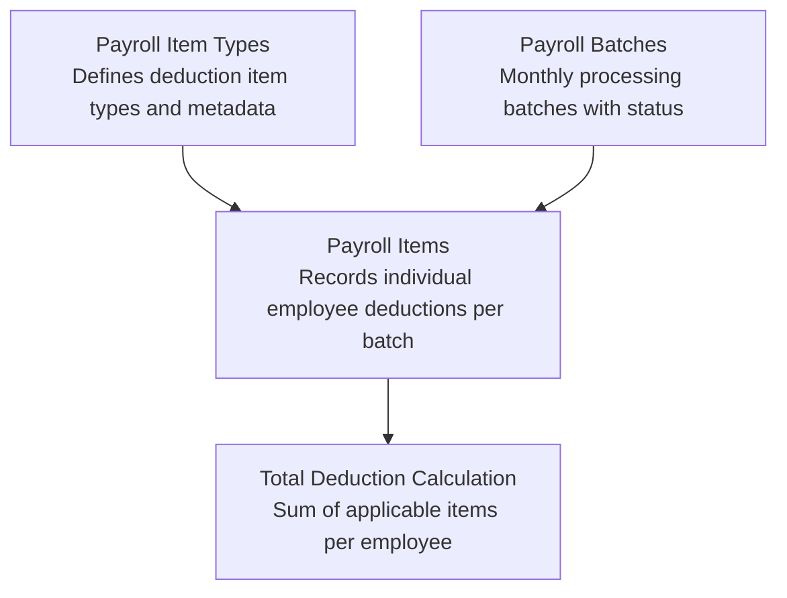
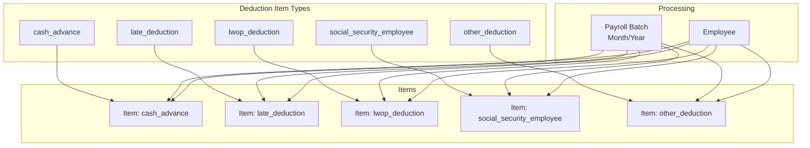
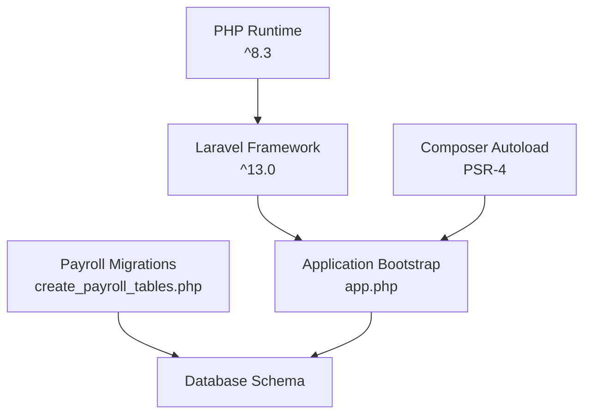

# Deduction Components Management

<cite>
**Referenced Files in This Document**
- [0001_01_01_000007_create_payroll_tables.php](file://database/migrations/0001_01_01_000007_create_payroll_tables.php)
- [composer.json](file://composer.json)
- [app.php](file://bootstrap/app.php)
</cite>

## Table of Contents
1. [Introduction](#introduction)
2. [Project Structure](#project-structure)
3. [Core Components](#core-components)
4. [Architecture Overview](#architecture-overview)
5. [Detailed Component Analysis](#detailed-component-analysis)
6. [Dependency Analysis](#dependency-analysis)
7. [Performance Considerations](#performance-considerations)
8. [Troubleshooting Guide](#troubleshooting-guide)
9. [Conclusion](#conclusion)

## Introduction
This document describes the deduction components management system for monthly staff payroll. It focuses on five main deduction categories: cash_advance, late_deduction, lwop_deduction, social_security_employee, and other_deduction. The documentation explains how deductions are modeled, configured, calculated, and integrated into the total deduction computation. It also covers manual override capabilities, rule-based generation, audit trail requirements for adjustments, and compliance considerations for each deduction type.

## Project Structure
The payroll system is built on Laravel and uses database migrations to define core payroll entities. The migration file establishes three primary tables: payroll_item_types, payroll_batches, and payroll_items. These tables form the foundation for modeling deduction item types, batch processing, and individual payroll items respectively.

**Diagram sources**
- [0001_01_01_000007_create_payroll_tables.php:11-20](file://database/migrations/0001_01_01_000007_create_payroll_tables.php#L11-L20)
- [0001_01_01_000007_create_payroll_tables.php:22-33](file://database/migrations/0001_01_01_000007_create_payroll_tables.php#L22-L33)
- [0001_01_01_000007_create_payroll_tables.php:35-51](file://database/migrations/0001_01_01_000007_create_payroll_tables.php#L35-L51)

**Section sources**
- [0001_01_01_000007_create_payroll_tables.php:1-61](file://database/migrations/0001_01_01_000007_create_payroll_tables.php#L1-L61)
- [composer.json:1-87](file://composer.json#L1-L87)
- [app.php:1-19](file://bootstrap/app.php#L1-L19)

## Core Components
This section outlines the core components that support deduction management:

- Payroll Item Types
  - Purpose: Define deduction item types with metadata such as code, labels, category, sort order, and whether the type is system-defined.
  - Category field indicates whether the item belongs to income or deduction.
  - Sort order controls presentation and processing sequence.
  - Unique code ensures consistent identification across the system.

- Payroll Batches
  - Purpose: Represent monthly payroll processing cycles with status tracking (draft, processing, finalized).
  - Associates items with a specific month and year.
  - Tracks who created the batch and when it was finalized.

- Payroll Items
  - Purpose: Store individual deduction records for employees within a batch.
  - Fields include employee identifier, batch reference, item type code, category, label, amount, source flag, sort order, and notes.
  - Source flag supports multiple origins: auto-generated, manually entered, overridden, master templates, and rule-applied.

These components collectively enable:
- Deduction item definition and categorization
- Batch-based processing and status control
- Individual item recording with provenance tracking
- Sorting and ordering for deterministic calculations

**Section sources**
- [0001_01_01_000007_create_payroll_tables.php:11-20](file://database/migrations/0001_01_01_000007_create_payroll_tables.php#L11-L20)
- [0001_01_01_000007_create_payroll_tables.php:22-33](file://database/migrations/0001_01_01_000007_create_payroll_tables.php#L22-L33)
- [0001_01_01_000007_create_payroll_tables.php:35-51](file://database/migrations/0001_01_01_000007_create_payroll_tables.php#L35-L51)

## Architecture Overview
The deduction management architecture centers around the payroll item types and payroll items tables. Each deduction item type defines a category (deduction) and a unique code. During payroll processing, items are generated or recorded for each employee within a batch. The system supports multiple sources for each item (auto, manual, override, master, rule_applied), enabling flexible calculation and adjustment mechanisms.

**Diagram sources**
- [0001_01_01_000007_create_payroll_tables.php:11-20](file://database/migrations/0001_01_01_000007_create_payroll_tables.php#L11-L20)
- [0001_01_01_000007_create_payroll_tables.php:35-51](file://database/migrations/0001_01_01_000007_create_payroll_tables.php#L35-L51)

## Detailed Component Analysis

### Cash Advance Deduction
Cash advance represents an advance payment given to employees that is later deducted from their salary. The system models this as a deduction item type with a unique code and category set to deduction.

- Definition and Configuration
  - Defined in payroll_item_types with category set to deduction.
  - Unique code enables consistent identification and lookup.
  - Sort order allows controlled presentation and processing.

- Calculation and Integration
  - Amount is recorded in payroll_items for each employee within a batch.
  - Source flag supports auto-generation from HR systems, manual entry, or overrides.
  - Integrated into total deduction by summing all items with the cash advance type for an employee.

- Manual Override Capabilities
  - Source flag values include manual and override, allowing authorized users to adjust amounts.
  - Notes field captures justification for overrides.

- Rule-Based Generation
  - Auto-source flag indicates rule-applied or system-generated entries.
  - Rule engine can compute cash advances based on policies (e.g., approved advances).

- Audit Trail Requirements
  - Timestamps track creation and updates.
  - Created_by in payroll_batches identifies who finalized the batch.
  - Notes provide audit trail context for adjustments.

- Compliance Considerations
  - Ensure adherence to company policy on advance limits and repayment terms.
  - Maintain documentation for approvals and adjustments.

**Section sources**
- [0001_01_01_000007_create_payroll_tables.php:11-20](file://database/migrations/0001_01_01_000007_create_payroll_tables.php#L11-L20)
- [0001_01_01_000007_create_payroll_tables.php:35-51](file://database/migrations/0001_01_01_000007_create_payroll_tables.php#L35-L51)

### Late Deduction
Late deduction accounts for penalties or deductions related to employee lateness or tardiness.

- Definition and Configuration
  - Defined as a deduction item type with unique code and category.
  - Sort order ensures predictable processing alongside other deductions.

- Calculation and Integration
  - Amount computed based on attendance records and policy thresholds.
  - Recorded in payroll_items with source flag indicating origin (auto/manual/override/rule_applied).

- Manual Override Capabilities
  - Override capability allows corrections for exceptional circumstances.
  - Notes capture rationale for overrides.

- Rule-Based Generation
  - Auto-source entries generated via rules (e.g., late minutes converted to monetary value).

- Audit Trail Requirements
  - Full timestamps and batch metadata support traceability.
  - Notes provide context for adjustments.

- Compliance Considerations
  - Align with labor regulations governing wage deductions for attendance violations.
  - Ensure fair application of policies and documented exceptions.

**Section sources**
- [0001_01_01_000007_create_payroll_tables.php:11-20](file://database/migrations/0001_01_01_000007_create_payroll_tables.php#L11-L20)
- [0001_01_01_000007_create_payroll_tables.php:35-51](file://database/migrations/0001_01_01_000007_create_payroll_tables.php#L35-L51)

### LWOP Deduction
Leave Without Pay (LWOP) deduction reflects periods where employees receive no pay, often impacting net take-home pay calculations.

- Definition and Configuration
  - Defined as a deduction item type with category set to deduction.
  - Unique code and sort order support consistent processing.

- Calculation and Integration
  - Amount derived from leave records and applicable policies.
  - Stored in payroll_items with source flag reflecting origin.

- Manual Override Capabilities
  - Manual and override flags enable corrections for administrative errors or special cases.
  - Notes provide audit trail for changes.

- Rule-Based Generation
  - Auto-source entries generated from leave management rules.

- Audit Trail Requirements
  - Timestamps and batch metadata ensure traceability.
  - Notes document reasons for adjustments.

- Compliance Considerations
  - Comply with statutory and regulatory requirements for LWOP treatment.
  - Maintain accurate leave and deduction records.

**Section sources**
- [0001_01_01_000007_create_payroll_tables.php:11-20](file://database/migrations/0001_01_01_000007_create_payroll_tables.php#L11-L20)
- [0001_01_01_000007_create_payroll_tables.php:35-51](file://database/migrations/0001_01_01_000007_create_payroll_tables.php#L35-L51)

### Social Security Employee Deduction
Social Security Employee deduction represents mandatory or voluntary employee contributions toward social security benefits.

- Definition and Configuration
  - Defined as a deduction item type with category set to deduction.
  - Unique code and sort order ensure standardized processing.

- Calculation and Integration
  - Amount computed according to statutory rates and employee earnings thresholds.
  - Recorded in payroll_items with source flag supporting multiple origins.

- Manual Override Capabilities
  - Override capability accommodates special situations (e.g., exemptions, corrections).
  - Notes capture approval and justification.

- Rule-Based Generation
  - Auto-source entries generated via statutory computation rules.

- Audit Trail Requirements
  - Timestamps and batch metadata provide comprehensive audit trail.
  - Notes document overrides and adjustments.

- Compliance Considerations
  - Strict adherence to local social security laws and contribution rates.
  - Maintain accurate records for regulatory audits.

**Section sources**
- [0001_01_01_000007_create_payroll_tables.php:11-20](file://database/migrations/0001_01_01_000007_create_payroll_tables.php#L11-L20)
- [0001_01_01_000007_create_payroll_tables.php:35-51](file://database/migrations/0001_01_01_000007_create_payroll_tables.php#L35-L51)

### Other Deduction
Other deduction serves as a catch-all category for miscellaneous deductions not covered by the primary categories.

- Definition and Configuration
  - Defined as a deduction item type with category set to deduction.
  - Unique code and sort order enable consistent handling.

- Calculation and Integration
  - Amount determined by specific policies or ad-hoc decisions.
  - Stored in payroll_items with source flag indicating origin.

- Manual Override Capabilities
  - Manual and override flags allow authorized adjustments.
  - Notes provide audit trail for changes.

- Rule-Based Generation
  - Auto-source entries generated via configurable rules.

- Audit Trail Requirements
  - Timestamps and batch metadata ensure traceability.
  - Notes document rationale for adjustments.

- Compliance Considerations
  - Ensure lawful basis for all deductions.
  - Maintain transparency and documentation for regulatory compliance.

**Section sources**
- [0001_01_01_000007_create_payroll_tables.php:11-20](file://database/migrations/0001_01_01_000007_create_payroll_tables.php#L11-L20)
- [0001_01_01_000007_create_payroll_tables.php:35-51](file://database/migrations/0001_01_01_000007_create_payroll_tables.php#L35-L51)

## Dependency Analysis
The payroll system relies on Laravel’s framework and standard PHP runtime. The application configuration and autoloading are defined in composer.json, while the bootstrap process is handled by the Laravel application factory.

**Diagram sources**
- [composer.json:8-13](file://composer.json#L8-L13)
- [composer.json:22-27](file://composer.json#L22-L27)
- [app.php:7-18](file://bootstrap/app.php#L7-L18)
- [0001_01_01_000007_create_payroll_tables.php:11-20](file://database/migrations/0001_01_01_000007_create_payroll_tables.php#L11-L20)

**Section sources**
- [composer.json:1-87](file://composer.json#L1-L87)
- [app.php:1-19](file://bootstrap/app.php#L1-L19)
- [0001_01_01_000007_create_payroll_tables.php:1-61](file://database/migrations/0001_01_01_000007_create_payroll_tables.php#L1-L61)

## Performance Considerations
- Indexing: The payroll_items table includes an index on employee_id and payroll_batch_id, which optimizes queries for retrieving items per employee and per batch.
- Sorting: Sort order fields in payroll_item_types and payroll_items enable efficient ordering during calculation and reporting.
- Batch Status: Using batch status (draft, processing, finalized) helps avoid concurrent modifications and reduces contention during heavy processing.

[No sources needed since this section provides general guidance]

## Troubleshooting Guide
- Deduction Not Appearing
  - Verify the item type exists in payroll_item_types with category set to deduction.
  - Confirm the item is present in payroll_items for the target employee and batch.
  - Check source flag to ensure the item originated from the expected source (auto/manual/override/rule_applied).

- Incorrect Amount
  - Review source flag and notes for overrides or manual entries.
  - Recalculate using rule-applied entries if applicable.

- Audit Trail Issues
  - Confirm timestamps and batch metadata are populated.
  - Ensure notes accompany any overrides or adjustments.

- Compliance Concerns
  - Validate adherence to statutory rates and policy limits for each deduction type.
  - Maintain documentation for exceptions and approvals.

**Section sources**
- [0001_01_01_000007_create_payroll_tables.php:35-51](file://database/migrations/0001_01_01_000007_create_payroll_tables.php#L35-L51)

## Conclusion
The deduction components management system leverages a structured approach to define, record, and process payroll deductions. By modeling each deduction as a distinct item type and storing individual items with clear provenance, the system supports flexible calculation, manual overrides, rule-based generation, and robust audit trails. Adhering to compliance requirements and maintaining transparent documentation ensures legal and regulatory alignment across all deduction categories.