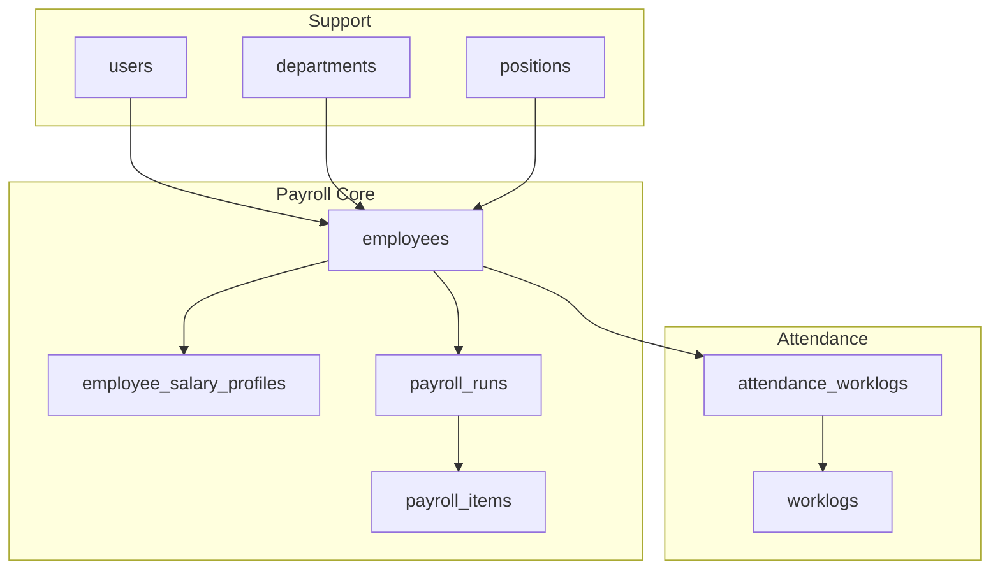
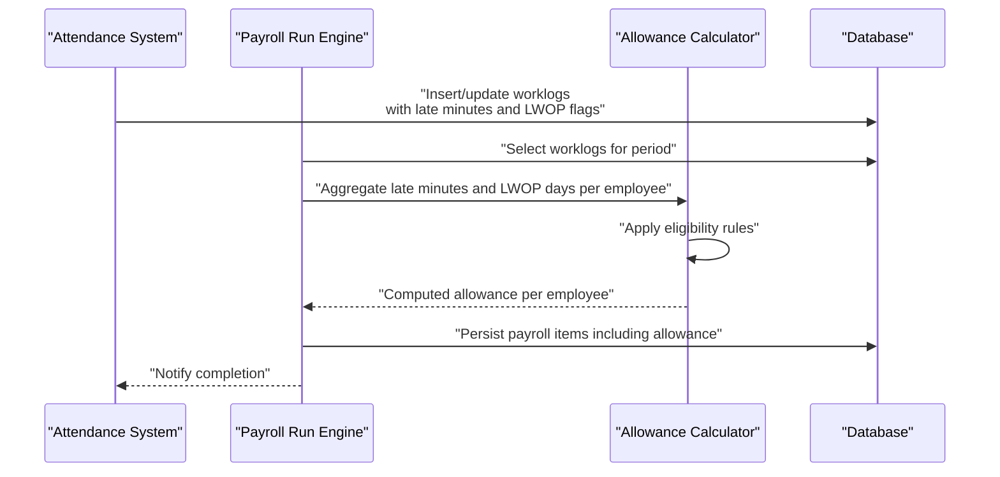
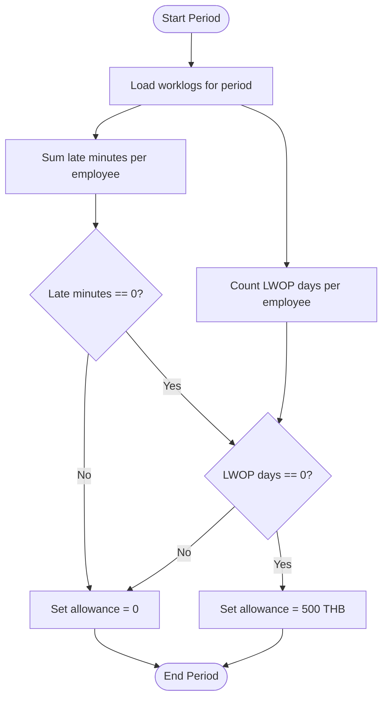
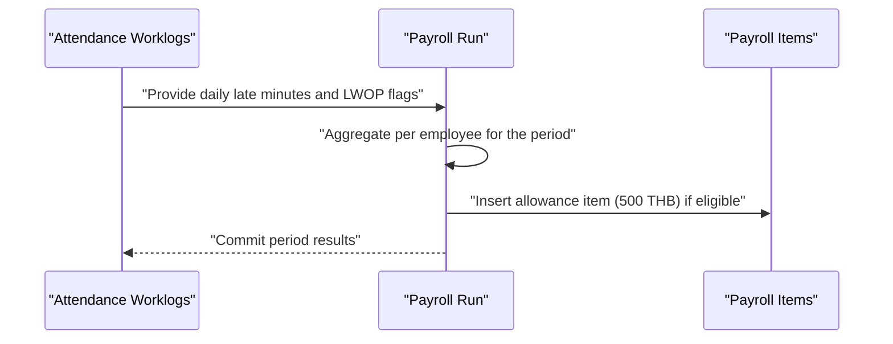
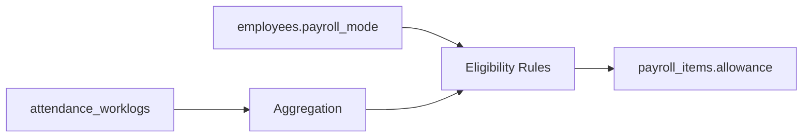

# Diligence Allowance System

<cite>
**Referenced Files in This Document**
- [0001_01_01_000005_create_employees_tables.php](file://database/migrations/0001_01_01_000005_create_employees_tables.php)
- [0001_01_01_000006_create_attendance_worklogs_tables.php](file://database/migrations/0001_01_01_000006_create_attendance_worklogs_tables.php)
- [0001_01_01_000007_create_payroll_tables.php](file://database/migrations/0001_01_01_000007_create_payroll_tables.php)
</cite>

## Table of Contents
1. [Introduction](#introduction)
2. [Project Structure](#project-structure)
3. [Core Components](#core-components)
4. [Architecture Overview](#architecture-overview)
5. [Detailed Component Analysis](#detailed-component-analysis)
6. [Dependency Analysis](#dependency-analysis)
7. [Performance Considerations](#performance-considerations)
8. [Troubleshooting Guide](#troubleshooting-guide)
9. [Conclusion](#conclusion)

## Introduction
This document describes the diligence allowance calculation system designed for monthly staff payroll. The system provides a default allowance amount when employees meet specific attendance criteria: zero late minutes and zero unpaid absence (LWOP) days during the pay period. It also documents configuration parameters, eligibility rules, and integration points with the attendance tracking system. Practical scenarios illustrate how the allowance interacts with other payroll components.

## Project Structure
The payroll and attendance system is built on a relational schema with dedicated tables for employees, attendance records, and payroll computations. The following diagram shows the high-level structure and relationships among core entities.

**Diagram sources**
- [0001_01_01_000005_create_employees_tables.php:11-80](file://database/migrations/0001_01_01_000005_create_employees_tables.php#L11-L80)
- [0001_01_01_000006_create_attendance_worklogs_tables.php](file://database/migrations/0001_01_01_000006_create_attendance_worklogs_tables.php)
- [0001_01_01_000007_create_payroll_tables.php](file://database/migrations/0001_01_01_000007_create_payroll_tables.php)

**Section sources**
- [0001_01_01_000005_create_employees_tables.php:11-80](file://database/migrations/0001_01_01_000005_create_employees_tables.php#L11-L80)
- [0001_01_01_000006_create_attendance_worklogs_tables.php](file://database/migrations/0001_01_01_000006_create_attendance_worklogs_tables.php)
- [0001_01_01_000007_create_payroll_tables.php](file://database/migrations/0001_01_01_000007_create_payroll_tables.php)

## Core Components
- Employees: Stores employee identifiers, payroll mode, department, position, and status. Monthly staff employees are eligible for the diligence allowance.
- Attendance Worklogs: Captures daily attendance records including late minutes and unpaid absence (LWOP) indicators.
- Payroll Runs: Represents a periodic payroll computation cycle.
- Payroll Items: Contains computed components such as base salary, allowances, deductions, and net pay per employee per run.

Eligibility criteria for the diligence allowance:
- Employee classification: monthly staff.
- Attendance criteria: zero late minutes and zero LWOP days within the payroll period.

Default allowance value:
- 500 THB when criteria are met.

Integration points:
- Attendance data feeds into payroll runs to compute eligibility and allowance amounts.
- Payroll items record the allowance as part of the total compensation.

**Section sources**
- [0001_01_01_000005_create_employees_tables.php:20-21](file://database/migrations/0001_01_01_000005_create_employees_tables.php#L20-L21)
- [0001_01_01_000006_create_attendance_worklogs_tables.php](file://database/migrations/0001_01_01_000006_create_attendance_worklogs_tables.php)
- [0001_01_01_000007_create_payroll_tables.php](file://database/migrations/0001_01_01_000007_create_payroll_tables.php)

## Architecture Overview
The diligence allowance system operates within a payroll computation pipeline that aggregates attendance metrics and applies eligibility rules to determine allowance amounts. The following sequence diagram illustrates the end-to-end flow from attendance capture to allowance inclusion in payroll items.

**Diagram sources**
- [0001_01_01_000006_create_attendance_worklogs_tables.php](file://database/migrations/0001_01_01_000006_create_attendance_worklogs_tables.php)
- [0001_01_01_000007_create_payroll_tables.php](file://database/migrations/0001_01_01_000007_create_payroll_tables.php)

## Detailed Component Analysis

### Eligibility Rules and Calculation Logic
The allowance is calculated per payroll period and depends on two factors:
- Late minutes: Sum of late arrivals recorded in worklogs for the period.
- LWOP days: Count of unpaid absence days recorded in worklogs for the period.

Eligibility conditions:
- Late minutes must equal zero.
- LWOP days must equal zero.

Default allowance:
- 500 THB when both conditions are satisfied.

Calculation flow:

**Diagram sources**
- [0001_01_01_000006_create_attendance_worklogs_tables.php](file://database/migrations/0001_01_01_000006_create_attendance_worklogs_tables.php)
- [0001_01_01_000007_create_payroll_tables.php](file://database/migrations/0001_01_01_000007_create_payroll_tables.php)

### Configuration Parameters
- Payroll mode: Employees must be classified as monthly staff to qualify for the allowance.
- Pay period boundary: Defines the window for aggregating late minutes and LWOP days.
- Allowance amount: Fixed 500 THB for qualifying employees.

**Section sources**
- [0001_01_01_000005_create_employees_tables.php:20-21](file://database/migrations/0001_01_01_000005_create_employees_tables.php#L20-L21)
- [0001_01_01_000007_create_payroll_tables.php](file://database/migrations/0001_01_01_000007_create_payroll_tables.php)

### Integration with Attendance Tracking
- Attendance worklogs capture daily late minutes and LWOP flags.
- Payroll engine queries worklogs within the pay period and aggregates counts per employee.
- Eligible employees receive the allowance in the payroll items table.

**Diagram sources**
- [0001_01_01_000006_create_attendance_worklogs_tables.php](file://database/migrations/0001_01_01_000006_create_attendance_worklogs_tables.php)
- [0001_01_01_000007_create_payroll_tables.php](file://database/migrations/0001_01_01_000007_create_payroll_tables.php)

### Practical Scenarios

Scenario A: Employee with zero late minutes and zero LWOP days
- Eligibility: Met.
- Allowance: 500 THB included in payroll items.

Scenario B: Employee with late minutes greater than zero
- Eligibility: Not met.
- Allowance: 0 THB.

Scenario C: Employee with LWOP days greater than zero
- Eligibility: Not met.
- Allowance: 0 THB.

Scenario D: Employee with both late minutes and LWOP days
- Eligibility: Not met.
- Allowance: 0 THB.

These scenarios demonstrate how the allowance interacts with other payroll components:
- Base salary remains unchanged.
- Allowance is additive to gross pay.
- Net pay reflects the allowance after applicable deductions.

**Section sources**
- [0001_01_01_000006_create_attendance_worklogs_tables.php](file://database/migrations/0001_01_01_000006_create_attendance_worklogs_tables.php)
- [0001_01_01_000007_create_payroll_tables.php](file://database/migrations/0001_01_01_000007_create_payroll_tables.php)

## Dependency Analysis
The diligence allowance system depends on:
- Employee payroll mode to determine eligibility.
- Attendance worklogs for late minutes and LWOP counts.
- Payroll runs to aggregate data and persist computed items.

**Diagram sources**
- [0001_01_01_000005_create_employees_tables.php:20-21](file://database/migrations/0001_01_01_000005_create_employees_tables.php#L20-L21)
- [0001_01_01_000006_create_attendance_worklogs_tables.php](file://database/migrations/0001_01_01_000006_create_attendance_worklogs_tables.php)
- [0001_01_01_000007_create_payroll_tables.php](file://database/migrations/0001_01_01_000007_create_payroll_tables.php)

**Section sources**
- [0001_01_01_000005_create_employees_tables.php:20-21](file://database/migrations/0001_01_01_000005_create_employees_tables.php#L20-L21)
- [0001_01_01_000006_create_attendance_worklogs_tables.php](file://database/migrations/0001_01_01_000006_create_attendance_worklogs_tables.php)
- [0001_01_01_000007_create_payroll_tables.php](file://database/migrations/0001_01_01_000007_create_payroll_tables.php)

## Performance Considerations
- Indexing: Ensure indexes exist on employee identifiers and date ranges in attendance worklogs to optimize aggregation queries.
- Batch processing: Aggregate worklogs per pay period to minimize repeated scans.
- Deduplication: Prevent double-counting by using distinct day-level entries per employee.

## Troubleshooting Guide
Common issues and resolutions:
- No allowance credited despite meeting criteria:
  - Verify payroll mode is set to monthly staff.
  - Confirm worklog entries include accurate late minutes and LWOP flags for the pay period.
- Incorrect allowance amount:
  - Review aggregation logic for late minutes and LWOP days.
  - Ensure the allowance value is consistently applied as 500 THB for qualifying employees.

**Section sources**
- [0001_01_01_000005_create_employees_tables.php:20-21](file://database/migrations/0001_01_01_000005_create_employees_tables.php#L20-L21)
- [0001_01_01_000006_create_attendance_worklogs_tables.php](file://database/migrations/0001_01_01_000006_create_attendance_worklogs_tables.php)
- [0001_01_01_000007_create_payroll_tables.php](file://database/migrations/0001_01_01_000007_create_payroll_tables.php)

## Conclusion
The diligence allowance system provides a straightforward mechanism to reward punctuality and regular attendance for monthly staff. By enforcing strict eligibility rules—zero late minutes and zero LWOP days—and applying a fixed allowance amount, the system integrates cleanly with payroll computations while remaining transparent and easy to audit.