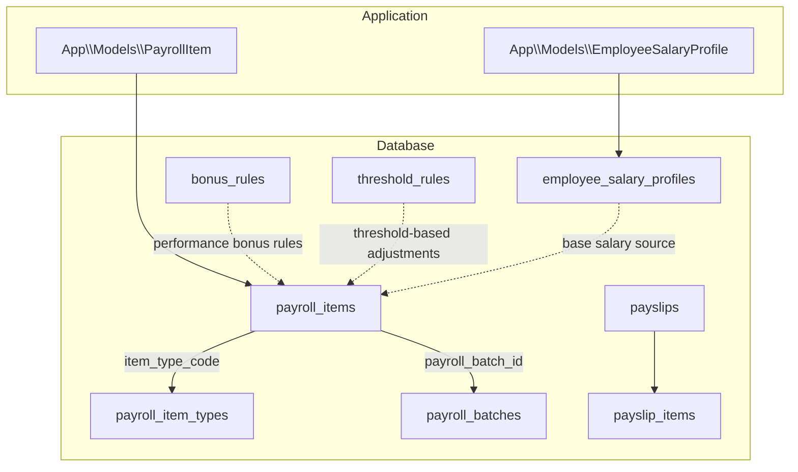
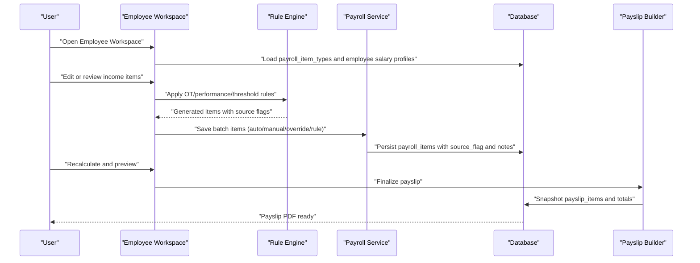
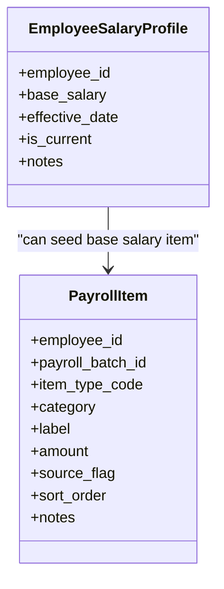
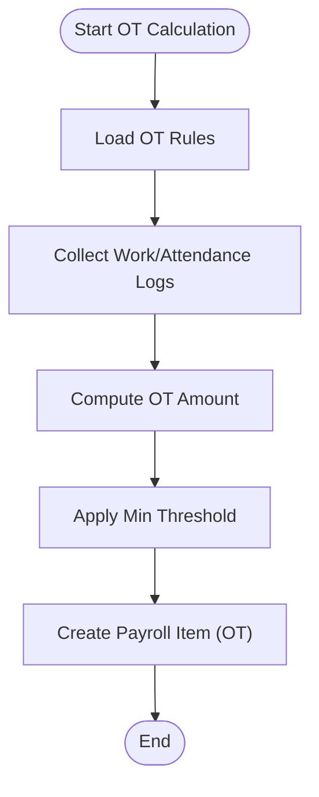
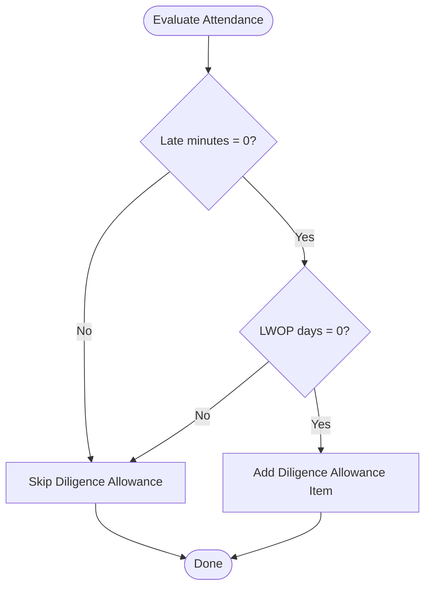
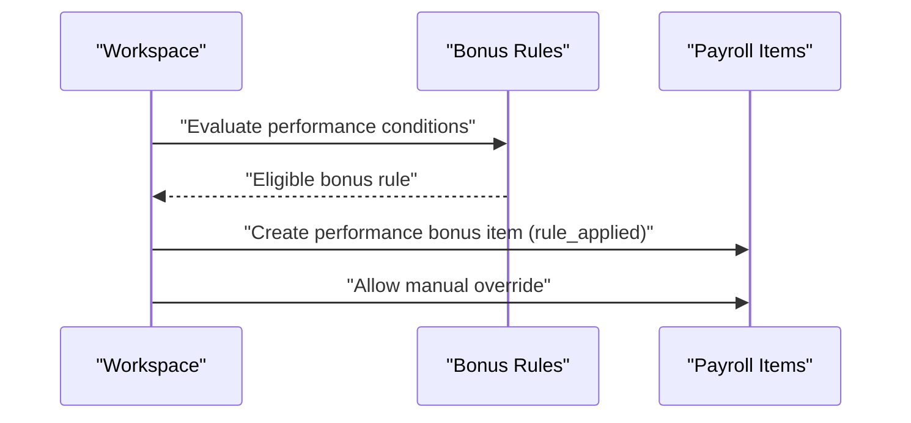
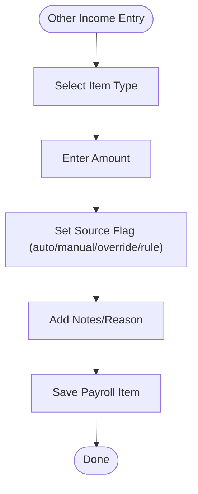
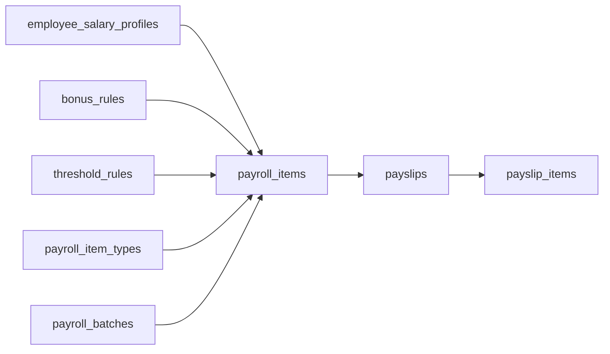

# Income Components Management

<cite>
**Referenced Files in This Document**
- [AGENTS.md](file://AGENTS.md)
- [0001_01_01_000007_create_payroll_tables.php](file://database/migrations/0001_01_01_000007_create_payroll_tables.php)
- [0001_01_01_000008_create_rules_config_tables.php](file://database/migrations/0001_01_01_000008_create_rules_config_tables.php)
- [0001_01_01_000009_create_payslips_tables.php](file://database/migrations/0001_01_01_000009_create_payslips_tables.php)
- [PayrollItem.php](file://app/Models/PayrollItem.php)
- [EmployeeSalaryProfile.php](file://app/Models/EmployeeSalaryProfile.php)
</cite>

## Table of Contents
1. [Introduction](#introduction)
2. [Project Structure](#project-structure)
3. [Core Components](#core-components)
4. [Architecture Overview](#architecture-overview)
5. [Detailed Component Analysis](#detailed-component-analysis)
6. [Dependency Analysis](#dependency-analysis)
7. [Performance Considerations](#performance-considerations)
8. [Troubleshooting Guide](#troubleshooting-guide)
9. [Conclusion](#conclusion)

## Introduction
This document explains how income components are managed in the monthly staff payroll system. It covers the five main income categories defined for monthly staff:
- Base salary
- Overtime pay
- Diligence allowance
- Performance bonus
- Other income

It details how each component is modeled, configured, calculated, and integrated into the total income computation. It also documents manual override capabilities, rule-based generation, and audit trail requirements for income adjustments.

## Project Structure
The payroll system is structured around database-first design with explicit separation of concerns:
- Data model and persistence are defined via Eloquent models and database migrations.
- Business rules and configurations are stored in dedicated configuration tables.
- Payroll items are persisted per employee and per payroll batch.
- Payslips capture the final computed snapshot of income and deductions.

**Diagram sources**
- [0001_01_01_000007_create_payroll_tables.php:11-51](file://database/migrations/0001_01_01_000007_create_payroll_tables.php#L11-L51)
- [0001_01_01_000008_create_rules_config_tables.php:37-58](file://database/migrations/0001_01_01_000008_create_rules_config_tables.php#L37-L58)
- [0001_01_01_000009_create_payslips_tables.php:33-43](file://database/migrations/0001_01_01_000009_create_payslips_tables.php#L33-L43)
- [PayrollItem.php:7-28](file://app/Models/PayrollItem.php#L7-L28)
- [EmployeeSalaryProfile.php:7-26](file://app/Models/EmployeeSalaryProfile.php#L7-L26)

**Section sources**
- [0001_01_01_000007_create_payroll_tables.php:11-51](file://database/migrations/0001_01_01_000007_create_payroll_tables.php#L11-L51)
- [0001_01_01_000008_create_rules_config_tables.php:37-58](file://database/migrations/0001_01_01_000008_create_rules_config_tables.php#L37-L58)
- [0001_01_01_000009_create_payslips_tables.php:33-43](file://database/migrations/0001_01_01_000009_create_payslips_tables.php#L33-L43)
- [PayrollItem.php:7-28](file://app/Models/PayrollItem.php#L7-L28)
- [EmployeeSalaryProfile.php:7-26](file://app/Models/EmployeeSalaryProfile.php#L7-L26)

## Core Components
This section maps each income component to its data model, configuration, and calculation pathway.

- Base salary
  - Source: Employee salary profile records.
  - Persistence: Stored as part of employee salary profiles and can be represented as a payroll item during a batch run.
  - Calculation: Typically a fixed amount per contract effective date; can be overridden per batch if needed.
  - Audit: Changes to effective salary profiles are tracked via audit logs.

- Overtime pay
  - Configuration: Governed by OT rules and thresholds.
  - Generation: Computed from attendance/work logs and applied as a payroll item with a source flag indicating rule application.
  - Overrides: Can be manually adjusted per employee per batch.

- Diligence allowance
  - Configuration: Configurable allowance amount with conditions (e.g., zero late minutes and zero LWOP days).
  - Generation: Applied automatically when conditions are met; otherwise excluded.
  - Overrides: Can be manually set or overridden per batch.

- Performance bonus
  - Configuration: Defined via bonus rules with condition types (e.g., performance metrics).
  - Generation: Automatically generated based on rule evaluation; can be reviewed and overridden.
  - Overrides: Manual override allowed per batch.

- Other income
  - Configuration: Managed via payroll item types and batch-specific entries.
  - Generation: Can be rule-derived or manually entered.
  - Overrides: Fully editable per batch with audit trail.

Integration into total income:
- Total income is the sum of all income items within a payroll batch for an employee.
- The system supports categorization (income vs deduction) and sorting order for consistent aggregation.

**Section sources**
- [AGENTS.md:440-444](file://AGENTS.md#L440-L444)
- [AGENTS.md:446-452](file://AGENTS.md#L446-L452)
- [AGENTS.md:454-460](file://AGENTS.md#L454-L460)
- [AGENTS.md:498-504](file://AGENTS.md#L498-L504)
- [0001_01_01_000007_create_payroll_tables.php:35-51](file://database/migrations/0001_01_01_000007_create_payroll_tables.php#L35-L51)

## Architecture Overview
The income component lifecycle spans data modeling, rule configuration, batch processing, and payslip finalization.

**Diagram sources**
- [0001_01_01_000007_create_payroll_tables.php:11-51](file://database/migrations/0001_01_01_000007_create_payroll_tables.php#L11-L51)
- [0001_01_01_000008_create_rules_config_tables.php:37-58](file://database/migrations/0001_01_01_000008_create_rules_config_tables.php#L37-L58)
- [0001_01_01_000009_create_payslips_tables.php:33-43](file://database/migrations/0001_01_01_000009_create_payslips_tables.php#L33-L43)
- [AGENTS.md:498-504](file://AGENTS.md#L498-L504)

## Detailed Component Analysis

### Base Salary
- Purpose: Represents the fixed monthly compensation tied to the employee’s current salary profile.
- Data model: Employee salary profile stores the base salary amount and effective date.
- Batch integration: During payroll run, base salary can be recorded as a payroll item with appropriate source flag and label.
- Override: Can be overridden per batch if needed; changes are audited.

**Diagram sources**
- [EmployeeSalaryProfile.php:7-26](file://app/Models/EmployeeSalaryProfile.php#L7-L26)
- [PayrollItem.php:7-28](file://app/Models/PayrollItem.php#L7-L28)

**Section sources**
- [EmployeeSalaryProfile.php:7-26](file://app/Models/EmployeeSalaryProfile.php#L7-L26)
- [0001_01_01_000007_create_payroll_tables.php:35-51](file://database/migrations/0001_01_01_000007_create_payroll_tables.php#L35-L51)

### Overtime Pay
- Purpose: Compensation for hours worked beyond normal working hours.
- Configuration: OT rules define calculation modes (by minute/hour), thresholds, and enable flags.
- Generation: Derived from attendance/work logs and applied as a payroll item with a rule-applied source flag.
- Override: Manual override permitted per batch.

**Diagram sources**
- [0001_01_01_000008_create_rules_config_tables.php:37-58](file://database/migrations/0001_01_01_000008_create_rules_config_tables.php#L37-L58)
- [0001_01_01_000007_create_payroll_tables.php:35-51](file://database/migrations/0001_01_01_000007_create_payroll_tables.php#L35-L51)

**Section sources**
- [AGENTS.md:454-460](file://AGENTS.md#L454-L460)
- [0001_01_01_000008_create_rules_config_tables.php:37-58](file://database/migrations/0001_01_01_000008_create_rules_config_tables.php#L37-L58)

### Diligence Allowance
- Purpose: Incentive paid when attendance criteria are met (e.g., no late minutes and no LWOP days).
- Configuration: Allowance amount and eligibility conditions are configurable.
- Generation: Automatically included when conditions are satisfied; otherwise excluded.
- Override: Can be manually set or overridden per batch.

**Diagram sources**
- [AGENTS.md:446-452](file://AGENTS.md#L446-L452)
- [0001_01_01_000007_create_payroll_tables.php:35-51](file://database/migrations/0001_01_01_000007_create_payroll_tables.php#L35-L51)

**Section sources**
- [AGENTS.md:446-452](file://AGENTS.md#L446-L452)

### Performance Bonus
- Purpose: Variable reward linked to performance metrics.
- Configuration: Bonus rules define condition types and amounts.
- Generation: Automatically generated based on evaluated conditions; can be reviewed and overridden.
- Override: Manual override supported per batch.

**Diagram sources**
- [0001_01_01_000008_create_rules_config_tables.php:37-58](file://database/migrations/0001_01_01_000008_create_rules_config_tables.php#L37-L58)
- [0001_01_01_000007_create_payroll_tables.php:35-51](file://database/migrations/0001_01_01_000007_create_payroll_tables.php#L35-L51)

**Section sources**
- [AGENTS.md:498-504](file://AGENTS.md#L498-L504)
- [0001_01_01_000008_create_rules_config_tables.php:37-58](file://database/migrations/0001_01_01_000008_create_rules_config_tables.php#L37-L58)

### Other Income
- Purpose: Miscellaneous income items not covered by the above categories.
- Configuration: Defined via payroll item types and batch-specific entries.
- Generation: Can be rule-derived or manually entered.
- Override: Fully editable per batch with notes and audit trail.

**Diagram sources**
- [0001_01_01_000007_create_payroll_tables.php:35-51](file://database/migrations/0001_01_01_000007_create_payroll_tables.php#L35-L51)

**Section sources**
- [0001_01_01_000007_create_payroll_tables.php:35-51](file://database/migrations/0001_01_01_000007_create_payroll_tables.php#L35-L51)

## Dependency Analysis
The following diagram shows how income components depend on configuration tables and are persisted as payroll items.

**Diagram sources**
- [0001_01_01_000007_create_payroll_tables.php:11-51](file://database/migrations/0001_01_01_000007_create_payroll_tables.php#L11-L51)
- [0001_01_01_000008_create_rules_config_tables.php:37-58](file://database/migrations/0001_01_01_000008_create_rules_config_tables.php#L37-L58)
- [0001_01_01_000009_create_payslips_tables.php:33-43](file://database/migrations/0001_01_01_000009_create_payslips_tables.php#L33-L43)

**Section sources**
- [0001_01_01_000007_create_payroll_tables.php:11-51](file://database/migrations/0001_01_01_000007_create_payroll_tables.php#L11-L51)
- [0001_01_01_000008_create_rules_config_tables.php:37-58](file://database/migrations/0001_01_01_000008_create_rules_config_tables.php#L37-L58)
- [0001_01_01_000009_create_payslips_tables.php:33-43](file://database/migrations/0001_01_01_000009_create_payslips_tables.php#L33-L43)

## Performance Considerations
- Prefer indexed queries on employee and payroll batch identifiers to speed up item retrieval and aggregation.
- Use batched writes for rule-generated items to minimize round trips.
- Cache frequently accessed configuration rules (e.g., bonus rules, threshold rules) to reduce repeated reads.
- Limit the number of recalculations by applying incremental updates when only specific items change.

## Troubleshooting Guide
Common issues and resolutions:
- Income item missing after rule application
  - Verify that the rule is active and conditions match the employee’s data.
  - Confirm the item type exists and is categorized as income.
- Incorrect total income
  - Check for conflicting overrides or duplicate items.
  - Ensure sort order and category are correct for aggregation.
- Audit discrepancies
  - Review audit logs for changes to salary profiles, rule configurations, and manual overrides.
  - Confirm that notes were added for overrides.

Audit requirements:
- Must log who changed what, old and new values, action, timestamp, and optional reason.
- High-priority audit areas include salary profile changes, payroll item amounts, and rule modifications.

**Section sources**
- [AGENTS.md:576-595](file://AGENTS.md#L576-L595)

## Conclusion
The income components management system separates data modeling, configuration, and batch processing to ensure transparency, flexibility, and auditability. Base salary, overtime pay, diligence allowance, performance bonus, and other income are each governed by clear rules and can be manually overridden when necessary. The system enforces a strict audit trail and supports dynamic UI behaviors for efficient payroll management.