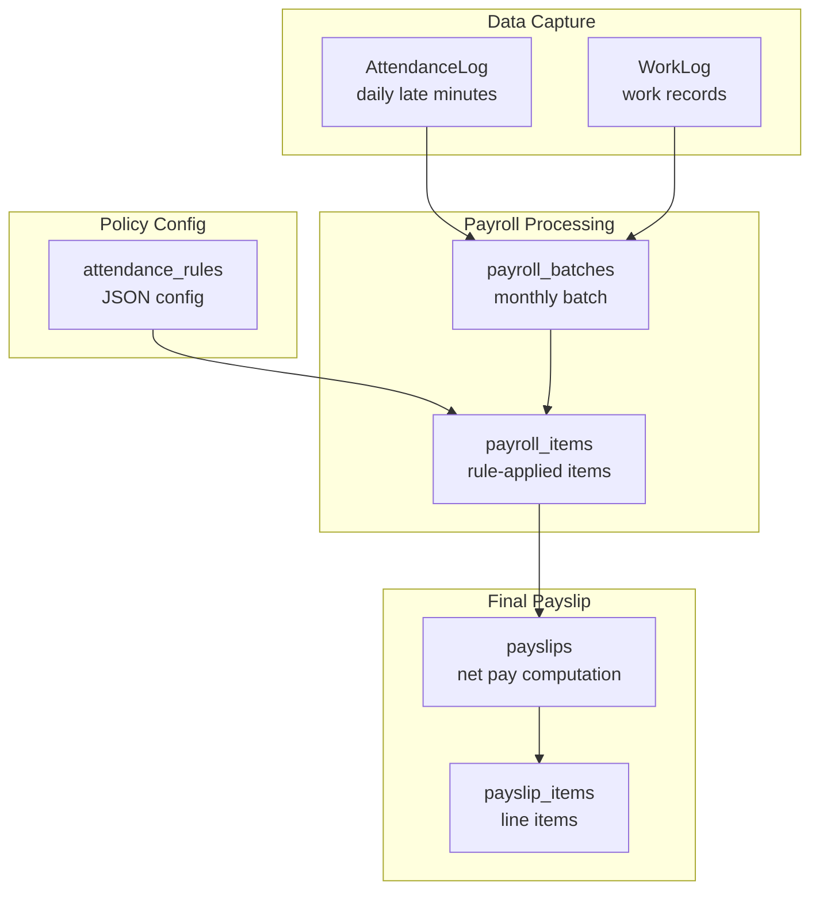
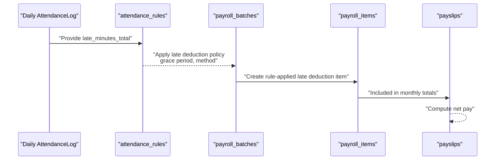
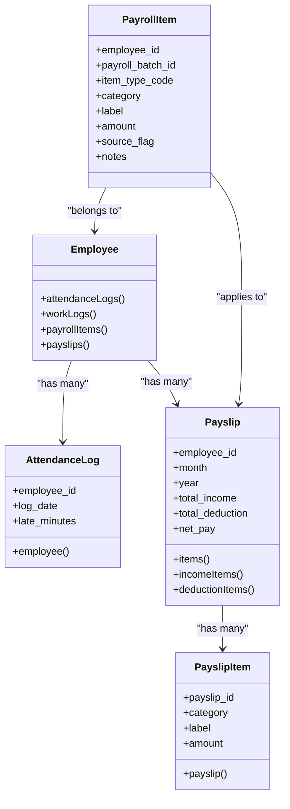
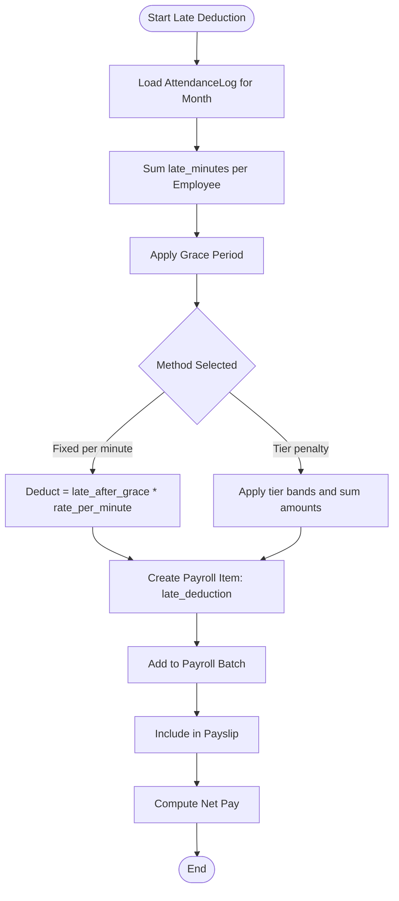
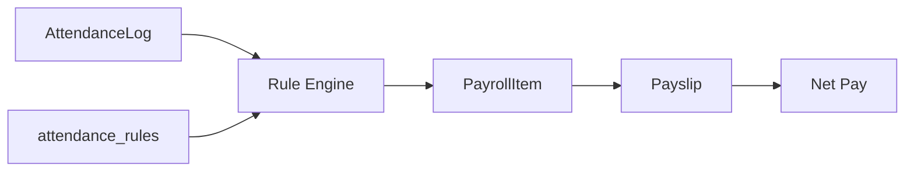

# Late Deduction System

<cite>
**Referenced Files in This Document**
- [AGENTS.md](file://AGENTS.md)
- [0001_01_01_000006_create_attendance_worklogs_tables.php](file://database/migrations/0001_01_01_000006_create_attendance_worklogs_tables.php)
- [0001_01_01_000007_create_payroll_tables.php](file://database/migrations/0001_01_01_000007_create_payroll_tables.php)
- [0001_01_01_000008_create_rules_config_tables.php](file://database/migrations/0001_01_01_000008_create_rules_config_tables.php)
- [0001_01_01_000009_create_payslips_tables.php](file://database/migrations/0001_01_01_000009_create_payslips_tables.php)
- [AttendanceLog.php](file://app/Models/AttendanceLog.php)
- [Payslip.php](file://app/Models/Payslip.php)
- [PayrollItem.php](file://app/Models/PayrollItem.php)
- [Employee.php](file://app/Models/Employee.php)
</cite>

## Table of Contents
1. [Introduction](#introduction)
2. [Project Structure](#project-structure)
3. [Core Components](#core-components)
4. [Architecture Overview](#architecture-overview)
5. [Detailed Component Analysis](#detailed-component-analysis)
6. [Dependency Analysis](#dependency-analysis)
7. [Performance Considerations](#performance-considerations)
8. [Troubleshooting Guide](#troubleshooting-guide)
9. [Conclusion](#conclusion)

## Introduction
This document describes the monthly staff late deduction calculation system. It explains the two supported deduction methods—fixed per minute and tier penalty—and how they integrate with attendance tracking and payroll generation. It covers grace period configurations, deduction thresholds, and progressive penalty calculations. Practical examples illustrate how different late-minute scenarios apply penalties and impact net pay. Policy compliance is addressed via configurable rules and audit-ready payroll items.

## Project Structure
The late deduction system spans database tables, models, and payroll/payslip generation. The relevant components include:
- Attendance logging and work logs for capturing daily lateness
- Rule configuration for late deduction policies
- Payroll batching and itemization for applying and recording deductions
- Payslips for finalizing income, deductions, and net pay

**Diagram sources**
- [0001_01_01_000006_create_attendance_worklogs_tables.php:11-29](file://database/migrations/0001_01_01_000006_create_attendance_worklogs_tables.php#L11-L29)
- [0001_01_01_000007_create_payroll_tables.php:22-51](file://database/migrations/0001_01_01_000007_create_payroll_tables.php#L22-L51)
- [0001_01_01_000008_create_rules_config_tables.php:71-78](file://database/migrations/0001_01_01_000008_create_rules_config_tables.php#L71-L78)
- [0001_01_01_000009_create_payslips_tables.php:11-31](file://database/migrations/0001_01_01_000009_create_payslips_tables.php#L11-L31)

**Section sources**
- [0001_01_01_000006_create_attendance_worklogs_tables.php:1-69](file://database/migrations/0001_01_01_000006_create_attendance_worklogs_tables.php#L1-L69)
- [0001_01_01_000007_create_payroll_tables.php:1-60](file://database/migrations/0001_01_01_000007_create_payroll_tables.php#L1-L60)
- [0001_01_01_000008_create_rules_config_tables.php:1-103](file://database/migrations/0001_01_01_000008_create_rules_config_tables.php#L1-L103)
- [0001_01_01_000009_create_payslips_tables.php:1-51](file://database/migrations/0001_01_01_000009_create_payslips_tables.php#L1-L51)

## Core Components
- AttendanceLog captures daily check-in/out and computed late minutes per day. These drive the late deduction calculation.
- attendance_rules stores policy configurations for late deduction, including grace period and method selection (fixed per minute vs tier penalty).
- Payroll batching aggregates employee records for a month and applies rule-generated items such as late deduction.
- Payslips consolidate income and deductions and compute net pay.

Key integration points:
- Late minutes from AttendanceLog feed into the late deduction rule engine.
- The rule engine writes a late deduction item into payroll_items with a source flag indicating rule application.
- Payslips sum income and deductions to produce net pay.

**Section sources**
- [AGENTS.md:440-466](file://AGENTS.md#L440-L466)
- [0001_01_01_000006_create_attendance_worklogs_tables.php:11-29](file://database/migrations/0001_01_01_000006_create_attendance_worklogs_tables.php#L11-L29)
- [0001_01_01_000008_create_rules_config_tables.php:71-78](file://database/migrations/0001_01_01_000008_create_rules_config_tables.php#L71-L78)
- [0001_01_01_000007_create_payroll_tables.php:35-51](file://database/migrations/0001_01_01_000007_create_payroll_tables.php#L35-L51)
- [0001_01_01_000009_create_payslips_tables.php:11-31](file://database/migrations/0001_01_01_000009_create_payslips_tables.php#L11-L31)

## Architecture Overview
The late deduction pipeline transforms daily attendance into a monthly payroll deduction through configurable rules.

**Diagram sources**
- [0001_01_01_000006_create_attendance_worklogs_tables.php:11-29](file://database/migrations/0001_01_01_000006_create_attendance_worklogs_tables.php#L11-L29)
- [0001_01_01_000008_create_rules_config_tables.php:71-78](file://database/migrations/0001_01_01_000008_create_rules_config_tables.php#L71-L78)
- [0001_01_01_000007_create_payroll_tables.php:35-51](file://database/migrations/0001_01_01_000007_create_payroll_tables.php#L35-L51)
- [0001_01_01_000009_create_payslips_tables.php:11-31](file://database/migrations/0001_01_01_000009_create_payslips_tables.php#L11-L31)

## Detailed Component Analysis

### Late Deduction Methods
Two methods are supported:
- Fixed per minute: A constant rate applied to total late minutes after grace period.
- Tier penalty: Progressive rates applied across bands of late minutes (for example, first N minutes at one rate, next band at another, and so on).

Grace period configuration:
- A grace period setting allows the first K minutes of lateness to be ignored when computing deductions.

Deduction thresholds:
- Threshold rules can trigger additional actions based on counts such as late_count, complementing the late deduction logic.

Integration with attendance tracking:
- Late minutes are captured daily in AttendanceLog and aggregated per month for deduction computation.

Policy compliance:
- Rules are stored as JSON in attendance_rules with effective_date and is_active flags to support audits and retroactive changes.

**Section sources**
- [AGENTS.md:461-466](file://AGENTS.md#L461-L466)
- [0001_01_01_000008_create_rules_config_tables.php:71-78](file://database/migrations/0001_01_01_000008_create_rules_config_tables.php#L71-L78)
- [0001_01_01_000007_create_payroll_tables.php:48-58](file://database/migrations/0001_01_01_000007_create_payroll_tables.php#L48-L58)

### Data Models and Relationships

**Diagram sources**
- [Employee.php:77-110](file://app/Models/Employee.php#L77-L110)
- [AttendanceLog.php:9-26](file://app/Models/AttendanceLog.php#L9-L26)
- [Payslip.php:9-56](file://app/Models/Payslip.php#L9-L56)
- [PayrollItem.php:9-27](file://app/Models/PayrollItem.php#L9-L27)

**Section sources**
- [Employee.php:77-110](file://app/Models/Employee.php#L77-L110)
- [AttendanceLog.php:9-26](file://app/Models/AttendanceLog.php#L9-L26)
- [Payslip.php:9-56](file://app/Models/Payslip.php#L9-L56)
- [PayrollItem.php:9-27](file://app/Models/PayrollItem.php#L9-L27)

### Calculation Logic Flow

**Diagram sources**
- [0001_01_01_000006_create_attendance_worklogs_tables.php:11-29](file://database/migrations/0001_01_01_000006_create_attendance_worklogs_tables.php#L11-L29)
- [0001_01_01_000008_create_rules_config_tables.php:71-78](file://database/migrations/0001_01_01_000008_create_rules_config_tables.php#L71-L78)
- [0001_01_01_000007_create_payroll_tables.php:35-51](file://database/migrations/0001_01_01_000007_create_payroll_tables.php#L35-L51)
- [0001_01_01_000009_create_payslips_tables.php:11-31](file://database/migrations/0001_01_01_000009_create_payslips_tables.php#L11-L31)

### Practical Examples

Example 1: Fixed per minute deduction
- Scenario: Employee has 45 late minutes in a month; grace period is 10 minutes; rate is fixed at a configured amount per minute.
- Computation: Deductable minutes = 45 − 10 = 35. Deduction = 35 × rate_per_minute.
- Impact: A single late deduction item is added to payroll_items and reflected in the employee’s payslip.

Example 2: Tier penalty structure
- Scenario: Employee has 65 late minutes; grace period is 15 minutes; tiers:
  - First 20 minutes at rate A
  - Next 30 minutes at rate B
  - Remaining at rate C
- Computation: Deductable minutes = 65 − 15 = 50. Apply tier bands and sum amounts.
- Impact: One late deduction item is generated and included in payslip totals.

Example 3: No deduction due to grace period
- Scenario: Employee has 8 late minutes; grace period is 10 minutes.
- Computation: Deductable minutes = 8 − 10 = 0.
- Impact: No late deduction item is created.

Example 4: Impact on net pay
- Scenario: Base income is 30,000; total other deductions are 2,000; late deduction is 350.
- Net pay = income − (other deductions + late deduction) = 30,000 − (2,000 + 350).

Note: These examples illustrate the mechanics; actual amounts depend on configured rates and tiers.

**Section sources**
- [AGENTS.md:440-466](file://AGENTS.md#L440-L466)
- [0001_01_01_000006_create_attendance_worklogs_tables.php:11-29](file://database/migrations/0001_01_01_000006_create_attendance_worklogs_tables.php#L11-L29)
- [0001_01_01_000007_create_payroll_tables.php:35-51](file://database/migrations/0001_01_01_000007_create_payroll_tables.php#L35-L51)
- [0001_01_01_000009_create_payslips_tables.php:11-31](file://database/migrations/0001_01_01_000009_create_payslips_tables.php#L11-L31)

## Dependency Analysis
- AttendanceLog depends on Employee and contributes late_minutes used by the rule engine.
- PayrollItem depends on Employee and PayrollBatch; it carries the late deduction item with a source flag indicating rule application.
- Payslip depends on PayslipItem and computes net pay from income and deductions.
- attendance_rules provides the policy configuration consumed by the rule engine.

**Diagram sources**
- [0001_01_01_000006_create_attendance_worklogs_tables.php:11-29](file://database/migrations/0001_01_01_000006_create_attendance_worklogs_tables.php#L11-L29)
- [0001_01_01_000007_create_payroll_tables.php:35-51](file://database/migrations/0001_01_01_000007_create_payroll_tables.php#L35-L51)
- [0001_01_01_000009_create_payslips_tables.php:11-31](file://database/migrations/0001_01_01_000009_create_payslips_tables.php#L11-L31)
- [0001_01_01_000008_create_rules_config_tables.php:71-78](file://database/migrations/0001_01_01_000008_create_rules_config_tables.php#L71-L78)

**Section sources**
- [0001_01_01_000006_create_attendance_worklogs_tables.php:11-29](file://database/migrations/0001_01_01_000006_create_attendance_worklogs_tables.php#L11-L29)
- [0001_01_01_000007_create_payroll_tables.php:35-51](file://database/migrations/0001_01_01_000007_create_payroll_tables.php#L35-L51)
- [0001_01_01_000009_create_payslips_tables.php:11-31](file://database/migrations/0001_01_01_000009_create_payslips_tables.php#L11-L31)
- [0001_01_01_000008_create_rules_config_tables.php:71-78](file://database/migrations/0001_01_01_000008_create_rules_config_tables.php#L71-L78)

## Performance Considerations
- Indexes on employee_id and log_date in AttendanceLog optimize monthly aggregation.
- Effective-date-based rule selection ensures minimal runtime branching.
- Batch processing consolidates rule application to reduce per-employee overhead.
- JSON-based rule configs allow flexibility without complex joins.

## Troubleshooting Guide
Common issues and resolutions:
- No late deduction appears on payslip:
  - Verify attendance_rules contains an active late deduction rule for the effective date range.
  - Confirm AttendanceLog entries exist for the target month and employee.
  - Ensure payroll batch includes the employee and that the late deduction item was created with a rule-applied source flag.
- Incorrect deduction amount:
  - Check grace period configuration and selected method (fixed vs tier).
  - Validate tier bands and rates in the rule config.
  - Recompute payroll items for the affected month.
- Net pay differs from expectations:
  - Review other deduction items and income adjustments.
  - Confirm threshold rules did not add or remove items unexpectedly.

**Section sources**
- [0001_01_01_000008_create_rules_config_tables.php:71-78](file://database/migrations/0001_01_01_000008_create_rules_config_tables.php#L71-L78)
- [0001_01_01_000006_create_attendance_worklogs_tables.php:11-29](file://database/migrations/0001_01_01_000006_create_attendance_worklogs_tables.php#L11-L29)
- [0001_01_01_000007_create_payroll_tables.php:35-51](file://database/migrations/0001_01_01_000007_create_payroll_tables.php#L35-L51)
- [0001_01_01_000009_create_payslips_tables.php:11-31](file://database/migrations/0001_01_01_000009_create_payslips_tables.php#L11-L31)

## Conclusion
The late deduction system supports configurable methods and grace periods, integrates tightly with attendance logs, and applies deductions through rule-driven payroll items recorded on payslips. By leveraging attendance_rules and monthly payroll batches, the system ensures policy compliance and transparent net pay computation.