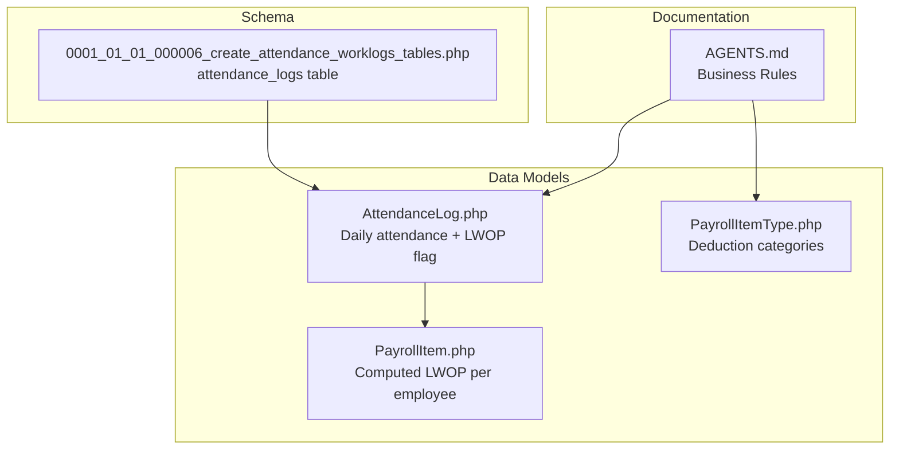
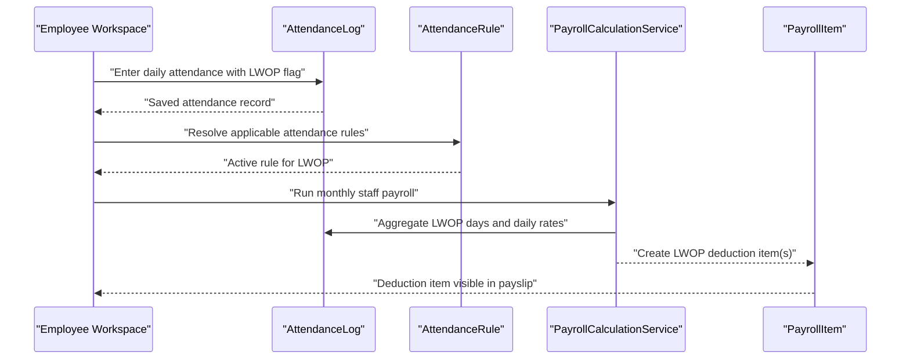
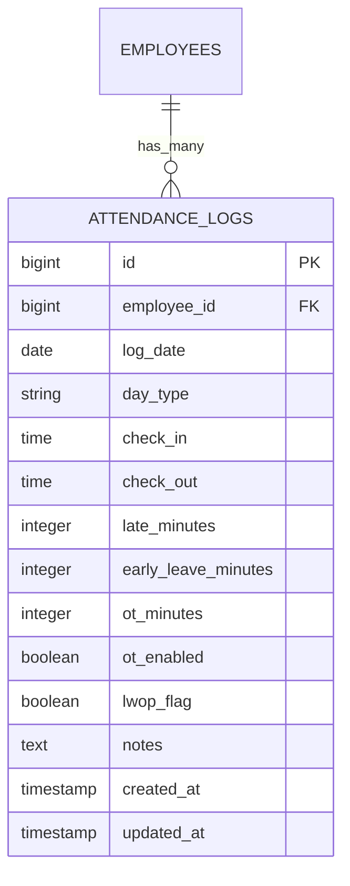
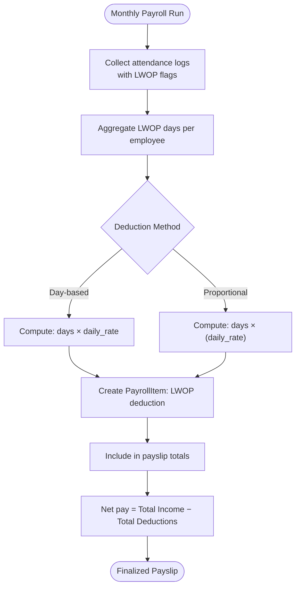
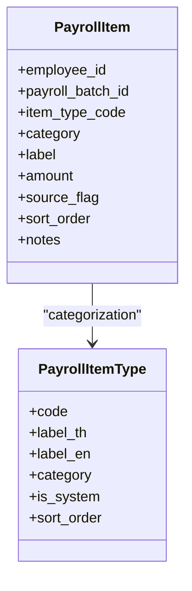
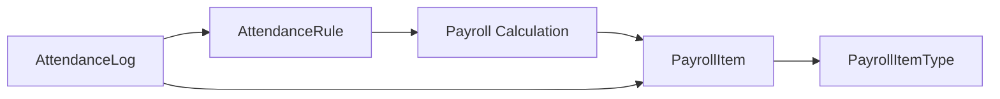

# Leave Without Pay Deduction

<cite>
**Referenced Files in This Document**
- [AGENTS.md](file://AGENTS.md)
- [AttendanceLog.php](file://app/Models/AttendanceLog.php)
- [0001_01_01_000006_create_attendance_worklogs_tables.php](file://database/migrations/0001_01_01_000006_create_attendance_worklogs_tables.php)
- [AttendanceRule.php](file://app/Models/AttendanceRule.php)
- [PayrollItem.php](file://app/Models/PayrollItem.php)
- [PayrollItemType.php](file://app/Models/PayrollItemType.php)
</cite>

## Table of Contents
1. [Introduction](#introduction)
2. [Project Structure](#project-structure)
3. [Core Components](#core-components)
4. [Architecture Overview](#architecture-overview)
5. [Detailed Component Analysis](#detailed-component-analysis)
6. [Dependency Analysis](#dependency-analysis)
7. [Performance Considerations](#performance-considerations)
8. [Troubleshooting Guide](#troubleshooting-guide)
9. [Conclusion](#conclusion)
10. [Appendices](#appendices)

## Introduction
This document describes the Leave Without Pay (LWOP) deduction system for monthly staff payroll. It covers the two supported deduction methods—day-based deductions and proportional salary deductions—and explains how LWOP is tracked via attendance logs and integrated into the payroll calculation pipeline. Practical examples illustrate how different LWOP scenarios affect monthly net pay, along with policy compliance and documentation requirements derived from the repository’s business rules and schema.

## Project Structure
The LWOP system spans several core areas:
- Business rules and supported deduction methods are documented in the project guide.
- Attendance logging captures daily records including LWOP flags.
- Payroll item types define LWOP as a formal deduction category.
- Payroll items store computed LWOP amounts per employee per batch.

**Diagram sources**
- [AGENTS.md](file://AGENTS.md)
- [AttendanceLog.php](file://app/Models/AttendanceLog.php)
- [PayrollItemType.php](file://app/Models/PayrollItemType.php)
- [PayrollItem.php](file://app/Models/PayrollItem.php)
- [0001_01_01_000006_create_attendance_worklogs_tables.php](file://database/migrations/0001_01_01_000006_create_attendance_worklogs_tables.php)

**Section sources**
- [AGENTS.md](file://AGENTS.md)
- [0001_01_01_000006_create_attendance_worklogs_tables.php](file://database/migrations/0001_01_01_000006_create_attendance_worklogs_tables.php)

## Core Components
- LWOP deduction methods: The system supports day-based deduction and proportional salary deduction.
- Attendance integration: LWOP is recorded per day in attendance logs with a dedicated flag.
- Payroll itemization: LWOP appears as a formal deduction item with a source flag and categorization.
- Net pay computation: LWOP reduces total deduction, thereby lowering net pay.

Key implementation anchors:
- Supported deduction methods are declared in the business rules.
- Attendance logs include a boolean LWOP flag and a unique constraint per employee-day.
- Payroll item types define deduction categories; LWOP is modeled as a distinct item.
- Payroll items store computed amounts and source metadata.

**Section sources**
- [AGENTS.md](file://AGENTS.md)
- [AttendanceLog.php](file://app/Models/AttendanceLog.php)
- [PayrollItemType.php](file://app/Models/PayrollItemType.php)
- [PayrollItem.php](file://app/Models/PayrollItem.php)

## Architecture Overview
The LWOP deduction pipeline integrates attendance data with payroll calculation and itemization.

**Diagram sources**
- [AGENTS.md](file://AGENTS.md)
- [AttendanceLog.php](file://app/Models/AttendanceLog.php)
- [AttendanceRule.php](file://app/Models/AttendanceRule.php)
- [PayrollItem.php](file://app/Models/PayrollItem.php)

## Detailed Component Analysis

### LWOP Deduction Methods
Two methods are supported:
- Day-based deduction: A fixed daily amount is deducted for each LWOP day.
- Proportional salary deduction: The deduction equals the daily rate multiplied by the number of LWOP days.

These methods are declared in the business rules and applied during monthly staff payroll calculation.

**Section sources**
- [AGENTS.md](file://AGENTS.md)

### Attendance Logging and LWOP Tracking
Each day’s attendance record includes:
- Employee identifier
- Date
- Boolean LWOP flag
- Optional notes

The schema enforces:
- Unique attendance record per employee per date.
- Index on log_date for efficient aggregation.
- Optional check-in/check-out fields for working time computation.

**Diagram sources**
- [0001_01_01_000006_create_attendance_worklogs_tables.php](file://database/migrations/0001_01_01_000006_create_attendance_worklogs_tables.php)

**Section sources**
- [0001_01_01_000006_create_attendance_worklogs_tables.php](file://database/migrations/0001_01_01_000006_create_attendance_worklogs_tables.php)
- [AttendanceLog.php](file://app/Models/AttendanceLog.php)

### Payroll Itemization and Net Pay Impact
LWOP is represented as a payroll item:
- Categorized as a deduction.
- Amount computed from attendance aggregation.
- Source flag indicates whether it was rule-generated or manually overridden.
- Sort order ensures consistent presentation on the payslip.

Net pay is computed as total income minus total deductions, including LWOP.

**Diagram sources**
- [AGENTS.md](file://AGENTS.md)
- [PayrollItem.php](file://app/Models/PayrollItem.php)

**Section sources**
- [AGENTS.md](file://AGENTS.md)
- [PayrollItem.php](file://app/Models/PayrollItem.php)

### Practical Scenarios and Examples
Below are scenario outlines illustrating how LWOP affects net pay. These examples reflect the documented deduction methods and net pay formula.

- Scenario A: Day-based deduction
  - Employee has 3 LWOP days in the month.
  - Daily deduction amount is set by rule.
  - Net pay decreases by 3 × daily_rate.

- Scenario B: Proportional salary deduction
  - Employee has 2 LWOP days.
  - Daily rate equals monthly salary divided by number of working days.
  - Net pay decreases by 2 × daily_rate.

- Scenario C: Mixed days
  - Employee has 1 full LWOP day and 0.5 LWOP day.
  - If partial days are supported, compute prorated deduction accordingly.

- Scenario D: No LWOP days
  - Net pay remains unaffected by LWOP deduction.

Note: The exact daily rate and method selection are governed by active attendance rules and payroll configuration.

**Section sources**
- [AGENTS.md](file://AGENTS.md)

### Policy Compliance and Documentation Requirements
- Rule-driven configuration: LWOP methods and rates must be configurable via rules, not hardcoded.
- Audit trail: Every change to LWOP configuration or manual overrides must be logged.
- Source flags: All LWOP items must carry a source flag indicating whether they are master, monthly override, manual, or rule-generated.
- Snapshot rule: Payslips are finalized snapshots; LWOP items included in the final payslip must be immutable.

**Diagram sources**
- [PayrollItem.php](file://app/Models/PayrollItem.php)
- [PayrollItemType.php](file://app/Models/PayrollItemType.php)

**Section sources**
- [AGENTS.md](file://AGENTS.md)
- [PayrollItem.php](file://app/Models/PayrollItem.php)
- [PayrollItemType.php](file://app/Models/PayrollItemType.php)

## Dependency Analysis
The LWOP system depends on:
- Attendance logs for daily LWOP flags.
- Active attendance rules to select the appropriate deduction method and daily rate.
- Payroll item types to classify LWOP as a deduction.
- Payroll items to persist computed amounts with source metadata.

**Diagram sources**
- [AttendanceLog.php](file://app/Models/AttendanceLog.php)
- [AttendanceRule.php](file://app/Models/AttendanceRule.php)
- [PayrollItem.php](file://app/Models/PayrollItem.php)
- [PayrollItemType.php](file://app/Models/PayrollItemType.php)

**Section sources**
- [AttendanceLog.php](file://app/Models/AttendanceLog.php)
- [AttendanceRule.php](file://app/Models/AttendanceRule.php)
- [PayrollItem.php](file://app/Models/PayrollItem.php)
- [PayrollItemType.php](file://app/Models/PayrollItemType.php)

## Performance Considerations
- Indexes: The attendance_logs table includes an index on log_date and a unique constraint on (employee_id, log_date). These support efficient aggregation and prevent duplicate entries.
- Aggregation: Monthly LWOP aggregation should leverage indexed date ranges and employee filters to minimize query cost.
- Computation: Prefer precomputed daily rates where possible to avoid repeated recalculations.

**Section sources**
- [0001_01_01_000006_create_attendance_worklogs_tables.php](file://database/migrations/0001_01_01_000006_create_attendance_worklogs_tables.php)

## Troubleshooting Guide
Common issues and resolutions:
- Duplicate attendance records for the same employee-date:
  - Cause: Missing unique constraint or duplicate entry.
  - Resolution: Enforce unique constraint and deduplicate data.

- LWOP flag not recognized:
  - Cause: Incorrect day_type or missing lwop_flag.
  - Resolution: Verify attendance record fields and ensure lwop_flag is set.

- LWOP amount mismatch:
  - Cause: Wrong daily rate or method misconfiguration.
  - Resolution: Review active attendance rules and confirm selected deduction method.

- Payslip discrepancies:
  - Cause: Missing or incorrect source flag on LWOP item.
  - Resolution: Re-run payroll to regenerate items and verify source flags.

**Section sources**
- [0001_01_01_000006_create_attendance_worklogs_tables.php](file://database/migrations/0001_01_01_000006_create_attendance_worklogs_tables.php)
- [AGENTS.md](file://AGENTS.md)

## Conclusion
The LWOP deduction system integrates attendance logging with configurable payroll rules to compute either a fixed daily deduction or a proportional amount based on the employee’s daily rate. By modeling LWOP as a formal payroll item with source flags and auditability, the system ensures compliance, transparency, and accurate net pay computation.

## Appendices
- Appendix A: Net Pay Formula
  - Total income includes base salary, overtime pay, diligence allowance, performance bonus, and other income.
  - Total deduction includes cash advance, late deduction, LWOP deduction, social security employee portion, and other deductions.
  - Net pay equals total income minus total deductions.

- Appendix B: LWOP Item Attributes
  - item_type_code: identifies LWOP category.
  - amount: computed deduction amount.
  - source_flag: master, monthly override, manual, or rule-generated.
  - sort_order: controls presentation on the payslip.

**Section sources**
- [AGENTS.md](file://AGENTS.md)
- [PayrollItem.php](file://app/Models/PayrollItem.php)