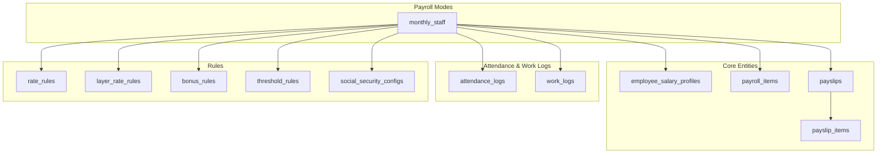
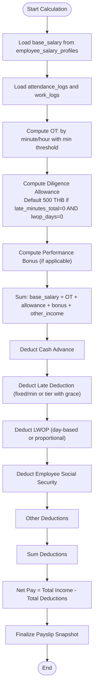
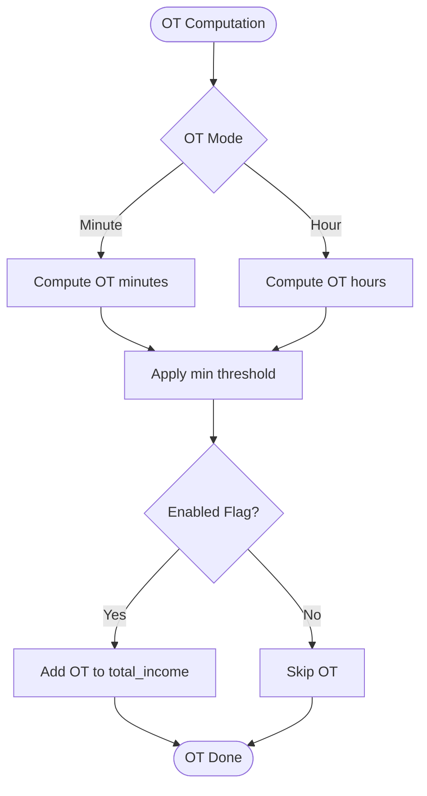
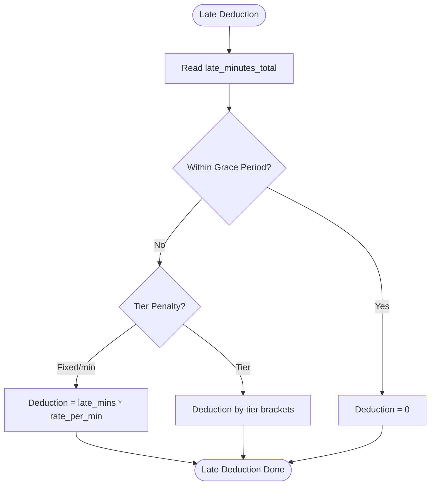
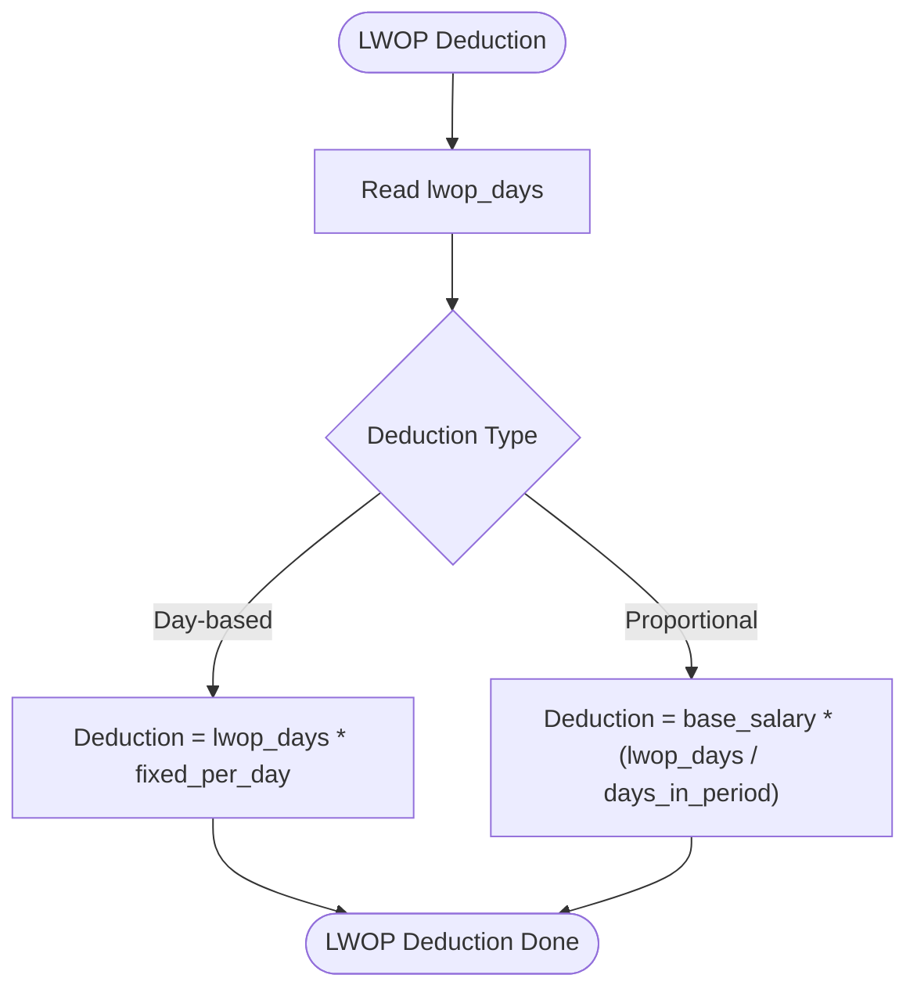
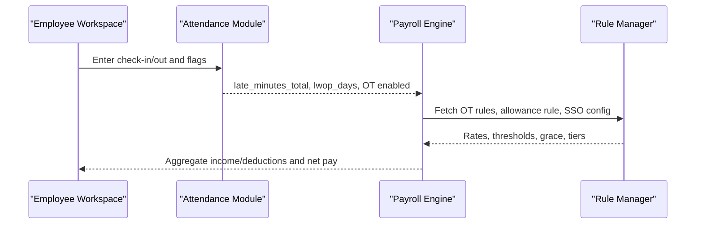
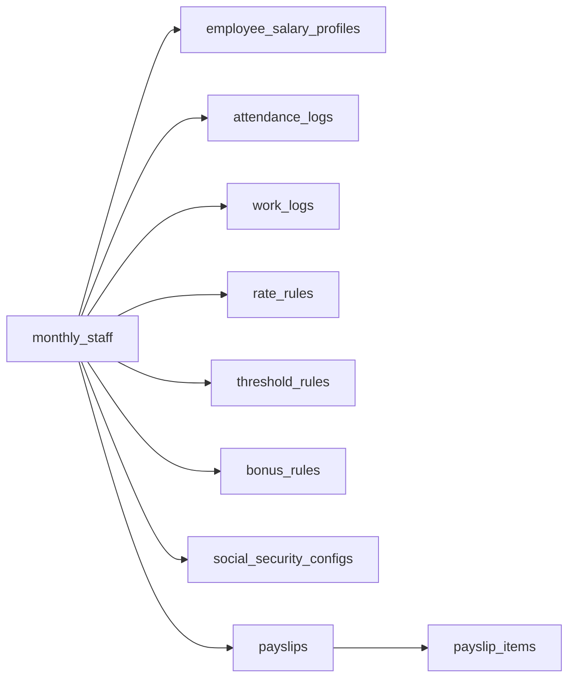

# Monthly Staff Payroll

<cite>
**Referenced Files in This Document**
- [AGENTS.md](file://AGENTS.md)
</cite>

## Table of Contents
1. [Introduction](#introduction)
2. [Project Structure](#project-structure)
3. [Core Components](#core-components)
4. [Architecture Overview](#architecture-overview)
5. [Detailed Component Analysis](#detailed-component-analysis)
6. [Dependency Analysis](#dependency-analysis)
7. [Performance Considerations](#performance-considerations)
8. [Troubleshooting Guide](#troubleshooting-guide)
9. [Conclusion](#conclusion)
10. [Appendices](#appendices)

## Introduction
This document describes the Monthly Staff Payroll mode calculation system for the HR/payroll platform. It consolidates the calculation formula, allowance rules, OT computation, late deduction structures, LWOP deduction options, and integration points with the attendance tracking system. The goal is to provide a clear, rule-driven specification that supports dynamic configuration and auditability.

## Project Structure
The repository defines a comprehensive domain model and module set for payroll, including:
- Payroll modes and calculation engines
- Attendance and work logging
- Rule management for OT, allowances, bonuses, thresholds, and social security
- Payslip generation and audit logging

**Diagram sources**
- [AGENTS.md:123-149](file://AGENTS.md#L123-L149)
- [AGENTS.md:387-416](file://AGENTS.md#L387-L416)
- [AGENTS.md:438-444](file://AGENTS.md#L438-L444)

**Section sources**
- [AGENTS.md:123-149](file://AGENTS.md#L123-L149)
- [AGENTS.md:387-416](file://AGENTS.md#L387-L416)
- [AGENTS.md:438-444](file://AGENTS.md#L438-L444)

## Core Components
- Payroll Modes: The system supports multiple modes; the Monthly Staff mode is the focus here.
- Payroll Rules Agent: Defines configurable rules per mode (OT, diligence allowance, performance bonus, late deduction, LWOP, SSO).
- Attendance Module: Captures check-in/out, late minutes, early leave, OT enablement, and LWOP flags.
- Work Log Module: Supports freelancers and hybrid modes with time-based rates.
- Payroll Engine: Aggregates income and deductions, supports manual overrides, and produces a final snapshot for payslips.
- Rule Manager: Manages OT rules, bonus rules, threshold rules, layer rate rules, SSO rules, and module toggles.
- Payslip Module: Builds previews, finalizes snapshots, and exports PDFs.

**Section sources**
- [AGENTS.md:123-130](file://AGENTS.md#L123-L130)
- [AGENTS.md:196-221](file://AGENTS.md#L196-L221)
- [AGENTS.md:322-352](file://AGENTS.md#L322-L352)
- [AGENTS.md:338-342](file://AGENTS.md#L338-L342)
- [AGENTS.md:344-352](file://AGENTS.md#L344-L352)
- [AGENTS.md:354-359](file://AGENTS.md#L354-L359)

## Architecture Overview
The Monthly Staff payroll mode follows a rule-driven calculation pipeline:
- Base salary is sourced from the employee’s salary profile.
- Income items include OT pay, diligence allowance, performance bonus, and other income.
- Deductions include cash advance, late deduction, LWOP deduction, employee social security, and other deductions.
- Net pay equals total income minus total deductions.
- Attendance and work logs feed OT and allowance/LWOP calculations.
- Rule manager supplies configurable parameters for each component.

**Diagram sources**
- [AGENTS.md:440-444](file://AGENTS.md#L440-L444)
- [AGENTS.md:446-450](file://AGENTS.md#L446-L450)
- [AGENTS.md:454-460](file://AGENTS.md#L454-L460)
- [AGENTS.md:461-466](file://AGENTS.md#L461-L466)
- [AGENTS.md:467-471](file://AGENTS.md#L467-L471)
- [AGENTS.md:488-497](file://AGENTS.md#L488-L497)

## Detailed Component Analysis

### Monthly Staff Calculation Formula
- Total income: base_salary + overtime_pay + diligence_allowance + performance_bonus + other_income
- Total deduction: cash_advance + late_deduction + lwop_deduction + social_security_employee + other_deduction
- Net pay: total_income - total_deduction

These definitions are the core of the Monthly Staff mode and must be enforced consistently across the payroll engine and UI.

**Section sources**
- [AGENTS.md:440-444](file://AGENTS.md#L440-L444)

### Diligence Allowance Rules
- Default allowance: 500 THB when late_minutes_total equals zero AND lwop_days equals zero.
- Must be configurable via the Rule Manager.

Practical example:
- An employee with 0 late minutes and 0 LWOP days receives the default allowance.
- If either condition is not met, the allowance may be zero or derived from a configurable rule.

**Section sources**
- [AGENTS.md:446-450](file://AGENTS.md#L446-L450)
- [AGENTS.md:452-453](file://AGENTS.md#L452-L453)

### Overtime (OT) Calculation Methods
Supported computation styles:
- By minute
- By hour
- Minimum threshold requirement
- Enable flag required

Practical example:
- If OT by minute is enabled, compute OT minutes and apply the configured rate per minute or per hour with a minimum threshold before inclusion.
- If OT by hour is enabled, convert fractional hours to amounts using the appropriate rate rule.

**Diagram sources**
- [AGENTS.md:454-460](file://AGENTS.md#L454-L460)

**Section sources**
- [AGENTS.md:454-460](file://AGENTS.md#L454-L460)

### Late Deduction Structures
Supported structures:
- Fixed per minute
- Tier penalty
- Grace period

Practical example:
- If within grace minutes, no deduction.
- Beyond grace, apply fixed per-minute deduction or tier thresholds (e.g., higher penalty after threshold minutes).

**Diagram sources**
- [AGENTS.md:461-466](file://AGENTS.md#L461-L466)

**Section sources**
- [AGENTS.md:461-466](file://AGENTS.md#L461-L466)

### LWOP Deduction Options
Supported options:
- Day-based deduction
- Proportional salary deduction

Practical example:
- Day-based: Deduct a fixed amount per LWOP day.
- Proportional: Deduct a prorated portion of the monthly salary based on LWOP days.

**Diagram sources**
- [AGENTS.md:467-471](file://AGENTS.md#L467-L471)

**Section sources**
- [AGENTS.md:467-471](file://AGENTS.md#L467-L471)

### Social Security (Thailand)
- Configurable by effective date.
- Requires employee contribution rate, employer contribution rate, salary ceiling, and max monthly contribution.
- Employee portion is deducted as part of total_deduction.

**Section sources**
- [AGENTS.md:488-497](file://AGENTS.md#L488-L497)

### Attendance Tracking Integration
- Attendance logs capture late minutes, early leave, OT enablement, and LWOP flags.
- These inputs drive OT computation, allowance eligibility, and LWOP deduction.

**Diagram sources**
- [AGENTS.md:322-328](file://AGENTS.md#L322-L328)
- [AGENTS.md:338-342](file://AGENTS.md#L338-L342)
- [AGENTS.md:344-352](file://AGENTS.md#L344-L352)

**Section sources**
- [AGENTS.md:322-328](file://AGENTS.md#L322-L328)
- [AGENTS.md:338-342](file://AGENTS.md#L338-L342)
- [AGENTS.md:344-352](file://AGENTS.md#L344-L352)

### Payslip Editing and Snapshot Rules
- Values are categorized as master, monthly override, manual item, or rule-generated.
- Finalized payslips are snapshotted into payslip_items with totals and rendering metadata for PDF generation.

**Section sources**
- [AGENTS.md:498-505](file://AGENTS.md#L498-L505)
- [AGENTS.md:562-573](file://AGENTS.md#L562-L573)

## Dependency Analysis
The Monthly Staff mode depends on:
- Employee salary profile for base salary
- Attendance logs for late minutes and LWOP
- Work logs for OT computation
- Rate and threshold rules for OT, allowances, and SSO
- Bonus rules for performance bonus
- Payslip and audit systems for snapshot and reporting

**Diagram sources**
- [AGENTS.md:394-394](file://AGENTS.md#L394-L394)
- [AGENTS.md:401-401](file://AGENTS.md#L401-L401)
- [AGENTS.md:402-402](file://AGENTS.md#L402-L402)
- [AGENTS.md:404-404](file://AGENTS.md#L404-L404)
- [AGENTS.md:407-407](file://AGENTS.md#L407-L407)
- [AGENTS.md:406-406](file://AGENTS.md#L406-L406)
- [AGENTS.md:408-408](file://AGENTS.md#L408-L408)
- [AGENTS.md:413-413](file://AGENTS.md#L413-L413)
- [AGENTS.md:414-414](file://AGENTS.md#L414-L414)

**Section sources**
- [AGENTS.md:394-394](file://AGENTS.md#L394-L394)
- [AGENTS.md:401-401](file://AGENTS.md#L401-L401)
- [AGENTS.md:402-402](file://AGENTS.md#L402-L402)
- [AGENTS.md:404-404](file://AGENTS.md#L404-L404)
- [AGENTS.md:407-407](file://AGENTS.md#L407-L407)
- [AGENTS.md:406-406](file://AGENTS.md#L406-L406)
- [AGENTS.md:408-408](file://AGENTS.md#L408-L408)
- [AGENTS.md:413-413](file://AGENTS.md#L413-L413)
- [AGENTS.md:414-414](file://AGENTS.md#L414-L414)

## Performance Considerations
- Prefer batch aggregation of attendance and work logs per payroll batch to minimize repeated scans.
- Cache frequently accessed rule sets (OT rates, allowance thresholds, SSO configs) per effective date.
- Use indexed lookups for employee_salary_profiles and payslip snapshots to reduce query latency.
- Avoid recalculating unchanged rows during grid edits; only recompute affected items.

## Troubleshooting Guide
Common issues and resolutions:
- Deduction appears on income side: Ensure reductions are recorded under deductions, not by lowering base_salary indirectly.
- Incorrect OT inclusion: Verify enable flag, min threshold, and mode selection (minute vs hour).
- Late deduction not applied: Confirm grace period and tier configuration; ensure late minutes are captured.
- LWOP mismatch: Check deduction type (day-based vs proportional) and lwop_days value.
- SSO discrepancy: Validate effective date and contribution rates; confirm employee contribution is included.

**Section sources**
- [AGENTS.md:562-566](file://AGENTS.md#L562-L566)
- [AGENTS.md:454-460](file://AGENTS.md#L454-L460)
- [AGENTS.md:461-466](file://AGENTS.md#L461-L466)
- [AGENTS.md:467-471](file://AGENTS.md#L467-L471)
- [AGENTS.md:488-497](file://AGENTS.md#L488-L497)

## Conclusion
The Monthly Staff Payroll mode is designed around a clear, configurable formula with robust integration to attendance and rule management. By adhering to the outlined calculation steps, allowance rules, OT methods, late deduction structures, and LWOP options, organizations can maintain accurate, auditable, and flexible payroll processing.

## Appendices

### Practical Calculation Examples
- Example 1: Standard month
  - base_salary: 25,000 THB
  - OT: computed by minute with 180 min threshold and 25 THB/min rate
  - diligence_allowance: 500 THB (no late minutes and no LWOP days)
  - performance_bonus: 0 THB (not applicable)
  - other_income: 0 THB
  - total_income: sum of above
  - deductions: cash advance 1,000 THB, late_deduction 0 THB, lwop_deduction 0 THB, social_security_employee 1,200 THB, other_deduction 0 THB
  - net_pay: total_income minus total_deduction

- Example 2: With late minutes and LWOP
  - base_salary: 25,000 THB
  - OT: 0 THB (below threshold)
  - diligence_allowance: 0 THB (late_minutes_total > 0)
  - performance_bonus: 0 THB
  - other_income: 0 THB
  - total_income: base_salary + OT + allowance + bonus + other_income
  - deductions: cash advance 0 THB, late_deduction computed from per-minute or tier rule, lwop_deduction computed as proportional or day-based, social_security_employee, other_deduction
  - net_pay: total_income minus total_deduction

[No sources needed since this section provides general examples]