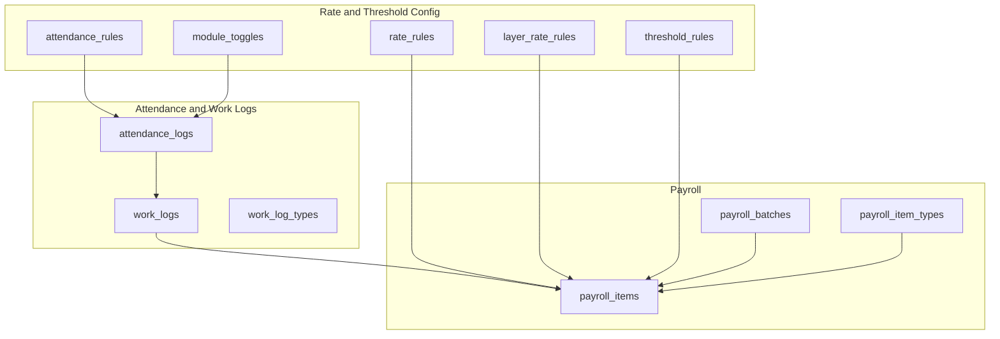
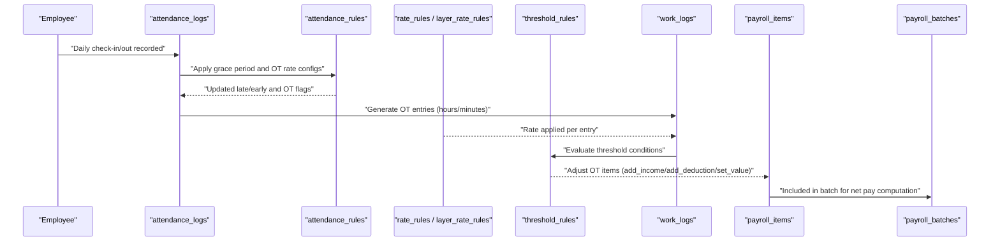
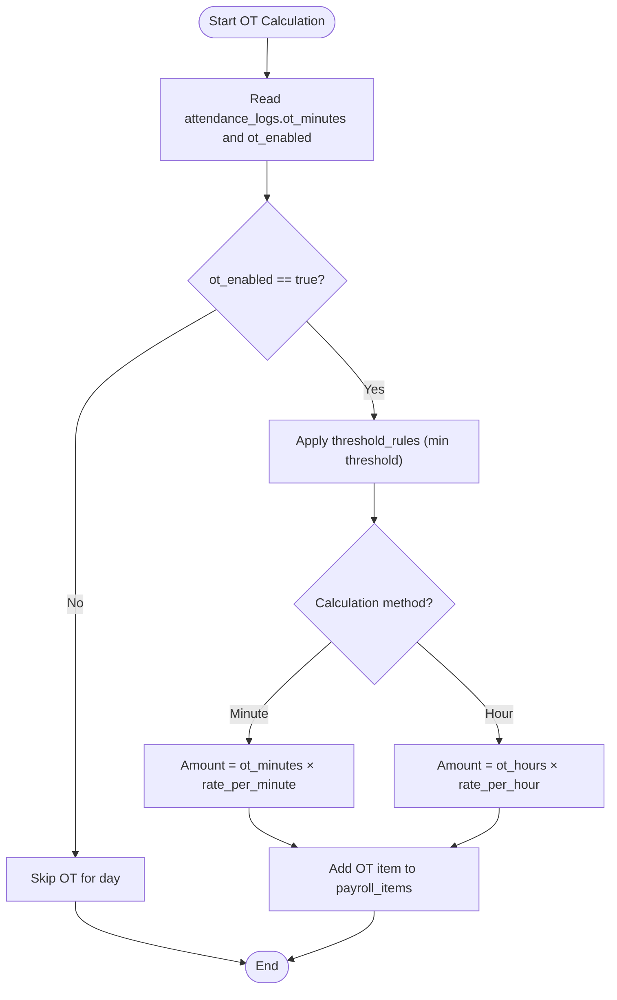
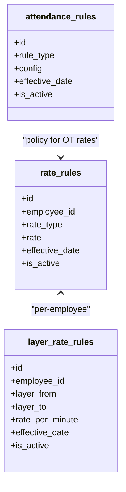
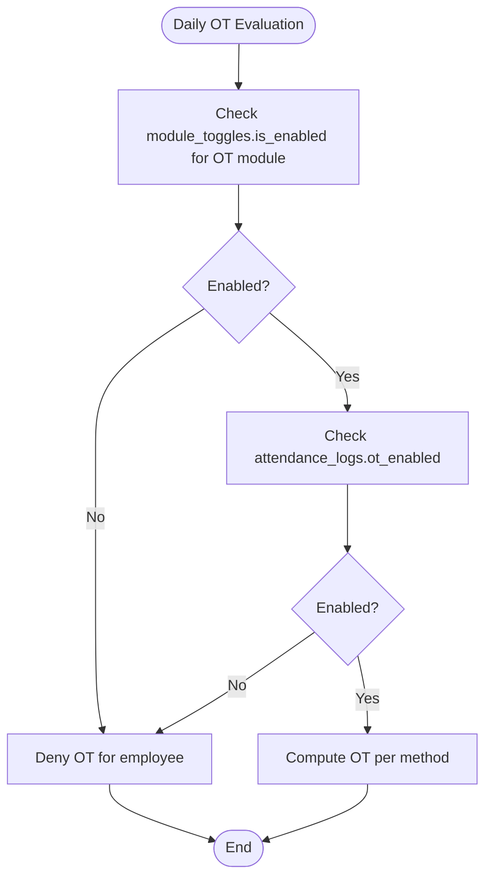
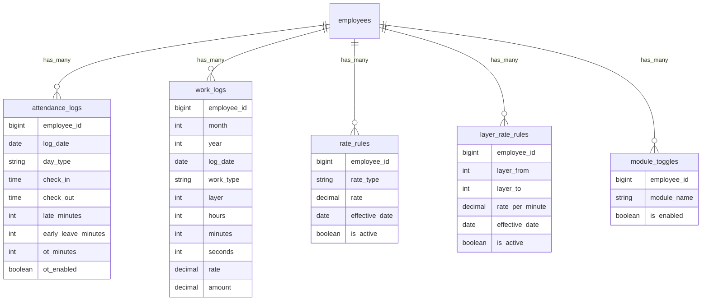
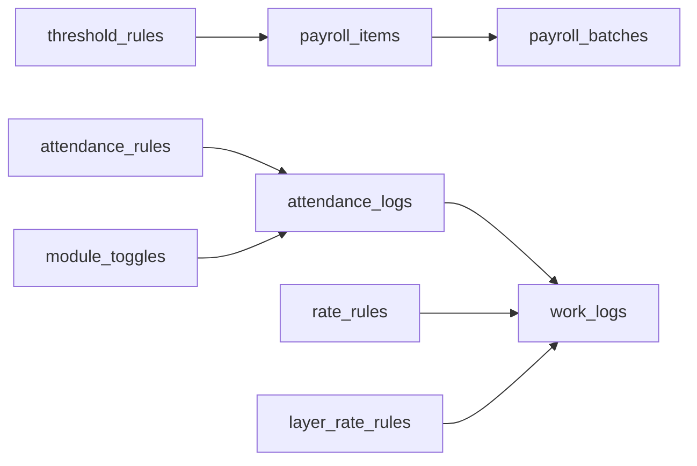

# Overtime Calculation Rules

<cite>
**Referenced Files in This Document**
- [AGENTS.md](file://AGENTS.md)
- [0001_01_01_000006_create_attendance_worklogs_tables.php](file://database/migrations/0001_01_01_000006_create_attendance_worklogs_tables.php)
- [0001_01_01_000007_create_payroll_tables.php](file://database/migrations/0001_01_01_000007_create_payroll_tables.php)
- [0001_01_01_000008_create_rules_config_tables.php](file://database/migrations/0001_01_01_000008_create_rules_config_tables.php)
</cite>

## Table of Contents
1. [Introduction](#introduction)
2. [Project Structure](#project-structure)
3. [Core Components](#core-components)
4. [Architecture Overview](#architecture-overview)
5. [Detailed Component Analysis](#detailed-component-analysis)
6. [Dependency Analysis](#dependency-analysis)
7. [Performance Considerations](#performance-considerations)
8. [Troubleshooting Guide](#troubleshooting-guide)
9. [Conclusion](#conclusion)

## Introduction
This document defines the monthly staff overtime (OT) calculation rules for the payroll system. It covers the three supported OT calculation methods (by minute, by hour, and minimum threshold), rate structures, enable flags, integration with attendance logs, and how OT affects net pay. It also outlines grace periods, approval workflows, and audit trail requirements for OT adjustments.

## Project Structure
The overtime system is implemented using database-first design with Laravel migrations. The relevant schema elements include:
- Attendance logs capturing daily check-in/out, late minutes, early leave, OT minutes, and OT enable flag
- Work logs for detailed time entries and amounts
- Rate rules and layer rate rules for OT rates
- Threshold rules for OT-related conditions
- Payroll items and batches for generating net pay
- Module toggles for enabling OT per employee
- Attendance rules for grace period and OT rate configurations

**Diagram sources**
- [0001_01_01_000006_create_attendance_worklogs_tables.php:11-60](file://database/migrations/0001_01_01_000006_create_attendance_worklogs_tables.php#L11-L60)
- [0001_01_01_000007_create_payroll_tables.php:11-51](file://database/migrations/0001_01_01_000007_create_payroll_tables.php#L11-L51)
- [0001_01_01_000008_create_rules_config_tables.php:11-89](file://database/migrations/0001_01_01_000008_create_rules_config_tables.php#L11-L89)

**Section sources**
- [AGENTS.md:438-460](file://AGENTS.md#L438-L460)
- [0001_01_01_000006_create_attendance_worklogs_tables.php:11-60](file://database/migrations/0001_01_01_000006_create_attendance_worklogs_tables.php#L11-L60)
- [0001_01_01_000007_create_payroll_tables.php:11-51](file://database/migrations/0001_01_01_000007_create_payroll_tables.php#L11-L51)
- [0001_01_01_000008_create_rules_config_tables.php:11-89](file://database/migrations/0001_01_01_000008_create_rules_config_tables.php#L11-L89)

## Core Components
- OT calculation methods
  - OT by minute: OT amount equals total OT minutes multiplied by the applicable rate per minute
  - OT by hour: OT amount equals total OT hours (rounded or truncated per policy) multiplied by the applicable hourly rate
  - Minimum threshold: OT is only counted if OT minutes exceed a configured threshold
- Rate structures
  - Fixed rate per minute or per hour via rate_rules
  - Layered rates via layer_rate_rules for tiered OT rates
- Enable flags and module toggles
  - attendance_logs.ot_enabled indicates whether OT was enabled for a given day
  - module_toggles.module_name controls OT module enablement per employee
- Integration with attendance logs
  - attendance_logs contains daily ot_minutes and ot_enabled
  - work_logs captures granular work entries with hours/minutes/seconds and calculated amounts
- Net pay impact
  - OT contributes to total_income in the monthly staff formula
  - OT does not directly affect deductions unless linked to threshold rules

**Section sources**
- [AGENTS.md:438-460](file://AGENTS.md#L438-L460)
- [0001_01_01_000006_create_attendance_worklogs_tables.php:11-29](file://database/migrations/0001_01_01_000006_create_attendance_worklogs_tables.php#L11-L29)
- [0001_01_01_000008_create_rules_config_tables.php:11-35](file://database/migrations/0001_01_01_000008_create_rules_config_tables.php#L11-L35)
- [0001_01_01_000007_create_payroll_tables.php:11-51](file://database/migrations/0001_01_01_000007_create_payroll_tables.php#L11-L51)

## Architecture Overview
The OT calculation pipeline integrates attendance data, rate configurations, thresholds, and payroll generation.

**Diagram sources**
- [0001_01_01_000006_create_attendance_worklogs_tables.php:11-60](file://database/migrations/0001_01_01_000006_create_attendance_worklogs_tables.php#L11-L60)
- [0001_01_01_000008_create_rules_config_tables.php:11-89](file://database/migrations/0001_01_01_000008_create_rules_config_tables.php#L11-L89)
- [0001_01_01_000007_create_payroll_tables.php:11-51](file://database/migrations/0001_01_01_000007_create_payroll_tables.php#L11-L51)

## Detailed Component Analysis

### OT Calculation Methods
- OT by minute
  - Formula: total_ot_minutes × rate_per_minute
  - Rate source: rate_rules or layer_rate_rules
- OT by hour
  - Formula: total_ot_hours × rate_per_hour
  - Rounding/truncation follows policy in attendance_rules.config
- Minimum threshold
  - Only minutes exceeding threshold are counted toward OT
  - Threshold evaluated via threshold_rules.metric = "ot_hours" or similar

**Diagram sources**
- [0001_01_01_000006_create_attendance_worklogs_tables.php:11-29](file://database/migrations/0001_01_01_000006_create_attendance_worklogs_tables.php#L11-L29)
- [0001_01_01_000008_create_rules_config_tables.php:11-35](file://database/migrations/0001_01_01_000008_create_rules_config_tables.php#L11-L35)
- [0001_01_01_000008_create_rules_config_tables.php:48-58](file://database/migrations/0001_01_01_000008_create_rules_config_tables.php#L48-L58)

**Section sources**
- [AGENTS.md:454-459](file://AGENTS.md#L454-L459)
- [0001_01_01_000006_create_attendance_worklogs_tables.php:11-29](file://database/migrations/0001_01_01_000006_create_attendance_worklogs_tables.php#L11-L29)
- [0001_01_01_000008_create_rules_config_tables.php:11-35](file://database/migrations/0001_01_01_000008_create_rules_config_tables.php#L11-L35)
- [0001_01_01_000008_create_rules_config_tables.php:48-58](file://database/migrations/0001_01_01_000008_create_rules_config_tables.php#L48-L58)

### Rate Structures
- Fixed rate per minute/hour
  - Stored in rate_rules.rate_type ("fixed", "hourly") with numeric rate
- Layered rates
  - Defined by layer_from and layer_to ranges with rate_per_minute
  - Effective date and is_active control applicability
- Attendance rules
  - attendance_rules.rule_type includes "ot_rate" and "grace_period"
  - Config stored as JSON for flexible policy definition

**Diagram sources**
- [0001_01_01_000008_create_rules_config_tables.php:11-35](file://database/migrations/0001_01_01_000008_create_rules_config_tables.php#L11-L35)
- [0001_01_01_000008_create_rules_config_tables.php:71-78](file://database/migrations/0001_01_01_000008_create_rules_config_tables.php#L71-L78)

**Section sources**
- [0001_01_01_000008_create_rules_config_tables.php:11-35](file://database/migrations/0001_01_01_000008_create_rules_config_tables.php#L11-L35)
- [0001_01_01_000008_create_rules_config_tables.php:71-78](file://database/migrations/0001_01_01_000008_create_rules_config_tables.php#L71-L78)

### Enable Flags and Module Toggles
- attendance_logs.ot_enabled
  - Boolean flag indicating OT eligibility for a day
- module_toggles.module_name
  - Controls OT module enablement per employee
  - Unique constraint ensures one toggle per employee and module

**Diagram sources**
- [0001_01_01_000006_create_attendance_worklogs_tables.php](file://database/migrations/0001_01_01_000006_create_attendance_worklogs_tables.php#L21)
- [0001_01_01_000008_create_rules_config_tables.php:80-89](file://database/migrations/0001_01_01_000008_create_rules_config_tables.php#L80-L89)

**Section sources**
- [0001_01_01_000006_create_attendance_worklogs_tables.php](file://database/migrations/0001_01_01_000006_create_attendance_worklogs_tables.php#L21)
- [0001_01_01_000008_create_rules_config_tables.php:80-89](file://database/migrations/0001_01_01_000008_create_rules_config_tables.php#L80-L89)

### Integration with Attendance Logs
- attendance_logs fields used for OT:
  - log_date, day_type, check_in, check_out, late_minutes, early_leave_minutes, ot_minutes, ot_enabled
- work_logs supports granular OT entries:
  - month, year, log_date, hours, minutes, seconds, rate, amount
- Threshold evaluation:
  - threshold_rules.metric can target OT metrics; operator and threshold_value define condition
  - result_action determines whether to add_income, add_deduction, or set_value

**Diagram sources**
- [0001_01_01_000006_create_attendance_worklogs_tables.php:11-60](file://database/migrations/0001_01_01_000006_create_attendance_worklogs_tables.php#L11-L60)
- [0001_01_01_000008_create_rules_config_tables.php:11-35](file://database/migrations/0001_01_01_000008_create_rules_config_tables.php#L11-L35)
- [0001_01_01_000008_create_rules_config_tables.php:80-89](file://database/migrations/0001_01_01_000008_create_rules_config_tables.php#L80-L89)

**Section sources**
- [0001_01_01_000006_create_attendance_worklogs_tables.php:11-60](file://database/migrations/0001_01_01_000006_create_attendance_worklogs_tables.php#L11-L60)
- [0001_01_01_000008_create_rules_config_tables.php:48-58](file://database/migrations/0001_01_01_000008_create_rules_config_tables.php#L48-L58)

### Practical Examples and Scenarios
- Example 1: OT by minute
  - Scenario: Employee worked 120 OT minutes with rate_rules.rate_per_minute = 1.5
  - Calculation: 120 × 1.5 = 180
- Example 2: OT by hour
  - Scenario: Employee worked 2 hours with rate_rules.rate_per_hour = 100
  - Calculation: 2 × 100 = 200
- Example 3: Minimum threshold
  - Scenario: threshold_rules.threshold_value = 60 minutes; employee logged 90 OT minutes
  - Result: Only 90 minutes eligible (exceeds 60)
- Example 4: Net pay effect
  - OT increases total_income; if threshold rules add_income, OT amount is included in net_pay computation

Note: These examples illustrate the mechanics described in the referenced schema and business rules.

**Section sources**
- [AGENTS.md:440-446](file://AGENTS.md#L440-L446)
- [0001_01_01_000006_create_attendance_worklogs_tables.php:11-29](file://database/migrations/0001_01_01_000006_create_attendance_worklogs_tables.php#L11-L29)
- [0001_01_01_000008_create_rules_config_tables.php:11-35](file://database/migrations/0001_01_01_000008_create_rules_config_tables.php#L11-L35)
- [0001_01_01_000008_create_rules_config_tables.php:48-58](file://database/migrations/0001_01_01_000008_create_rules_config_tables.php#L48-L58)
- [0001_01_01_000007_create_payroll_tables.php:11-51](file://database/migrations/0001_01_01_000007_create_payroll_tables.php#L11-L51)

### Grace Periods, Approval Workflows, and Audit Trail
- Grace periods
  - Defined via attendance_rules.rule_type = "grace_period" with JSON config
  - Used to adjust late_minutes thresholds before applying OT rules
- Approval workflows
  - Not explicitly defined in the referenced schema; implement at application level using module_toggles and audit_logs
- Audit trail
  - Required for all significant changes per AGENTS.md guidelines
  - Maintain audit_logs for employee status, salary profile, payroll item changes, payslip edits/finalization, SSO config, bonus rules, and module toggle changes

**Section sources**
- [AGENTS.md:257-271](file://AGENTS.md#L257-L271)
- [0001_01_01_000008_create_rules_config_tables.php:71-78](file://database/migrations/0001_01_01_000008_create_rules_config_tables.php#L71-L78)

## Dependency Analysis
OT calculation depends on:
- Attendance data (attendance_logs)
- Rate configuration (rate_rules, layer_rate_rules)
- Policy configuration (threshold_rules, attendance_rules)
- Payroll assembly (payroll_items, payroll_batches)

**Diagram sources**
- [0001_01_01_000006_create_attendance_worklogs_tables.php:11-60](file://database/migrations/0001_01_01_000006_create_attendance_worklogs_tables.php#L11-L60)
- [0001_01_01_000007_create_payroll_tables.php:11-51](file://database/migrations/0001_01_01_000007_create_payroll_tables.php#L11-L51)
- [0001_01_01_000008_create_rules_config_tables.php:11-89](file://database/migrations/0001_01_01_000008_create_rules_config_tables.php#L11-L89)

**Section sources**
- [0001_01_01_000006_create_attendance_worklogs_tables.php:11-60](file://database/migrations/0001_01_01_000006_create_attendance_worklogs_tables.php#L11-L60)
- [0001_01_01_000007_create_payroll_tables.php:11-51](file://database/migrations/0001_01_01_000007_create_payroll_tables.php#L11-L51)
- [0001_01_01_000008_create_rules_config_tables.php:11-89](file://database/migrations/0001_01_01_000008_create_rules_config_tables.php#L11-L89)

## Performance Considerations
- Indexes on attendance_logs.log_date and composite keys improve daily aggregation
- Layered rate lookups benefit from index on (employee_id, is_active)
- Batch processing of payroll_items reduces per-item overhead
- Threshold evaluation should leverage metric/operator indexing for efficient filtering

## Troubleshooting Guide
- OT not appearing in payslip
  - Verify attendance_logs.ot_enabled is true for the relevant day
  - Confirm module_toggles is enabled for OT module
  - Check rate_rules or layer_rate_rules are present and active
- Incorrect OT amount
  - Validate method selection (minute vs hour) and rounding policy
  - Review threshold_rules.threshold_value and operator
- Excessive late minutes affecting OT
  - Inspect attendance_rules.grace_period configuration
- Audit discrepancies
  - Review audit_logs for changes to module_toggles, rate_rules, threshold_rules, and payroll_items

**Section sources**
- [0001_01_01_000006_create_attendance_worklogs_tables.php:11-29](file://database/migrations/0001_01_01_000006_create_attendance_worklogs_tables.php#L11-L29)
- [0001_01_01_000008_create_rules_config_tables.php:48-58](file://database/migrations/0001_01_01_000008_create_rules_config_tables.php#L48-L58)
- [0001_01_01_000008_create_rules_config_tables.php:71-78](file://database/migrations/0001_01_01_000008_create_rules_config_tables.php#L71-L78)
- [AGENTS.md:257-271](file://AGENTS.md#L257-L271)

## Conclusion
The overtime calculation system is designed around configurable rates, daily attendance flags, and threshold policies. By combining attendance_logs, rate_rules, layer_rate_rules, threshold_rules, and module_toggles, the system supports flexible OT computations that integrate seamlessly into monthly net pay. Proper configuration of grace periods, approval workflows, and audit logging ensures compliance and transparency.