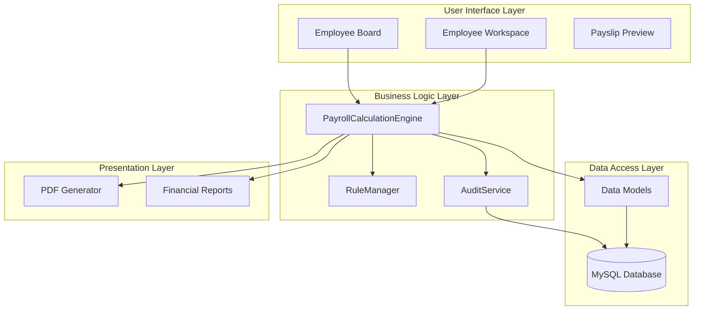
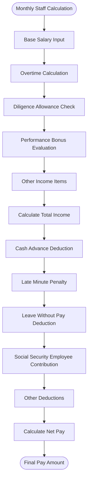
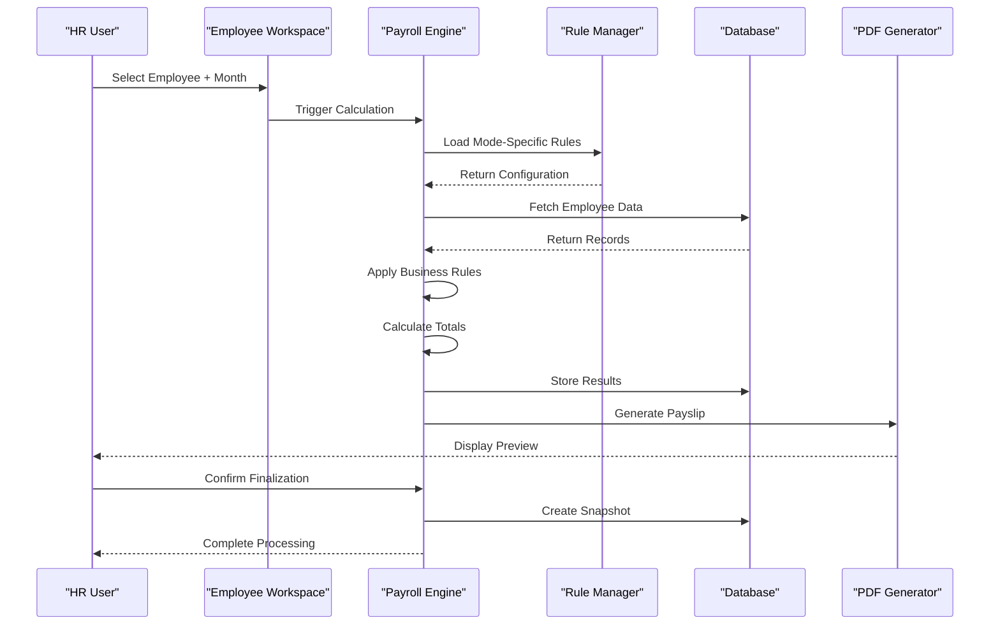
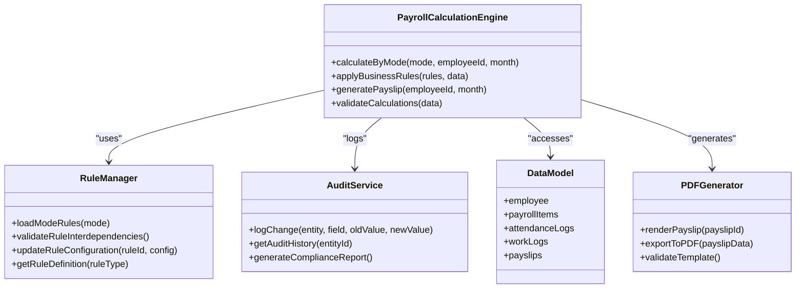
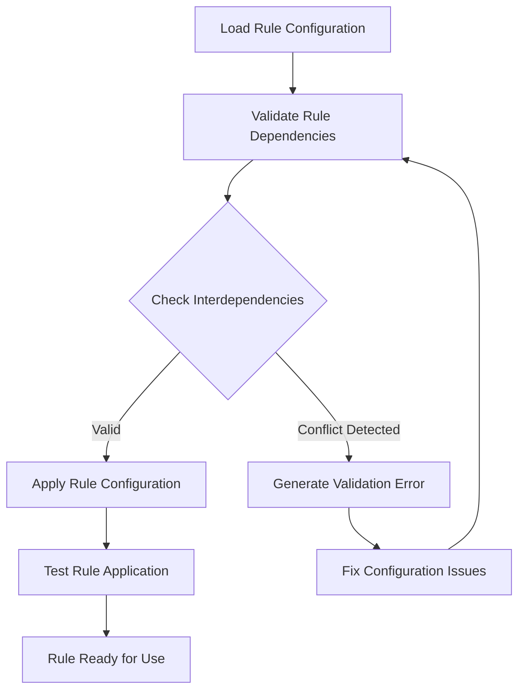
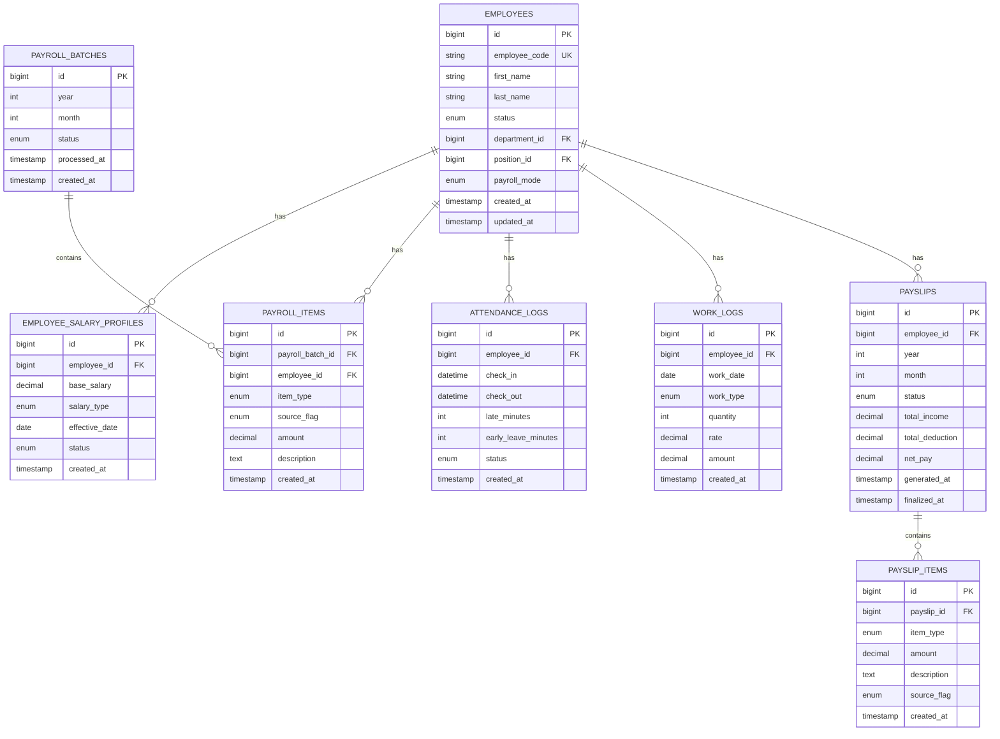
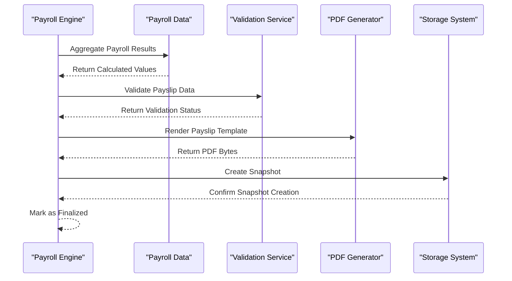
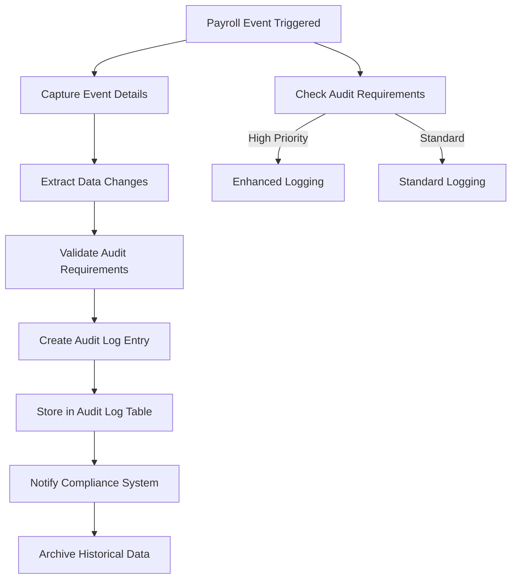

# Payroll Processing System

<cite>
**Referenced Files in This Document**
- [AGENTS.md](file://AGENTS.md)
</cite>

## Table of Contents
1. [Introduction](#introduction)
2. [System Architecture Overview](#system-architecture-overview)
3. [Core Payroll Modes](#core-payroll-modes)
4. [Business Rules and Calculation Algorithms](#business-rules-and-calculation-algorithms)
5. [Data Processing Workflows](#data-processing-workflows)
6. [Modular Design Architecture](#modular-design-architecture)
7. [Rule Management System](#rule-management-system)
8. [Data Model and Schema](#data-model-and-schema)
9. [Payslip Generation and PDF Processing](#payslip-generation-and-pdf-processing)
10. [Audit and Compliance Framework](#audit-and-compliance-framework)
11. [Performance Considerations](#performance-considerations)
12. [Implementation Guidelines](#implementation-guidelines)
13. [Troubleshooting Guide](#troubleshooting-guide)
14. [Conclusion](#conclusion)

## Introduction

The xHR Payroll & Finance System is a comprehensive payroll processing solution designed to replace traditional Excel-based systems with a robust, rule-driven, and audit-enabled platform. This system supports six distinct payroll modes while maintaining a unified architecture that promotes maintainability, scalability, and regulatory compliance.

The system follows modern PHP/Laravel development practices with MySQL database backend, providing dynamic data entry capabilities similar to spreadsheets while ensuring proper data governance, audit trails, and compliance requirements. The platform supports both monthly staff, freelance workers, and YouTuber/talent arrangements with flexible hybrid configurations.

## System Architecture Overview

The payroll system employs a modular, service-oriented architecture built on Laravel framework principles. The system emphasizes separation of concerns, rule-driven configuration, and maintainable code structure.

**Diagram sources**
- [AGENTS.md:338-343](file://AGENTS.md#L338-L343)
- [AGENTS.md:5.3:196-221](file://AGENTS.md#L196-L221)

The architecture ensures that business logic remains isolated from presentation concerns while maintaining flexibility for future enhancements and regulatory changes.

**Section sources**
- [AGENTS.md:23-31](file://AGENTS.md#L23-L31)
- [AGENTS.md:34-100](file://AGENTS.md#L34-L100)

## Core Payroll Modes

The system supports six distinct payroll modes, each designed for specific employment arrangements and calculation methodologies:

### 1. Monthly Staff Mode
**Purpose**: Traditional salaried employees with fixed monthly compensation
**Key Characteristics**:
- Base salary as primary income component
- Supports overtime calculations with configurable thresholds
- Performance-based bonuses with threshold rules
- Comprehensive deduction system including social security contributions

### 2. Freelance Layer Rate Mode
**Purpose**: Independent contractors with tiered rate calculations
**Key Characteristics**:
- Time-based calculations with minute-level precision
- Layered rate structures for different work segments
- Flexible rate configurations per work type
- Integration with work log tracking

### 3. Freelance Fixed Rate Mode
**Purpose**: Flat-rate freelance engagements with predetermined compensation
**Key Characteristics**:
- Quantity-based calculations (hours, tasks, units)
- Fixed rate per unit with configurable quantities
- Simplified calculation workflow
- Direct integration with project-based work tracking

### 4. YouTuber/Talent Salary Mode
**Purpose**: Content creators with traditional salary arrangements
**Key Characteristics**:
- Similar to monthly staff with specialized talent management
- Module-specific configurations for content creator benefits
- Performance metrics integration for talent development

### 5. YouTuber/Talent Settlement Mode
**Purpose**: Content creators with profit-sharing or revenue-based arrangements
**Key Characteristics**:
- Revenue-based calculations with expense deductions
- Net settlement calculations after business expenses
- Profit-sharing model with predefined formulas
- Comprehensive expense tracking integration

### 6. Custom Hybrid Mode
**Purpose**: Complex payroll arrangements combining multiple calculation methods
**Key Characteristics**:
- Configurable combination of different payroll modes
- Override mechanisms for manual adjustments
- Flexible rule application across multiple components
- Advanced customization for unique employment arrangements

**Section sources**
- [AGENTS.md:123-131](file://AGENTS.md#L123-L131)
- [AGENTS.md:203-215](file://AGENTS.md#L203-L215)

## Business Rules and Calculation Algorithms

Each payroll mode implements specific business rules and calculation algorithms designed to handle unique employment scenarios while maintaining consistency across the system.

### Monthly Staff Calculation Algorithm

The monthly staff mode follows a comprehensive income-deduction structure:

**Diagram sources**
- [AGENTS.md:440-444](file://AGENTS.md#L440-L444)

**Calculation Formula**:
- `Total Income = Base Salary + Overtime Pay + Diligence Allowance + Performance Bonus + Other Income`
- `Total Deduction = Cash Advance + Late Deduction + LWOP Deduction + Social Security Employee + Other Deduction`
- `Net Pay = Total Income - Total Deduction`

### Freelance Layer Rate Algorithm

The layer rate system provides tiered compensation based on work duration and rate tiers:

**Calculation Formula**:
- `Duration Minutes = Minute + (Second / 60)`
- `Amount = Duration Minutes × Rate Per Minute`

### Freelance Fixed Rate Algorithm

The fixed rate system applies predetermined rates to quantities worked:

**Calculation Formula**:
- `Amount = Quantity × Fixed Rate`

### YouTuber Settlement Algorithm

Content creator settlements focus on revenue minus business expenses:

**Calculation Formula**:
- `Net Settlement = Total Income - Total Expenses`

### Social Security Configuration

The system supports configurable social security contributions with effective date management:

**Configuration Parameters**:
- Employee contribution rate
- Employer contribution rate
- Salary ceiling limits
- Maximum monthly contribution caps

**Section sources**
- [AGENTS.md:440-497](file://AGENTS.md#L440-L497)

## Data Processing Workflows

The system implements comprehensive data processing workflows that ensure data integrity, auditability, and real-time calculation capabilities.

### Payroll Batch Processing Workflow

**Diagram sources**
- [AGENTS.md:513-515](file://AGENTS.md#L513-L515)
- [AGENTS.md:338-343](file://AGENTS.md#L338-L343)

### Data Source Tracking System

The system maintains comprehensive source tracking for all payroll calculations:

| Data Source Type | Purpose | Audit Trail |
|------------------|---------|-------------|
| Master Value | Original calculated values | Full history |
| Monthly Override | Monthly adjustments | Change logs |
| Manual Item | User-entered values | Modification records |
| Rule-Generated | Automatically calculated items | Formula references |

**Section sources**
- [AGENTS.md:498-505](file://AGENTS.md#L498-L505)
- [AGENTS.md:513-515](file://AGENTS.md#L513-L515)

## Modular Design Architecture

The system employs a highly modular architecture that separates concerns while enabling flexible configuration and extensibility.

### Core Service Components

**Diagram sources**
- [AGENTS.md:636-647](file://AGENTS.md#L636-L647)

### Service Layer Responsibilities

**PayrollCalculationService**: Core calculation engine handling all payroll mode implementations
**EmployeeService**: Employee profile and assignment management
**AttendanceService**: Time tracking and attendance logging
**WorkLogService**: Freelance work tracking and time recording
**BonusRuleService**: Performance-based bonus calculation and management
**SocialSecurityService**: Thailand social security contribution calculations
**PayslipService**: Payslip generation, validation, and PDF export
**CompanyFinanceService**: Monthly financial summaries and reporting
**AuditLogService**: Comprehensive audit trail management
**ModuleToggleService**: Runtime configuration of payroll modules

**Section sources**
- [AGENTS.md:636-647](file://AGENTS.md#L636-L647)
- [AGENTS.md:196-221](file://AGENTS.md#L196-L221)

## Rule Management System

The system implements a comprehensive rule management framework that enables dynamic configuration of payroll calculations without code modifications.

### Rule Categories and Implementation

| Rule Category | Purpose | Configuration Options |
|---------------|---------|----------------------|
| Attendance Rules | Late arrival, early departure penalties | Fixed per minute, tiered penalties, grace periods |
| OT Rules | Overtime calculation thresholds | Minute-based, hourly-based, minimum thresholds |
| Bonus Rules | Performance-based incentives | Threshold-based, percentage-based, fixed amounts |
| Threshold Rules | Deduction triggers | Day-based, proportional, maximum limits |
| Layer Rate Rules | Freelance tiered pricing | Multiple tiers, rate progression, volume discounts |
| Social Security Rules | Contribution calculations | Effective dates, rate changes, ceiling updates |
| Tax Rules | Income tax calculations | Progressive rates, exemptions, deductions |
| Module Toggles | Feature availability | Enable/disable payroll modes, calculation features |

### Rule Interdependency Validation

The system validates rule interdependencies to prevent configuration conflicts:

**Diagram sources**
- [AGENTS.md:201](file://AGENTS.md#L201)

**Section sources**
- [AGENTS.md:344-352](file://AGENTS.md#L344-L352)
- [AGENTS.md:201-202](file://AGENTS.md#L201-L202)

## Data Model and Schema

The system employs a comprehensive data model designed for auditability, scalability, and maintainability.

### Core Entity Relationships

**Diagram sources**
- [AGENTS.md:387-417](file://AGENTS.md#L387-L417)

### Database Design Principles

**Field Naming Conventions**:
- Table names: plural snake_case
- Primary keys: `id`
- Foreign keys: `<entity>_id`
- Status flags: `status`, `is_active`
- Date fields: `*_date`
- Duration fields: `*_minutes`, `*_seconds`
- Monetary fields: `decimal(12,2)`
- Percentage fields: `decimal(5,2)`

**Indexing Strategy**:
- Primary keys automatically indexed
- Foreign key relationships optimized
- Date-based queries with composite indexes
- Status filtering with dedicated indexes
- Audit trail performance optimization

**Section sources**
- [AGENTS.md:418-427](file://AGENTS.md#L418-L427)
- [AGENTS.md:387-417](file://AGENTS.md#L387-L417)

## Payslip Generation and PDF Processing

The system provides comprehensive payslip generation with audit-protected snapshots and customizable PDF templates.

### Payslip Generation Workflow

**Diagram sources**
- [AGENTS.md:567-573](file://AGENTS.md#L567-L573)

### Payslip Structure Requirements

**Required Elements**:
- Company header with branding
- Employee identification details
- Payment period and calculation date
- Bank account information
- Income breakdown (left column)
- Deduction breakdown (right column)
- Grand totals and net pay
- Signature verification sections

**Critical Rules**:
- Deductions must appear in dedicated deduction section
- Base salary reductions require explicit deduction entries
- Manual overrides must be clearly marked
- All calculations must reference audit-tracked sources

**Section sources**
- [AGENTS.md:549-573](file://AGENTS.md#L549-L573)

## Audit and Compliance Framework

The system implements comprehensive audit logging and compliance management to meet regulatory requirements and internal governance standards.

### Audit Logging Architecture

**Diagram sources**
- [AGENTS.md:576-595](file://AGENTS.md#L576-L595)

### Audit Coverage Areas

**High-Priority Audit Events**:
- Employee salary profile changes
- Payroll item amount modifications
- Payslip finalize/unfinalize actions
- Rule configuration updates
- Module toggle changes
- Social security configuration modifications

**Audit Log Fields**:
- Who performed the action
- What entity was affected
- What field was modified
- Old and new values
- Action type and timestamp
- Optional reason for changes
- User session and IP information

**Section sources**
- [AGENTS.md:576-595](file://AGENTS.md#L576-L595)

## Performance Considerations

The system is designed with performance optimization in mind, supporting large-scale payroll processing while maintaining responsiveness and reliability.

### Scalability Features

**Database Optimization**:
- Proper indexing strategy for frequent queries
- Partitioning for historical data
- Connection pooling for concurrent processing
- Query optimization for batch operations

**Caching Strategy**:
- Rule configuration caching
- Employee profile caching
- Frequently accessed payroll data
- PDF template caching

**Processing Optimization**:
- Batch processing for large datasets
- Asynchronous job queuing
- Memory-efficient data processing
- Parallel calculation capabilities

### Performance Monitoring

**Key Metrics to Monitor**:
- Calculation processing time
- Database query performance
- Memory usage patterns
- Concurrent user capacity
- PDF generation throughput

**Optimization Opportunities**:
- Index optimization for frequently queried fields
- Query plan analysis and tuning
- Memory allocation optimization
- Database connection pool sizing

## Implementation Guidelines

### Development Best Practices

**Code Organization**:
- Service classes for business logic isolation
- Clear separation between controllers and services
- Comprehensive validation at service boundaries
- Transaction management for critical operations

**Testing Strategy**:
- Unit tests for individual service methods
- Integration tests for complete workflows
- Performance testing for batch operations
- Security testing for data access controls

**Documentation Standards**:
- Inline code comments for complex logic
- API documentation for service interfaces
- Configuration documentation for rule systems
- User guides for system administration

### Deployment Considerations

**Environment Setup**:
- PHP 8.2+ with required extensions
- MySQL 8+ with appropriate storage engine
- Laravel framework with proper configuration
- PDF generation libraries (DomPDF/Snappy)

**Security Measures**:
- Role-based access control implementation
- Data encryption for sensitive information
- Secure session management
- Input validation and sanitization

**Monitoring and Maintenance**:
- Performance monitoring setup
- Error logging and alerting
- Database backup procedures
- Regular maintenance schedules

**Section sources**
- [AGENTS.md:598-620](file://AGENTS.md#L598-L620)

## Troubleshooting Guide

### Common Issues and Solutions

**Calculation Errors**:
- Verify rule configuration completeness
- Check for conflicting rule dependencies
- Validate data type consistency
- Review audit logs for recent changes

**Performance Issues**:
- Analyze slow database queries
- Check memory usage patterns
- Review batch processing logs
- Optimize indexing strategy

**Integration Problems**:
- Verify database connectivity
- Check service dependencies
- Review configuration files
- Validate external system connections

**Data Integrity Issues**:
- Review audit trail for unauthorized changes
- Check data validation rules
- Verify transaction boundaries
- Examine foreign key constraints

### Diagnostic Tools

**System Health Checks**:
- Database connection status
- Service availability monitoring
- Memory usage analysis
- Disk space monitoring

**Performance Diagnostics**:
- Query execution time analysis
- Memory allocation tracking
- Concurrent user impact assessment
- Resource utilization monitoring

**Error Resolution Procedures**:
- Error log analysis and categorization
- Root cause investigation protocols
- Rollback procedures for failed changes
- Recovery procedures for system failures

## Conclusion

The xHR Payroll & Finance System represents a comprehensive solution for modern payroll processing needs. By combining six distinct payroll modes with a robust rule-driven architecture, the system provides the flexibility required for diverse organizational structures while maintaining regulatory compliance and operational efficiency.

The modular design ensures maintainability and extensibility, allowing organizations to adapt to changing business requirements without compromising system stability. The comprehensive audit framework provides transparency and compliance assurance, while the dynamic UI offers familiar spreadsheet-like functionality with proper data governance.

Key strengths of the system include:
- Flexible payroll mode support for various employment arrangements
- Comprehensive rule management system for dynamic configuration
- Robust audit and compliance framework
- Scalable architecture supporting growth
- User-friendly interface with spreadsheet-like functionality
- Comprehensive reporting and financial analysis capabilities

The system's adherence to modern development practices, combined with its focus on maintainability and regulatory compliance, positions it as a solid foundation for organizations seeking to modernize their payroll processing capabilities while preserving the familiar spreadsheet experience that users expect.