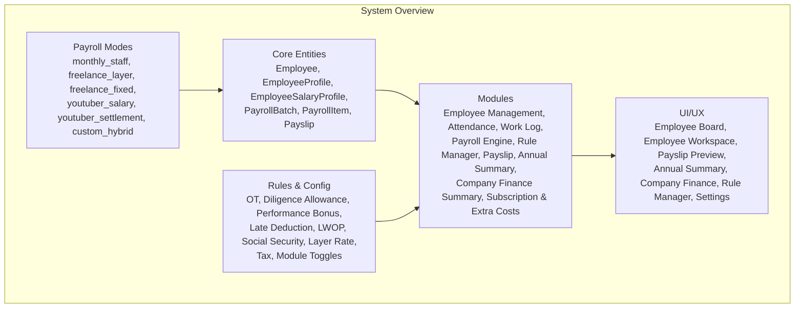
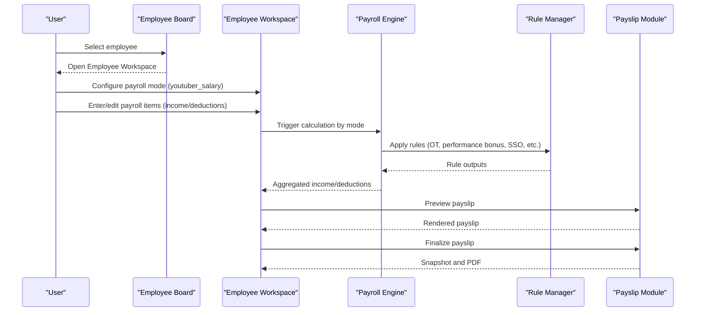
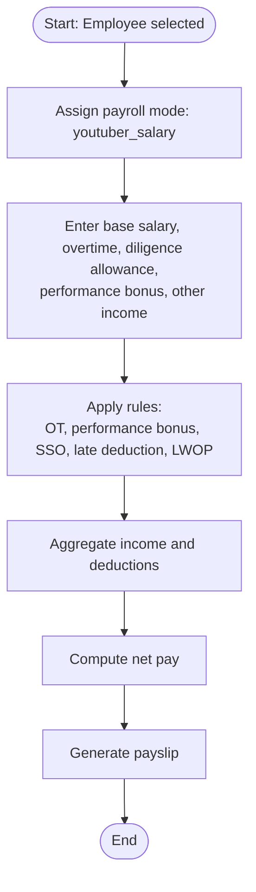
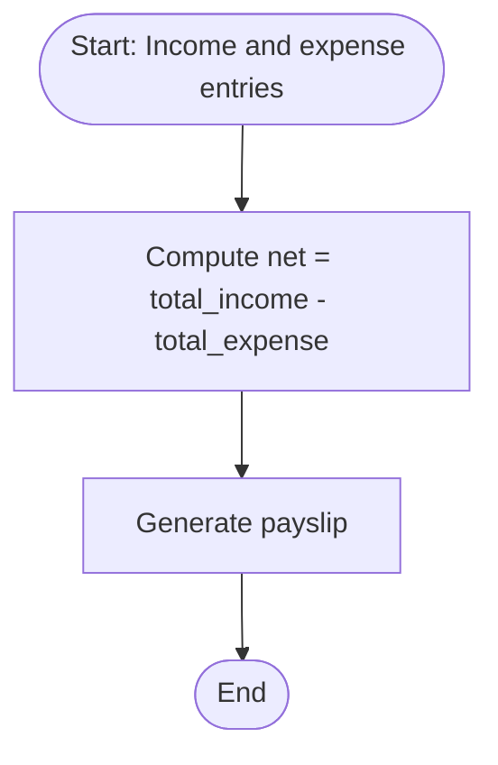
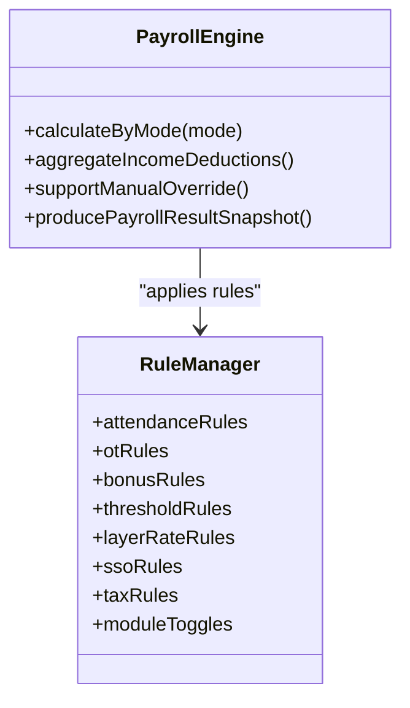
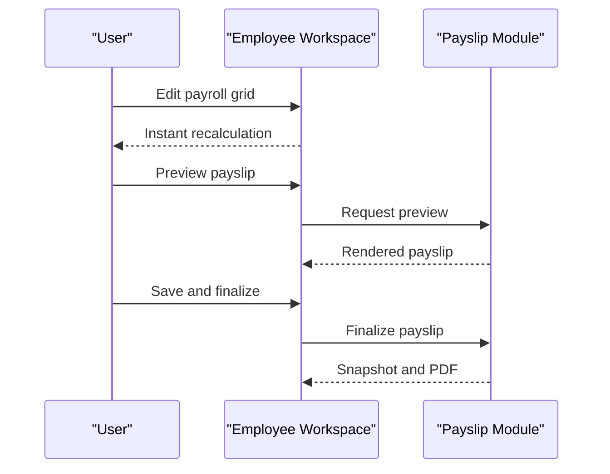
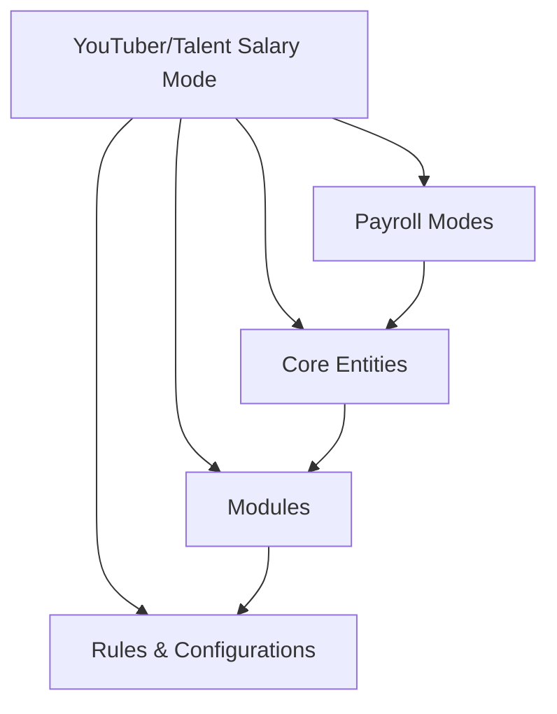

# YouTuber/Talent Salary Payroll

<cite>
**Referenced Files in This Document**
- [AGENTS.md](file://AGENTS.md)
- [README.md](file://laravel-temp/README.md)
</cite>

## Table of Contents
1. [Introduction](#introduction)
2. [Project Structure](#project-structure)
3. [Core Components](#core-components)
4. [Architecture Overview](#architecture-overview)
5. [Detailed Component Analysis](#detailed-component-analysis)
6. [Dependency Analysis](#dependency-analysis)
7. [Performance Considerations](#performance-considerations)
8. [Troubleshooting Guide](#troubleshooting-guide)
9. [Conclusion](#conclusion)
10. [Appendices](#appendices)

## Introduction
This document explains the YouTuber/Talent salary payroll mode within the xHR Payroll & Finance System. It describes how this mode operates similarly to the monthly staff payroll but with specialized configurations for content creators and talent management. It covers payroll calculation similarities, module-specific settings, and how the system handles talent compensation including performance-based components, royalty structures, and content-specific bonuses. It also outlines configuration examples and integration requirements with the broader payroll system.

## Project Structure
The repository provides a comprehensive specification for the payroll system and its modules. The payroll system is designed around a rule-driven, record-based architecture with strong separation of concerns across agents (architecture, database, payroll rules, UI/UX, PDF/Payslip, audit/compliance, refactor). The system supports multiple payroll modes, including YouTuber/Talent modes, and integrates tightly with UI grids, rule managers, and payslip generation.

**Section sources**
- [AGENTS.md:123-149](file://AGENTS.md#L123-L149)
- [AGENTS.md:286-382](file://AGENTS.md#L286-L382)
- [AGENTS.md:438-505](file://AGENTS.md#L438-L505)

## Core Components
- Payroll Modes: The system defines multiple modes, including the YouTuber/Talent modes (salary and settlement). These modes encapsulate distinct calculation rules and UI behaviors.
- Core Entities: The payroll engine relies on core entities such as employees, payroll batches, payroll items, and payslips. These entities are the backbone of all payroll calculations and reporting.
- Modules: The system is composed of cohesive modules (employee management, attendance, work log, payroll engine, rule manager, payslip, annual summary, company finance summary, subscription & extra costs) that collaborate to deliver a complete payroll solution.
- Rules & Configurations: Business rules are stored in configuration tables and applied dynamically during payroll calculation. This includes OT, performance bonus, diligence allowance, late deduction, LWOP, social security, layer rates, taxes, and module toggles.

**Section sources**
- [AGENTS.md:123-149](file://AGENTS.md#L123-L149)
- [AGENTS.md:286-382](file://AGENTS.md#L286-L382)
- [AGENTS.md:438-505](file://AGENTS.md#L438-L505)

## Architecture Overview
The YouTuber/Talent salary payroll mode follows the same foundational architecture as the monthly staff payroll. It leverages the payroll engine to compute income and deductions, aggregates results, supports manual overrides, and produces a payroll result snapshot for payslip generation. The mode is activated per employee and integrates with the broader payroll ecosystem.

**Diagram sources**
- [AGENTS.md:338-359](file://AGENTS.md#L338-L359)
- [AGENTS.md:438-444](file://AGENTS.md#L438-L444)

**Section sources**
- [AGENTS.md:338-359](file://AGENTS.md#L338-L359)
- [AGENTS.md:438-444](file://AGENTS.md#L438-L444)

## Detailed Component Analysis

### YouTuber/Talent Salary Mode
- Operating Similarity to Monthly Staff: The YouTuber/Talent salary mode mirrors the monthly staff calculation logic, aggregating income and deductions to compute net pay. It supports the same categories of income (base salary, overtime pay, diligence allowance, performance bonus, other income) and deductions (cash advance, late deduction, LWOP deduction, social security employee, other deduction).
- Specialized Module Settings: The mode enables specific UI and rule toggles relevant to talent compensation. While the exact configuration fields are defined in the rule manager and UI modules, the mode itself signals that certain talent-related rules and UI behaviors should be active.
- Performance-Based Components: The mode supports performance bonus computation, allowing dynamic adjustments based on performance thresholds and rule configurations.
- Royalty and Content-Specific Bonuses: The system’s rule manager supports configurable bonus rules and threshold rules, enabling the definition of royalty structures and content-specific bonuses. These rules can be toggled per mode and applied during payroll calculation.

**Section sources**
- [AGENTS.md:440-444](file://AGENTS.md#L440-L444)
- [AGENTS.md:481-483](file://AGENTS.md#L481-L483)
- [AGENTS.md:438-505](file://AGENTS.md#L438-L505)

### YouTuber/Talent Settlement Mode
- Calculation Formula: The settlement mode computes net as total income minus total expense, suitable for talent arrangements where revenue and expenses are tracked separately.
- Integration: Like the salary mode, it integrates with the payroll engine and rule manager to apply applicable rules and produce a payslip snapshot.

**Section sources**
- [AGENTS.md:484-487](file://AGENTS.md#L484-L487)

### Payroll Engine and Rule Manager
- Payroll Engine: Calculates by payroll mode, aggregates income and deductions, supports manual override, and produces a payroll result snapshot for payslip generation.
- Rule Manager: Manages attendance rules, OT rules, bonus rules, threshold rules, layer rate rules, SSO rules, tax rules, and module toggles. These rules are applied during payroll calculation to ensure consistent and configurable compensation logic.

**Diagram sources**
- [AGENTS.md:338-352](file://AGENTS.md#L338-L352)

**Section sources**
- [AGENTS.md:338-352](file://AGENTS.md#L338-L352)

### UI/UX and Payslip Module
- Employee Workspace: Provides a single-page interface for editing payroll entries, with inline editing, recalculation, preview, save, and finalize actions.
- Payslip Module: Renders payslips from finalized data, supports PDF export, and enforces snapshot rules to prevent post-finalization changes.

**Diagram sources**
- [AGENTS.md:513-515](file://AGENTS.md#L513-L515)
- [AGENTS.md:354-359](file://AGENTS.md#L354-L359)

**Section sources**
- [AGENTS.md:513-515](file://AGENTS.md#L513-L515)
- [AGENTS.md:354-359](file://AGENTS.md#L354-L359)

## Dependency Analysis
The YouTuber/Talent salary payroll mode depends on:
- Payroll Modes: The mode selection determines which rules and UI behaviors are active.
- Core Entities: Employees, payroll batches, payroll items, and payslips form the data backbone.
- Modules: Employee Management, Attendance, Work Log, Payroll Engine, Rule Manager, Payslip, Annual Summary, Company Finance Summary, and Subscription & Extra Costs.
- Rules & Configurations: OT, performance bonus, diligence allowance, late deduction, LWOP, social security, layer rates, taxes, and module toggles.

**Section sources**
- [AGENTS.md:123-149](file://AGENTS.md#L123-L149)
- [AGENTS.md:286-382](file://AGENTS.md#L286-L382)
- [AGENTS.md:438-505](file://AGENTS.md#L438-L505)

## Performance Considerations
- Rule-driven calculations: Applying rules via the Rule Manager ensures consistent and configurable computations without hardcoding logic, improving maintainability and reducing errors.
- Snapshot-based payslips: Finalized payslips are snapshotted to prevent post-change discrepancies, ensuring reliable reporting and compliance.
- UI responsiveness: Inline editing and instant recalculation improve user productivity while maintaining auditability.

[No sources needed since this section provides general guidance]

## Troubleshooting Guide
- Incorrect net pay: Verify that base salary, overtime, performance bonus, and deductions are correctly entered and that the appropriate rules are enabled.
- Payslip discrepancies: Confirm that the payslip was finalized and that the snapshot reflects the intended values.
- Rule misapplication: Review module toggles and rule configurations in the Rule Manager to ensure the correct rules are applied for the selected payroll mode.

**Section sources**
- [AGENTS.md:498-505](file://AGENTS.md#L498-L505)
- [AGENTS.md:567-573](file://AGENTS.md#L567-L573)

## Conclusion
The YouTuber/Talent salary payroll mode aligns closely with the monthly staff payroll while incorporating specialized configurations for talent compensation. It leverages the payroll engine, rule manager, and UI modules to support performance-based components, royalty structures, and content-specific bonuses. By applying configurable rules and maintaining auditability, the system delivers a flexible and scalable solution for managing talent compensation.

[No sources needed since this section summarizes without analyzing specific files]

## Appendices

### Configuration Examples and Integration Notes
- Assign payroll mode: Ensure the employee’s payroll mode is set to the YouTuber/Talent salary mode.
- Enable relevant rules: Activate OT, performance bonus, and SSO rules in the Rule Manager.
- Configure bonus and threshold rules: Define performance thresholds and bonus formulas to reflect royalty and content-specific incentives.
- Generate payslips: Use the Employee Workspace to preview and finalize payslips, leveraging the snapshot mechanism for compliance.

**Section sources**
- [AGENTS.md:123-130](file://AGENTS.md#L123-L130)
- [AGENTS.md:338-352](file://AGENTS.md#L338-L352)
- [AGENTS.md:438-505](file://AGENTS.md#L438-L505)