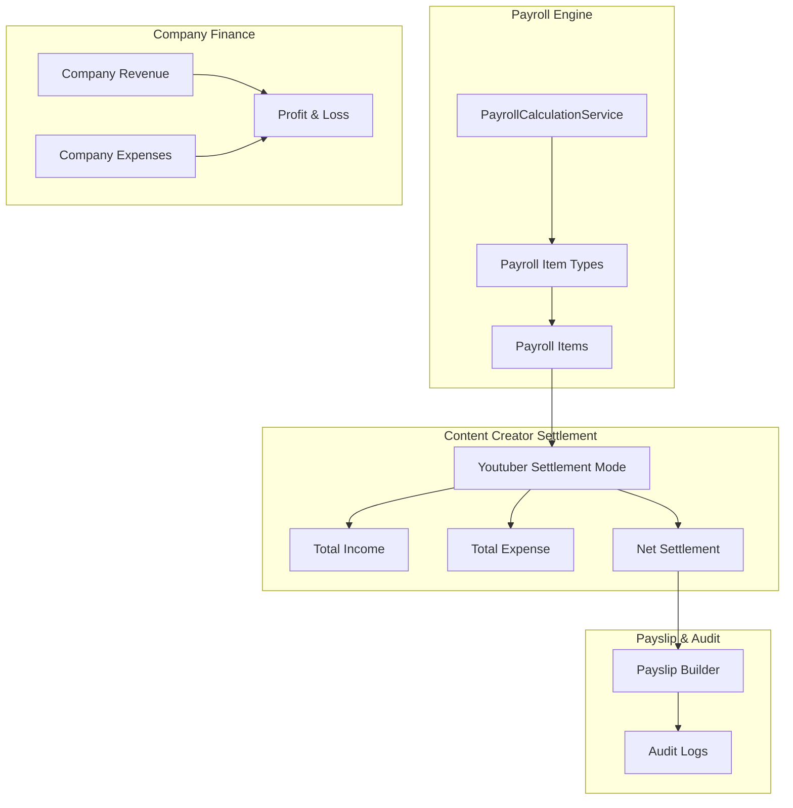
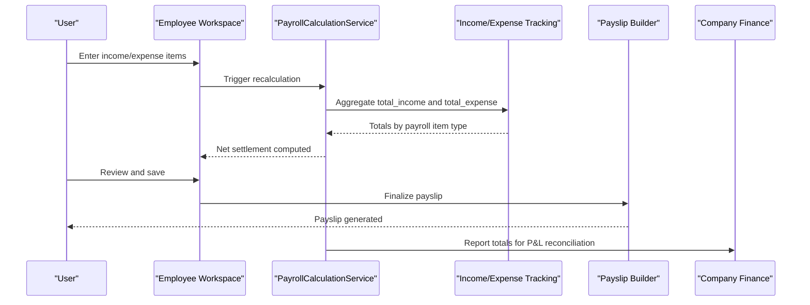
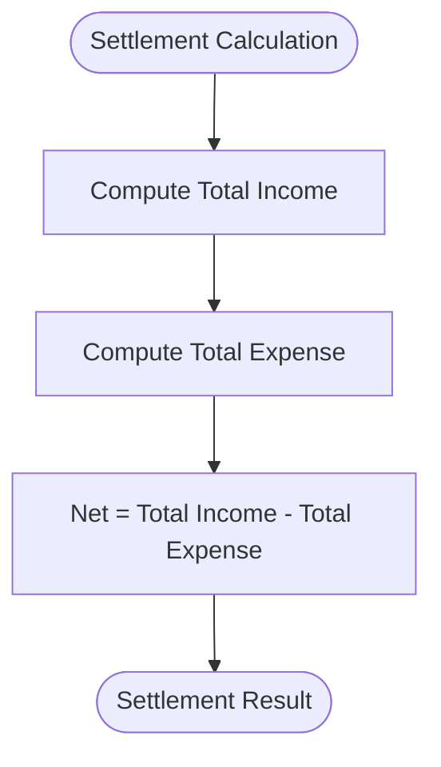
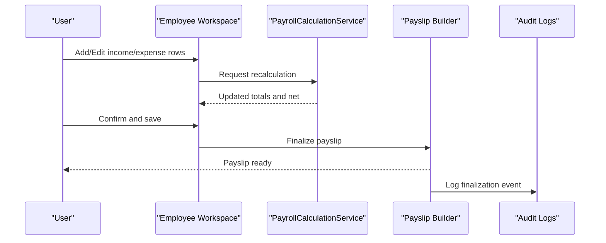
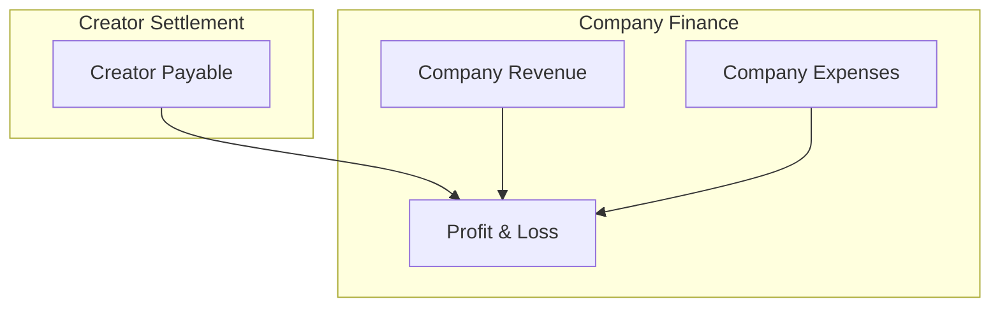
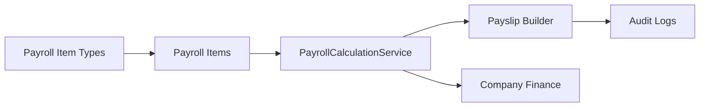

# YouTuber/Talent Settlement Payroll

<cite>
**Referenced Files in This Document**
- [AGENTS.md](file://AGENTS.md)
</cite>

## Table of Contents
1. [Introduction](#introduction)
2. [Project Structure](#project-structure)
3. [Core Components](#core-components)
4. [Architecture Overview](#architecture-overview)
5. [Detailed Component Analysis](#detailed-component-analysis)
6. [Dependency Analysis](#dependency-analysis)
7. [Performance Considerations](#performance-considerations)
8. [Troubleshooting Guide](#troubleshooting-guide)
9. [Conclusion](#conclusion)
10. [Appendices](#appendices)

## Introduction
This document describes the YouTuber/Talent settlement payroll calculation system within the xHR Payroll & Finance System. It explains the settlement formula net = total_income - total_expense and how the system supports profit-and-loss settlements for content creators. It covers income tracking mechanisms, expense categorization, settlement calculation workflows, and integration with the company finance tracking system. The goal is to help both technical and non-technical readers understand how the system operates and how to manage YouTuber/Talent payments consistently and auditably.

## Project Structure
The system is designed around a rule-driven, record-based payroll engine with clear separation of concerns. The settlement mode is one of several payroll modes and integrates with:
- Payroll calculation engine
- Payroll item types and income/expense tracking
- Payslip generation and auditing
- Company finance reporting (revenue, expenses, P&L)

Key structural elements:
- Payroll modes include monthly staff, freelance layer, freelance fixed, youtuber_salary, youtuber_settlement, and custom_hybrid.
- Core entities include employees, payroll batches, payroll items, payslips, company revenues/expenses, and audit logs.
- The UI emphasizes dynamic, spreadsheet-like editing with instant recalculation and clear source flags.

**Diagram sources**
- [AGENTS.md:123-149](file://AGENTS.md#L123-L149)
- [AGENTS.md:338-343](file://AGENTS.md#L338-L343)
- [AGENTS.md:354-359](file://AGENTS.md#L354-L359)
- [AGENTS.md:367-375](file://AGENTS.md#L367-L375)

**Section sources**
- [AGENTS.md:121-149](file://AGENTS.md#L121-L149)
- [AGENTS.md:338-375](file://AGENTS.md#L338-L375)

## Core Components
- Payroll modes: The system defines multiple modes, including youtuber_settlement for profit-and-loss settlements.
- Payroll item types: Income and expense items are categorized via payroll item types and tracked as payroll items.
- Payroll calculation engine: Aggregates income and expenses per mode and produces a net settlement amount.
- Payslip module: Renders and finalizes payslips from calculated results and snapshots.
- Company finance summary: Tracks company revenue and expenses and computes P&L for reporting.

Settlement formula:
- net = total_income - total_expense

This formula applies to the youtuber_settlement payroll mode, enabling creators to be paid according to their actual earnings minus documented business expenses.

**Section sources**
- [AGENTS.md:123-130](file://AGENTS.md#L123-L130)
- [AGENTS.md:387-417](file://AGENTS.md#L387-L417)
- [AGENTS.md:484-487](file://AGENTS.md#L484-L487)

## Architecture Overview
The settlement system is part of the broader payroll architecture. It relies on:
- Payroll item types to classify income and expense entries
- Payroll items to aggregate amounts per batch and employee
- Payroll calculation engine to compute net settlement
- Payslip builder to render and finalize payouts
- Company finance tables to reconcile with corporate P&L

**Diagram sources**
- [AGENTS.md:338-343](file://AGENTS.md#L338-L343)
- [AGENTS.md:354-359](file://AGENTS.md#L354-L359)
- [AGENTS.md:367-375](file://AGENTS.md#L367-L375)

## Detailed Component Analysis

### Settlement Formula and Mode
- Settlement mode: youtuber_settlement uses net = total_income - total_expense.
- Income tracking: total_income aggregates all income items recorded under payroll item types configured for income.
- Expense tracking: total_expense aggregates all expense items recorded under payroll item types configured for expenses.
- Net settlement: The difference becomes the payable amount for the creator.

**Diagram sources**
- [AGENTS.md:484-487](file://AGENTS.md#L484-L487)

**Section sources**
- [AGENTS.md:484-487](file://AGENTS.md#L484-L487)

### Income Tracking Mechanisms
- Payroll item types define categories for income and expense classification.
- Payroll items capture amounts per type and per payroll batch/employee.
- The payroll calculation engine aggregates these items to compute total_income.

Typical income categories for YouTuber/Talent may include:
- Ad revenue
- Sponsorship revenue
- Merchandise sales
- Affiliate commissions
- Platform-specific creator funds

These are recorded as income items in the payroll system and included in total_income during settlement.

**Section sources**
- [AGENTS.md:387-417](file://AGENTS.md#L387-L417)
- [AGENTS.md:338-343](file://AGENTS.md#L338-L343)

### Expense Categorization
- Expenses are tracked similarly to income via payroll item types and payroll items.
- Typical expense categories for YouTuber/Talent may include:
  - Equipment rental or purchase
  - Studio or production costs
  - Editing and post-production
  - Marketing and promotion
  - Software subscriptions
  - Travel and logistics
  - Taxes and professional fees
- These items contribute to total_expense and reduce net settlement.

**Section sources**
- [AGENTS.md:387-417](file://AGENTS.md#L387-L417)
- [AGENTS.md:367-375](file://AGENTS.md#L367-L375)

### Settlement Calculation Workflow
- Data entry: Income and expense items are entered in the Employee Workspace grid with clear source flags and state indicators.
- Recalculation: The PayrollCalculationService aggregates items and computes net.
- Preview: The payslip preview shows income vs. expense breakdown and net.
- Finalization: The payslip is finalized and snapshot data is stored for audit and PDF generation.
- Reporting: Company finance tables update revenue and expenses for consolidated P&L reporting.

**Diagram sources**
- [AGENTS.md:508-546](file://AGENTS.md#L508-L546)
- [AGENTS.md:354-359](file://AGENTS.md#L354-L359)
- [AGENTS.md:576-595](file://AGENTS.md#L576-L595)

**Section sources**
- [AGENTS.md:508-546](file://AGENTS.md#L508-L546)
- [AGENTS.md:354-359](file://AGENTS.md#L354-L359)
- [AGENTS.md:576-595](file://AGENTS.md#L576-L595)

### Integration with Company Finance Tracking
- Company revenue and expenses are tracked separately from individual creator settlements.
- The company finance summary module computes P&L and supports tax simulation and quarterly reporting.
- Settlement totals reconcile with company records to ensure accurate financial statements.

**Diagram sources**
- [AGENTS.md:367-375](file://AGENTS.md#L367-L375)
- [AGENTS.md:387-417](file://AGENTS.md#L387-L417)

**Section sources**
- [AGENTS.md:367-375](file://AGENTS.md#L367-L375)
- [AGENTS.md:387-417](file://AGENTS.md#L387-L417)

## Dependency Analysis
- Payroll item types define the taxonomy for income and expense entries.
- Payroll items depend on payroll batches and employees.
- Payroll calculation engine depends on item types and items.
- Payslip builder depends on finalized payroll results.
- Company finance summary depends on revenue and expense records.

**Diagram sources**
- [AGENTS.md:387-417](file://AGENTS.md#L387-L417)
- [AGENTS.md:338-343](file://AGENTS.md#L338-L343)
- [AGENTS.md:367-375](file://AGENTS.md#L367-L375)
- [AGENTS.md:576-595](file://AGENTS.md#L576-L595)

**Section sources**
- [AGENTS.md:387-417](file://AGENTS.md#L387-L417)
- [AGENTS.md:338-343](file://AGENTS.md#L338-L343)
- [AGENTS.md:367-375](file://AGENTS.md#L367-L375)
- [AGENTS.md:576-595](file://AGENTS.md#L576-L595)

## Performance Considerations
- Keep payroll item types minimal and well-defined to avoid excessive joins and recalculations.
- Use batch processing for large-scale updates to reduce UI latency.
- Store aggregated totals per payroll batch to accelerate previews and reports.
- Ensure database indexing on foreign keys and frequently queried fields (employee_id, payroll_batch_id, item_type_id).

## Troubleshooting Guide
Common issues and resolutions:
- Discrepancies between total_income and total_expense:
  - Verify item types are correctly classified as income vs. expense.
  - Confirm manual overrides are intentional and logged.
- Payslip not finalizing:
  - Check that all required fields are set and validation passes.
  - Review audit logs for blocked actions or permissions.
- Company finance mismatch:
  - Reconcile settlement totals against company revenue/expense records.
  - Ensure all income and expense items are posted to the correct periods.

Audit and compliance:
- Audit logs track who changed what, when, and why.
- High-priority audit areas include payroll item amounts, payslip edits, and module toggles.

**Section sources**
- [AGENTS.md:576-595](file://AGENTS.md#L576-L595)
- [AGENTS.md:508-546](file://AGENTS.md#L508-L546)

## Conclusion
The YouTuber/Talent settlement payroll system uses a straightforward yet robust formula: net = total_income - total_expense. By leveraging structured payroll item types, a rule-driven calculation engine, and a comprehensive audit trail, the system enables accurate, transparent, and compliant settlements for content creators while maintaining seamless integration with company finance reporting.

## Appendices
- Example categories:
  - Income: Ad revenue, sponsorship, merchandise, affiliate commissions, platform creator funds
  - Expenses: Equipment, studio, editing, marketing, software, travel, taxes, professional fees
- Best practices:
  - Use clear item type definitions
  - Maintain source flags and audit logs
  - Finalize payslips before exporting PDFs
  - Reconcile settlement totals with company finance records