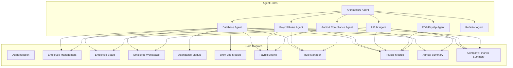
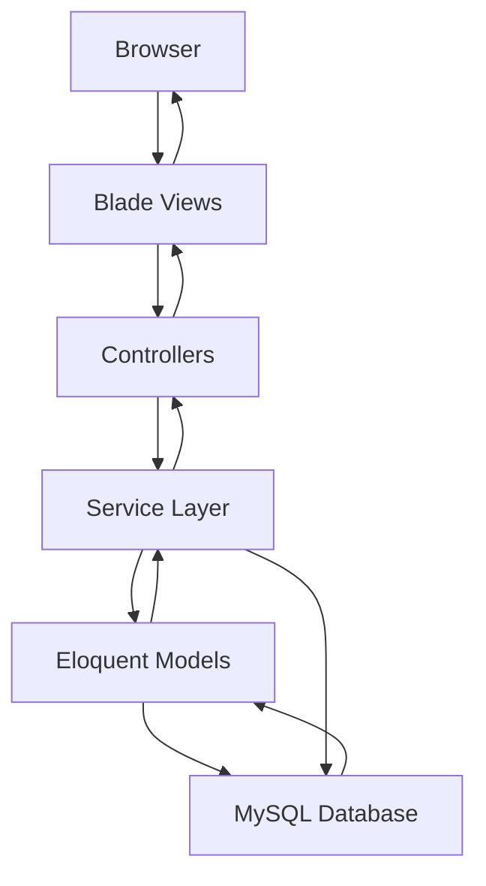
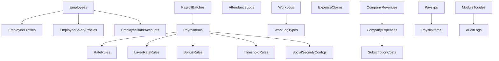

# Key Features

<cite>
**Referenced Files in This Document**
- [AGENTS.md](file://AGENTS.md)
</cite>

## Table of Contents
1. [Introduction](#introduction)
2. [Project Structure](#project-structure)
3. [Core Components](#core-components)
4. [Architecture Overview](#architecture-overview)
5. [Detailed Component Analysis](#detailed-component-analysis)
6. [Dependency Analysis](#dependency-analysis)
7. [Performance Considerations](#performance-considerations)
8. [Troubleshooting Guide](#troubleshooting-guide)
9. [Conclusion](#conclusion)

## Introduction
This document presents the key features of the xHR Payroll & Finance System as defined in the project’s development guide. It focuses on multi-payroll mode support, dynamic data entry with an Excel-like interface, rule-driven business logic configuration, comprehensive audit trail, PDF payslip generation, annual and company financial summaries, and attendance/work log tracking. Practical benefits and usage scenarios are included to demonstrate how each feature improves payroll management for real-world organizations.

## Project Structure
The system is designed around a PHP-first, MySQL-backed architecture with a focus on maintainability, auditability, and spreadsheet-like usability. The guide outlines:
- Core design principles: record-based storage, single source of truth, rule-driven logic, dynamic but controlled editing, and maintainability-first engineering.
- Technology stack: PHP 8.2+, Laravel preferred, MySQL 8+, phpMyAdmin-compatible schema, and lightweight client-side scripting for dynamic grids.
- Agent roles: Architecture, Database, Payroll Rules, UI/UX, PDF/Payslip, Audit & Compliance, and Refactor agents.

**Diagram sources**
- [AGENTS.md:153-283](file://AGENTS.md#L153-L283)
- [AGENTS.md:286-382](file://AGENTS.md#L286-L382)

**Section sources**
- [AGENTS.md:23-31](file://AGENTS.md#L23-L31)
- [AGENTS.md:102-118](file://AGENTS.md#L102-L118)
- [AGENTS.md:153-283](file://AGENTS.md#L153-L283)
- [AGENTS.md:286-382](file://AGENTS.md#L286-L382)

## Core Components
This section summarizes the core components and their responsibilities as defined in the guide.

- Employee Management: Add/edit employees, assign payroll mode, departments, positions, bank accounts, and SSO eligibility.
- Employee Board: Card/grid list with search and filters; opens Employee Workspace.
- Employee Workspace: Central payroll interface with month selector, summary cards, main payroll grid, detail inspector, payslip preview, and audit timeline.
- Attendance Module: Check-in/check-out style input, late minutes, early leave, OT enablement, and LWOP flag.
- Work Log Module: Date, work type, quantity/time units, layer, rate, and amount for freelancers and hybrid modes.
- Payroll Engine: Calculates payrolls by mode, aggregates income/deductions, supports manual override, and produces snapshots.
- Rule Manager: Configures attendance rules, OT rules, bonus rules, threshold rules, layer rate rules, SSO rules, tax rules, and module toggles.
- Payslip Module: Preview, finalize, export PDF, and regenerate from finalized data only by permission.
- Annual Summary: 12-month view, employee summary, annual totals, and export.
- Company Finance Summary: Revenue, expenses, profit/loss, cumulative, quarterly, and tax simulation.
- Audit & Compliance: Logs all significant changes with who, what, field, old/new values, action, timestamp, and optional reason.

**Section sources**
- [AGENTS.md:294-382](file://AGENTS.md#L294-L382)
- [AGENTS.md:438-595](file://AGENTS.md#L438-L595)
- [AGENTS.md:576-595](file://AGENTS.md#L576-L595)

## Architecture Overview
The system architecture emphasizes separation of concerns and maintainability while preserving a familiar spreadsheet-like user experience.

**Diagram sources**
- [AGENTS.md:600-647](file://AGENTS.md#L600-L647)

**Section sources**
- [AGENTS.md:600-647](file://AGENTS.md#L600-L647)

## Detailed Component Analysis

### Multi-Payroll Mode Support
The system supports six payroll modes, each with distinct calculation rules and use cases.

- Monthly Staff Payroll
  - Income: base salary plus overtime pay, diligence allowance, performance bonus, and other income.
  - Deductions: cash advance, late deduction, LWOP deduction, social security employee portion, and other deductions.
  - Net pay: total income minus total deductions.
  - Benefits: standardized monthly calculation, configurable allowances and thresholds, and audit-ready records.

- Freelance Layer Rate Payroll
  - Calculation: duration in minutes plus fractional seconds converted to minutes, multiplied by rate per minute.
  - Benefits: precise time-based compensation for freelancers with layered rates.

- Freelance Fixed Rate Payroll
  - Calculation: quantity multiplied by fixed rate.
  - Benefits: straightforward billing for fixed deliverables.

- YouTuber/Talent Salary Payroll
  - Similar to monthly staff but scoped to talent-related modules.
  - Benefits: dedicated configuration for content creators’ salary structures.

- YouTuber/Talent Settlement Payroll
  - Calculation: net equals total income minus total expense.
  - Benefits: simplified P&L settlement for talent engagements.

- Custom Hybrid Payroll Mode
  - Allows combining multiple modes and manual overrides for complex scenarios.
  - Benefits: flexibility for unique contracts and cross-mode compensation.

Practical examples:
- A freelancer logs daily work minutes and rates; the system auto-calculates earnings per task and aggregates monthly totals.
- A talent receives a monthly retainer plus performance thresholds; the system applies thresholds and generates a settlement statement at contract end.
- A hybrid contract includes a base salary plus project-based bonuses; the system supports both modes concurrently with clear audit trails.

**Section sources**
- [AGENTS.md:440-497](file://AGENTS.md#L440-L497)
- [AGENTS.md:123-130](file://AGENTS.md#L123-L130)

### Dynamic Data Entry System (Excel-like Interface)
The UI mimics spreadsheets while enforcing structured data entry and audit controls.

- Main payroll grid supports:
  - Add/remove/duplicate rows
  - Inline editing
  - Dropdown categories/types
  - Auto amount calculation
  - Manual override
  - Instant recalculation
  - Source badges indicating origin (auto/manual/override/master)
- Detail Inspector shows:
  - Source of values
  - Formula/rule source
  - Whether item is monthly-only or master
  - Notes/reasons
  - Audit history for the row
- Required UI states include locked/auto/manual/override/from_master/rule_applied/draft/finalized.

Benefits:
- Reduces friction for payroll processors familiar with spreadsheets.
- Maintains data integrity and transparency through state indicators and audit logs.

**Section sources**
- [AGENTS.md:513-546](file://AGENTS.md#L513-L546)
- [AGENTS.md:528-538](file://AGENTS.md#L528-L538)

### Rule-Driven Business Logic Configuration
Rules are stored in configuration tables and applied consistently across payroll calculations.

- Configurable rules include:
  - Overtime (by minute/hour, thresholds, enable flags)
  - Diligence allowance
  - Performance threshold
  - Layer rate
  - Social security
  - Bonuses
  - Deductions
  - Module toggles
- Anti-patterns: avoid hardcoded values, logic in views/controllers, and magic numbers.

Benefits:
- Enables rapid adaptation to changing regulations and internal policies.
- Supports testing and validation of rule interdependencies.

**Section sources**
- [AGENTS.md:61-74](file://AGENTS.md#L61-L74)
- [AGENTS.md:196-221](file://AGENTS.md#L196-L221)
- [AGENTS.md:344-352](file://AGENTS.md#L344-L352)
- [AGENTS.md:663-672](file://AGENTS.md#L663-L672)

### Comprehensive Audit Trail System
Every significant change is logged with:
- Who performed the action
- What entity and field changed
- Old and new values
- Action type and timestamp
- Optional reason

High-priority audit areas include:
- Employee salary profile changes
- Payroll item amounts
- Payslip edits/finalization
- Rule/module/Social Security configuration changes

Benefits:
- Ensures compliance and traceability.
- Supports rollback capability and historical reporting.

**Section sources**
- [AGENTS.md:578-595](file://AGENTS.md#L578-L595)
- [AGENTS.md:257-271](file://AGENTS.md#L257-L271)

### PDF Payslip Generation
Payslips are rendered from finalized data snapshots to guarantee consistency and immutability.

- Structure includes company header, employee details, month, payment date, bank/account info, income and deduction columns, totals, and signatures.
- Critical rule: reductions must appear in deductions, not by decreasing base salary in income.
- Snapshot rule: upon finalization, items are copied to payslip items, totals and rendering metadata are stored, and PDFs are generated from the snapshot.

Benefits:
- Professional, tamper-evident payslips.
- Consistent rendering across months and users.

**Section sources**
- [AGENTS.md:549-573](file://AGENTS.md#L549-L573)
- [AGENTS.md:245-256](file://AGENTS.md#L245-L256)

### Annual and Company Financial Summaries
- Annual Summary: 12-month view, employee-level summary, annual totals, and export.
- Company Finance Summary: revenue, expenses, profit/loss, cumulative, quarterly, and tax simulation.

Benefits:
- Simplifies year-end reporting and planning.
- Provides insights into organizational financial health.

**Section sources**
- [AGENTS.md:360-382](file://AGENTS.md#L360-L382)
- [AGENTS.md:686-689](file://AGENTS.md#L686-L689)

### Attendance and Work Log Tracking
- Attendance Module: check-in/check-out style input, late minutes, early leave, OT enablement, LWOP flag.
- Work Log Module: date, work type, quantity/time units, layer, rate, and amount for freelancers and hybrid modes.

Benefits:
- Accurate time tracking for OT and LWOP calculations.
- Transparent, auditable records for freelancers and hybrid workers.

**Section sources**
- [AGENTS.md:322-337](file://AGENTS.md#L322-L337)
- [AGENTS.md:385-416](file://AGENTS.md#L385-L416)

## Dependency Analysis
The system’s modules depend on a shared set of entities and services, with clear separation of concerns.

**Diagram sources**
- [AGENTS.md:387-416](file://AGENTS.md#L387-L416)

**Section sources**
- [AGENTS.md:387-416](file://AGENTS.md#L387-L416)

## Performance Considerations
- Maintainability-first design ensures efficient future enhancements without introducing technical debt.
- Rule-driven configuration reduces hardcoded logic and promotes reuse.
- Structured data entry and audit logs minimize rework and improve data quality.
- Lightweight client-side scripting supports responsive grid interactions without heavy frameworks.

[No sources needed since this section provides general guidance]

## Troubleshooting Guide
Common issues and resolutions grounded in the system’s design:

- Incorrect net pay calculation
  - Verify that reductions are recorded under deductions, not by lowering base salary in income.
  - Confirm that the correct payroll mode is selected and that related rules are configured.

- Payslip discrepancies
  - Check the finalized snapshot and audit logs for manual overrides or rule changes.
  - Ensure the payslip was generated from the snapshot, not live calculations.

- Attendance/LWOP errors
  - Review attendance logs for late minutes and LWOP flags; confirm thresholds and module toggles.
  - Validate work log entries for freelancers and hybrid modes.

- Rule changes not taking effect
  - Confirm that the rule manager updates the appropriate configuration tables.
  - Check module toggles and ensure the relevant module is enabled.

**Section sources**
- [AGENTS.md:562-566](file://AGENTS.md#L562-L566)
- [AGENTS.md:567-573](file://AGENTS.md#L567-L573)
- [AGENTS.md:578-595](file://AGENTS.md#L578-L595)
- [AGENTS.md:344-352](file://AGENTS.md#L344-L352)

## Conclusion
The xHR Payroll & Finance System delivers a modern, maintainable, and audit-ready solution for diverse payroll needs. Its multi-payroll modes, dynamic Excel-like interface, rule-driven configuration, comprehensive audit trail, PDF payslip generation, and financial summaries collectively address the complexities of contemporary payroll management while preserving simplicity and transparency.

[No sources needed since this section summarizes without analyzing specific files]