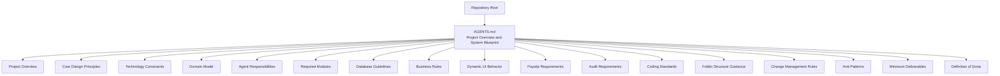
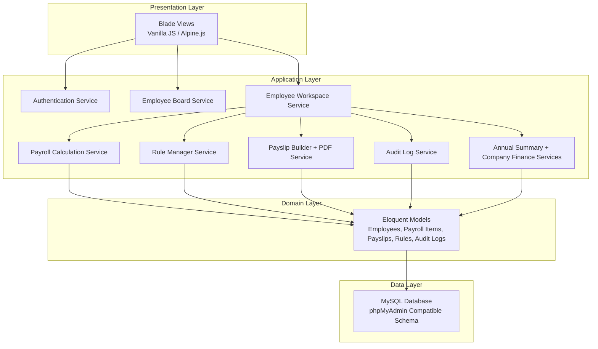
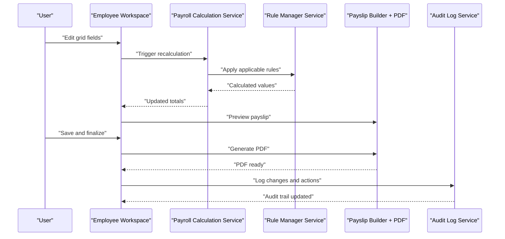
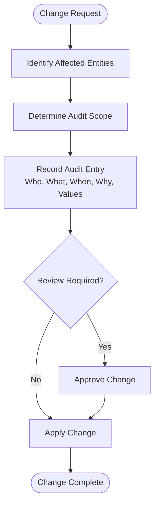
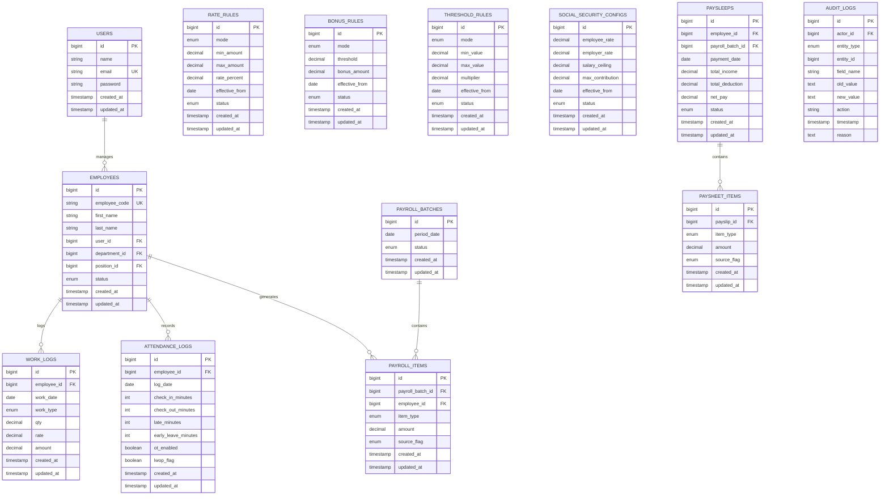
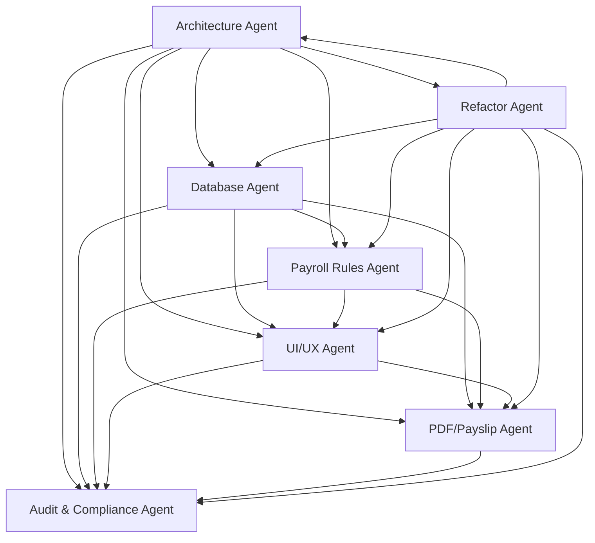

# Project Overview

<cite>
**Referenced Files in This Document**
- [AGENTS.md](file://AGENTS.md)
</cite>

## Table of Contents
1. [Introduction](#introduction)
2. [Project Structure](#project-structure)
3. [Core Components](#core-components)
4. [Architecture Overview](#architecture-overview)
5. [Detailed Component Analysis](#detailed-component-analysis)
6. [Dependency Analysis](#dependency-analysis)
7. [Performance Considerations](#performance-considerations)
8. [Troubleshooting Guide](#troubleshooting-guide)
9. [Conclusion](#conclusion)
10. [Appendices](#appendices)

## Introduction
The xHR Payroll & Finance System is a modern replacement for Excel-based payroll management, designed to streamline and secure financial operations for organizations. It targets HR professionals and finance teams who manage diverse payroll modes including monthly staff, freelancers (layer and fixed rates), YouTubers/Talent (salary and settlement), social security contributions, bonuses, and company finance summaries. The system emphasizes automation, auditability, and compliance while preserving the familiar spreadsheet-like user experience.

Key benefits include:
- Automated calculations driven by configurable rules
- Complete audit trails for transparency and compliance
- PDF payslip generation with standardized templates
- Dynamic, controlled editing that feels like Excel but enforces data integrity
- Maintainability-first architecture enabling future enhancements

## Project Structure
The repository currently includes a comprehensive guide that defines the system’s purpose, design principles, technology stack, domain model, agent roles, required modules, database guidelines, business rules, UI behaviors, audit requirements, coding standards, folder structure guidance, change management, anti-patterns, and minimum deliverables. This guide serves as the foundational blueprint for building the system.

**Diagram sources**
- [AGENTS.md:1-721](file://AGENTS.md#L1-L721)

**Section sources**
- [AGENTS.md:9-31](file://AGENTS.md#L9-L31)
- [AGENTS.md:102-118](file://AGENTS.md#L102-L118)
- [AGENTS.md:121-151](file://AGENTS.md#L121-L151)
- [AGENTS.md:153-284](file://AGENTS.md#L153-L284)
- [AGENTS.md:286-383](file://AGENTS.md#L286-L383)
- [AGENTS.md:385-436](file://AGENTS.md#L385-L436)
- [AGENTS.md:438-506](file://AGENTS.md#L438-L506)
- [AGENTS.md:508-547](file://AGENTS.md#L508-L547)
- [AGENTS.md:549-574](file://AGENTS.md#L549-L574)
- [AGENTS.md:576-596](file://AGENTS.md#L576-L596)
- [AGENTS.md:598-620](file://AGENTS.md#L598-L620)
- [AGENTS.md:622-647](file://AGENTS.md#L622-L647)
- [AGENTS.md:650-672](file://AGENTS.md#L650-L672)
- [AGENTS.md:675-710](file://AGENTS.md#L675-L710)

## Core Components
The system is built around a set of core components that align with the agent responsibilities and required modules. These components ensure modularity, maintainability, and scalability.

- Authentication and Authorization: Login/logout, role/permission management
- Employee Management: Add/edit employees, assign payroll modes, departments, positions, bank info, and SSO eligibility
- Employee Board: Card/grid list, search, filters, and quick access to workspaces
- Employee Workspace: Central interface for payroll entry, real-time recalculation, payslip preview, audit timeline, and inspector
- Attendance Module: Check-in/check-out, late minutes, early leave, OT enablement, LWOP flag
- Work Log Module: Date, work type, quantity/time units, layer, rate, amount
- Payroll Engine: Mode-specific calculations, income/deduction aggregation, manual override support, snapshot production
- Rule Manager: Configurable rules for attendance, OT, bonuses, thresholds, layer rates, SSO, taxes, and module toggles
- Payslip Module: Preview, finalize, export PDF, regeneration controls
- Annual Summary: 12-month view, employee summary, annual totals, export
- Company Finance Summary: Revenue, expenses, profit/loss, cumulative, quarterly, tax simulation
- Subscription and Extra Costs: Recurring software, fixed costs, equipment, dubbing, other business expenses

These components collectively address common payroll challenges such as inconsistent calculations, lack of auditability, manual errors, and difficulty in maintaining historical records.

**Section sources**
- [AGENTS.md:288-382](file://AGENTS.md#L288-L382)
- [AGENTS.md:338-353](file://AGENTS.md#L338-L353)
- [AGENTS.md:354-366](file://AGENTS.md#L354-L366)
- [AGENTS.md:367-382](file://AGENTS.md#L367-L382)

## Architecture Overview
The system follows a PHP-first, Laravel-oriented architecture with MySQL/phpMyAdmin compatibility. It enforces rule-driven, dynamic data entry with strong auditability and maintainability. The architecture separates concerns across agents, ensuring clean boundaries and reusable services.

**Diagram sources**
- [AGENTS.md:104-110](file://AGENTS.md#L104-L110)
- [AGENTS.md:196-221](file://AGENTS.md#L196-L221)
- [AGENTS.md:245-256](file://AGENTS.md#L245-L256)
- [AGENTS.md:257-271](file://AGENTS.md#L257-L271)
- [AGENTS.md:636-647](file://AGENTS.md#L636-L647)

## Detailed Component Analysis

### Payroll Modes and Business Value
The system supports multiple payroll modes to meet varied organizational needs:
- Monthly staff: Base salary plus overtime, allowances, performance bonuses, and deductions
- Freelance layer: Minute-based work logs with layered rates
- Freelance fixed: Fixed-rate jobs with quantity-based amounts
- YouTuber/Talent salary and settlement: Specialized modules for creators’ compensation and settlement

Business value:
- Reduces manual effort and human errors typical in Excel-based systems
- Provides standardized, auditable calculations aligned with local regulations (e.g., social security)
- Enables quick scenario modeling and rule changes without disrupting existing data

**Section sources**
- [AGENTS.md:123-131](file://AGENTS.md#L123-L131)
- [AGENTS.md:440-487](file://AGENTS.md#L440-L487)

### Rule-Driven Calculations
Rules are stored in configuration tables and applied dynamically during payroll runs. This ensures:
- Consistency across calculations
- Easy updates to formulas and thresholds
- Traceability of changes through audit logs

Common rule categories:
- Overtime, diligence allowance, performance thresholds, layer rates, social security, bonuses, deductions, module toggles

**Section sources**
- [AGENTS.md:61-74](file://AGENTS.md#L61-L74)
- [AGENTS.md:344-352](file://AGENTS.md#L344-L352)
- [AGENTS.md:454-471](file://AGENTS.md#L454-L471)

### Dynamic UI and User Experience
The UI mimics spreadsheet behavior with inline editing, instant recalculation, and preview capabilities. Users can:
- Add/remove/duplicate rows
- Toggle between auto/manual/override states
- Inspect row sources and audit history
- Finalize payslips with snapshot protection

**Diagram sources**
- [AGENTS.md:513-515](file://AGENTS.md#L513-L515)
- [AGENTS.md:517-527](file://AGENTS.md#L517-L527)
- [AGENTS.md:539-546](file://AGENTS.md#L539-L546)
- [AGENTS.md:567-573](file://AGENTS.md#L567-L573)

**Section sources**
- [AGENTS.md:508-547](file://AGENTS.md#L508-L547)
- [AGENTS.md:549-574](file://AGENTS.md#L549-L574)

### Audit and Compliance
The system mandates comprehensive audit logging for high-risk changes and operations:
- Who changed what, when, and why
- Old/new values and action types
- Audit coverage for salary profiles, payroll items, payslip edits, rule changes, and module toggles

**Diagram sources**
- [AGENTS.md:578-596](file://AGENTS.md#L578-L596)

**Section sources**
- [AGENTS.md:576-596](file://AGENTS.md#L576-L596)

### Database Design and Maintainability
The database schema adheres to conventions that support phpMyAdmin compatibility and future growth:
- Plural snake_case table names, explicit primary and foreign keys
- Monetary fields use precise decimals; durations use integers
- Status flags, timestamps, and soft deletes where appropriate
- Suggested tables cover users, roles, permissions, employees, payroll batches, items, attendance/work logs, rules, expense claims, company finances, subscription costs, payslips, module toggles, and audit logs

**Diagram sources**
- [AGENTS.md:387-417](file://AGENTS.md#L387-L417)

**Section sources**
- [AGENTS.md:385-436](file://AGENTS.md#L385-L436)

## Dependency Analysis
The system’s agent roles define clear dependencies and responsibilities, ensuring separation of concerns and maintainability.

**Diagram sources**
- [AGENTS.md:158-283](file://AGENTS.md#L158-L283)

**Section sources**
- [AGENTS.md:153-284](file://AGENTS.md#L153-L284)

## Performance Considerations
- Use indexed foreign keys and appropriate data types to optimize query performance
- Batch payroll calculations and limit recalculations to visible changes
- Employ snapshots for payslips to avoid recomputation overhead
- Cache frequently accessed rule configurations and module toggles
- Minimize N+1 queries in reporting and summary views

## Troubleshooting Guide
Common issues and resolutions:
- Incorrect calculations: Verify rule configurations and effective dates; confirm source flags and manual overrides
- Audit gaps: Ensure all high-risk changes trigger audit logging; review permission scopes
- PDF discrepancies: Confirm finalized snapshot integrity; re-generate PDFs from approved data only
- UI inconsistencies: Check state flags (locked/auto/manual/override); validate real-time recalculation triggers
- Database schema mismatches: Align with phpMyAdmin compatibility guidelines; verify migrations and indexes

**Section sources**
- [AGENTS.md:663-672](file://AGENTS.md#L663-L672)
- [AGENTS.md:578-596](file://AGENTS.md#L578-L596)
- [AGENTS.md:567-573](file://AGENTS.md#L567-L573)

## Conclusion
The xHR Payroll & Finance System transforms traditional Excel-based payroll into a robust, rule-driven, and auditable platform. By combining spreadsheet-like usability with enterprise-grade architecture, it empowers HR and finance teams to manage diverse payroll modes efficiently, maintain compliance, and scale operations confidently. The modular design and comprehensive agent responsibilities ensure long-term maintainability and adaptability to evolving business needs.

## Appendices
- Minimum deliverables and definition of done provide clear milestones for iterative development and validation.

**Section sources**
- [AGENTS.md:675-710](file://AGENTS.md#L675-L710)