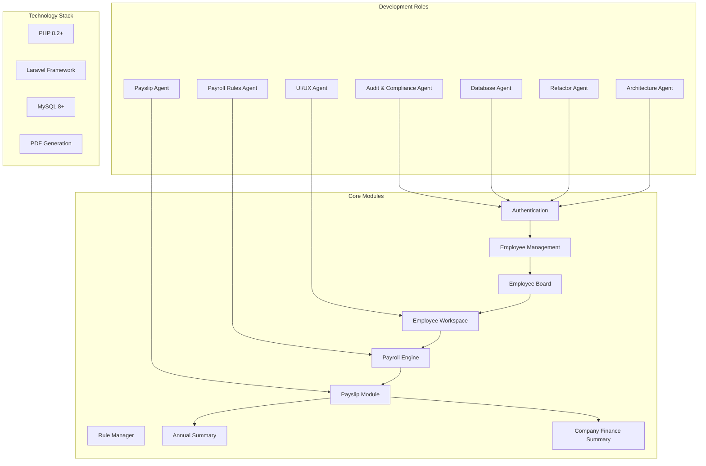
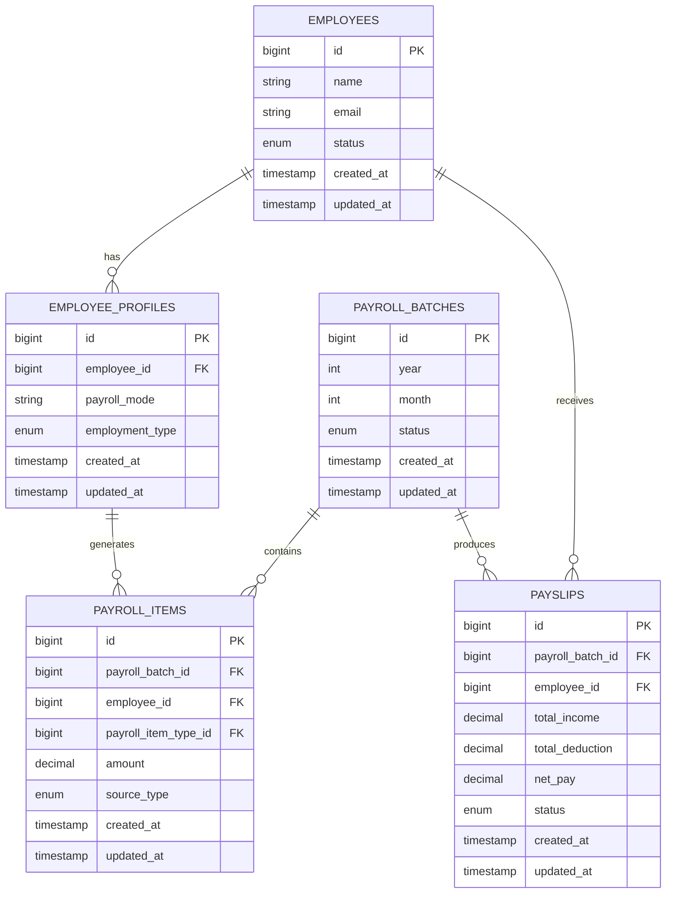
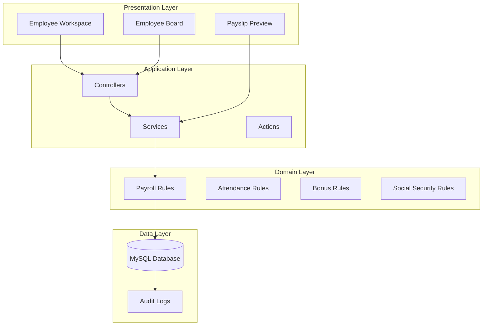
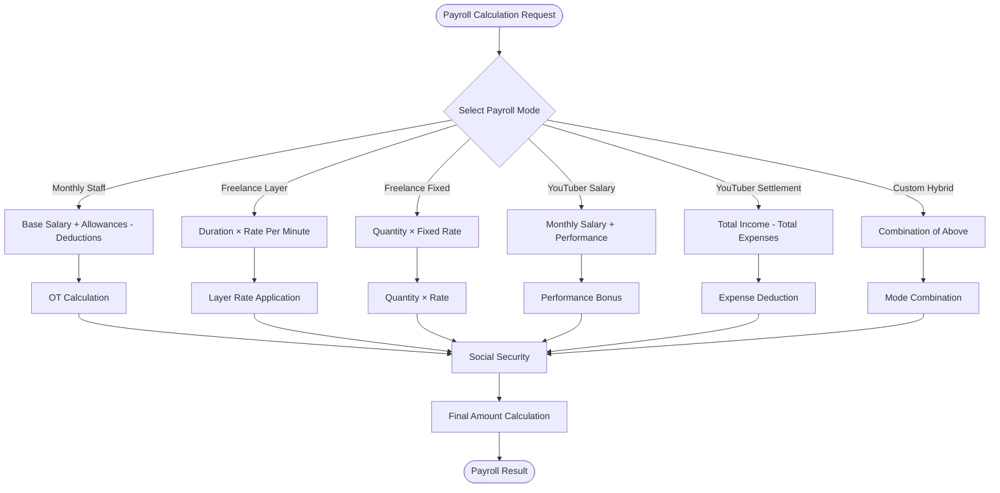
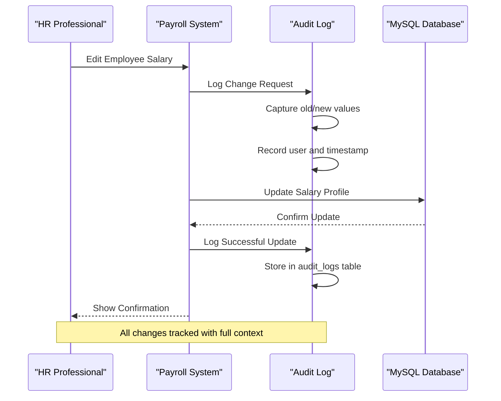
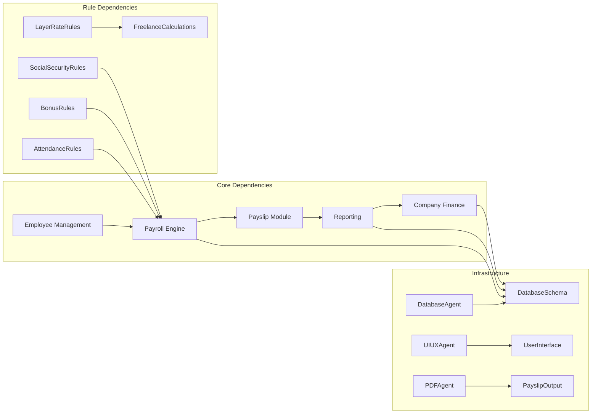

# System Introduction

<cite>
**Referenced Files in This Document**
- [AGENTS.md](file://AGENTS.md)
</cite>

## Table of Contents
1. [Introduction](#introduction)
2. [Project Structure](#project-structure)
3. [Core Components](#core-components)
4. [Architecture Overview](#architecture-overview)
5. [Detailed Component Analysis](#detailed-component-analysis)
6. [Dependency Analysis](#dependency-analysis)
7. [Performance Considerations](#performance-considerations)
8. [Troubleshooting Guide](#troubleshooting-guide)
9. [Conclusion](#conclusion)

## Introduction
The xHR Payroll & Finance System is a modern, database-driven replacement for traditional Excel-based payroll management. It transforms manual, error-prone spreadsheets into an automated, auditable, and scalable solution designed for real-world enterprise environments.

Traditional payroll systems built on spreadsheets suffer from several critical limitations:
- Manual calculations prone to human error
- No audit trail or version control
- Difficult reporting and compliance tracking
- Limited scalability for growing organizations
- Risk of data corruption and inconsistent formulas
- Time-consuming reconciliation processes

The xHR system addresses these challenges by establishing a single source of truth, implementing rule-driven calculations, and providing comprehensive audit capabilities while maintaining the familiar spreadsheet-like user experience.

## Project Structure
The repository follows a structured approach to system development with clearly defined roles and responsibilities:

**Diagram sources**
- [AGENTS.md:153-283](file://AGENTS.md#L153-L283)
- [AGENTS.md:286-383](file://AGENTS.md#L286-L383)

**Section sources**
- [AGENTS.md:1-721](file://AGENTS.md#L1-L721)

## Core Components
The system is built around seven core agents, each responsible for specific aspects of payroll and financial management:

### Payroll Modes
The system supports six distinct payroll calculation modes:
- **Monthly Staff**: Traditional salaried employees with fixed monthly compensation
- **Freelance Layer**: Rate-based calculations with tiered pricing structures
- **Freelance Fixed**: Flat-rate project-based compensation
- **YouTuber Salary**: Salary-based talent compensation
- **YouTuber Settlement**: Profit-sharing based on revenue generation
- **Custom Hybrid**: Flexible combinations of the above modes

### Data Model Architecture
The system establishes a record-based approach replacing Excel's cell-centric model:

**Diagram sources**
- [AGENTS.md:387-417](file://AGENTS.md#L387-L417)

**Section sources**
- [AGENTS.md:121-150](file://AGENTS.md#L121-L150)
- [AGENTS.md:385-435](file://AGENTS.md#L385-L435)

## Architecture Overview
The system follows a modular architecture with clear separation of concerns:

**Diagram sources**
- [AGENTS.md:598-647](file://AGENTS.md#L598-L647)

The architecture emphasizes:
- **Rule-driven calculations** stored in database tables
- **Single source of truth** for all payroll data
- **Comprehensive audit trails** for all changes
- **Flexible payroll modes** through configuration
- **Spreadsheet-like user experience** with backend integrity

**Section sources**
- [AGENTS.md:23-31](file://AGENTS.md#L23-L31)
- [AGENTS.md:34-100](file://AGENTS.md#L34-L100)

## Detailed Component Analysis

### Payroll Calculation Engine
The system implements sophisticated calculation logic through configurable rules:

**Diagram sources**
- [AGENTS.md:440-497](file://AGENTS.md#L440-L497)

### Audit and Compliance Framework
The system maintains comprehensive audit trails for all critical operations:

**Diagram sources**
- [AGENTS.md:576-595](file://AGENTS.md#L576-L595)

**Section sources**
- [AGENTS.md:438-506](file://AGENTS.md#L438-L506)
- [AGENTS.md:576-595](file://AGENTS.md#L576-L595)

## Dependency Analysis
The system establishes clear dependencies between components:

**Diagram sources**
- [AGENTS.md:196-221](file://AGENTS.md#L196-L221)
- [AGENTS.md:222-256](file://AGENTS.md#L222-L256)

**Section sources**
- [AGENTS.md:153-283](file://AGENTS.md#L153-L283)

## Performance Considerations
The system is designed for optimal performance through several key strategies:

- **Database Optimization**: Proper indexing on frequently queried fields like employee_id, payroll_batch_id, and date ranges
- **Caching Strategy**: Strategic caching of frequently accessed rule configurations and employee profiles
- **Batch Processing**: Efficient batch calculation of payroll items during processing cycles
- **Lazy Loading**: On-demand loading of detailed payroll item data to minimize initial page load times
- **Connection Pooling**: Optimized database connection management for concurrent user scenarios

## Troubleshooting Guide
Common issues and their solutions:

### Data Integrity Issues
- **Problem**: Inconsistent payroll calculations across different modes
- **Solution**: Verify rule configurations in the database and ensure proper rule precedence
- **Prevention**: Regular audit log reviews and automated validation checks

### Performance Degradation
- **Problem**: Slow payroll processing during peak periods
- **Solution**: Optimize database queries, implement proper indexing, and consider batch processing improvements
- **Monitoring**: Track query execution times and database connection usage

### User Experience Challenges
- **Problem**: Confusion about manual vs automatic calculations
- **Solution**: Implement clearer UI indicators for field states and provide tooltips explaining calculation sources
- **Training**: Comprehensive user documentation and onboarding materials

**Section sources**
- [AGENTS.md:663-672](file://AGENTS.md#L663-L672)

## Conclusion
The xHR Payroll & Finance System represents a fundamental shift from traditional Excel-based payroll management to a modern, database-driven solution. By eliminating the limitations of spreadsheets while preserving their familiar interface, the system delivers:

- **Automated Calculations**: Eliminating manual errors through rule-driven processing
- **Complete Audit Trail**: Full transparency of all payroll modifications and their contexts
- **Scalable Architecture**: Supporting growing organizations without sacrificing performance
- **Flexible Configuration**: Adaptable rules and payroll modes for diverse business needs
- **Enterprise-Ready Features**: Professional-grade security, compliance, and reporting capabilities

This system enables HR professionals, finance teams, and business owners to manage payroll efficiently while maintaining the flexibility needed for complex organizational structures and evolving business requirements.