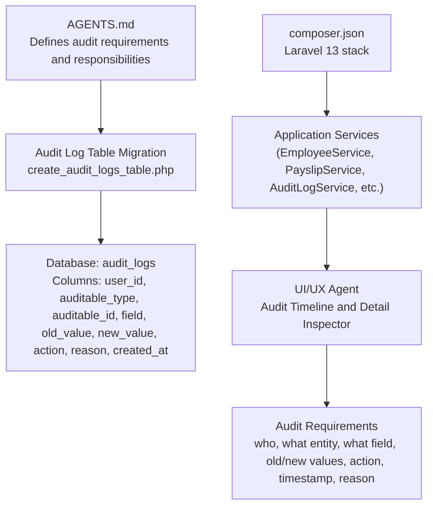
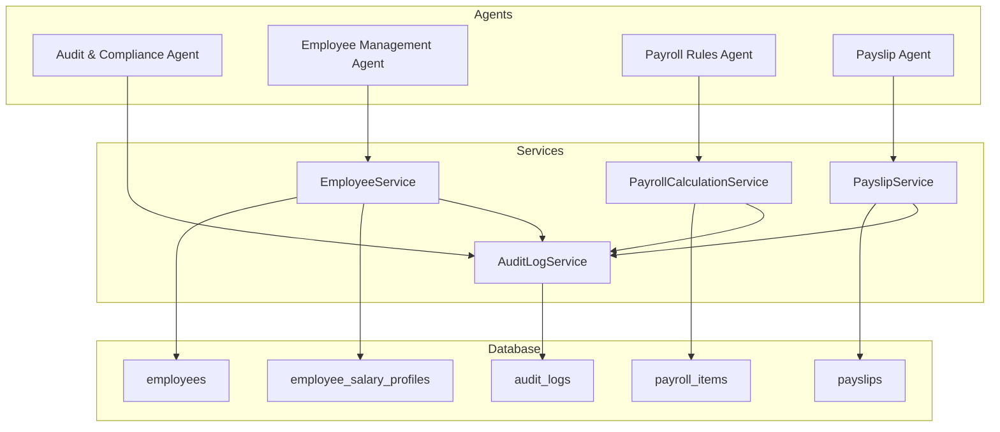
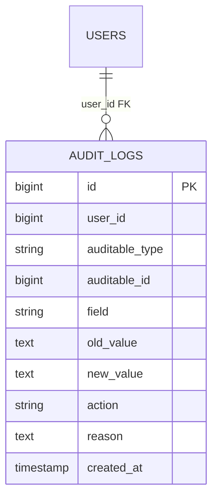
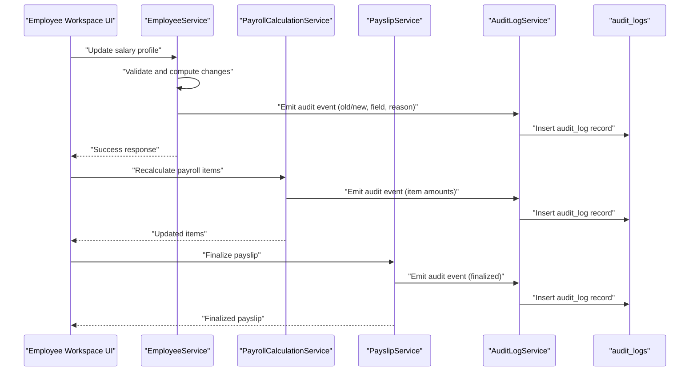
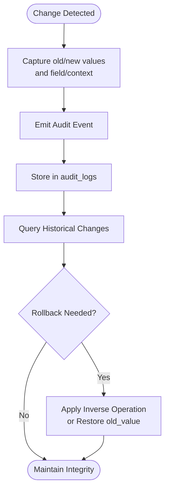
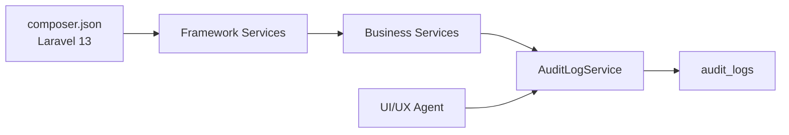

# Audit Trail and Integration Patterns

<cite>
**Referenced Files in This Document**
- [AGENTS.md](file://AGENTS.md)
- [create_audit_logs_table.php](file://database/migrations/0001_01_01_000011_create_audit_logs_table.php)
- [composer.json](file://composer.json)
</cite>

## Table of Contents
1. [Introduction](#introduction)
2. [Project Structure](#project-structure)
3. [Core Components](#core-components)
4. [Architecture Overview](#architecture-overview)
5. [Detailed Component Analysis](#detailed-component-analysis)
6. [Dependency Analysis](#dependency-analysis)
7. [Performance Considerations](#performance-considerations)
8. [Troubleshooting Guide](#troubleshooting-guide)
9. [Conclusion](#conclusion)

## Introduction
This document describes the audit trail implementation and integration patterns for the xHR payroll and finance system. It explains how audit logging captures meaningful changes across major components—employee management, payroll processing, rule configuration, and payslip finalization—and how the audit log supports compliance requirements. The audit log structure includes who, what entity, what field, old value, new value, action, timestamp, and an optional reason. Integration points, service coordination, historical record maintenance, and rollback capability are documented with practical examples and diagrams.

## Project Structure
The repository defines the audit system in a central specification document and includes a database migration for the audit log table. The Laravel application stack is declared in the project configuration.

**Diagram sources**
- [AGENTS.md](file://AGENTS.md)
- [create_audit_logs_table.php](file://database/migrations/0001_01_01_000011_create_audit_logs_table.php)
- [composer.json](file://composer.json)

**Section sources**
- [AGENTS.md](file://AGENTS.md)
- [create_audit_logs_table.php](file://database/migrations/0001_01_01_000011_create_audit_logs_table.php)
- [composer.json](file://composer.json)

## Core Components
- Audit Log Table: Stores audit records with indexed references to auditable entities and timestamps for efficient querying.
- Audit Requirements: Defines the required fields for audit events and high-priority audit areas.
- Agent Responsibilities: Assigns ownership of audit coverage to specific agents (e.g., Audit & Compliance Agent).
- Service Layer: Suggests dedicated services for business operations that should emit audit events (e.g., AuditLogService, EmployeeService, PayslipService).

Key audit log structure:
- Who: user_id (nullable to capture system-initiated actions)
- What entity: auditable_type (model class), auditable_id
- What field: field (nullable)
- Old/New values: old_value, new_value (text)
- Action: action (e.g., created, updated, deleted, finalized, unfinalized)
- Timestamp: created_at
- Optional reason: reason (text)

High-priority audit areas:
- Employee salary profile
- Payroll item amount
- Payslip finalize/unfinalize
- Rule changes
- Module toggle changes
- SSO config changes

**Section sources**
- [create_audit_logs_table.php](file://database/migrations/0001_01_01_000011_create_audit_logs_table.php)
- [AGENTS.md](file://AGENTS.md)

## Architecture Overview
The audit system is integrated across the application’s major workflows. The Audit & Compliance Agent coordinates audit coverage, while services emit structured audit events. The UI surfaces audit history for transparency and compliance review.

**Diagram sources**
- [AGENTS.md](file://AGENTS.md)
- [create_audit_logs_table.php](file://database/migrations/0001_01_01_000011_create_audit_logs_table.php)

## Detailed Component Analysis

### Audit Log Table Schema
The audit log table is designed to:
- Reference the acting user (nullable for system actions)
- Identify the auditable entity by model class and ID
- Capture the affected field (nullable for bulk changes)
- Store textual representations of old and new values
- Record the action type and optional reason
- Index by auditable reference and timestamp for fast queries

**Diagram sources**
- [create_audit_logs_table.php](file://database/migrations/0001_01_01_000011_create_audit_logs_table.php)

**Section sources**
- [create_audit_logs_table.php](file://database/migrations/0001_01_01_000011_create_audit_logs_table.php)

### Audit Requirements and Coverage Areas
The specification enumerates mandatory audit fields and high-priority audit areas. These define the integration points where audit events must be emitted.

Mandatory audit fields:
- who, what entity, what field, old value, new value, action, timestamp, optional reason

High-priority audit areas:
- Employee salary profile
- Payroll item amount
- Payslip finalize/unfinalize
- Rule changes
- Module toggle changes
- SSO config changes

Integration responsibilities:
- Audit & Compliance Agent owns coverage and rollback capability
- Employee Management Agent covers employee status and salary profile changes
- Payroll Rules Agent covers rule and module toggle changes
- Payslip Agent covers payslip edits and finalization

**Section sources**
- [AGENTS.md](file://AGENTS.md)

### Audit Event Generation Workflow
The following sequence illustrates how audit events are generated during typical operations.

**Diagram sources**
- [AGENTS.md](file://AGENTS.md)
- [create_audit_logs_table.php](file://database/migrations/0001_01_01_000011_create_audit_logs_table.php)

### Audit Log Structure and Field Semantics
- user_id: Identifies the actor; nullable for system-triggered actions
- auditable_type: Fully qualified model class (e.g., Employee::class)
- auditable_id: Primary key of the changed record
- field: Name of the changed column or logical field
- old_value/new_value: Textual representation of values before/after change
- action: Semantic action (e.g., created, updated, deleted, finalized, unfinalized)
- reason: Optional note explaining the change (e.g., policy justification)
- created_at: Timestamp of the audit event

**Section sources**
- [create_audit_logs_table.php](file://database/migrations/0001_01_01_000011_create_audit_logs_table.php)

### Integration Points Across Major Components
- Employee Management
  - Trigger: Employee status change, salary profile updates
  - Fields: status, base_salary, allowances, etc.
  - Example: Updating an employee’s base salary emits an audit event with old/new values and reason
- Payroll Processing
  - Trigger: Item creation/update/deletion, recalculation
  - Fields: amount, rate, category, source flags
  - Example: Manual override of an item emits an audit event capturing the field and reason
- Rule Configuration
  - Trigger: Rule changes, module toggle updates, SSO config changes
  - Fields: thresholds, rates, toggles, effective dates
  - Example: Changing a bonus rule emits an audit event with action “updated”
- Payslip Finalization
  - Trigger: Finalize/unfinalize actions
  - Fields: totals, items snapshot, rendering metadata
  - Example: Finalizing a payslip emits an audit event with action “finalized”

**Section sources**
- [AGENTS.md](file://AGENTS.md)

### Historical Record Maintenance and Rollback Capability
- Historical Records: Each change is stored as a discrete audit log entry with old/new values and timestamp.
- Rollback Capability: To revert a change, replay the audit trail by applying inverse operations or restoring previous values captured in old_value, ensuring compliance and traceability.
- Snapshot Rule: Payslip finalization copies items into a durable snapshot table for immutable reference, supporting audit integrity.

**Section sources**
- [AGENTS.md](file://AGENTS.md)
- [create_audit_logs_table.php](file://database/migrations/0001_01_01_000011_create_audit_logs_table.php)

### Compliance Support
- Required Fields: The audit log includes all mandated fields for compliance reporting.
- High-Priority Areas: Focus coverage on sensitive areas such as salary profiles, item amounts, rule changes, and finalization.
- Traceability: Timestamped entries with reasons enable audit trails suitable for internal and external audits.

**Section sources**
- [AGENTS.md](file://AGENTS.md)
- [create_audit_logs_table.php](file://database/migrations/0001_01_01_000011_create_audit_logs_table.php)

## Dependency Analysis
The audit system depends on:
- Laravel framework for service layer and ORM
- Application services to emit structured audit events
- UI agents to present audit timelines and detail inspectors
- Database schema to persist audit records efficiently

**Diagram sources**
- [composer.json](file://composer.json)
- [AGENTS.md](file://AGENTS.md)
- [create_audit_logs_table.php](file://database/migrations/0001_01_01_000011_create_audit_logs_table.php)

**Section sources**
- [composer.json](file://composer.json)
- [AGENTS.md](file://AGENTS.md)
- [create_audit_logs_table.php](file://database/migrations/0001_01_01_000011_create_audit_logs_table.php)

## Performance Considerations
- Indexing: Composite index on (auditable_type, auditable_id) and created_at enables fast lookups for entity histories and chronological queries.
- Storage: Use text fields for old/new values to accommodate varied data types; consider compression or partitioning for large-scale deployments.
- Transactions: Wrap audit writes in the same transaction as business changes to maintain consistency.
- Sampling: For high-frequency updates, consider sampling or batching to balance fidelity and performance.

[No sources needed since this section provides general guidance]

## Troubleshooting Guide
Common issues and resolutions:
- Missing actor identity: Ensure user_id is populated for logged-in sessions; use nullable for system actions.
- Incomplete field capture: Verify that each update captures the specific field changed; use null for bulk changes.
- Audit gaps after failures: Wrap audit writes in transactions alongside business operations to prevent partial writes.
- Excessive storage growth: Implement retention policies and archival strategies for older audit records.

**Section sources**
- [create_audit_logs_table.php](file://database/migrations/0001_01_01_000011_create_audit_logs_table.php)
- [AGENTS.md](file://AGENTS.md)

## Conclusion
The xHR system’s audit trail is designed to be comprehensive, structured, and integrated across core modules. By capturing who, what entity, what field, old/new values, action, timestamp, and optional reason, the audit log supports robust compliance, transparency, and rollback capability. The defined integration points and responsibilities ensure consistent coverage across employee management, payroll processing, rule configuration, and payslip finalization.