# Component Interactions and Data Flow

<cite>
**Referenced Files in This Document**
- [AGENTS.md](file://AGENTS.md)
</cite>

## Table of Contents
1. [Introduction](#introduction)
2. [System Architecture Overview](#system-architecture-overview)
3. [Core Service Components](#core-service-components)
4. [Data Flow Patterns](#data-flow-patterns)
5. [Payroll Calculation Engine](#payroll-calculation-engine)
6. [Employee Management Services](#employee-management-services)
7. [Attendance Tracking Modules](#attendance-tracking-modules)
8. [Financial Reporting Systems](#financial-reporting-systems)
9. [Audit Trail and Transaction Management](#audit-trail-and-transaction-management)
10. [Service Layer Architecture](#service-layer-architecture)
11. [Sequence Diagrams](#sequence-diagrams)
12. [Error Handling and Consistency](#error-handling-and-consistency)
13. [Performance Considerations](#performance-considerations)
14. [Troubleshooting Guide](#troubleshooting-guide)
15. [Conclusion](#conclusion)

## Introduction

The xHR Payroll & Finance System is a comprehensive payroll management solution designed to replace traditional Excel-based payroll processing with a robust, rule-driven, and audit-able system. Built on PHP 8.2+ with Laravel framework and MySQL 8+, this system manages multiple payroll modes including monthly staff, freelance workers, and content creators while maintaining strict compliance with Thai social security regulations and providing detailed financial reporting capabilities.

The system emphasizes dynamic data entry, rule-driven calculations, and maintainability while preserving the familiar spreadsheet-like user experience. It separates concerns through distinct service layers, each responsible for specific payroll domains while maintaining clear data flow patterns and comprehensive audit trails.

## System Architecture Overview

The xHR Payroll & Finance System follows a layered architecture pattern with clear separation of concerns:

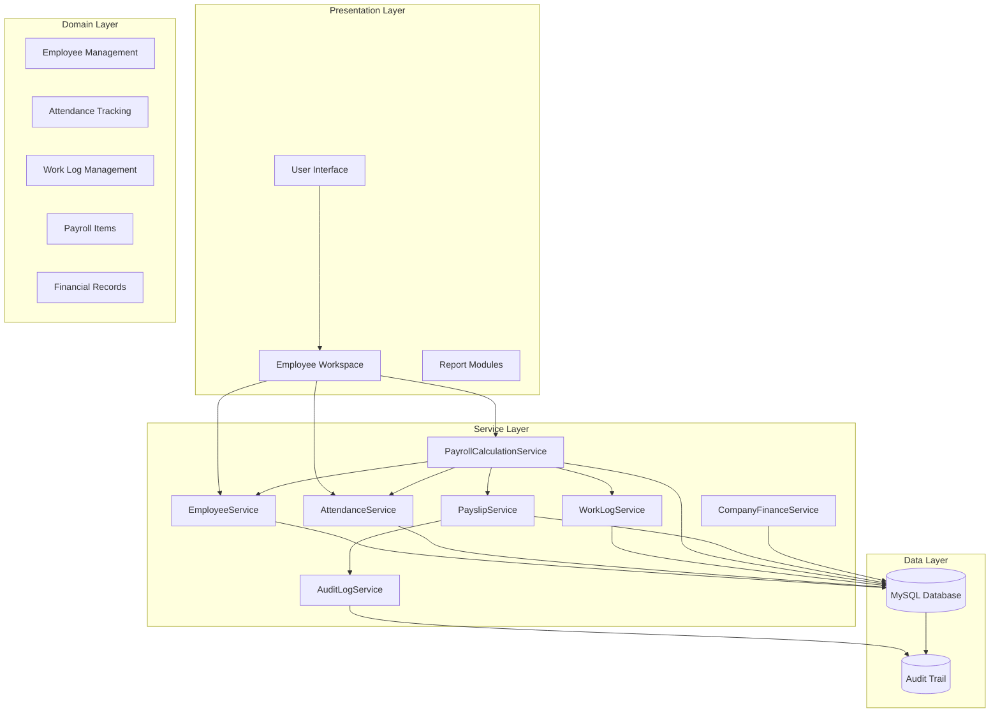

**Diagram sources**
- [AGENTS.md:121-149](file://AGENTS.md#L121-L149)
- [AGENTS.md:636-646](file://AGENTS.md#L636-L646)

The architecture ensures that business logic remains isolated from presentation concerns while maintaining clear data flow boundaries between components. Each service operates independently but coordinates through well-defined interfaces and shared data models.

## Core Service Components

The system's service layer consists of specialized components that handle different aspects of payroll processing:

### PayrollCalculationService
The central orchestrator responsible for processing payroll calculations across all supported payroll modes. This service aggregates data from various sources, applies business rules, and generates comprehensive payroll results.

### EmployeeService
Manages employee profiles, salary configurations, and employment-related data. Handles employee lifecycle events including hiring, transfers, and termination while maintaining historical records.

### AttendanceService
Processes attendance tracking data including check-in/check-out records, overtime calculations, and leave management. Integrates with time tracking systems to ensure accurate payroll computations.

### WorkLogService
Handles work log entries for freelance and hybrid payroll modes, managing hourly rates, layer-based calculations, and project-based billing.

### PayslipService
Generates, validates, and manages payslip creation, including PDF generation and finalization processes with snapshot preservation.

### CompanyFinanceService
Provides financial reporting capabilities including profit and loss statements, revenue tracking, and expense management.

### AuditLogService
Maintains comprehensive audit trails for all significant system changes, ensuring compliance and traceability.

**Section sources**
- [AGENTS.md:636-646](file://AGENTS.md#L636-L646)
- [AGENTS.md:196-221](file://AGENTS.md#L196-L221)

## Data Flow Patterns

The system implements several key data flow patterns to ensure consistency and reliability:

### Master vs Monthly Override Pattern
The system maintains clear separation between master data (permanent employee information) and monthly overrides (temporary adjustments):

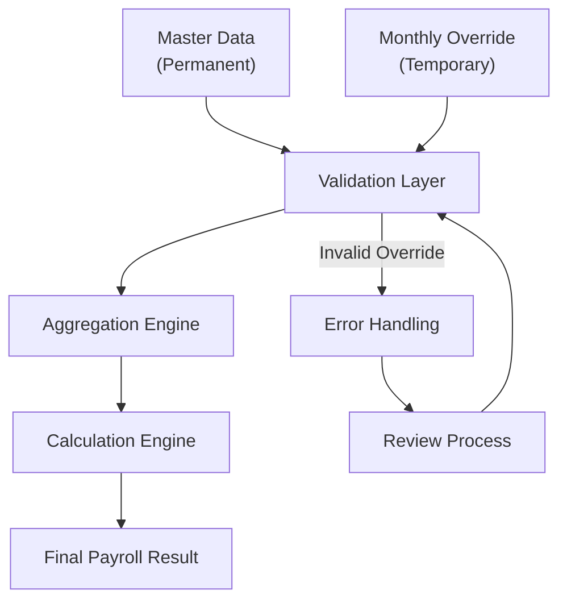

**Diagram sources**
- [AGENTS.md:498-505](file://AGENTS.md#L498-L505)

### Rule-Driven Processing Flow
Business rules are applied systematically through configurable rule sets:

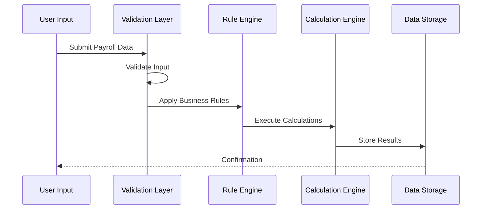

**Diagram sources**
- [AGENTS.md:61-74](file://AGENTS.md#L61-L74)
- [AGENTS.md:338-343](file://AGENTS.md#L338-L343)

## Payroll Calculation Engine

The PayrollCalculationService serves as the central processing hub, coordinating calculations across multiple payroll modes:

### Supported Payroll Modes
The system supports six distinct payroll modes, each with specific calculation rules:

| Payroll Mode | Description | Key Features |
|--------------|-------------|--------------|
| `monthly_staff` | Traditional employee salary | Base salary, overtime, allowances |
| `freelance_layer` | Hourly rate with tiered pricing | Layer-based calculations |
| `freelance_fixed` | Fixed-rate contracts | Quantity-based billing |
| `youtuber_salary` | Content creator salary | Performance-based adjustments |
| `youtuber_settlement` | Revenue sharing model | Profit/loss calculations |
| `custom_hybrid` | Mixed compensation structures | Flexible rule combinations |

### Calculation Architecture
The calculation engine processes data through multiple stages:

**Diagram sources**
- [AGENTS.md:440-444](file://AGENTS.md#L440-L444)
- [AGENTS.md:472-487](file://AGENTS.md#L472-L487)

**Section sources**
- [AGENTS.md:123-131](file://AGENTS.md#L123-L131)
- [AGENTS.md:438-497](file://AGENTS.md#L438-L497)

## Employee Management Services

The EmployeeService handles comprehensive employee lifecycle management:

### Core Employee Operations
- Employee registration and profile management
- Payroll mode assignment and configuration
- Department and position assignments
- Bank account and social security information
- Employment status tracking

### Data Integrity Measures
The system enforces strict data validation and maintains historical records for all employee changes:

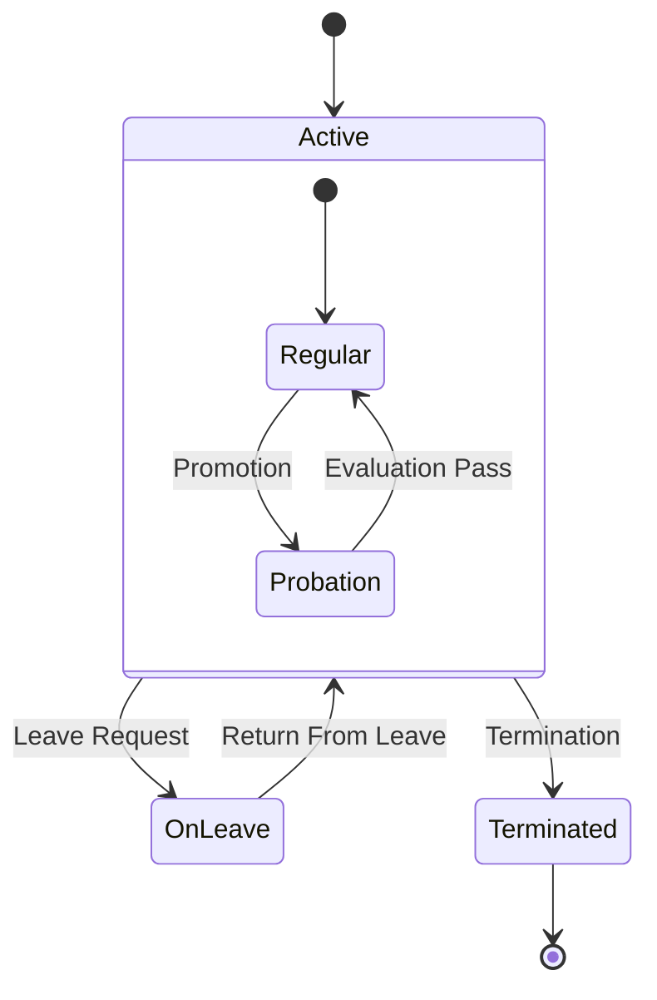

**Diagram sources**
- [AGENTS.md:294-302](file://AGENTS.md#L294-L302)

**Section sources**
- [AGENTS.md:294-302](file://AGENTS.md#L294-L302)
- [AGENTS.md:132-137](file://AGENTS.md#L132-L137)

## Attendance Tracking Modules

The AttendanceService processes time and attendance data with sophisticated overtime and leave management:

### Attendance Features
- Check-in/check-out tracking with geolocation
- Overtime calculation based on configurable thresholds
- Late arrival and early departure penalties
- Leave of absence (LWOP) management
- Daily attendance validation

### Integration Patterns
The attendance system integrates with external time tracking devices and mobile applications:

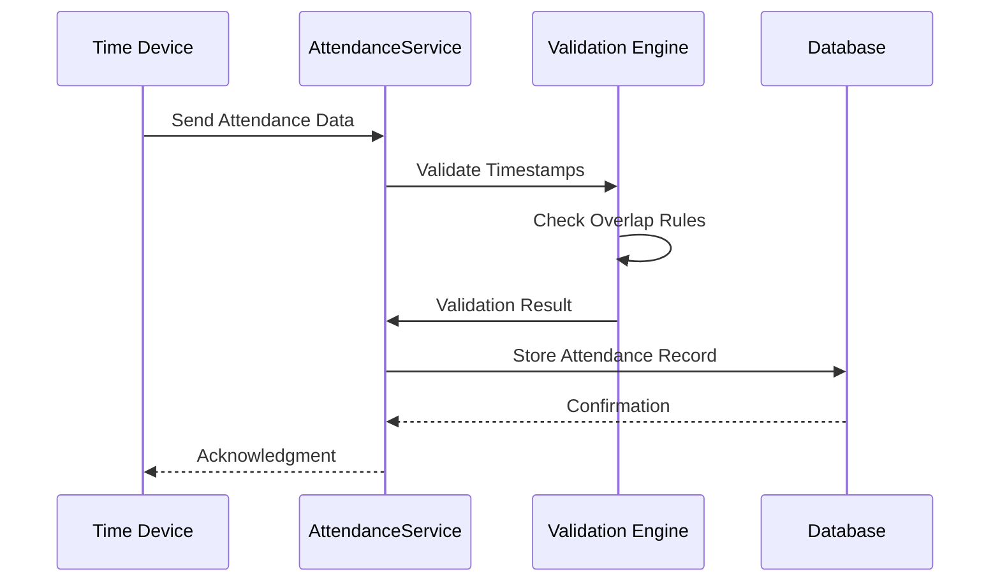

**Diagram sources**
- [AGENTS.md:322-328](file://AGENTS.md#L322-L328)

**Section sources**
- [AGENTS.md:322-328](file://AGENTS.md#L322-L328)
- [AGENTS.md:454-471](file://AGENTS.md#L454-L471)

## Financial Reporting Systems

The CompanyFinanceService provides comprehensive financial reporting capabilities:

### Report Types
- Monthly payroll summaries
- Annual employee compensation reports
- Company profit and loss statements
- Tax liability calculations
- Expense tracking and categorization

### Data Aggregation
Financial data is aggregated from multiple sources including payroll results, expense claims, and revenue tracking:

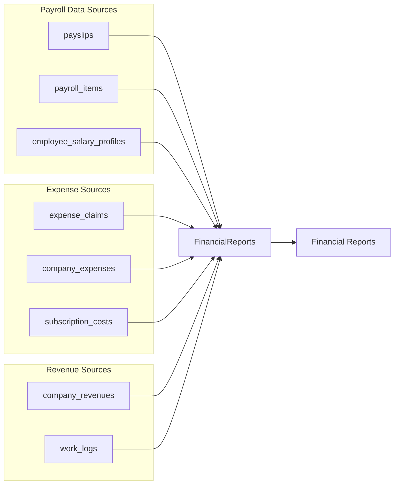

**Diagram sources**
- [AGENTS.md:367-382](file://AGENTS.md#L367-L382)
- [AGENTS.md:387-416](file://AGENTS.md#L387-L416)

**Section sources**
- [AGENTS.md:367-382](file://AGENTS.md#L367-L382)
- [AGENTS.md:387-416](file://AGENTS.md#L387-L416)

## Audit Trail and Transaction Management

The system maintains comprehensive audit trails for all significant operations:

### Audit Requirements
Every change must capture:
- Who performed the action
- What entity was modified
- What field changed
- Old and new values
- Action type and timestamp
- Optional reason for changes

### Audit Coverage Areas
High-priority audit areas include:
- Employee salary profile modifications
- Payroll item amount changes
- Payslip finalization/unfinalization
- Business rule modifications
- Module toggle changes
- Social security configuration updates

### Transaction Boundaries
The system implements strict transaction boundaries to ensure data consistency:

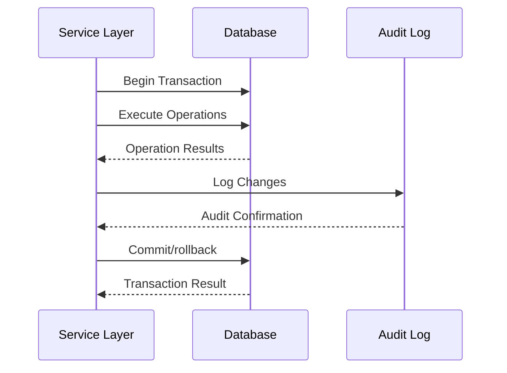

**Diagram sources**
- [AGENTS.md:576-595](file://AGENTS.md#L576-L595)

**Section sources**
- [AGENTS.md:576-595](file://AGENTS.md#L576-L595)
- [AGENTS.md:604](file://AGENTS.md#L604)

## Service Layer Architecture

The service layer implements a clean architecture pattern with clear separation of concerns:

### Service Organization
Each service follows the same architectural pattern:

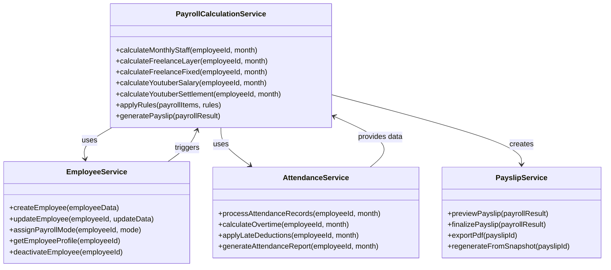

**Diagram sources**
- [AGENTS.md:636-646](file://AGENTS.md#L636-L646)

### Service Dependencies
The services maintain loose coupling through well-defined interfaces and shared data models, allowing for independent development and testing.

**Section sources**
- [AGENTS.md:636-646](file://AGENTS.md#L636-L646)

## Sequence Diagrams

### Typical Payroll Processing Workflow

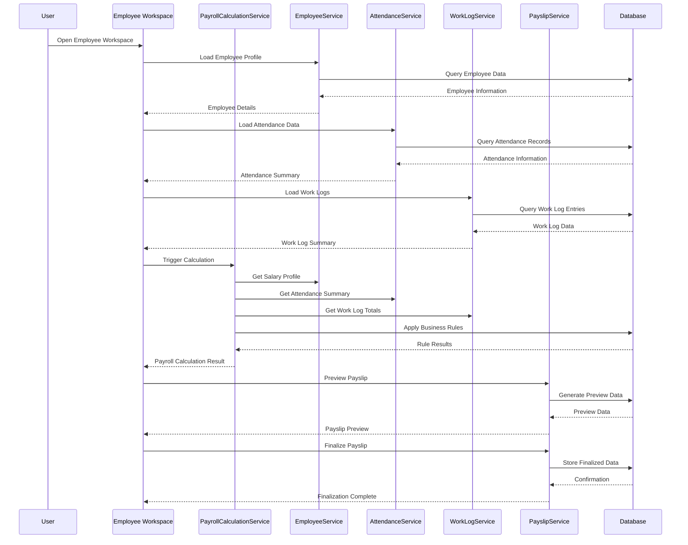

**Diagram sources**
- [AGENTS.md:513-515](file://AGENTS.md#L513-L515)
- [AGENTS.md:338-343](file://AGENTS.md#L338-L343)

### Audit Trail Propagation

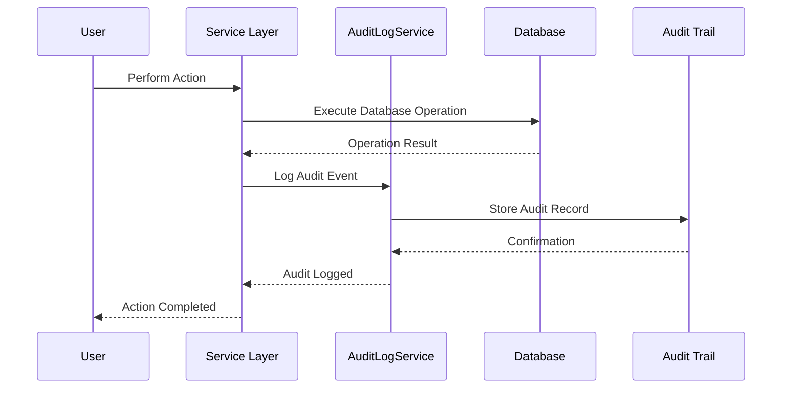

**Diagram sources**
- [AGENTS.md:578-587](file://AGENTS.md#L578-L587)

### State Management Across Components

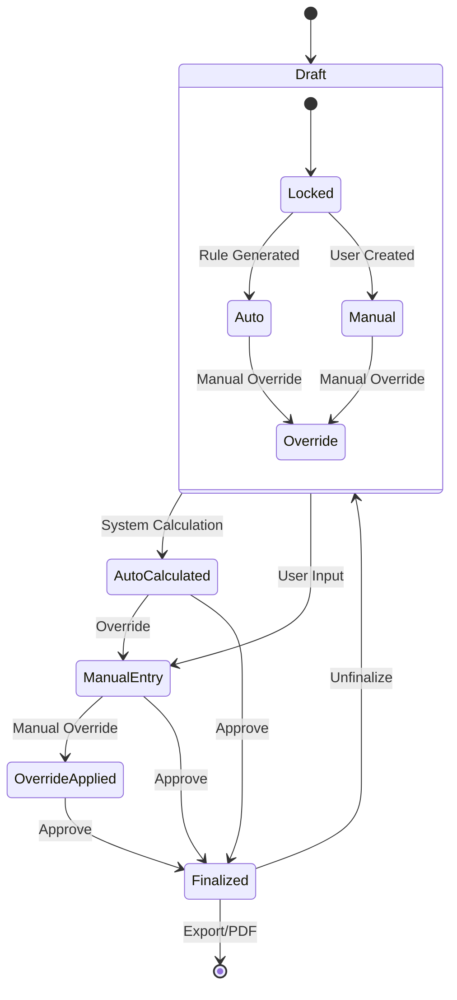

**Diagram sources**
- [AGENTS.md:528-538](file://AGENTS.md#L528-L538)

## Error Handling and Consistency

### Error Handling Strategy
The system implements comprehensive error handling across all service layers:

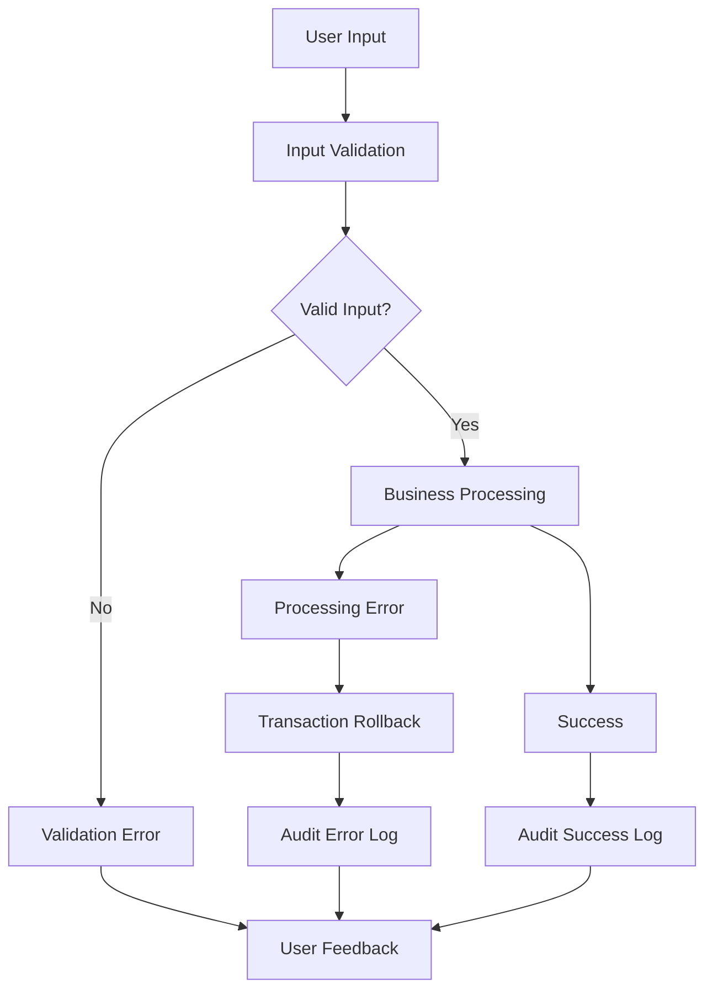

### Consistency Guarantees
The system ensures data consistency through:
- Atomic transactions for critical operations
- Audit trail synchronization
- Rule validation before calculation
- State validation before finalization

**Section sources**
- [AGENTS.md:663-672](file://AGENTS.md#L663-L672)
- [AGENTS.md:604](file://AGENTS.md#L604)

## Performance Considerations

### Optimization Strategies
The system incorporates several performance optimization techniques:

- **Batch Processing**: Large-scale payroll calculations processed in batches
- **Caching**: Frequently accessed rule configurations cached in memory
- **Lazy Loading**: Attendance and work log data loaded on-demand
- **Indexing**: Strategic database indexing for common query patterns
- **Pagination**: Large dataset pagination for reporting modules

### Scalability Factors
- Horizontal scaling potential through service decomposition
- Database connection pooling for concurrent operations
- Asynchronous processing for heavy computational tasks
- CDN integration for PDF generation and distribution

## Troubleshooting Guide

### Common Issues and Solutions

**Issue**: Payroll calculation inconsistencies
- Verify rule configuration alignment
- Check for conflicting monthly overrides
- Review audit trail for recent changes
- Validate employee profile completeness

**Issue**: Attendance data discrepancies
- Confirm device synchronization
- Verify timezone settings
- Check for overlapping check-in/out records
- Review late/distance tolerance settings

**Issue**: Payslip generation failures
- Validate finalization prerequisites
- Check PDF generation permissions
- Review audit trail for blocking changes
- Verify bank account information completeness

**Issue**: Performance degradation during peak periods
- Monitor batch processing queue
- Review database query performance
- Check cache hit ratios
- Validate service resource allocation

### Diagnostic Tools
- Real-time calculation progress monitoring
- Audit trail analysis for change tracking
- Performance metrics dashboard
- Error log aggregation and analysis

**Section sources**
- [AGENTS.md:663-672](file://AGENTS.md#L663-L672)

## Conclusion

The xHR Payroll & Finance System represents a comprehensive solution for modern payroll management, combining the familiarity of spreadsheet interfaces with the reliability and auditability of enterprise-grade systems. Through its well-structured service layer, rule-driven architecture, and comprehensive audit capabilities, the system provides organizations with the tools necessary for accurate, compliant, and transparent payroll processing.

The modular design ensures maintainability and extensibility, while the clear data flow patterns and transaction boundaries guarantee data consistency and reliability. By separating concerns across specialized services and implementing robust error handling and auditing, the system provides a solid foundation for payroll operations that can adapt to evolving business requirements.

The integration of multiple payroll modes, sophisticated attendance tracking, and comprehensive financial reporting capabilities positions the system as a complete solution for organizations seeking to modernize their payroll processes while maintaining compliance and operational excellence.