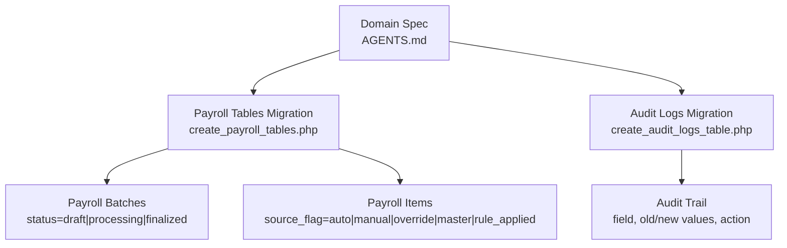
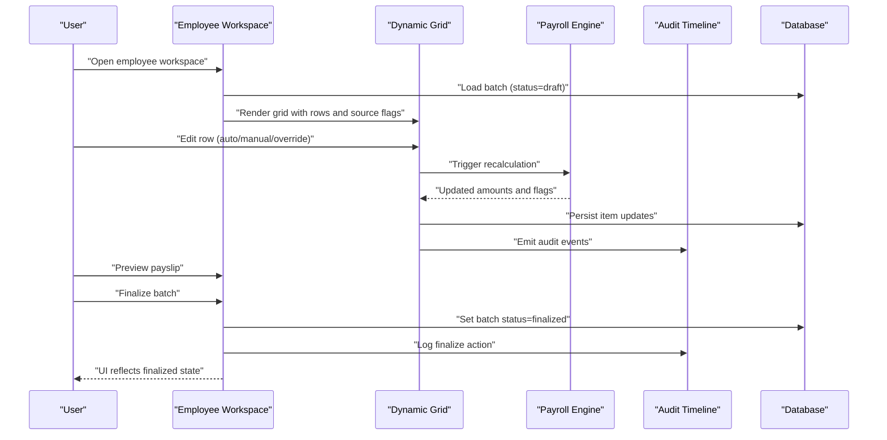
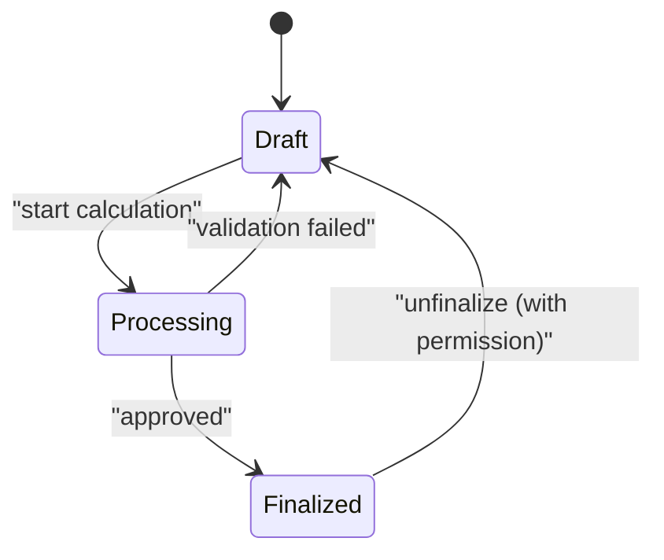
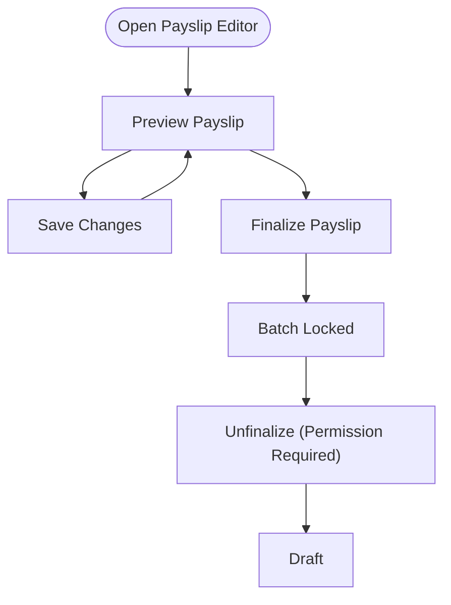
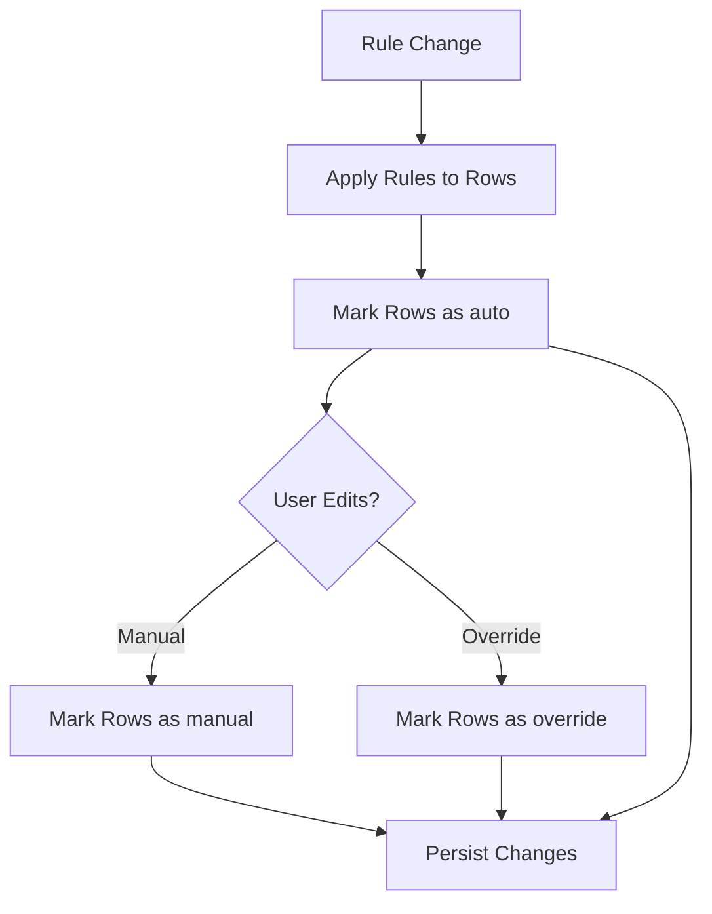
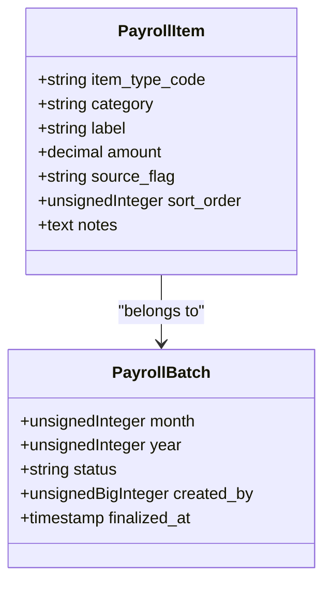
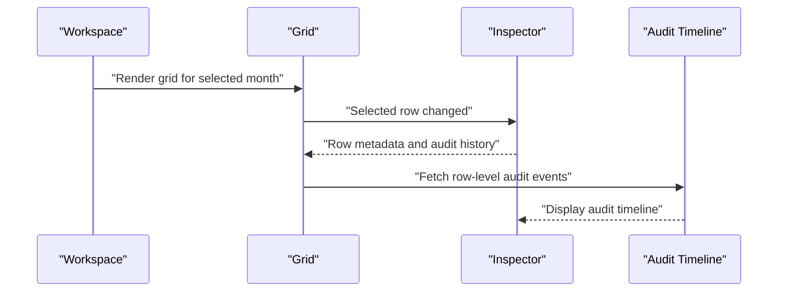
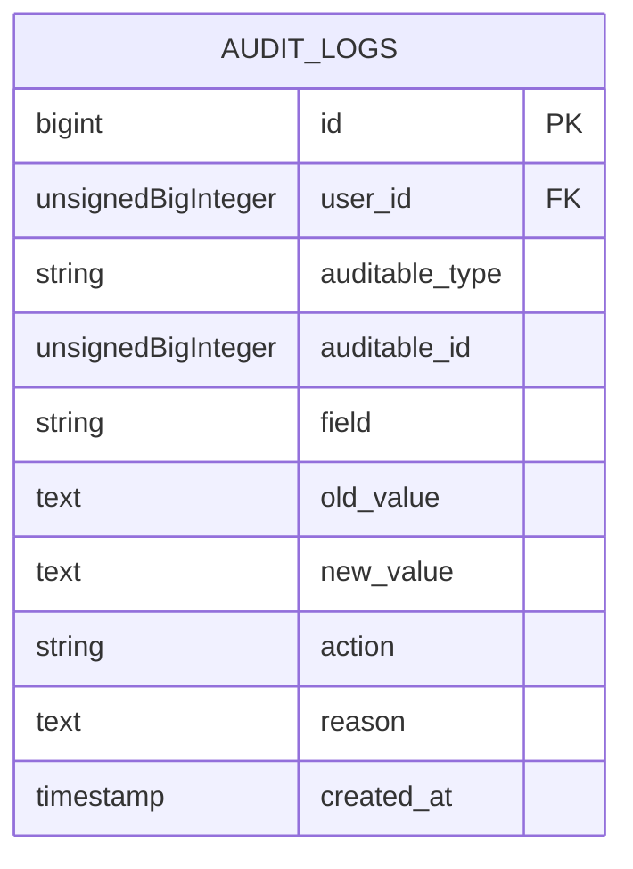
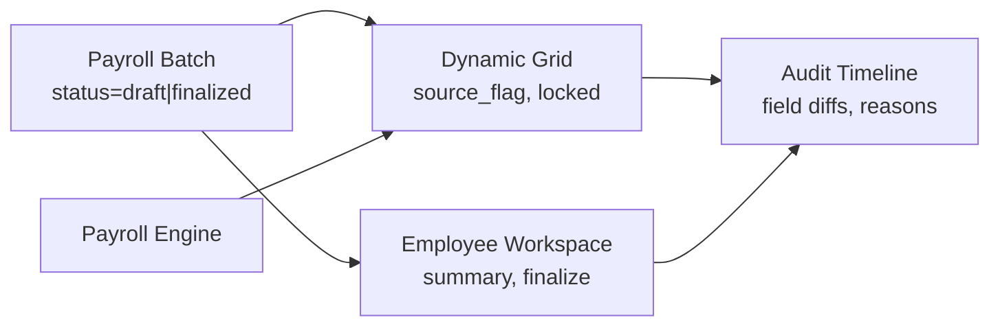

# Component State Management

<cite>
**Referenced Files in This Document**
- [AGENTS.md](file://AGENTS.md)
- [0001_01_01_000007_create_payroll_tables.php](file://database/migrations/0001_01_01_000007_create_payroll_tables.php)
- [0001_01_01_000011_create_audit_logs_table.php](file://database/migrations/0001_01_01_000011_create_audit_logs_table.php)
- [README.md](file://README.md)
</cite>

## Table of Contents
1. [Introduction](#introduction)
2. [Project Structure](#project-structure)
3. [Core Components](#core-components)
4. [Architecture Overview](#architecture-overview)
5. [Detailed Component Analysis](#detailed-component-analysis)
6. [Dependency Analysis](#dependency-analysis)
7. [Performance Considerations](#performance-considerations)
8. [Troubleshooting Guide](#troubleshooting-guide)
9. [Conclusion](#conclusion)

## Introduction
This document explains component state management and coordination in the xHR Payroll & Finance System. It focuses on UI states such as locked, auto, manual, override, from_master, rule_applied, draft, and finalized. It describes how state transitions occur during payroll processing, payslip editing, and rule configuration, and how state information flows across the dynamic grid interface, employee workspace, and audit timeline components. Guidance is provided on state persistence, validation triggers, and UI feedback mechanisms to maintain consistency across the user interface.

## Project Structure
The repository includes:
- A domain specification and UI state requirements document that defines the payroll workspace, grid capabilities, and required UI states.
- Database migrations that define the data model for payroll batches, items, and audit logs.

**Diagram sources**
- [AGENTS.md:513-547](file://AGENTS.md#L513-L547)
- [0001_01_01_000007_create_payroll_tables.php:22-51](file://database/migrations/0001_01_01_000007_create_payroll_tables.php#L22-L51)
- [0001_01_01_000011_create_audit_logs_table.php:11-26](file://database/migrations/0001_01_01_000011_create_audit_logs_table.php#L11-L26)

**Section sources**
- [AGENTS.md:513-547](file://AGENTS.md#L513-L547)
- [0001_01_01_000007_create_payroll_tables.php:1-61](file://database/migrations/0001_01_01_000007_create_payroll_tables.php#L1-L61)
- [0001_01_01_000011_create_audit_logs_table.php:1-34](file://database/migrations/0001_01_01_000011_create_audit_logs_table.php#L1-L34)

## Core Components
This section outlines the core stateful components and their responsibilities in the payroll system.

- Employee Workspace
  - Purpose: Central editing surface for payroll entries per employee and month.
  - Responsibilities:
    - Month selection and batch scoping.
    - Rendering summary cards and main payroll grid.
    - Detail inspector for selected rows.
    - Payslip preview and finalize controls.
    - Audit timeline integration.
  - State implications:
    - Workspace state reflects current batch status (draft vs finalized).
    - Grid state tracks row-level source flags and lock status.
    - Inspector state surfaces row metadata and audit history.

- Dynamic Payroll Grid
  - Capabilities:
    - Inline editing, add/remove/duplicate rows.
    - Dropdown type/category selection.
    - Auto/manual/override modes and rule application.
    - Instant recalculation and source badges.
  - State implications:
    - Each row holds a source flag indicating origin (auto, manual, override, master, rule_applied).
    - Rows may be locked to prevent edits when finalized or governed by policy.
    - Batch-level state influences grid interactivity and allowed actions.

- Audit Timeline
  - Purpose: Display historical changes with field-level diffs and reasons.
  - State implications:
    - Renders entries grouped by auditable entity and timestamp.
    - Supports drill-down into row-level audit history from the inspector.

- Payslip Module
  - Purpose: Preview, finalize, and export payslips.
  - State implications:
    - Finalization snapshots item data and totals for immutable reference.
    - Post-finalization actions are restricted except with explicit permissions.

**Section sources**
- [AGENTS.md:310-321](file://AGENTS.md#L310-L321)
- [AGENTS.md:516-527](file://AGENTS.md#L516-L527)
- [AGENTS.md:549-573](file://AGENTS.md#L549-L573)
- [0001_01_01_000011_create_audit_logs_table.php:11-26](file://database/migrations/0001_01_01_000011_create_audit_logs_table.php#L11-L26)

## Architecture Overview
The state lifecycle spans from batch creation to finalization, with continuous state propagation across components.

**Diagram sources**
- [AGENTS.md:513-515](file://AGENTS.md#L513-L515)
- [0001_01_01_000007_create_payroll_tables.php:22-51](file://database/migrations/0001_01_01_000007_create_payroll_tables.php#L22-L51)
- [0001_01_01_000011_create_audit_logs_table.php:11-26](file://database/migrations/0001_01_01_000011_create_audit_logs_table.php#L11-L26)

## Detailed Component Analysis

### State Definitions and Semantics
- locked: Indicates a row or cell is not editable due to policy or batch finalization.
- auto: Amount computed automatically by the payroll engine based on configured rules.
- manual: Amount entered directly by the user.
- override: Manual adjustment that supersedes automatic computation.
- from_master: Amount originates from a master template or baseline configuration.
- rule_applied: Amount reflects the result of applying a specific rule.
- draft: Batch is open for editing; changes are allowed.
- finalized: Batch is closed; further modifications are restricted except with explicit permissions.

These states are surfaced in the grid via badges and enforced by the workspace and engine.

**Section sources**
- [AGENTS.md:528-538](file://AGENTS.md#L528-L538)
- [0001_01_01_000007_create_payroll_tables.php:43-43](file://database/migrations/0001_01_01_000007_create_payroll_tables.php#L43-L43)

### State Transitions During Payroll Processing
- From draft to processing: Triggered when the batch enters calculation/validation workflows.
- From processing to finalized: Occurs after successful validation and approval.
- Row-level transitions:
  - auto → manual: User initiates manual editing.
  - auto → override: User applies a deliberate override.
  - manual → auto: Reverting to automatic computation.
  - from_master → auto/manual/override: Applying or overriding master values.
  - rule_applied → manual/override: Adjusting rule-derived values.

**Diagram sources**
- [0001_01_01_000007_create_payroll_tables.php:26-26](file://database/migrations/0001_01_01_000007_create_payroll_tables.php#L26-L26)

**Section sources**
- [AGENTS.md:513-515](file://AGENTS.md#L513-L515)
- [0001_01_01_000007_create_payroll_tables.php:22-33](file://database/migrations/0001_01_01_000007_create_payroll_tables.php#L22-L33)

### State Transitions During Payslip Editing
- Preview: Non-destructive view of computed totals and items.
- Save: Persists current state to the database.
- Finalize: Creates a snapshot and locks the batch; subsequent edits require special permissions.

**Diagram sources**
- [AGENTS.md:567-573](file://AGENTS.md#L567-L573)
- [0001_01_01_000007_create_payroll_tables.php:26-28](file://database/migrations/0001_01_01_000007_create_payroll_tables.php#L26-L28)

**Section sources**
- [AGENTS.md:567-573](file://AGENTS.md#L567-L573)
- [0001_01_01_000007_create_payroll_tables.php:26-28](file://database/migrations/0001_01_01_000007_create_payroll_tables.php#L26-L28)

### State Transitions During Rule Configuration
- Adding/modifying rules updates rule_applied rows.
- Master templates propagate from_master values to dependent rows.
- Overrides supersede rule_applied or from_master values.

**Diagram sources**
- [AGENTS.md:344-353](file://AGENTS.md#L344-L353)
- [0001_01_01_000007_create_payroll_tables.php:43-43](file://database/migrations/0001_01_01_000007_create_payroll_tables.php#L43-L43)

**Section sources**
- [AGENTS.md:344-353](file://AGENTS.md#L344-L353)
- [0001_01_01_000007_create_payroll_tables.php:43-43](file://database/migrations/0001_01_01_000007_create_payroll_tables.php#L43-L43)

### Dynamic Grid State Management Patterns
- Row-level state:
  - source_flag: Tracks origin (auto, manual, override, master, rule_applied).
  - locked: Prevents editing when finalized or policy dictates.
- Column-level state:
  - Type/category dropdowns influence downstream calculations.
- Batch-level state:
  - draft vs finalized governs global editability and recalculation triggers.
- Validation triggers:
  - On save, recalculation, and finalize, enforce critical rules (e.g., reducing take-home requires a deduction row).
- UI feedback:
  - Source badges indicate origin.
  - Lock indicators show immutability.
  - Real-time previews update totals upon changes.

**Diagram sources**
- [0001_01_01_000007_create_payroll_tables.php:35-51](file://database/migrations/0001_01_01_000007_create_payroll_tables.php#L35-L51)
- [0001_01_01_000007_create_payroll_tables.php:22-33](file://database/migrations/0001_01_01_000007_create_payroll_tables.php#L22-L33)

**Section sources**
- [AGENTS.md:516-527](file://AGENTS.md#L516-L527)
- [0001_01_01_000007_create_payroll_tables.php:43-43](file://database/migrations/0001_01_01_000007_create_payroll_tables.php#L43-L43)

### Employee Workspace State Coordination
- Month selector scopes the active payroll batch.
- Summary cards reflect computed totals and statuses.
- Grid and inspector synchronize around the selected row.
- Finalize button enforces snapshot and locks the batch.

**Diagram sources**
- [AGENTS.md:310-321](file://AGENTS.md#L310-L321)
- [0001_01_01_000011_create_audit_logs_table.php:11-26](file://database/migrations/0001_01_01_000011_create_audit_logs_table.php#L11-L26)

**Section sources**
- [AGENTS.md:310-321](file://AGENTS.md#L310-L321)
- [0001_01_01_000011_create_audit_logs_table.php:11-26](file://database/migrations/0001_01_01_000011_create_audit_logs_table.php#L11-L26)

### Audit Timeline State and Consistency
- Captures who changed what, when, and why.
- Supports drill-down from batch-level to row-level changes.
- Ensures consistency by recording old/new values and actions (created, updated, deleted, finalized, unfinalized).

**Diagram sources**
- [0001_01_01_000011_create_audit_logs_table.php:11-26](file://database/migrations/0001_01_01_000011_create_audit_logs_table.php#L11-L26)

**Section sources**
- [AGENTS.md:576-595](file://AGENTS.md#L576-L595)
- [0001_01_01_000011_create_audit_logs_table.php:11-26](file://database/migrations/0001_01_01_000011_create_audit_logs_table.php#L11-L26)

## Dependency Analysis
State dependencies across components:

**Diagram sources**
- [0001_01_01_000007_create_payroll_tables.php:22-51](file://database/migrations/0001_01_01_000007_create_payroll_tables.php#L22-L51)
- [0001_01_01_000011_create_audit_logs_table.php:11-26](file://database/migrations/0001_01_01_000011_create_audit_logs_table.php#L11-L26)

**Section sources**
- [0001_01_01_000007_create_payroll_tables.php:22-51](file://database/migrations/0001_01_01_000007_create_payroll_tables.php#L22-L51)
- [0001_01_01_000011_create_audit_logs_table.php:11-26](file://database/migrations/0001_01_01_000011_create_audit_logs_table.php#L11-L26)

## Performance Considerations
- Minimize recalculations by batching grid updates and debouncing user input.
- Use incremental updates for audit timeline to avoid heavy re-renders.
- Persist only changed rows to reduce write amplification.
- Cache computed totals per batch to accelerate preview and finalize operations.

## Troubleshooting Guide
Common issues and resolutions:
- Finalized batch cannot be edited:
  - Cause: Batch status is finalized.
  - Resolution: Unfinalize with appropriate permissions; verify audit log action.
- Unexpected auto/manual overrides:
  - Cause: Conflicting rule application or user override.
  - Resolution: Inspect row’s source flag and audit history; revert to desired source.
- Audit discrepancies:
  - Cause: Missing or delayed audit entries.
  - Resolution: Verify audit log queries and indexes; confirm event emission on save/finalize.

**Section sources**
- [AGENTS.md:576-595](file://AGENTS.md#L576-L595)
- [0001_01_01_000011_create_audit_logs_table.php:11-26](file://database/migrations/0001_01_01_000011_create_audit_logs_table.php#L11-L26)

## Conclusion
The xHR Payroll & Finance System enforces clear state semantics across the employee workspace, dynamic grid, and audit timeline. Batch-level states (draft/finalized) and row-level states (locked/auto/manual/override/from_master/rule_applied) coordinate through the payroll engine and audit trail to ensure consistency, transparency, and compliance. By adhering to defined transitions, validation triggers, and persistence patterns, the system supports reliable payroll processing and payslip management.