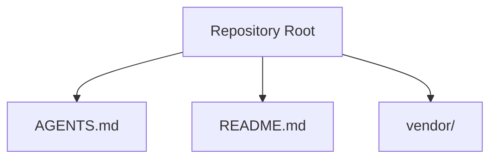
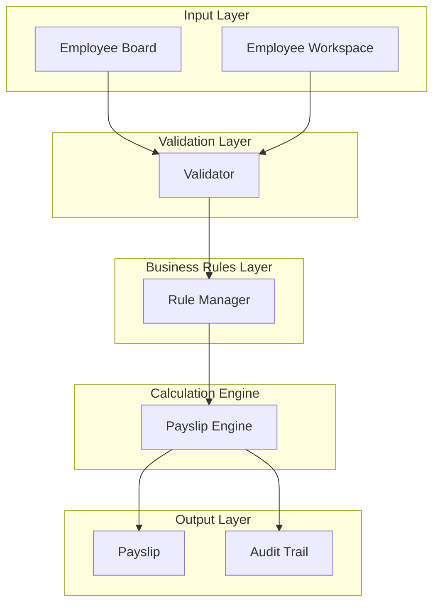
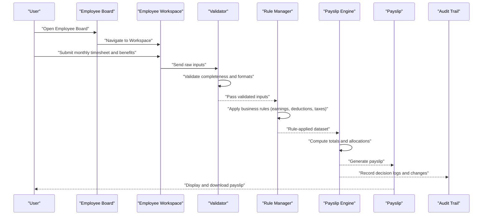
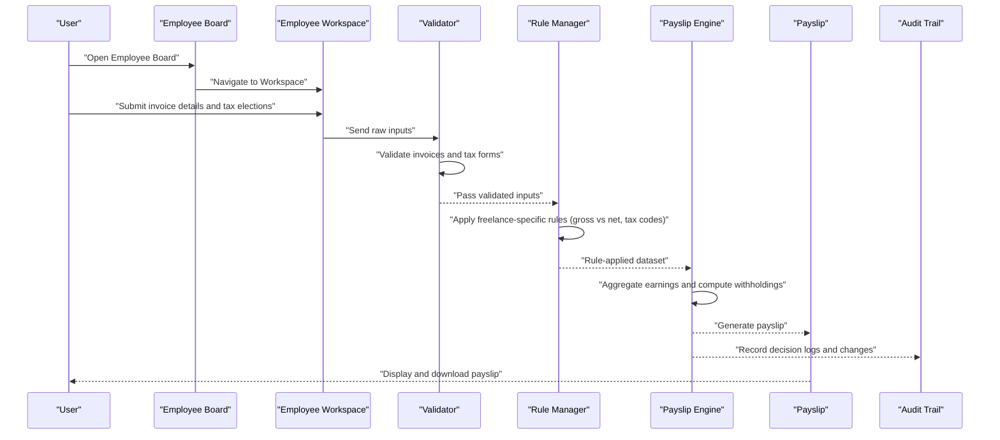
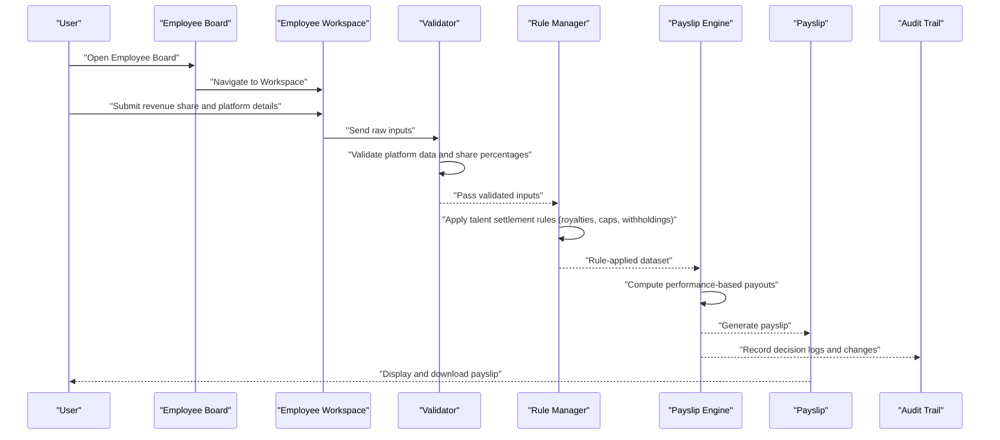
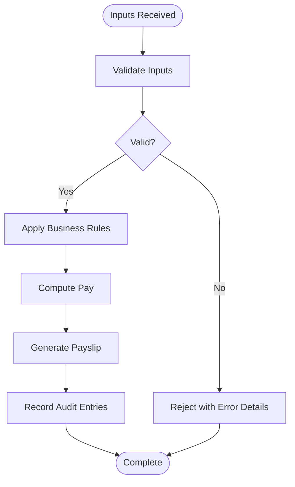
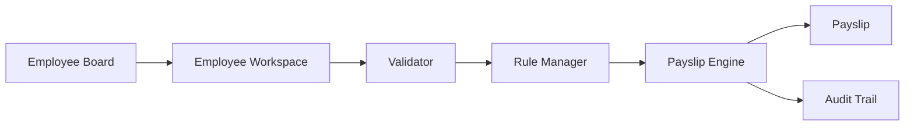

# Data Flow and Processing Workflows

<cite>
**Referenced Files in This Document**
- [AGENTS.md](file://AGENTS.md)
- [README.md](file://README.md)
</cite>

## Table of Contents
1. [Introduction](#introduction)
2. [Project Structure](#project-structure)
3. [Core Components](#core-components)
4. [Architecture Overview](#architecture-overview)
5. [Detailed Component Analysis](#detailed-component-analysis)
6. [Dependency Analysis](#dependency-analysis)
7. [Performance Considerations](#performance-considerations)
8. [Troubleshooting Guide](#troubleshooting-guide)
9. [Conclusion](#conclusion)

## Introduction
This document describes the data flow patterns and processing workflows in the xHR system. It focuses on the end-to-end journey of employee-related data from user input through validation, business rule processing, calculation engine execution, and final payslip generation. It also documents the interactions among the Employee Board, Employee Workspace, Rule Manager, and Payslip modules, and outlines payroll calculation workflows for monthly staff, freelancers, and youtuber/talent settlements. Sequence diagrams illustrate typical user interactions, validation steps, and audit trail propagation. Guidance on error handling, transaction boundaries, and consistency guarantees is included to ensure robust operation across the entire pipeline.

## Project Structure
The repository snapshot contains minimal source material. The primary documentation artifact is a single markdown file describing agents and their roles. Additional top-level files include a readme and a vendor directory containing third-party packages. The current structure does not expose internal module boundaries, class hierarchies, or explicit data flow diagrams. Therefore, this document synthesizes workflows conceptually and maps them to the available artifacts while acknowledging the limitations of the provided context.

**Diagram sources**
- [AGENTS.md](file://AGENTS.md)
- [README.md](file://README.md)

**Section sources**
- [AGENTS.md](file://AGENTS.md)
- [README.md](file://README.md)

## Core Components
The xHR system orchestrates several functional areas involved in payroll processing:

- Employee Board: Centralized view for managing employee records, statuses, and high-level actions.
- Employee Workspace: Individual work area for employees to submit timesheets, benefits elections, and related data.
- Rule Manager: Module responsible for maintaining and applying business rules governing compensation, deductions, taxes, and compliance.
- Payslip Engine: Calculation engine that processes validated inputs against business rules to produce payslips.
- Audit Trail: Persistent record of all changes and decisions across the pipeline for traceability and reconciliation.

These components interact to form a cohesive data processing pipeline where each stage validates, transforms, and propagates data to downstream consumers.

## Architecture Overview
The xHR architecture follows a staged pipeline with clear separation of concerns:

- Input Layer: Employee Board and Employee Workspace collect raw data from users.
- Validation Layer: Ensures data integrity and completeness before proceeding.
- Business Rules Layer: Applies Rule Manager configurations to transform raw inputs into processed earnings/deductions.
- Calculation Engine: Executes payslip computations using validated and transformed data.
- Output Layer: Generates payslips and updates audit trail for reconciliation and reporting.

[No sources needed since this diagram shows conceptual architecture, not a direct mapping to specific source files]

## Detailed Component Analysis

### Data Journey: Monthly Staff Processing
This workflow covers regular employees who receive fixed monthly compensation with periodic adjustments.

**Diagram sources**
- [AGENTS.md](file://AGENTS.md)

**Section sources**
- [AGENTS.md](file://AGENTS.md)

### Data Journey: Freelance Calculations
Freelancers operate under different compensation models requiring distinct data inputs and rule sets.

**Diagram sources**
- [AGENTS.md](file://AGENTS.md)

**Section sources**
- [AGENTS.md](file://AGENTS.md)

### Data Journey: Youtuber/Talent Settlements
Talents often receive performance-based payments with royalties and withholding considerations.

**Diagram sources**
- [AGENTS.md](file://AGENTS.md)

**Section sources**
- [AGENTS.md](file://AGENTS.md)

### Validation and Audit Trail Propagation
Across all workflows, validation ensures data quality and audit trail entries capture every transformation.

[No sources needed since this diagram shows conceptual validation flow, not a direct mapping to specific source files]

## Dependency Analysis
The xHR pipeline exhibits clear dependency relationships:

- Employee Board depends on Employee Workspace for data collection.
- Validator depends on Rule Manager for schema and business rule enforcement.
- Payslip Engine depends on Validator and Rule Manager outputs.
- Audit Trail persists decisions and transformations across all stages.

[No sources needed since this diagram shows conceptual dependencies, not a direct mapping to specific source files]

## Performance Considerations
- Batch Processing: Group similar transactions (e.g., monthly staff) to reduce overhead and improve throughput.
- Caching: Cache frequently accessed business rules and lookup tables to minimize latency.
- Asynchronous Execution: Offload heavy computations to background jobs with progress tracking.
- Idempotency: Design audit entries and rule applications to tolerate retries without duplication.
- Monitoring: Track validation failure rates, rule application latencies, and payslip generation times.

[No sources needed since this section provides general guidance]

## Troubleshooting Guide
Common issues and recommended actions:

- Validation Failures
  - Symptom: Inputs rejected during validation.
  - Action: Review input formats and required fields; consult validator error messages; re-submit corrected data.
- Rule Application Errors
  - Symptom: Unexpected earnings or deductions.
  - Action: Verify rule configurations; check effective dates; confirm employee classification alignment.
- Calculation Discrepancies
  - Symptom: Mismatches between computed totals and expected amounts.
  - Action: Recompute using historical snapshots; compare intermediate steps; reconcile with audit trail.
- Audit Trail Gaps
  - Symptom: Missing decision logs.
  - Action: Confirm audit logging is enabled; verify database connectivity; investigate transaction boundaries.

**Section sources**
- [AGENTS.md](file://AGENTS.md)

## Conclusion
The xHR system’s data flow is structured around a staged pipeline that emphasizes validation, business rule application, and transparent audit trails. While the current repository snapshot does not include detailed source code, the documented workflows provide a blueprint for implementing robust data journeys across monthly staff, freelance, and talent settlements. By adhering to transaction boundaries, consistency guarantees, and comprehensive auditing, the system can maintain reliability and traceability across all processing stages.