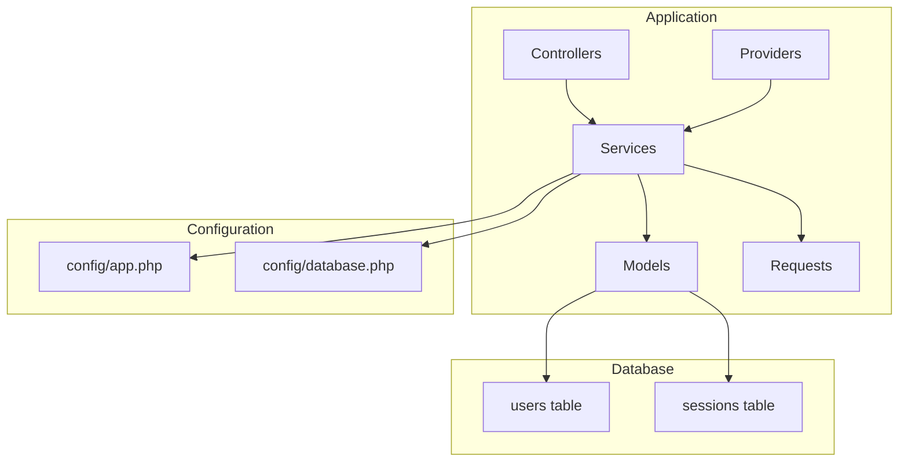
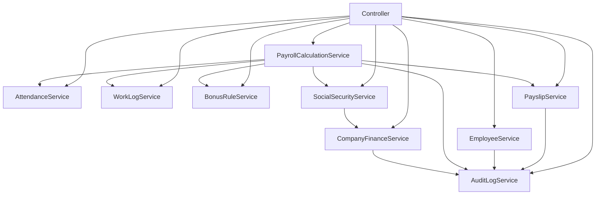
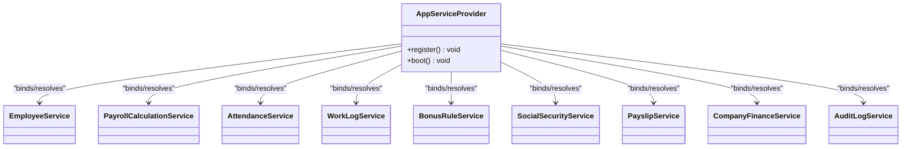
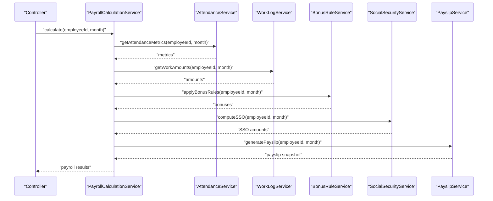
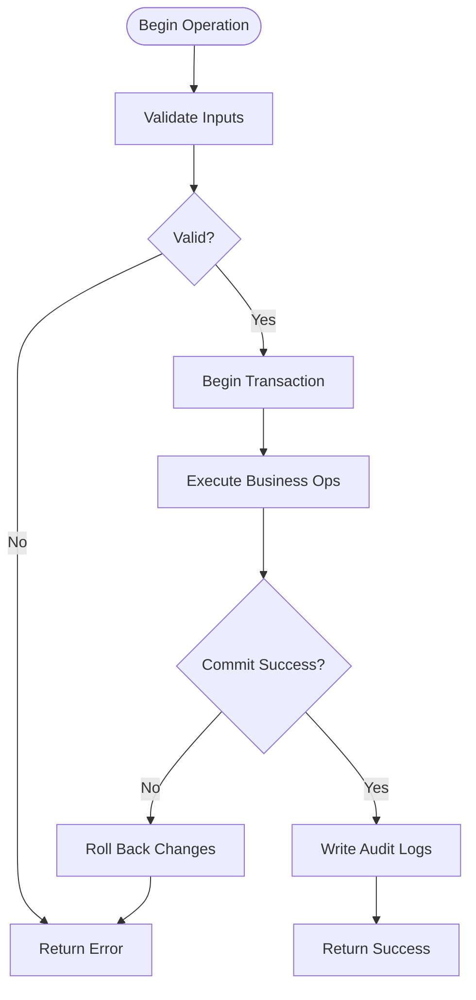
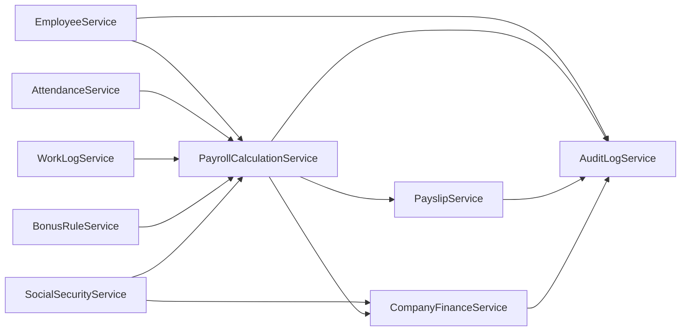

# Service Layer Architecture

<cite>
**Referenced Files in This Document**
- [AGENTS.md](file://AGENTS.md)
- [app.php](file://config/app.php)
- [AppServiceProvider.php](file://app/Providers/AppServiceProvider.php)
- [database.php](file://config/database.php)
- [create_users_table.php](file://database/migrations/0001_01_01_000000_create_users_table.php)
</cite>

## Table of Contents
1. [Introduction](#introduction)
2. [Project Structure](#project-structure)
3. [Core Components](#core-components)
4. [Architecture Overview](#architecture-overview)
5. [Detailed Component Analysis](#detailed-component-analysis)
6. [Dependency Analysis](#dependency-analysis)
7. [Performance Considerations](#performance-considerations)
8. [Troubleshooting Guide](#troubleshooting-guide)
9. [Conclusion](#conclusion)

## Introduction
This document describes the service layer architecture for the xHR Payroll & Finance System. It focuses on the service-oriented architecture pattern, dependency injection, and how services interact with models and repositories. It documents the service boundaries, responsibilities, and communication patterns among core services, including PayrollCalculationService, EmployeeService, AttendanceService, WorkLogService, BonusRuleService, SocialSecurityService, PayslipService, CompanyFinanceService, and AuditLogService. It also explains transaction management and error handling strategies to ensure data consistency across payroll calculations and financial operations.

## Project Structure
The repository follows a Laravel-style structure with clear separation of concerns:
- app/Models: Domain entities and Eloquent models
- app/Services: Business logic services
- app/Http/Controllers: HTTP entry points
- app/Http/Requests: Request validation
- app/Providers: Service container registration
- config/: Application configuration (database, cache, etc.)
- database/migrations: Database schema and migrations

**Diagram sources**
- [app.php:1-185](file://config/app.php#L1-L185)
- [database.php:1-185](file://config/database.php#L1-L185)
- [create_users_table.php:1-50](file://database/migrations/0001_01_01_000000_create_users_table.php#L1-L50)

**Section sources**
- [AGENTS.md:622-647](file://AGENTS.md#L622-L647)
- [app.php:1-185](file://config/app.php#L1-L185)
- [database.php:1-185](file://config/database.php#L1-L185)

## Core Components
This section outlines the core services and their responsibilities, derived from the project’s design principles and module requirements.

- EmployeeService
  - Responsibilities: Manage employee profiles, payroll modes, departments, positions, and bank accounts. Coordinate creation, updates, and deactivation while ensuring audit coverage.
  - Boundaries: Operates on Employee, EmployeeProfile, EmployeeSalaryProfile, EmployeeBankAccount, Department, Position.
  - Communication: Interacts with AttendanceService and WorkLogService for time-based inputs; integrates with PayrollCalculationService for payroll runs.

- PayrollCalculationService
  - Responsibilities: Calculate payroll by mode (monthly_staff, freelance_layer, freelance_fixed, youtuber_salary, youtuber_settlement, custom_hybrid). Aggregate income and deductions, apply rule-driven configurations, and produce payroll snapshots.
  - Boundaries: Uses PayrollBatch, PayrollItem, PayrollItemType, and rule tables (rate_rules, layer_rate_rules, bonus_rules, threshold_rules).
  - Communication: Coordinates with AttendanceService, WorkLogService, BonusRuleService, SocialSecurityService, and PayslipService.

- AttendanceService
  - Responsibilities: Track attendance logs, compute late minutes, early leave, OT eligibility, and LWOP flags. Provide validated attendance metrics for payroll calculation.
  - Boundaries: Manages AttendanceLog and related time-based entities.
  - Communication: Supplies attendance data to PayrollCalculationService and SocialSecurityService.

- WorkLogService
  - Responsibilities: Manage work logs for freelancers and hybrid modes, compute amounts based on layers and rates, and support manual overrides.
  - Boundaries: Uses WorkLog, WorkLogType, RateRules, LayerRateRules.
  - Communication: Feeds work amounts to PayrollCalculationService.

- BonusRuleService
  - Responsibilities: Apply performance and threshold-based bonuses according to configured rules.
  - Boundaries: Uses BonusRule, ThresholdRule.
  - Communication: Provides bonus values to PayrollCalculationService.

- SocialSecurityService
  - Responsibilities: Compute employee and employer contributions based on configurable SocialSecurityConfig, respecting salary ceilings and effective dates.
  - Boundaries: Uses SocialSecurityConfig.
  - Communication: Supplies SSO amounts to PayrollCalculationService and CompanyFinanceService.

- PayslipService
  - Responsibilities: Generate, preview, finalize, and export payslips. Enforce snapshot rules and audit requirements for finalized payslips.
  - Boundaries: Uses Payslip, PayslipItem.
  - Communication: Integrates with PayrollCalculationService for final totals and items.

- CompanyFinanceService
  - Responsibilities: Summarize company revenues, expenses, and profit/loss; maintain monthly summaries and support tax simulations.
  - Boundaries: Uses CompanyRevenue, CompanyExpense, module toggles, and expense claims.
  - Communication: Receives SSO and payroll totals from SocialSecurityService and PayrollCalculationService.

- AuditLogService
  - Responsibilities: Log all significant changes with who, what, field, old/new values, action, timestamp, and optional reason. Provide audit timelines and history.
  - Boundaries: Uses AuditLog.
  - Communication: Triggers on changes across EmployeeService, PayrollCalculationService, PayslipService, and configuration changes.

**Section sources**
- [AGENTS.md:153-283](file://AGENTS.md#L153-L283)
- [AGENTS.md:338-382](file://AGENTS.md#L338-L382)
- [AGENTS.md:438-506](file://AGENTS.md#L438-L506)
- [AGENTS.md:576-595](file://AGENTS.md#L576-L595)

## Architecture Overview
The system employs a service-oriented architecture with explicit boundaries and layered responsibilities:
- Controllers orchestrate requests and delegate to Services.
- Services encapsulate business logic and coordinate with Models and Repositories.
- Models represent domain entities and relationships.
- Transactions wrap critical operations to ensure consistency.
- AuditLogService ensures compliance and traceability.

[No sources needed since this diagram shows conceptual workflow, not actual code structure]

## Detailed Component Analysis

### Service-Oriented Architecture Pattern
- Separation of Concerns: Each service encapsulates a distinct business capability (e.g., payroll calculation, attendance tracking).
- Loose Coupling: Services communicate via well-defined interfaces and shared models; avoid tight coupling to rule tables and configuration entities.
- Reusability: Services are designed to be reusable across different payroll modes and financial summaries.

**Section sources**
- [AGENTS.md:158-174](file://AGENTS.md#L158-L174)
- [AGENTS.md:598-606](file://AGENTS.md#L598-L606)

### Dependency Injection and Container Registration
- Laravel container manages bindings and resolution. Services are resolved through constructors or facades.
- Providers can register singleton or contextual bindings for services and repositories.
- Configuration files (app.php, database.php) define application-wide settings consumed by services.

**Diagram sources**
- [AppServiceProvider.php:1-25](file://app/Providers/AppServiceProvider.php#L1-L25)

**Section sources**
- [AppServiceProvider.php:1-25](file://app/Providers/AppServiceProvider.php#L1-L25)
- [app.php:1-185](file://config/app.php#L1-L185)
- [database.php:1-185](file://config/database.php#L1-L185)

### Service Interaction Patterns
- Orchestration: PayrollCalculationService orchestrates dependent services (AttendanceService, WorkLogService, BonusRuleService, SocialSecurityService) to compute payroll results.
- Eventual Consistency with Transactions: Critical operations are wrapped in transactions to ensure atomicity; audit logs are recorded after successful commits.
- Validation Pipeline: Validation occurs at the request boundary (FormRequest) and within services for domain-specific checks.

**Diagram sources**
- [AGENTS.md:338-343](file://AGENTS.md#L338-L343)

**Section sources**
- [AGENTS.md:338-343](file://AGENTS.md#L338-L343)

### Transaction Management and Data Consistency
- Critical Operations: Payroll calculation, payslip finalization, and company finance aggregation are treated as critical operations requiring transactional guarantees.
- Rollback Strategy: On validation failures or runtime errors, transactions are rolled back to maintain consistency.
- Audit After Commit: Audit records are written after successful transaction commit to ensure audit trails reflect only valid changes.

**Diagram sources**
- [AGENTS.md:598-606](file://AGENTS.md#L598-L606)

**Section sources**
- [AGENTS.md:598-606](file://AGENTS.md#L598-L606)

### Parameter Validation and Error Handling Strategies
- Request-Level Validation: Use FormRequest classes to validate incoming payloads before delegating to services.
- Service-Level Validation: Validate domain-specific constraints (e.g., SSO effective dates, layer rate ranges) and return structured errors.
- Error Propagation: Services throw domain exceptions or return Result objects with error codes/messages; controllers translate to appropriate HTTP responses.
- Idempotency: Where applicable, services guard against duplicate operations (e.g., preventing double-finalization of payslips).

**Section sources**
- [AGENTS.md:598-606](file://AGENTS.md#L598-L606)
- [AGENTS.md:576-595](file://AGENTS.md#L576-L595)

### Service Method Signatures and Responsibilities
Below are representative method signatures and responsibilities for core services. These are conceptual outlines aligned with the documented responsibilities.

- EmployeeService
  - Methods: createEmployee(data), updateEmployee(id, data), assignPayrollMode(id, mode), deactivateEmployee(id), getEmployeeProfile(id)
  - Responsibilities: Employee lifecycle management, payroll mode assignment, and profile synchronization.

- PayrollCalculationService
  - Methods: calculate(employeeId, month), aggregateItems(batchId), produceSnapshot(batchId)
  - Responsibilities: Mode-aware calculation, income/deduction aggregation, and snapshot production.

- AttendanceService
  - Methods: recordAttendance(log), computeMetrics(employeeId, month), getOTEligibility(employeeId, date)
  - Responsibilities: Attendance tracking and OT/LWOP computations.

- WorkLogService
  - Methods: createWorkLog(log), computeAmounts(logs), applyLayerRates(logs)
  - Responsibilities: Work log management and amount computation.

- BonusRuleService
  - Methods: evaluateBonus(employeeId, month), applyThresholdRules(employeeId, metrics)
  - Responsibilities: Performance and threshold-based bonus application.

- SocialSecurityService
  - Methods: computeContributions(employeeId, month), getEffectiveConfig(date)
  - Responsibilities: SSO computation and configuration lookup.

- PayslipService
  - Methods: preview(employeeId, month), finalize(employeeId, month), exportPdf(payslipId)
  - Responsibilities: Payslip generation, finalization, and export.

- CompanyFinanceService
  - Methods: summarize(month), updateRevenue(revenue), updateExpense(expense)
  - Responsibilities: Revenue/expense tracking and P&L computation.

- AuditLogService
  - Methods: logChange(userId, entity, field, oldValue, newValue, action, reason)
  - Responsibilities: Comprehensive audit logging and timeline retrieval.

**Section sources**
- [AGENTS.md:153-283](file://AGENTS.md#L153-L283)
- [AGENTS.md:338-382](file://AGENTS.md#L338-L382)

## Dependency Analysis
This section analyzes dependencies between services and external systems.

**Diagram sources**
- [AGENTS.md:338-382](file://AGENTS.md#L338-L382)

**Section sources**
- [AGENTS.md:338-382](file://AGENTS.md#L338-L382)

## Performance Considerations
- Batch Processing: Group payroll calculations by batch to minimize repeated reads and writes.
- Caching: Cache frequently accessed rule configurations (e.g., rate_rules, layer_rate_rules) to reduce database load.
- Indexing: Ensure proper indexing on foreign keys and date ranges to optimize queries for attendance, work logs, and payroll items.
- Asynchronous Jobs: Offload heavy tasks (e.g., PDF generation, large exports) to queued jobs.

[No sources needed since this section provides general guidance]

## Troubleshooting Guide
- Common Issues
  - Validation Failures: Ensure FormRequest validation is applied before service invocation; inspect returned error messages for missing or invalid fields.
  - Transaction Rollbacks: Verify that all dependent services succeed before committing; check for constraint violations or unexpected nulls.
  - Audit Gaps: Confirm that AuditLogService is invoked after successful commits; verify user context and action metadata.
- Debugging Tips
  - Enable query logging during development to identify slow queries.
  - Use structured logging around service boundaries to trace execution paths.
  - Validate rule configurations (e.g., SSO effective dates) to prevent calculation discrepancies.

**Section sources**
- [AGENTS.md:576-595](file://AGENTS.md#L576-L595)
- [AGENTS.md:598-606](file://AGENTS.md#L598-L606)

## Conclusion
The xHR Payroll & Finance System’s service layer is designed around clear boundaries, dependency injection, and transactional integrity. Services collaborate to deliver accurate payroll calculations, maintain comprehensive audit trails, and support financial reporting. By adhering to the documented patterns—service orchestration, validation pipelines, and transactional consistency—the system achieves maintainability, scalability, and compliance.