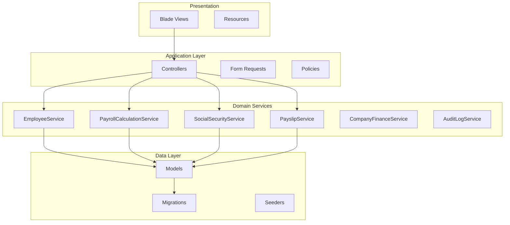
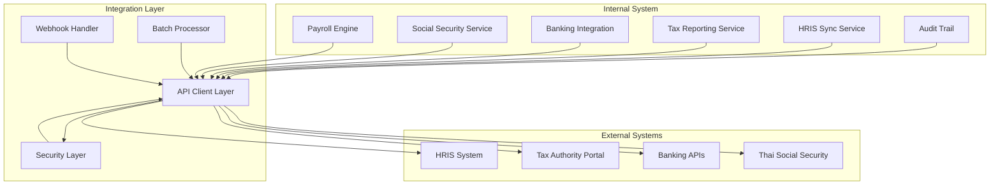
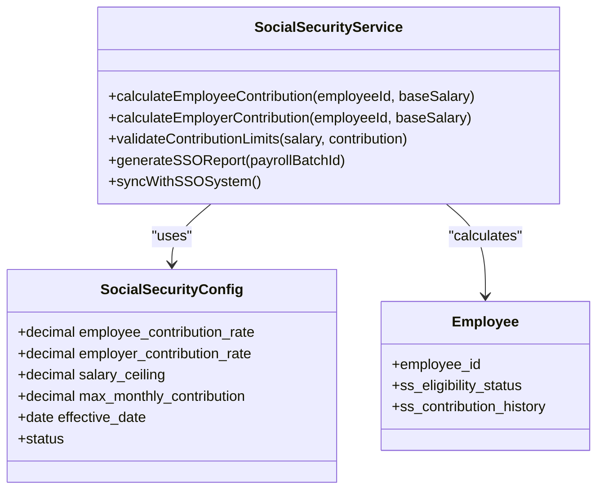
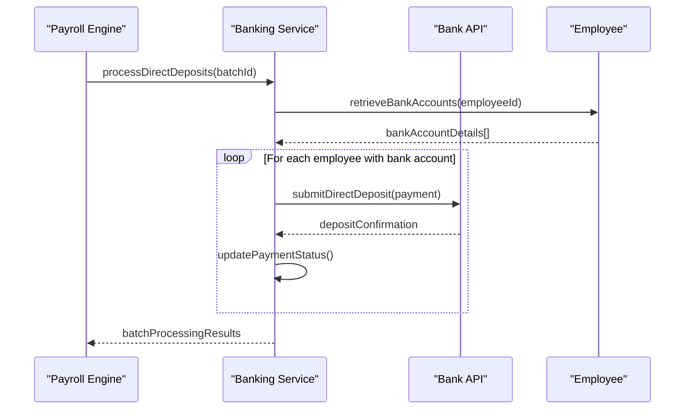
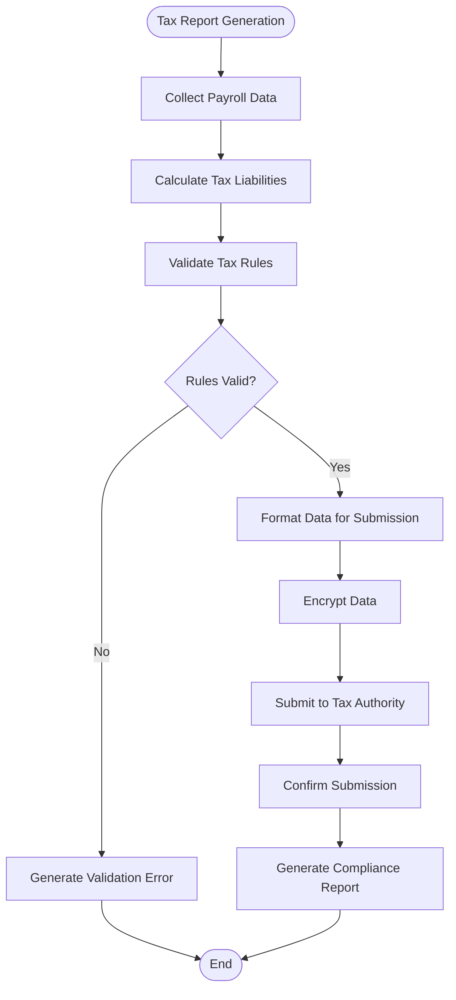
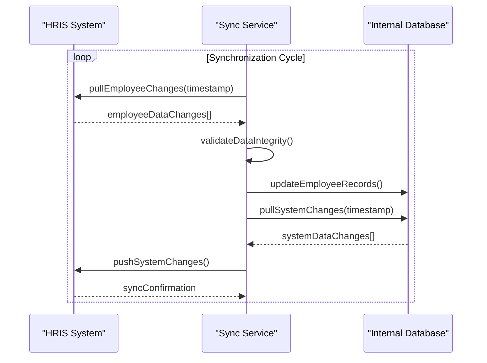
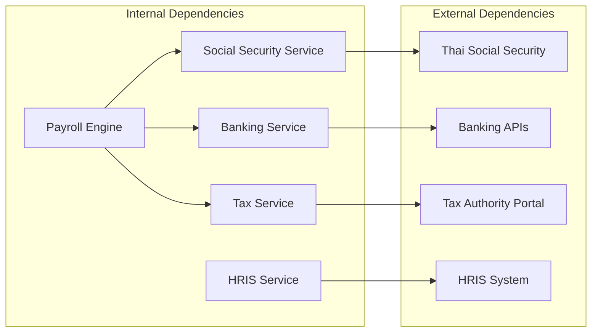
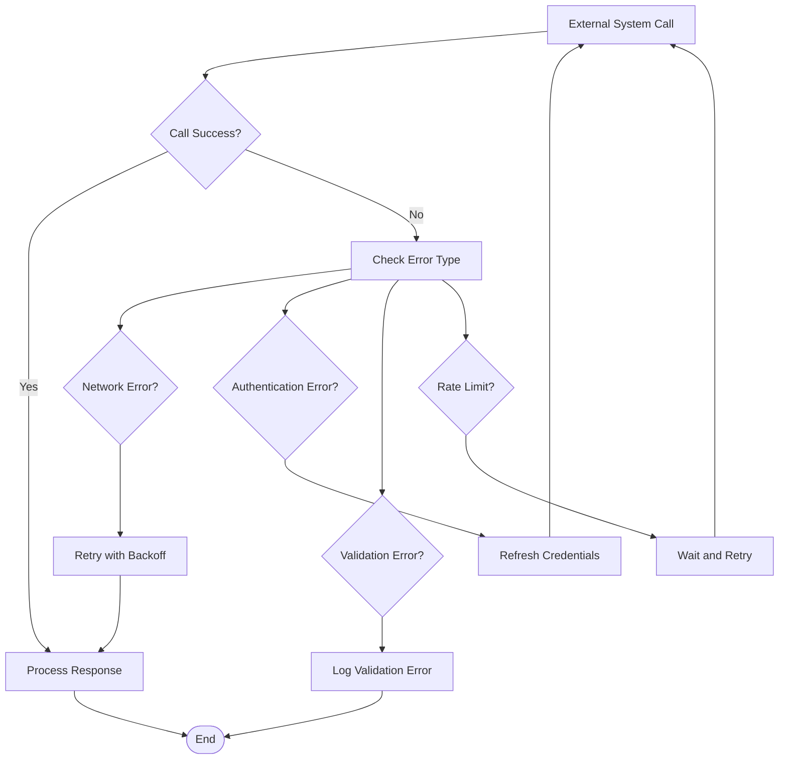

# Integration Patterns and External Systems

<cite>
**Referenced Files in This Document**
- [AGENTS.md](file://AGENTS.md)
</cite>

## Table of Contents
1. [Introduction](#introduction)
2. [Project Structure](#project-structure)
3. [Core Components](#core-components)
4. [Architecture Overview](#architecture-overview)
5. [Detailed Component Analysis](#detailed-component-analysis)
6. [Dependency Analysis](#dependency-analysis)
7. [Performance Considerations](#performance-considerations)
8. [Troubleshooting Guide](#troubleshooting-guide)
9. [Conclusion](#conclusion)
10. [Appendices](#appendices)

## Introduction
This document provides comprehensive guidance for integration patterns and external system connectivity in the xHR Payroll & Finance System. Based on the available project documentation, the system is designed as a PHP-first, MySQL-backed payroll solution with strong emphasis on rule-driven calculations, auditability, and maintainability. While the current repository snapshot focuses primarily on internal system design and database schema, this document synthesizes the documented requirements with industry-standard integration patterns to guide development of external system connectivity for Thai Social Security, banking direct deposit, tax authority reporting, and HRIS synchronization.

The system architecture outlined in the documentation establishes clear boundaries between internal modules and external integrations, emphasizing service-oriented design, configurable business rules, and robust audit trails. These foundations provide a solid platform for implementing secure, reliable, and compliant external system integrations.

## Project Structure
The xHR Payroll & Finance System follows a structured Laravel-style organization with clear separation of concerns:

**Diagram sources**
- [AGENTS.md:622-647](file://AGENTS.md#L622-L647)

The documentation specifies a comprehensive set of core entities that form the foundation for external system integration:

**Section sources**
- [AGENTS.md:132-150](file://AGENTS.md#L132-L150)
- [AGENTS.md:387-416](file://AGENTS.md#L387-L416)

## Core Components
The system's integration architecture centers around several key components that facilitate external system connectivity:

### Payroll Calculation Engine
The payroll calculation service orchestrates complex compensation computations across multiple payroll modes while maintaining strict auditability and rule configurability.

### Social Security Integration
Built-in support for Thai Social Security calculations with configurable rates, contribution ceilings, and effective date management.

### Banking Direct Deposit Infrastructure
Structured support for employee bank account configurations enabling seamless direct deposit processing.

### Tax Authority Reporting Framework
Integrated tax calculation and reporting capabilities with simulation features for compliance verification.

### HRIS Synchronization Layer
Mechanisms for bidirectional synchronization with Human Resource Information Systems.

**Section sources**
- [AGENTS.md:196-221](file://AGENTS.md#L196-L221)
- [AGENTS.md:488-497](file://AGENTS.md#L488-L497)
- [AGENTS.md:636-646](file://AGENTS.md#L636-L646)

## Architecture Overview
The integration architecture employs a service-oriented pattern with clear separation between internal business logic and external system interactions:

**Diagram sources**
- [AGENTS.md:488-497](file://AGENTS.md#L488-L497)
- [AGENTS.md:636-646](file://AGENTS.md#L636-L646)

## Detailed Component Analysis

### Thai Social Security Integration
The system provides comprehensive support for Thai Social Security integration through configurable parameters and effective date management:

**Diagram sources**
- [AGENTS.md:408](file://AGENTS.md#L408)
- [AGENTS.md:488-497](file://AGENTS.md#L488-L497)

**Section sources**
- [AGENTS.md:488-497](file://AGENTS.md#L488-L497)

### Banking Direct Deposit Integration
The banking integration framework supports multiple bank accounts per employee with standardized direct deposit processing:

**Diagram sources**
- [AGENTS.md:395](file://AGENTS.md#L395)
- [AGENTS.md:642](file://AGENTS.md#L642)

**Section sources**
- [AGENTS.md:395](file://AGENTS.md#L395)

### Tax Authority Reporting Integration
The tax reporting system provides automated compliance reporting with simulation capabilities:

**Diagram sources**
- [AGENTS.md:350](file://AGENTS.md#L350)
- [AGENTS.md:373](file://AGENTS.md#L373)

**Section sources**
- [AGENTS.md:350](file://AGENTS.md#L350)
- [AGENTS.md:373](file://AGENTS.md#L373)

### HRIS System Synchronization
The HRIS synchronization service maintains bidirectional data consistency:

**Diagram sources**
- [AGENTS.md:294-301](file://AGENTS.md#L294-L301)

**Section sources**
- [AGENTS.md:294-301](file://AGENTS.md#L294-L301)

## Dependency Analysis
The integration architecture establishes clear dependency relationships between internal services and external systems:

**Diagram sources**
- [AGENTS.md:636-646](file://AGENTS.md#L636-L646)

**Section sources**
- [AGENTS.md:636-646](file://AGENTS.md#L636-L646)

## Performance Considerations
External system integrations require careful consideration of performance characteristics:

### Real-time vs Asynchronous Processing
- **Real-time processing**: Immediate feedback for critical operations like direct deposits
- **Asynchronous processing**: Background jobs for non-critical operations like reporting
- **Hybrid approach**: Balance immediate user experience with system throughput

### Batch Processing Optimization
- **Batch size optimization**: Process multiple employees per batch to reduce API overhead
- **Rate limiting**: Respect external system rate limits and implement exponential backoff
- **Parallel processing**: Utilize concurrent processing for independent operations

### Caching Strategies
- **Configuration caching**: Cache external system configurations to reduce network calls
- **Result caching**: Cache frequently accessed data like bank routing numbers
- **Audit trail caching**: Optimize audit log queries for integration monitoring

## Troubleshooting Guide

### Common Integration Issues
- **Authentication failures**: Verify API credentials and token expiration
- **Network timeouts**: Implement retry logic with exponential backoff
- **Data validation errors**: Validate data formats against external system requirements
- **Rate limit exceeded**: Monitor and throttle API calls appropriately

### Error Handling Strategies
The system implements comprehensive error handling for external integrations:

**Diagram sources**
- [AGENTS.md:576-595](file://AGENTS.md#L576-L595)

### Monitoring and Alerting
- **Integration metrics**: Track call success rates, response times, and error frequencies
- **Health checks**: Regular monitoring of external system availability
- **Alert thresholds**: Configure alerts for critical integration failures
- **Audit logging**: Comprehensive logging of all integration activities

**Section sources**
- [AGENTS.md:576-595](file://AGENTS.md#L576-L595)

## Conclusion
The xHR Payroll & Finance System provides a robust foundation for external system integration through its service-oriented architecture, configurable business rules, and comprehensive audit capabilities. The documented design principles and entity relationships establish clear pathways for implementing secure, reliable, and compliant integrations with Thai Social Security, banking systems, tax authorities, and HRIS platforms.

Key architectural strengths for integration include:
- Clear separation of concerns between internal logic and external interactions
- Configurable business rules enabling flexible integration scenarios
- Comprehensive audit trails supporting compliance requirements
- Service-oriented design facilitating modular integration development
- Strong data validation and error handling capabilities

The integration patterns outlined in this document align with the system's foundational design principles while providing practical guidance for implementing external system connectivity in a secure and maintainable manner.

## Appendices

### API Design Patterns
- **RESTful API consumption**: Standard HTTP methods with JSON payloads
- **Webhook implementation**: Secure callback mechanisms for event-driven updates
- **Batch processing**: Efficient handling of multiple records in single operations
- **Idempotent operations**: Ensuring safe reprocessing of integration events

### Security Considerations
- **Transport security**: TLS encryption for all external communications
- **Authentication mechanisms**: API keys, OAuth tokens, or certificate-based authentication
- **Data privacy compliance**: GDPR, HIPAA, or local data protection regulations
- **Audit logging**: Comprehensive tracking of all external system interactions

### Testing Strategies
- **Mock service implementations**: Simulated external systems for development testing
- **Integration testing**: End-to-end testing with external system stubs
- **Load testing**: Performance validation under expected integration volumes
- **Failure scenario testing**: Validation of error handling and recovery mechanisms