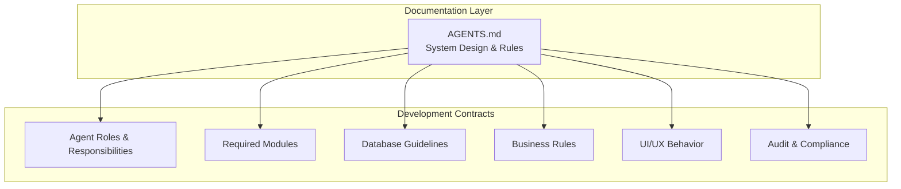
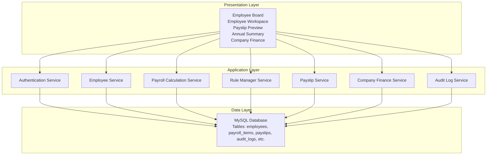
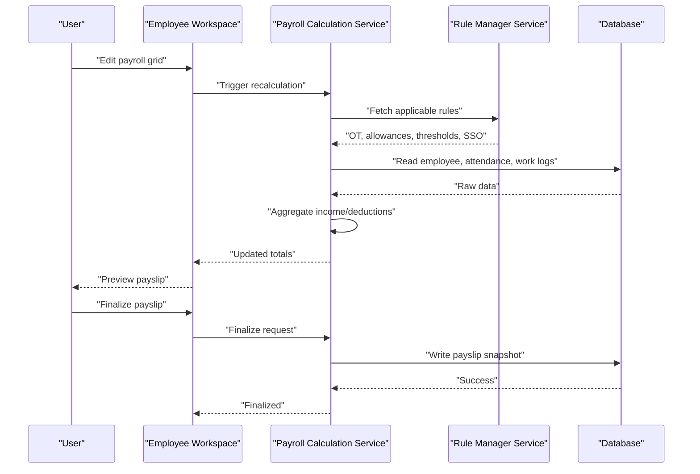
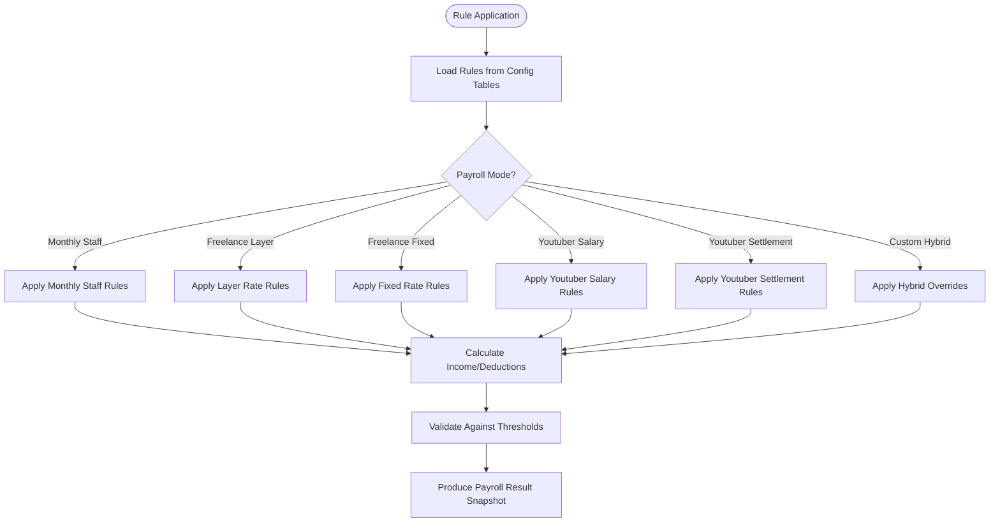
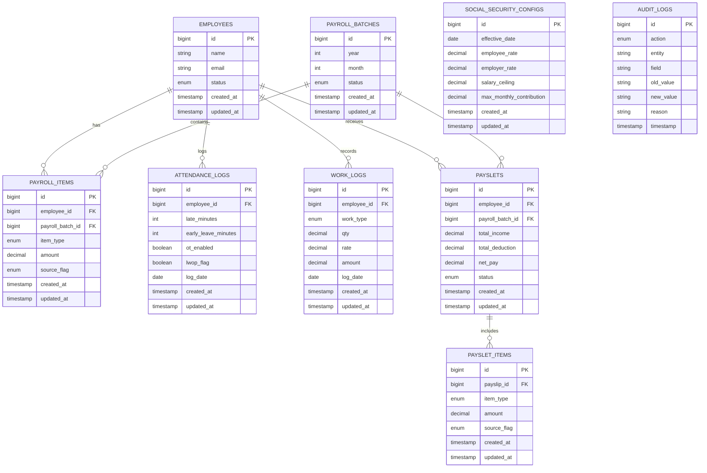
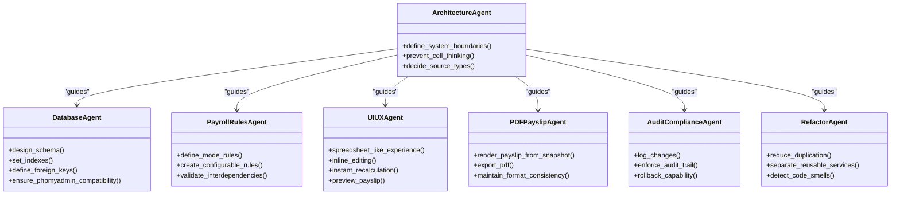
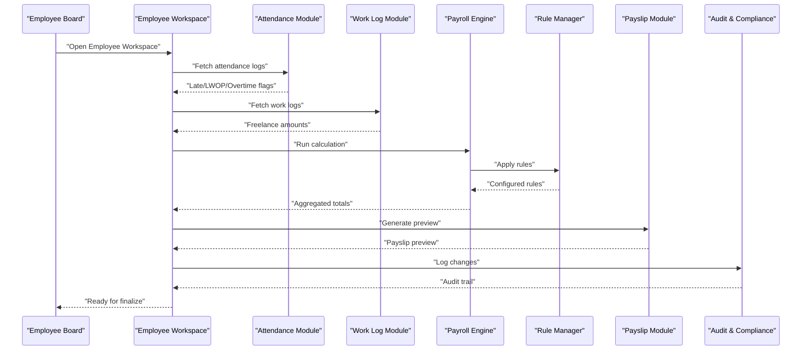
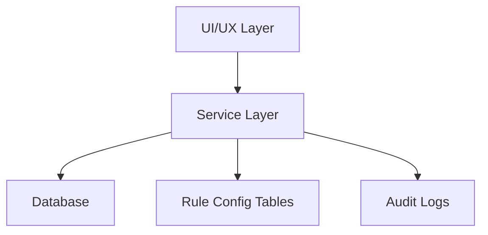

# Overall System Design

<cite>
**Referenced Files in This Document**
- [AGENTS.md](file://AGENTS.md)
</cite>

## Table of Contents
1. [Introduction](#introduction)
2. [Project Structure](#project-structure)
3. [Core Components](#core-components)
4. [Architecture Overview](#architecture-overview)
5. [Detailed Component Analysis](#detailed-component-analysis)
6. [Dependency Analysis](#dependency-analysis)
7. [Performance Considerations](#performance-considerations)
8. [Troubleshooting Guide](#troubleshooting-guide)
9. [Conclusion](#conclusion)
10. [Appendices](#appendices)

## Introduction
This document presents the overall system design for the xHR Payroll & Finance System. It explains the service-oriented architecture pattern, database-first approach, and rule-driven development methodology. It also documents how the system replaces Excel-based processes with structured database operations, details the separation of concerns among agent roles, and outlines system boundaries, component interactions, and data flow patterns. Architectural diagrams illustrate how payroll modes integrate with the calculation engine and how different modules communicate. Finally, it addresses scalability considerations, performance optimization strategies, and integration points with external systems such as Thai Social Security.

## Project Structure
The repository is a documentation-first workspace focused on defining the system’s architecture, responsibilities, and operational rules. The primary artifact is a comprehensive guide that specifies:
- Core design principles and technology constraints
- Domain model and payroll modes
- Agent responsibilities and module requirements
- Database guidelines and suggested tables
- Business rules and dynamic UI behavior
- Audit and compliance requirements
- Coding standards and folder structure guidance

This documentation establishes the foundation for building a robust, maintainable payroll and finance system that replaces ad-hoc spreadsheets with a structured, rule-driven, and auditable solution.

**Diagram sources**
- [AGENTS.md:1-721](file://AGENTS.md#L1-L721)

**Section sources**
- [AGENTS.md:9-118](file://AGENTS.md#L9-L118)
- [AGENTS.md:121-151](file://AGENTS.md#L121-L151)
- [AGENTS.md:153-284](file://AGENTS.md#L153-L284)
- [AGENTS.md:286-383](file://AGENTS.md#L286-L383)
- [AGENTS.md:385-436](file://AGENTS.md#L385-L436)
- [AGENTS.md:438-547](file://AGENTS.md#L438-L547)
- [AGENTS.md:549-596](file://AGENTS.md#L549-L596)
- [AGENTS.md:598-648](file://AGENTS.md#L598-L648)

## Core Components
The system is designed around a set of cohesive components aligned with the agent roles and module requirements. These components form the backbone of the payroll and finance workflow:

- Authentication and Authorization: Provides secure access with role-based permissions.
- Employee Management: Centralizes employee profiles, salary profiles, and payroll mode assignments.
- Employee Board and Workspace: Offers a unified interface for payroll entry, real-time recalculation, and payslip preview.
- Attendance and Work Log: Captures attendance and work logs for applicable payroll modes.
- Payroll Engine: Calculates earnings, deductions, and net pay according to configured rules and payroll modes.
- Rule Manager: Manages configurable rules for OT, allowances, bonuses, thresholds, layer rates, SSO, taxes, and module toggles.
- Payslip Builder and PDF Generator: Renders and exports payslips from validated, finalized snapshots.
- Annual Summary and Company Finance: Produces year-over-year summaries and financial statements.
- Audit and Compliance: Tracks changes and enforces compliance with audit requirements.

These components interact through clearly defined boundaries and responsibilities, ensuring separation of concerns and maintainability.

**Section sources**
- [AGENTS.md:288-383](file://AGENTS.md#L288-L383)
- [AGENTS.md:438-547](file://AGENTS.md#L438-L547)
- [AGENTS.md:549-596](file://AGENTS.md#L549-L596)
- [AGENTS.md:598-648](file://AGENTS.md#L598-L648)

## Architecture Overview
The system follows a service-oriented architecture with a database-first approach and rule-driven development. The architecture emphasizes:
- Service-centric business logic encapsulated in dedicated services
- A relational database as the single source of truth
- Configurable rules stored in dedicated tables
- Modular UI components integrated with backend services
- Audit trails and compliance controls

**Diagram sources**
- [AGENTS.md:288-383](file://AGENTS.md#L288-L383)
- [AGENTS.md:385-436](file://AGENTS.md#L385-L436)
- [AGENTS.md:598-648](file://AGENTS.md#L598-L648)

## Detailed Component Analysis

### Payroll Modes and Calculation Engine
The calculation engine integrates with multiple payroll modes, each governed by specific business rules and configurations. The engine aggregates income and deductions, supports manual overrides, and produces a final snapshot for payslip generation.

**Diagram sources**
- [AGENTS.md:338-353](file://AGENTS.md#L338-L353)
- [AGENTS.md:438-506](file://AGENTS.md#L438-L506)
- [AGENTS.md:549-574](file://AGENTS.md#L549-L574)

**Section sources**
- [AGENTS.md:123-131](file://AGENTS.md#L123-L131)
- [AGENTS.md:338-353](file://AGENTS.md#L338-L353)
- [AGENTS.md:438-506](file://AGENTS.md#L438-L506)

### Rule-Driven Development Methodology
Rules are stored in dedicated configuration tables and applied dynamically during calculations. This approach ensures maintainability, auditability, and flexibility to adapt to changing regulations or business needs.

**Diagram sources**
- [AGENTS.md:61-74](file://AGENTS.md#L61-L74)
- [AGENTS.md:196-221](file://AGENTS.md#L196-L221)
- [AGENTS.md:438-506](file://AGENTS.md#L438-L506)

**Section sources**
- [AGENTS.md:61-74](file://AGENTS.md#L61-L74)
- [AGENTS.md:196-221](file://AGENTS.md#L196-L221)
- [AGENTS.md:438-506](file://AGENTS.md#L438-L506)

### Database-First Approach and Schema Design
The database is the single source of truth, with tables designed for readability, auditability, and phpMyAdmin compatibility. The schema supports:
- Core entities: employees, payroll batches, payroll items, payslips, audit logs
- Supporting entities: attendance logs, work logs, rate rules, bonus rules, social security configs
- Financial summaries: company revenues, expenses, subscription costs

**Diagram sources**
- [AGENTS.md:387-417](file://AGENTS.md#L387-L417)

**Section sources**
- [AGENTS.md:385-436](file://AGENTS.md#L385-L436)
- [AGENTS.md:387-417](file://AGENTS.md#L387-L417)

### Agent Roles and Separation of Concerns
Each agent role defines a distinct responsibility area, ensuring clear boundaries and reducing coupling:
- Architecture Agent: Defines system boundaries and prevents spreadsheet-style cell thinking.
- Database Agent: Designs schema, indexes, foreign keys, and ensures phpMyAdmin compatibility.
- Payroll Rules Agent: Creates configurable rules per payroll mode and validates interdependencies.
- UI/UX Agent: Ensures a spreadsheet-like experience with inline editing, instant recalculation, and clear state indicators.
- PDF/Payslip Agent: Renders payslips from validated snapshots and maintains format consistency.
- Audit & Compliance Agent: Enforces audit logging and rollback capability for critical changes.
- Refactor Agent: Maintains simplicity, reduces duplication, and promotes reusable services.

**Diagram sources**
- [AGENTS.md:158-284](file://AGENTS.md#L158-L284)

**Section sources**
- [AGENTS.md:158-284](file://AGENTS.md#L158-L284)

### Module Interactions
Modules interact through well-defined interfaces and shared services. The Employee Workspace orchestrates interactions between Attendance, Work Log, Payroll Engine, Rule Manager, and Payslip services, while maintaining audit and compliance controls.

**Diagram sources**
- [AGENTS.md:303-383](file://AGENTS.md#L303-L383)
- [AGENTS.md:338-353](file://AGENTS.md#L338-L353)
- [AGENTS.md:576-596](file://AGENTS.md#L576-L596)

**Section sources**
- [AGENTS.md:303-383](file://AGENTS.md#L303-L383)
- [AGENTS.md:338-353](file://AGENTS.md#L338-L353)
- [AGENTS.md:576-596](file://AGENTS.md#L576-L596)

## Dependency Analysis
The system exhibits low coupling and high cohesion across modules. Dependencies flow from presentation to services and from services to the database. The rule-driven design centralizes business logic in services and configuration tables, minimizing direct dependencies between UI and business rules.

**Diagram sources**
- [AGENTS.md:598-648](file://AGENTS.md#L598-L648)
- [AGENTS.md:385-436](file://AGENTS.md#L385-L436)

**Section sources**
- [AGENTS.md:598-648](file://AGENTS.md#L598-L648)
- [AGENTS.md:385-436](file://AGENTS.md#L385-L436)

## Performance Considerations
- Indexing and Foreign Keys: Ensure appropriate indexes on frequently queried columns (employee_id, payroll_batch_id, log_date) and maintain referential integrity via foreign keys.
- Decimal Precision: Use precise numeric types for monetary fields to avoid rounding errors.
- Batch Processing: Aggregate and process payroll items in batches to reduce round-trips to the database.
- Caching: Cache frequently accessed rule configurations and static lists (e.g., departments, positions) to minimize repeated reads.
- Pagination and Filtering: Implement pagination and efficient filtering in the Employee Board and Workspace to handle large datasets.
- Query Optimization: Prefer joins and aggregations over multiple round-trips; use stored procedures or materialized views for complex financial summaries when feasible.
- Asynchronous Jobs: Offload heavy tasks (e.g., PDF generation, bulk recalculations) to queued jobs to keep the UI responsive.

[No sources needed since this section provides general guidance]

## Troubleshooting Guide
Common issues and resolutions:
- Incorrect Totals: Verify that the payroll mode is correctly assigned and that the Rule Manager is applying the intended rules. Confirm that manual overrides are properly tagged and audited.
- Payslip Discrepancies: Ensure that payslips are finalized and rendered from the snapshot tables. Check audit logs for changes made after finalization.
- Attendance/Work Log Errors: Validate that attendance and work logs are correctly linked to employees and payroll batches. Confirm that OT flags and LWOP flags are set appropriately.
- Audit Trail Gaps: Review audit logs for missing entries and ensure that all critical changes are captured with reasons and timestamps.
- Database Migration Issues: Confirm that migrations are compatible with phpMyAdmin and shared hosting environments. Validate foreign key constraints and data types.

**Section sources**
- [AGENTS.md:576-596](file://AGENTS.md#L576-L596)
- [AGENTS.md:549-574](file://AGENTS.md#L549-L574)
- [AGENTS.md:385-436](file://AGENTS.md#L385-L436)

## Conclusion
The xHR Payroll & Finance System is designed to replace Excel-based processes with a structured, database-first, and rule-driven solution. By adhering to service-oriented architecture, clear separation of concerns among agent roles, and maintainable coding standards, the system achieves reliability, auditability, and scalability. The documented modules, data flows, and integration points provide a blueprint for building a robust payroll and finance platform tailored to diverse payroll modes and compliance requirements, including integration with external systems such as Thai Social Security.

[No sources needed since this section summarizes without analyzing specific files]

## Appendices
- Minimum Deliverables: Project structure, database schema, migrations, seed data, model relationships, payroll services, rule manager, Employee workspace UI, payslip builder + PDF, audit logs, annual summary, company finance summary.
- Definition of Done: Successful onboarding of new employees, assignment of payroll modes, single-page salary entry, correct calculations across all payroll modes, configurable SSO, PDF payslips, annual summaries, company P&L, audit logs, and future extensibility.

**Section sources**
- [AGENTS.md:675-710](file://AGENTS.md#L675-L710)