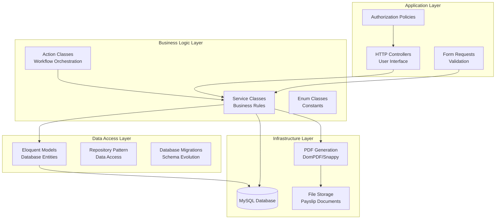
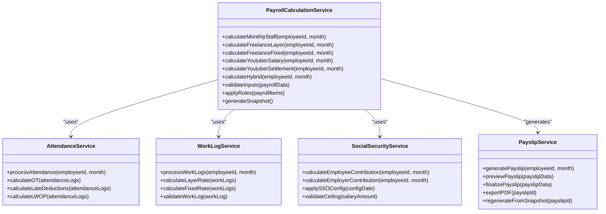
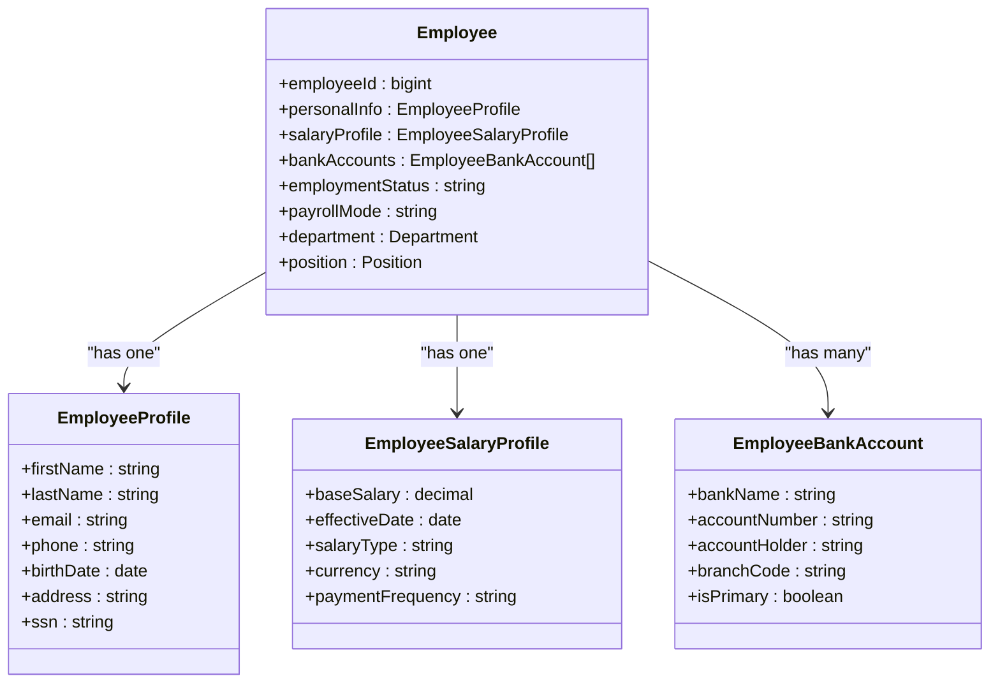
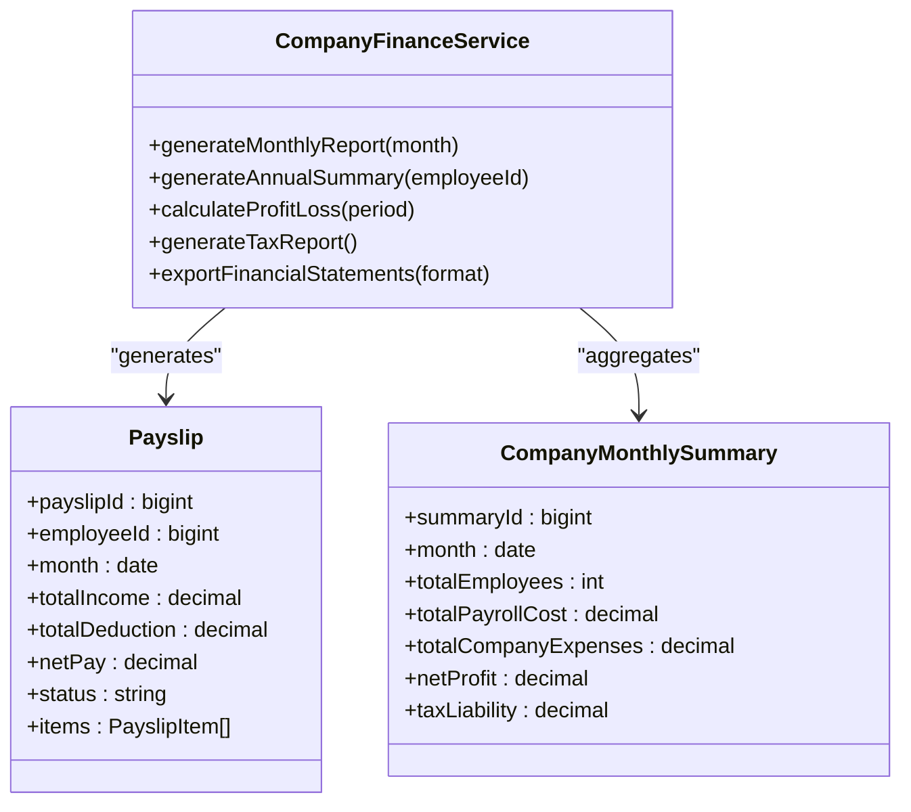
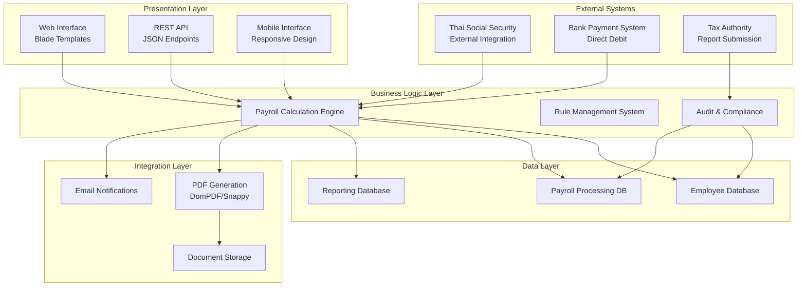
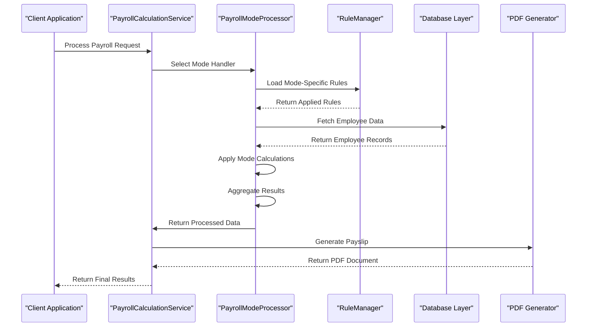
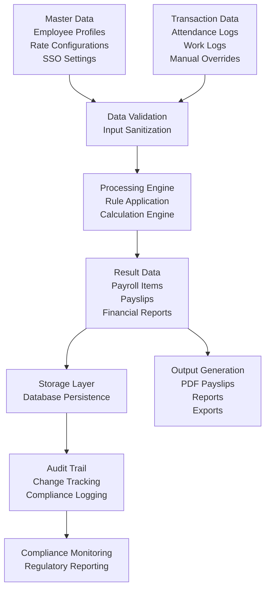
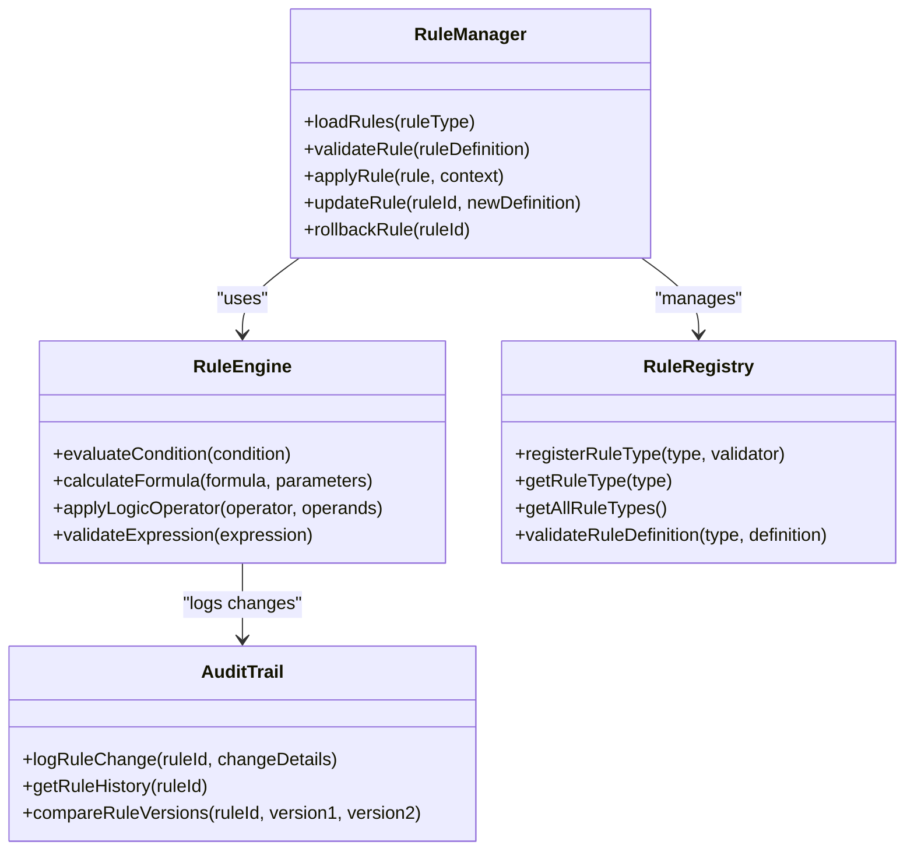
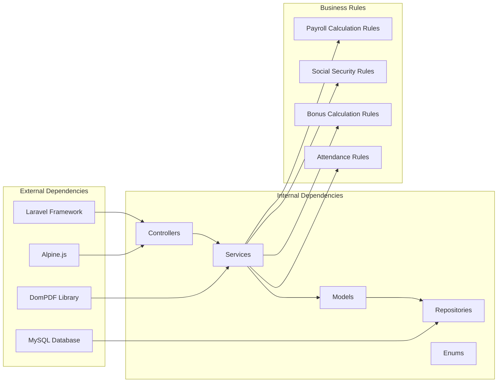

# System Architecture

<cite>
**Referenced Files in This Document**
- [AGENTS.md](file://AGENTS.md)
</cite>

## Table of Contents
1. [Introduction](#introduction)
2. [Project Structure](#project-structure)
3. [Core Components](#core-components)
4. [Architecture Overview](#architecture-overview)
5. [Detailed Component Analysis](#detailed-component-analysis)
6. [Dependency Analysis](#dependency-analysis)
7. [Performance Considerations](#performance-considerations)
8. [Troubleshooting Guide](#troubleshooting-guide)
9. [Conclusion](#conclusion)

## Introduction

The xHR Payroll & Finance System is a comprehensive payroll and financial management solution designed to replace traditional Excel-based systems with a modern, database-driven approach. Built on PHP 8.2+ with Laravel framework and MySQL 8+, this system provides automated payroll calculation, employee management, financial reporting, and compliance tracking capabilities.

The system follows six core design principles: PHP-first development, MySQL/phpMyAdmin-friendly database design, dynamic data entry, rule-driven configuration, auditability, and maintainability. It supports multiple payroll modes including monthly staff, freelance workers, and content creators while maintaining strict separation of concerns through service-oriented architecture.

## Project Structure

The system is organized around a service-oriented architecture with clear separation between business logic, data persistence, and presentation layers. The recommended folder structure follows Laravel conventions while emphasizing maintainability and extensibility.

**Diagram sources**
- [AGENTS.md:622-647](file://AGENTS.md#L622-L647)

The system emphasizes maintainability through clear component separation, with each service handling specific business domains while maintaining loose coupling and high cohesion.

**Section sources**
- [AGENTS.md:622-647](file://AGENTS.md#L622-L647)

## Core Components

### Payroll Calculation Engine

The heart of the system is the payroll calculation engine responsible for processing different payroll modes according to configurable business rules. The engine supports six distinct payroll modes with specialized calculation logic while maintaining common interfaces and data structures.

**Diagram sources**
- [AGENTS.md:636-646](file://AGENTS.md#L636-L646)

### Employee Management System

The employee management module handles comprehensive personnel data including profiles, salary configurations, bank accounts, and employment status tracking. It maintains strict data integrity while providing flexible configuration options.

**Diagram sources**
- [AGENTS.md:132-149](file://AGENTS.md#L132-L149)

### Financial Reporting Module

The financial reporting system generates comprehensive reports including payslips, annual summaries, and company financial statements. It provides multiple output formats while maintaining audit trails and compliance requirements.

**Diagram sources**
- [AGENTS.md:367-382](file://AGENTS.md#L367-L382)

**Section sources**
- [AGENTS.md:338-382](file://AGENTS.md#L338-L382)

## Architecture Overview

The xHR Payroll & Finance System follows a service-oriented architecture with clear separation of concerns and well-defined interfaces between components. The architecture emphasizes scalability, maintainability, and compliance through rule-driven configuration and comprehensive audit logging.

**Diagram sources**
- [AGENTS.md:102-118](file://AGENTS.md#L102-L118)

The architecture supports multiple integration patterns including direct database connections, REST API consumption, and event-driven communication with external systems like Thai Social Security.

**Section sources**
- [AGENTS.md:102-118](file://AGENTS.md#L102-L118)

## Detailed Component Analysis

### Payroll Mode Processing

Each payroll mode follows a standardized processing pipeline while accommodating specific business rules and calculations. The system maintains consistency through shared interfaces and data structures while allowing for mode-specific customization.

**Diagram sources**
- [AGENTS.md:440-487](file://AGENTS.md#L440-L487)

### Data Flow Architecture

The system maintains strict data flow principles with clear boundaries between master data, transaction data, and calculated results. This ensures auditability and prevents data corruption through unauthorized modifications.

**Diagram sources**
- [AGENTS.md:36-91](file://AGENTS.md#L36-L91)

### Rule-Driven Configuration System

The system implements a comprehensive rule management system that allows business rules to be configured dynamically without code changes. This enables rapid adaptation to changing regulations and business requirements.

**Diagram sources**
- [AGENTS.md:61-74](file://AGENTS.md#L61-L74)

**Section sources**
- [AGENTS.md:438-506](file://AGENTS.md#L438-L506)

## Dependency Analysis

The system exhibits low coupling and high cohesion through well-defined interfaces and service boundaries. Dependencies flow primarily from presentation to business logic to data access layers, with clear inversion of control through dependency injection.

**Diagram sources**
- [AGENTS.md:104-110](file://AGENTS.md#L104-L110)

The dependency structure supports scalability through horizontal scaling of services and database sharding for large datasets. The rule-driven architecture enables easy modification of business logic without affecting core system components.

**Section sources**
- [AGENTS.md:104-118](file://AGENTS.md#L104-L118)

## Performance Considerations

### Database Optimization

The system employs several database optimization strategies including proper indexing, query optimization, and caching mechanisms. The MySQL schema design prioritizes performance with appropriate data types and normalization while maintaining phpMyAdmin compatibility.

### Caching Strategy

The architecture supports multiple caching layers including:
- Application-level caching for frequently accessed rules and configurations
- Database query result caching for expensive calculations
- Session-based caching for user-specific data
- Static asset caching for improved frontend performance

### Scalability Patterns

Horizontal scaling is achieved through:
- Microservice decomposition for independent scaling of major components
- Database read replicas for reporting and analytics
- Message queuing for asynchronous processing of heavy calculations
- CDN integration for static assets and generated documents

## Troubleshooting Guide

### Common Issues and Solutions

**Payroll Calculation Errors**
- Verify rule configurations match payroll mode requirements
- Check for missing or invalid employee data
- Review audit logs for recent changes that may affect calculations
- Validate database constraints and foreign key relationships

**Payslip Generation Problems**
- Ensure PDF generation library is properly configured
- Check file permissions for document storage
- Verify template consistency across different payroll modes
- Review memory limits for large document generation

**Performance Degradation**
- Monitor database query execution times
- Implement proper indexing strategies
- Review caching configuration effectiveness
- Analyze memory usage patterns during peak processing

**Integration Failures**
- Validate external system credentials and endpoints
- Check network connectivity and firewall configurations
- Review API response formats and error handling
- Monitor integration logs for failure patterns

**Section sources**
- [AGENTS.md:663-672](file://AGENTS.md#L663-L672)

## Conclusion

The xHR Payroll & Finance System represents a sophisticated approach to payroll automation that balances user experience with technical excellence. Through its service-oriented architecture, rule-driven configuration system, and comprehensive audit capabilities, the system provides a robust foundation for scalable payroll processing.

The PHP-first development approach combined with Laravel's powerful ecosystem ensures maintainability and extensibility while MySQL's proven reliability provides solid data persistence. The system's design accommodates future growth through modular architecture and clear separation of concerns.

Key strengths include:
- Comprehensive rule management enabling rapid adaptation to regulatory changes
- Audit-ready design supporting compliance and regulatory requirements
- Flexible payroll mode support accommodating diverse business models
- Scalable architecture supporting enterprise-level deployment
- User-friendly interface maintaining spreadsheet-like experience

The system successfully transforms traditional payroll processing from a manual, error-prone Excel-based approach into an automated, auditable, and scalable solution that maintains the familiar user experience while providing professional-grade functionality.