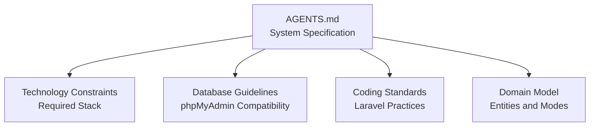
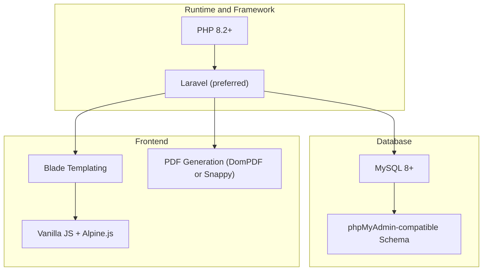
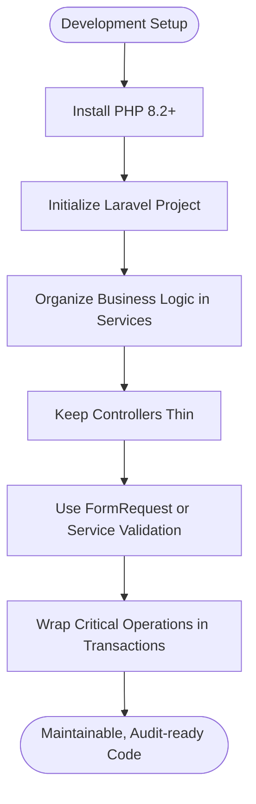
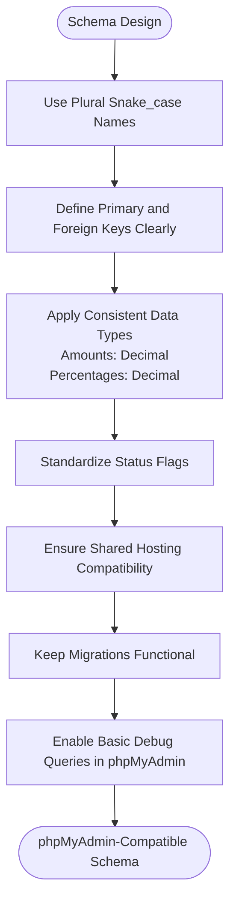
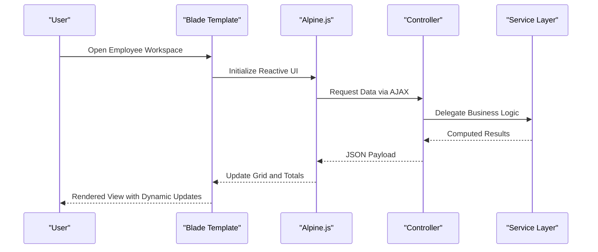
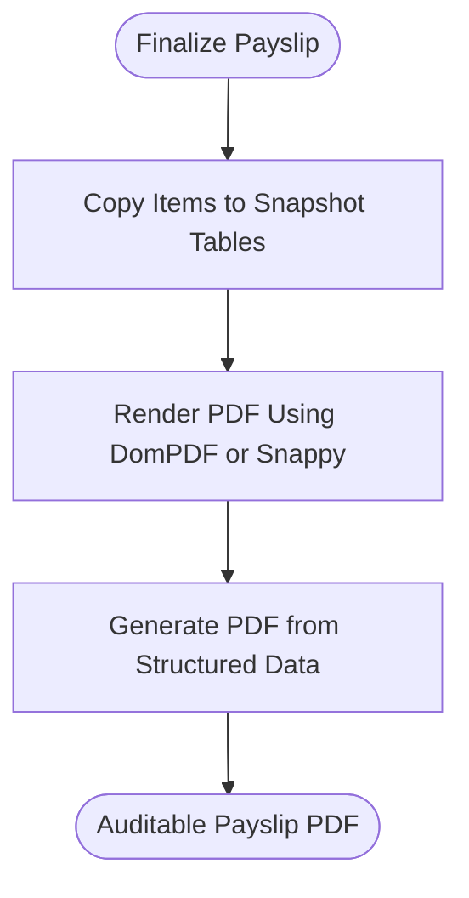
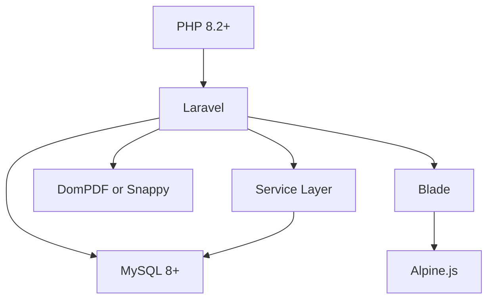

# Technology Stack and Constraints

<cite>
**Referenced Files in This Document**
- [AGENTS.md](file://AGENTS.md)
</cite>

## Table of Contents
1. [Introduction](#introduction)
2. [Project Structure](#project-structure)
3. [Core Components](#core-components)
4. [Architecture Overview](#architecture-overview)
5. [Detailed Component Analysis](#detailed-component-analysis)
6. [Dependency Analysis](#dependency-analysis)
7. [Performance Considerations](#performance-considerations)
8. [Troubleshooting Guide](#troubleshooting-guide)
9. [Conclusion](#conclusion)
10. [Appendices](#appendices)

## Introduction
This document defines the technology stack and constraints for the xHR Payroll & Finance System. It consolidates the required runtime and framework versions, database and phpMyAdmin compatibility expectations, frontend technologies, PDF generation libraries, architectural constraints, and migration/system integration guidelines. It also outlines version compatibility considerations and upgrade paths for each technology component.

## Project Structure
The repository currently contains a single specification and design document that prescribes the technology stack and constraints. The document describes the system’s PHP-first approach, Laravel preference, MySQL 8+ requirement, phpMyAdmin-friendly schema, Blade + JS stack, and PDF generation via DomPDF or Snappy.

**Diagram sources**
- [AGENTS.md:102-118](file://AGENTS.md#L102-L118)
- [AGENTS.md:428-435](file://AGENTS.md#L428-L435)
- [AGENTS.md:598-620](file://AGENTS.md#L598-L620)
- [AGENTS.md:121-150](file://AGENTS.md#L121-L150)

**Section sources**
- [AGENTS.md:1-721](file://AGENTS.md#L1-L721)

## Core Components
The system’s technology stack and constraints are explicitly defined in the specification document. The following components are required or constrained:

- Runtime and framework
  - PHP 8.2+ runtime
  - Laravel framework (preferred)
- Database and admin tooling
  - MySQL 8+
  - phpMyAdmin-compatible schema
- Frontend
  - Blade templating
  - Vanilla JavaScript and Alpine.js
  - Lightweight JavaScript for dynamic UI
- PDF generation
  - DomPDF or Snappy
- Architectural constraints
  - No spreadsheets-as-database
  - No magic numbers in views
  - No business logic in Blade
  - No direct query logic scattered in controllers
  - Avoid overengineering with unnecessary microservices

These constraints guide development practices, folder structure, and migration design to ensure maintainability, auditability, and scalability.

**Section sources**
- [AGENTS.md:104-118](file://AGENTS.md#L104-L118)

## Architecture Overview
The system architecture is designed around a PHP-first, Laravel-based backend with a MySQL 8+ database and a Blade + JS frontend. The architecture enforces separation of concerns, rule-driven calculations, and auditability. The document emphasizes dynamic but controlled editing, single-source-of-truth data storage, and PDF generation from structured data snapshots.

**Diagram sources**
- [AGENTS.md:104-110](file://AGENTS.md#L104-L110)
- [AGENTS.md:428-435](file://AGENTS.md#L428-L435)

**Section sources**
- [AGENTS.md:102-118](file://AGENTS.md#L102-L118)
- [AGENTS.md:428-435](file://AGENTS.md#L428-L435)

## Detailed Component Analysis

### PHP Runtime and Laravel Framework
- PHP 8.2+ is required for runtime compatibility.
- Laravel is preferred for framework-level capabilities, routing, middleware, and ecosystem integration.
- Coding standards emphasize service classes for business logic, minimal controllers, FormRequest-based validation, and transactional operations to reduce complexity and improve maintainability.

**Diagram sources**
- [AGENTS.md:104-106](file://AGENTS.md#L104-L106)
- [AGENTS.md:600-605](file://AGENTS.md#L600-L605)

**Section sources**
- [AGENTS.md:104-106](file://AGENTS.md#L104-L106)
- [AGENTS.md:598-620](file://AGENTS.md#L598-L620)

### Database and phpMyAdmin Compatibility
- MySQL 8+ is required for advanced features and compatibility.
- Schema must be phpMyAdmin-compatible:
  - Easy-to-read table and column names
  - Avoid reliance on advanced DB features unsupported by shared hosting
  - Migrations remain functional
  - Basic queries can be debugged in phpMyAdmin
- Database conventions include plural snake_case table names, explicit primary and foreign keys, standardized status flags, and consistent data types for amounts and percentages.

**Diagram sources**
- [AGENTS.md:418-427](file://AGENTS.md#L418-L427)
- [AGENTS.md:428-435](file://AGENTS.md#L428-L435)

**Section sources**
- [AGENTS.md:107-108](file://AGENTS.md#L107-L108)
- [AGENTS.md:418-427](file://AGENTS.md#L418-L427)
- [AGENTS.md:428-435](file://AGENTS.md#L428-L435)

### Frontend Technologies: Blade, Vanilla JS, Alpine.js
- Blade templating is used for server-rendered views.
- Vanilla JS and Alpine.js are used for lightweight, reactive UI behaviors.
- The system avoids embedding business logic in Blade templates and discourages magic numbers in views.

**Diagram sources**
- [AGENTS.md:109](file://AGENTS.md#L109)
- [AGENTS.md:600-605](file://AGENTS.md#L600-L605)

**Section sources**
- [AGENTS.md:109](file://AGENTS.md#L109)
- [AGENTS.md:600-605](file://AGENTS.md#L600-L605)

### PDF Generation Libraries (DomPDF/Snappy)
- PDF generation must be handled via DomPDF or Snappy.
- Payslips must be rendered from structured data snapshots to ensure auditability and reproducibility.

**Diagram sources**
- [AGENTS.md:110](file://AGENTS.md#L110)
- [AGENTS.md:252-256](file://AGENTS.md#L252-L256)

**Section sources**
- [AGENTS.md:110](file://AGENTS.md#L110)
- [AGENTS.md:252-256](file://AGENTS.md#L252-L256)

### Migration System Constraints
- Migrations must remain functional and compatible with phpMyAdmin-friendly schema design.
- Schema changes should avoid advanced DB features to preserve compatibility with shared hosting environments.

**Section sources**
- [AGENTS.md:181](file://AGENTS.md#L181)
- [AGENTS.md:428-435](file://AGENTS.md#L428-L435)

### Third-Party Library Integration Points
- PDF generation libraries (DomPDF/Snappy) integrate with the payslip rendering pipeline.
- Alpine.js integrates with Blade templates to provide dynamic, reactive UI behaviors.
- Laravel ecosystem components (routing, middleware, validation) support the overall architecture.

**Section sources**
- [AGENTS.md:110](file://AGENTS.md#L110)
- [AGENTS.md:109](file://AGENTS.md#L109)
- [AGENTS.md:600-605](file://AGENTS.md#L600-L605)

## Dependency Analysis
The system’s dependencies are primarily defined by the technology stack and constraints:

- PHP 8.2+ depends on Laravel ecosystem features and language-level improvements.
- Laravel depends on MySQL 8+ for advanced SQL features and compatibility.
- Blade depends on Laravel’s templating engine and integrates with Alpine.js for client-side reactivity.
- PDF generation depends on DomPDF or Snappy and the structured payslip data model.

**Diagram sources**
- [AGENTS.md:104-110](file://AGENTS.md#L104-L110)

**Section sources**
- [AGENTS.md:104-110](file://AGENTS.md#L104-L110)

## Performance Considerations
- Prefer service-layer logic over embedded business logic in views to keep controllers thin and improve testability.
- Use transactions for critical operations to ensure atomicity and reduce overhead from repeated round-trips.
- Keep migrations and schema changes minimal and phpMyAdmin-compatible to avoid performance regressions on shared hosting.

[No sources needed since this section provides general guidance]

## Troubleshooting Guide
Common issues and resolutions aligned with the constraints:

- Spreadsheets-as-database patterns
  - Symptom: Data stored in CSV/Excel-like structures instead of normalized tables.
  - Resolution: Normalize schema and enforce record-based storage per design principles.

- Magic numbers in views
  - Symptom: Hardcoded values in Blade templates.
  - Resolution: Centralize values in configuration or service classes and pass them to views.

- Business logic in Blade
  - Symptom: Complex calculations in templates.
  - Resolution: Move logic to service classes and controllers.

- Direct query logic scattered in controllers
  - Symptom: Ad-hoc queries and inconsistent data access.
  - Resolution: Use Eloquent models and repositories/services for data access.

- Overengineering with unnecessary microservices
  - Symptom: Excessive abstraction and distributed complexity.
  - Resolution: Keep the system cohesive and focused on core payroll and finance workflows.

**Section sources**
- [AGENTS.md:112-118](file://AGENTS.md#L112-L118)
- [AGENTS.md:36-48](file://AGENTS.md#L36-L48)
- [AGENTS.md:600-605](file://AGENTS.md#L600-L605)

## Conclusion
The xHR Payroll & Finance System is built on a clear technology stack and strict architectural constraints. By adhering to PHP 8.2+, Laravel, MySQL 8+, phpMyAdmin-friendly schema design, Blade + JS, and PDF generation via DomPDF/Snappy, the system achieves maintainability, auditability, and scalability. Migration and integration practices must align with these constraints to ensure compatibility across environments and future upgrades.

[No sources needed since this section summarizes without analyzing specific files]

## Appendices

### Version Compatibility Matrix and Upgrade Paths
- PHP runtime
  - Requirement: 8.2+
  - Upgrade path: Incremental patch updates within 8.x series; plan major version upgrades with Laravel compatibility checks.
- Laravel framework
  - Preference: Latest LTS or stable release aligned with PHP 8.2+.
  - Upgrade path: Follow Laravel release notes and ecosystem compatibility; test migrations and PDF rendering after upgrades.
- MySQL database
  - Requirement: 8+
  - Upgrade path: Backward-compatible schema design; test migrations and phpMyAdmin compatibility after upgrades.
- phpMyAdmin
  - Requirement: Compatible schema and migrations.
  - Upgrade path: Validate basic queries and schema changes post-upgrade.
- PDF libraries
  - Options: DomPDF or Snappy.
  - Upgrade path: Verify payslip rendering and snapshot data integrity after library updates.

**Section sources**
- [AGENTS.md:104-110](file://AGENTS.md#L104-L110)
- [AGENTS.md:428-435](file://AGENTS.md#L428-L435)
- [AGENTS.md:252-256](file://AGENTS.md#L252-L256)