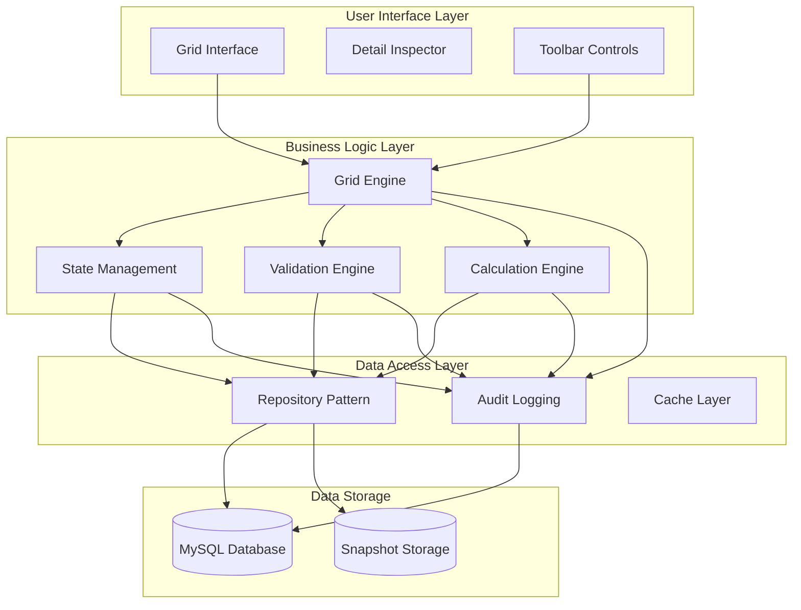
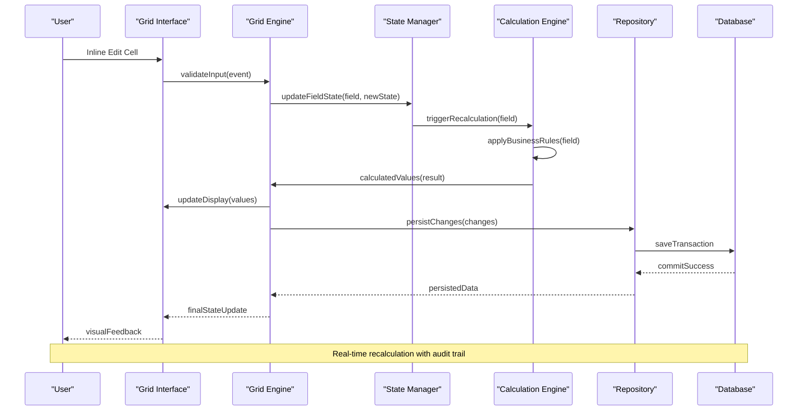
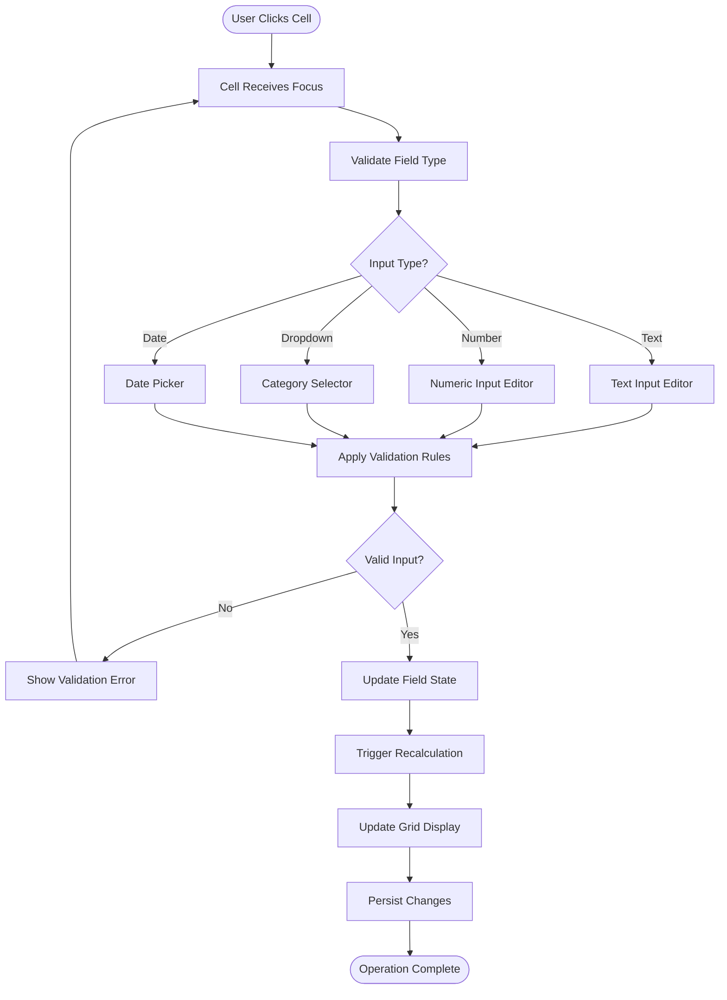
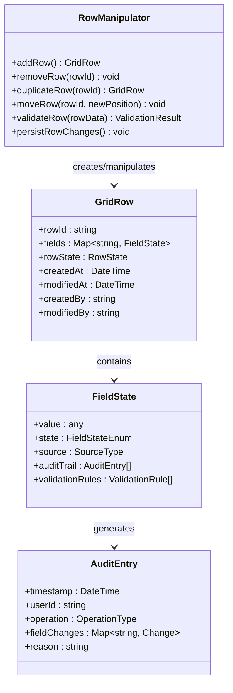
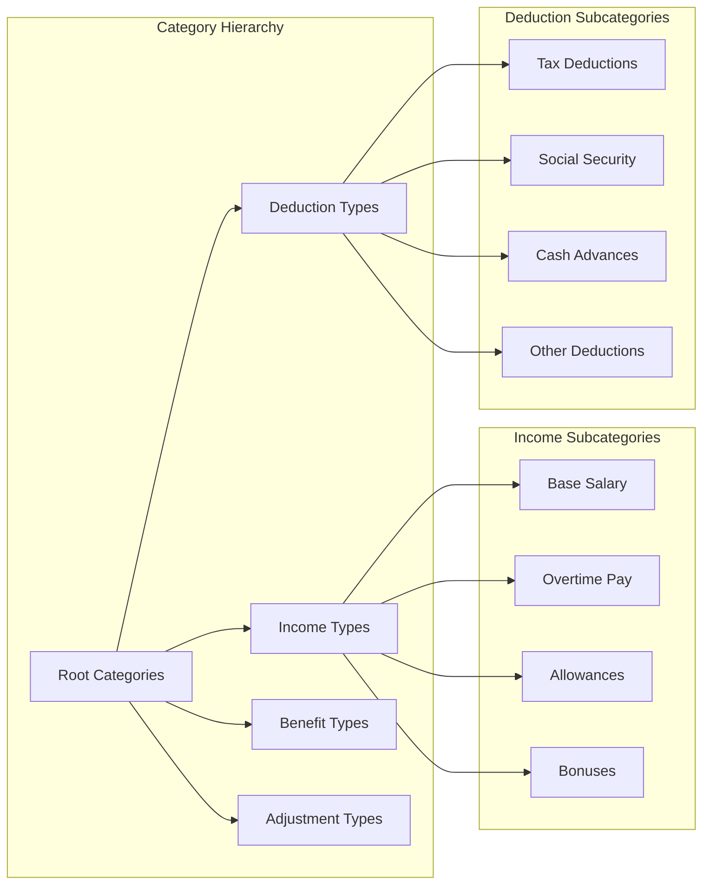
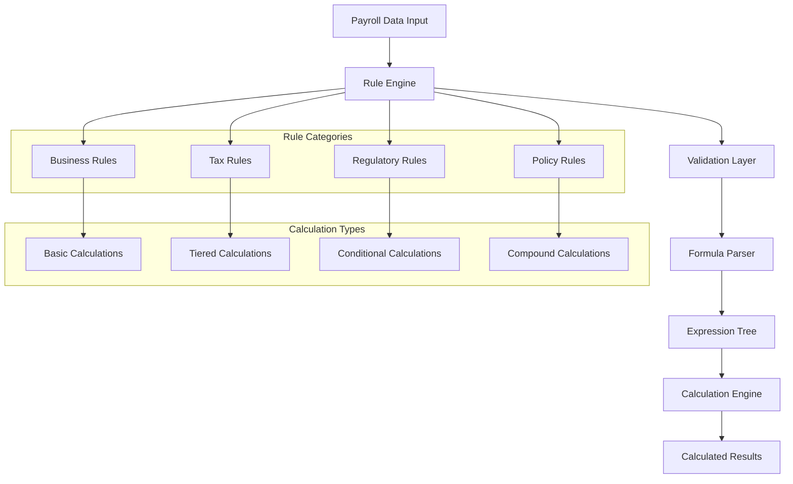
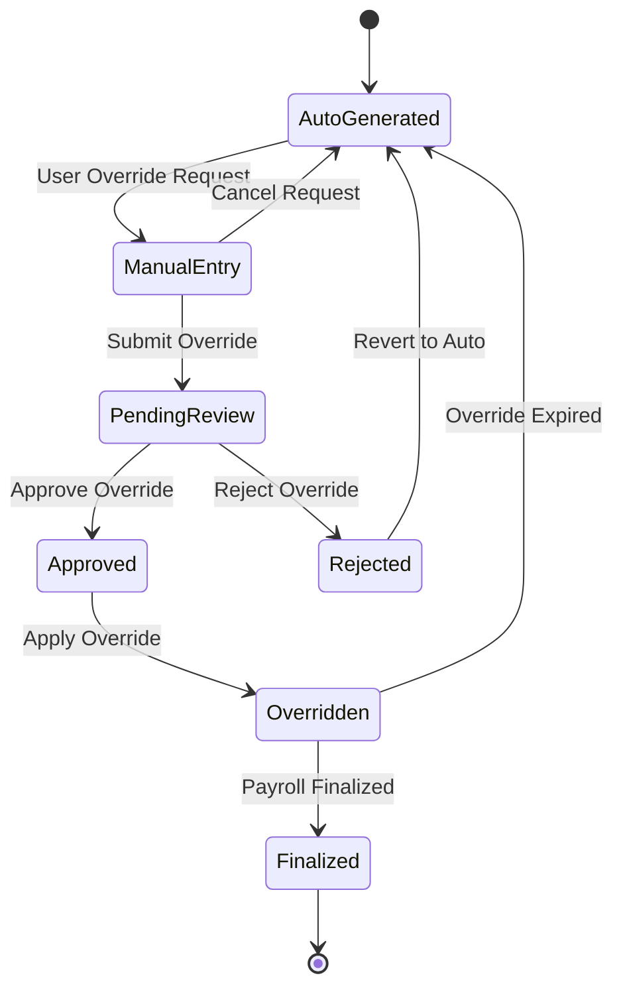
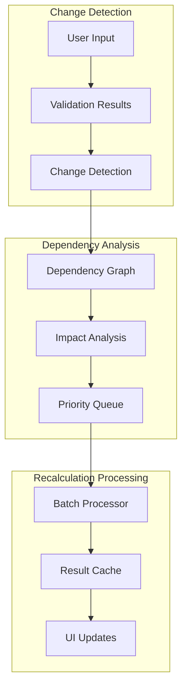
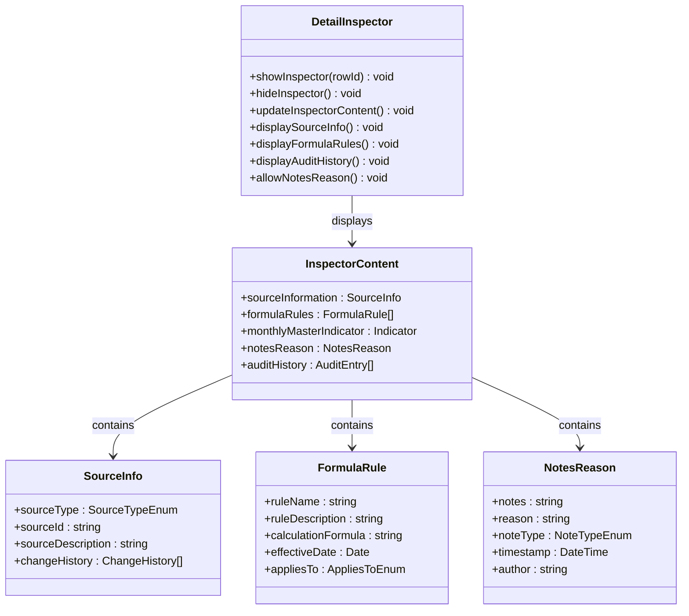
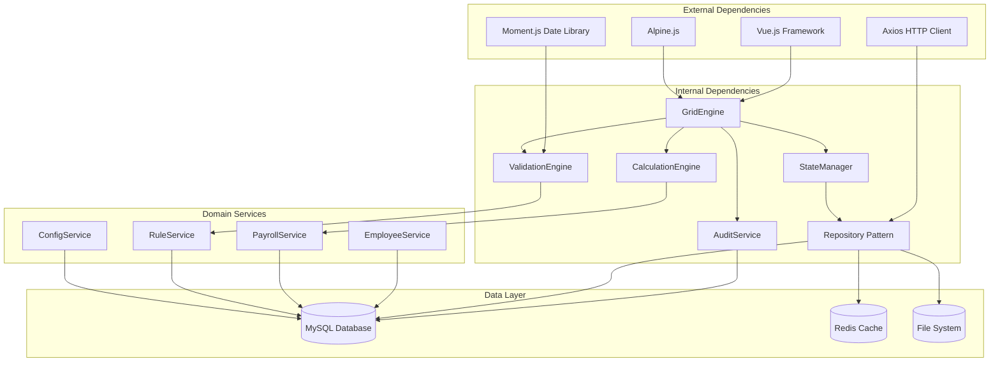

# Dynamic Grid Behavior

<cite>
**Referenced Files in This Document**
- [AGENTS.md](file://AGENTS.md)
</cite>

## Table of Contents
1. [Introduction](#introduction)
2. [Project Structure](#project-structure)
3. [Core Components](#core-components)
4. [Architecture Overview](#architecture-overview)
5. [Detailed Component Analysis](#detailed-component-analysis)
6. [Dependency Analysis](#dependency-analysis)
7. [Performance Considerations](#performance-considerations)
8. [Troubleshooting Guide](#troubleshooting-guide)
9. [Conclusion](#conclusion)

## Introduction

The dynamic grid system in the xHR Payroll & Finance System represents a sophisticated implementation that combines the familiar spreadsheet-like user experience with enterprise-grade data governance and auditability. This system transforms traditional Excel-based payroll management into a structured, rule-driven, and auditable digital platform while maintaining the intuitive inline editing capabilities that make spreadsheets so effective for data entry.

The grid system serves as the primary interface for payroll data entry, allowing users to manipulate employee compensation records with the fluidity of Excel while ensuring compliance with organizational policies, regulatory requirements, and data integrity standards. Every interaction within the grid is governed by explicit business rules, maintains comprehensive audit trails, and preserves the single source of truth principle that eliminates the chaos and inconsistencies inherent in traditional spreadsheet environments.

## Project Structure

The dynamic grid system is designed as a modular component within the broader xHR Payroll & Finance ecosystem, positioned strategically between the user interface layer and the underlying data persistence mechanisms. The system architecture follows a layered approach that separates concerns while maintaining optimal performance and maintainability.

**Diagram sources**
- [AGENTS.md:508-546](file://AGENTS.md#L508-L546)

The grid system operates on a record-based architecture rather than the traditional cell-based approach, ensuring that every payroll item is stored as a complete record in the database with proper relationships and constraints. This design choice eliminates the possibility of orphaned calculations, broken references, and data inconsistencies that plague spreadsheet-based systems.

**Section sources**
- [AGENTS.md:34-48](file://AGENTS.md#L34-L48)
- [AGENTS.md:508-546](file://AGENTS.md#L508-L546)

## Core Components

### Grid Engine

The Grid Engine serves as the central orchestrator for all grid-related operations, managing the lifecycle of payroll items from creation through finalization. This component implements sophisticated state management, real-time calculation coordination, and user interaction handling while maintaining strict adherence to business rules and audit requirements.

Key responsibilities include:
- **Row Lifecycle Management**: Creation, modification, deletion, and duplication of payroll items
- **Inline Editing Coordination**: Real-time validation and calculation during user input
- **State Synchronization**: Coordinating field states across the grid interface
- **Event Propagation**: Managing complex interactions between dependent fields

### State Management System

The state management system implements a comprehensive field state model that tracks the origin, current status, and modification history of every payroll value. This system ensures transparency and accountability by clearly indicating whether values originate from master configurations, monthly overrides, rule applications, or manual entries.

Field states include:
- **Locked**: Values protected from modification by policy or business rules
- **Auto**: Automatically calculated values generated by rule engines
- **Manual**: User-entered values requiring approval or validation
- **Override**: Monthly-specific modifications to master values
- **From Master**: Values inherited directly from employee master profiles
- **Rule Applied**: Calculated values resulting from business rule application
- **Draft**: Unapproved temporary values awaiting review
- **Finalized**: Approved and locked values ready for payslip generation

### Calculation Engine

The Calculation Engine processes complex payroll formulas and business rules in real-time, supporting multiple payroll modes while maintaining mathematical precision and performance. This engine integrates seamlessly with the state management system to ensure that calculated values reflect the appropriate business context and regulatory requirements.

Supported payroll modes include:
- **Monthly Staff**: Traditional salary-based compensation
- **Freelance Layer**: Tiered rate calculations based on work duration
- **Freelance Fixed**: Flat-rate project-based compensation
- **Youtuber Salary**: Hybrid salary and performance-based compensation
- **Youtuber Settlement**: Revenue-based settlement calculations
- **Custom Hybrid**: Flexible combinations of the above modes

### Audit and Compliance Layer

Every interaction within the grid system generates comprehensive audit trails that capture who made changes, what was changed, when it occurred, and why it happened. This compliance framework ensures regulatory adherence and enables detailed forensic analysis when required.

**Section sources**
- [AGENTS.md:528-538](file://AGENTS.md#L528-L538)
- [AGENTS.md:539-546](file://AGENTS.md#L539-L546)

## Architecture Overview

The dynamic grid system employs a sophisticated event-driven architecture that balances user responsiveness with computational efficiency. The system processes user interactions through a pipeline that validates input, applies business rules, recalculates dependent values, and updates the display in real-time while maintaining data consistency.

**Diagram sources**
- [AGENTS.md:516-527](file://AGENTS.md#L516-L527)

The architecture implements a reactive pattern where user actions trigger cascading updates throughout the system, ensuring that all dependent calculations and validations occur automatically. This approach eliminates the need for manual recalculation commands while maintaining system responsiveness through intelligent caching and batch processing.

**Section sources**
- [AGENTS.md:516-527](file://AGENTS.md#L516-L527)

## Detailed Component Analysis

### Inline Editing System

The inline editing system provides a seamless spreadsheet-like experience while enforcing strict validation and business rule compliance. Users can modify payroll values directly within grid cells, with immediate visual feedback and automatic calculation updates.

#### Editing Workflow

**Diagram sources**
- [AGENTS.md:516-527](file://AGENTS.md#L516-L527)

The system supports multiple input types to accommodate different payroll data characteristics, from simple text descriptions to complex numeric calculations with dropdown categories for standardized classifications.

#### Validation Pipeline

Every inline edit undergoes a multi-layered validation process that checks against business rules, data type constraints, and policy requirements. The validation system provides immediate feedback to users while preventing invalid data from entering the system.

**Section sources**
- [AGENTS.md:516-527](file://AGENTS.md#L516-L527)

### Row Manipulation Operations

The grid system provides comprehensive row manipulation capabilities that mirror Excel's functionality while adding robust data governance features. Users can add, remove, duplicate, and reorganize payroll rows with full audit trail and validation support.

#### Row Operations Architecture

**Diagram sources**
- [AGENTS.md:516-527](file://AGENTS.md#L516-L527)

Each row manipulation operation triggers a comprehensive validation process that ensures data integrity and business rule compliance. The system maintains detailed audit trails for every row-level change, providing complete traceability for compliance and forensic analysis.

**Section sources**
- [AGENTS.md:516-527](file://AGENTS.md#L516-L527)

### Dropdown Type/Category Inputs

The dropdown system provides standardized categorization for payroll items while maintaining flexibility for custom classifications. This system ensures consistency across the organization while accommodating specialized payroll scenarios.

#### Category Management System

**Diagram sources**
- [AGENTS.md:516-527](file://AGENTS.md#L516-L527)

The category system supports hierarchical organization with parent-child relationships, enabling complex payroll structures while maintaining simple user interfaces. Each category definition includes metadata such as tax implications, reporting requirements, and calculation rules.

**Section sources**
- [AGENTS.md:516-527](file://AGENTS.md#L516-L527)

### Automatic Amount Calculation

The automatic calculation system implements sophisticated business rule engines that compute payroll amounts based on predefined formulas, employee profiles, and organizational policies. This system ensures mathematical accuracy while providing transparency into calculation methodologies.

#### Calculation Engine Architecture

**Diagram sources**
- [AGENTS.md:516-527](file://AGENTS.md#L516-L527)

The calculation engine processes multiple rule categories simultaneously, applying precedence rules and conflict resolution strategies to ensure accurate and compliant payroll computations. Every calculation result includes detailed breakdown information showing the basis for the computed value.

**Section sources**
- [AGENTS.md:516-527](file://AGENTS.md#L516-L527)

### Manual Override Functionality

The manual override system provides authorized users with the ability to modify calculated values while maintaining complete auditability and compliance tracking. This functionality balances operational flexibility with governance requirements.

#### Override Control System

**Diagram sources**
- [AGENTS.md:516-527](file://AGENTS.md#L516-L527)

The override system implements role-based access controls, requiring appropriate authorization levels for different override scenarios. Every override request generates detailed audit trails documenting the rationale, approval process, and impact on payroll calculations.

**Section sources**
- [AGENTS.md:516-527](file://AGENTS.md#L516-L527)

### Real-time Recalculation

The real-time recalculation system ensures that all dependent fields update immediately when source data changes, maintaining consistency across the entire payroll dataset. This system implements intelligent caching and batch processing to optimize performance while ensuring accuracy.

#### Recalculation Engine

**Diagram sources**
- [AGENTS.md:516-527](file://AGENTS.md#L516-L527)

The recalculation engine analyzes field dependencies to determine the minimal set of calculations required when data changes, preventing unnecessary recomputations while ensuring complete consistency across the system.

**Section sources**
- [AGENTS.md:516-527](file://AGENTS.md#L516-L527)

### Detail Inspector Functionality

The Detail Inspector provides comprehensive row-level information display when users select specific payroll items. This inspector presents source information, formula/rule sources, monthly-only vs master indicators, note/reason capabilities, and audit history in an organized, user-friendly interface.

#### Inspector Architecture

**Diagram sources**
- [AGENTS.md:539-546](file://AGENTS.md#L539-L546)

The inspector system provides contextual information that helps users understand the origin and basis for each payroll value, supporting transparency and informed decision-making while maintaining compliance with audit requirements.

**Section sources**
- [AGENTS.md:539-546](file://AGENTS.md#L539-L546)

## Dependency Analysis

The dynamic grid system exhibits a well-structured dependency hierarchy that promotes maintainability and testability while ensuring optimal performance. Dependencies flow from user interface components toward business logic and data access layers, with clear separation of concerns and minimal coupling between modules.

**Diagram sources**
- [AGENTS.md:104-118](file://AGENTS.md#L104-L118)

The dependency structure supports horizontal scalability through service-oriented architecture principles, enabling independent development, testing, and deployment of individual components while maintaining system cohesion and performance.

**Section sources**
- [AGENTS.md:104-118](file://AGENTS.md#L104-L118)

## Performance Considerations

The dynamic grid system implements several performance optimization strategies to ensure responsive user interactions while handling complex payroll calculations and large datasets. These optimizations focus on minimizing latency, maximizing throughput, and maintaining system stability under load.

### Caching Strategy

The system employs a multi-tier caching architecture that reduces database load and improves response times through intelligent data caching at multiple levels. Cache invalidation strategies ensure data freshness while maintaining performance benefits.

### Batch Processing

Complex calculations and bulk operations utilize batch processing techniques that group multiple operations into efficient processing units, reducing overhead and improving overall system throughput.

### Lazy Loading

Non-critical data and components are loaded on-demand to minimize initial load times and reduce memory footprint, particularly important for large payroll datasets with numerous employees and historical records.

### Asynchronous Operations

Long-running calculations and data synchronization operations execute asynchronously to prevent user interface blocking, with progress indicators and completion notifications to maintain user engagement.

## Troubleshooting Guide

### Common Issues and Solutions

**Grid Not Responding to Edits**
- Verify browser console for JavaScript errors
- Check network connectivity to backend services
- Confirm user permissions for payroll data access
- Review browser compatibility requirements

**Calculations Not Updating**
- Clear browser cache and reload page
- Verify rule engine status and configuration
- Check for conflicting manual overrides
- Review audit logs for recent changes

**Audit Trail Missing**
- Confirm audit logging service status
- Verify database connection and permissions
- Check audit configuration settings
- Review system timezone and date settings

**Performance Degradation**
- Monitor database query performance
- Check cache hit ratios and invalidation patterns
- Review concurrent user limits and resource allocation
- Analyze memory usage and garbage collection patterns

### Diagnostic Tools

The system provides built-in diagnostic tools for monitoring grid performance, validating calculations, and troubleshooting configuration issues. These tools include real-time performance metrics, calculation trace logs, and configuration validation reports.

**Section sources**
- [AGENTS.md:576-595](file://AGENTS.md#L576-L595)

## Conclusion

The dynamic grid system represents a paradigm shift from traditional spreadsheet-based payroll management to a sophisticated, rule-driven, and auditable digital platform. By combining the familiar spreadsheet interface with enterprise-grade governance, the system achieves the best of both worlds: user-friendly data entry capabilities with comprehensive compliance, auditability, and data integrity.

The implementation demonstrates how modern web technologies can replicate the fluidity and power of spreadsheet applications while addressing their fundamental limitations in enterprise environments. Through careful architecture design, comprehensive state management, and robust audit capabilities, the system provides a foundation for scalable payroll management that can adapt to evolving business requirements while maintaining regulatory compliance and operational excellence.

This documentation serves as both a technical specification and a practical guide for developers, administrators, and end users, ensuring successful implementation and adoption of the dynamic grid system within the xHR Payroll & Finance ecosystem.