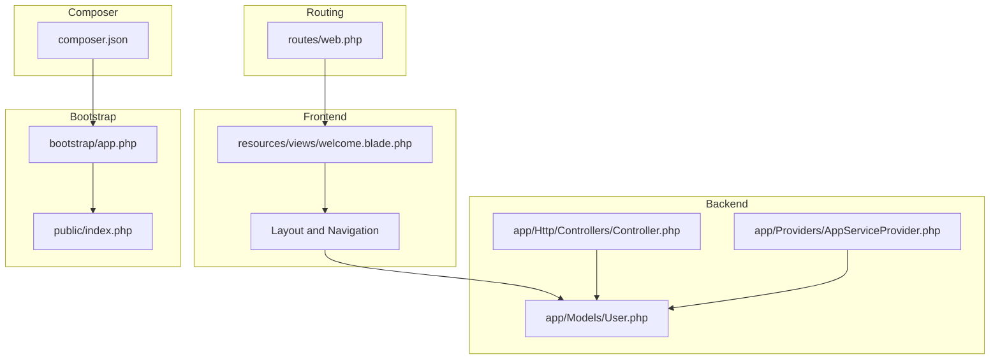
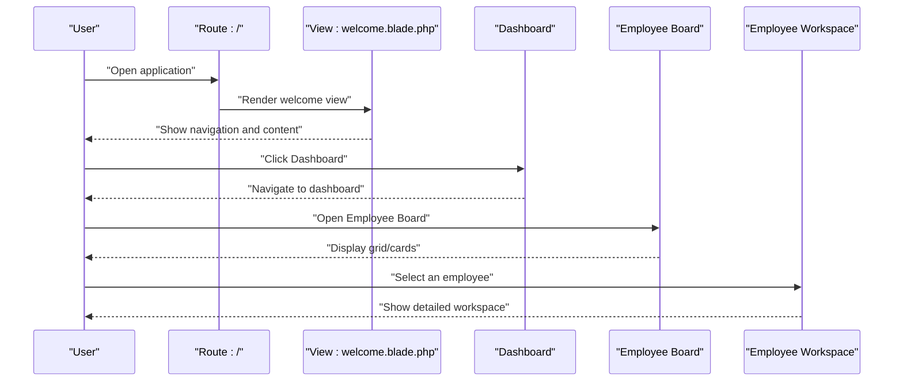
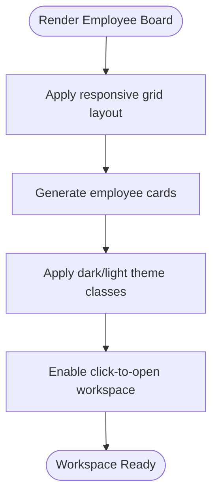
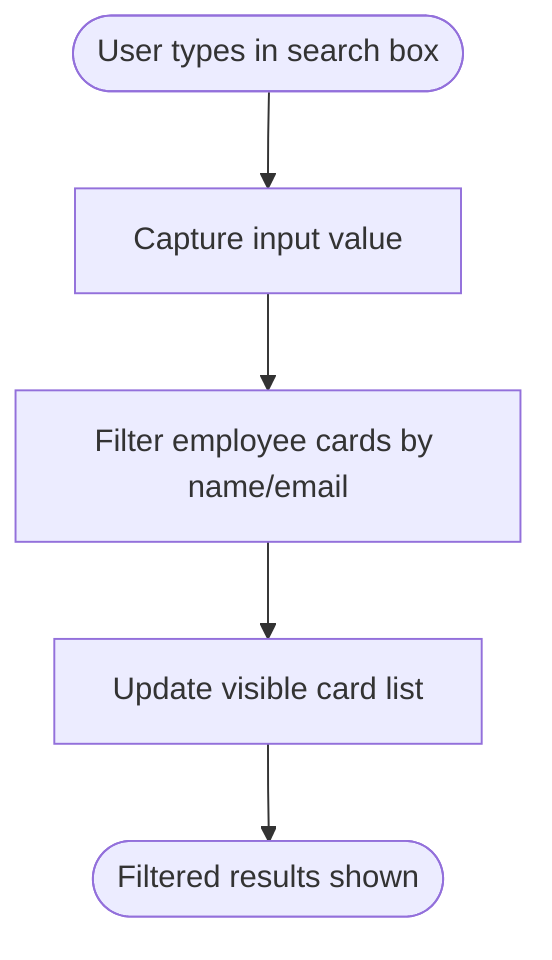
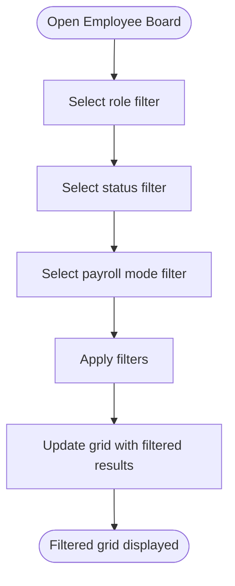
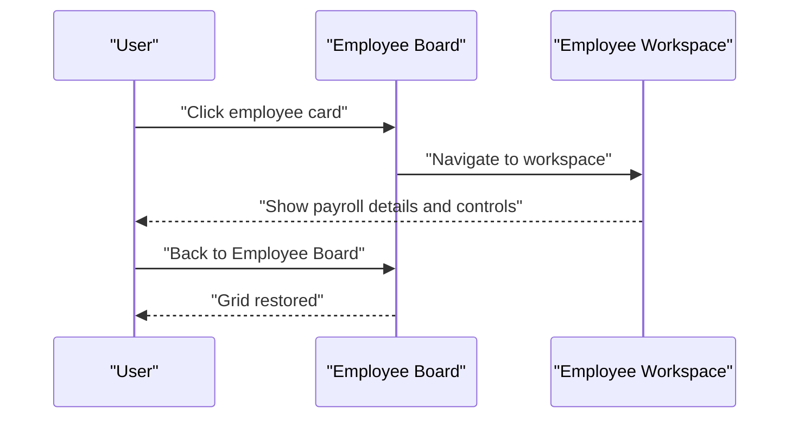
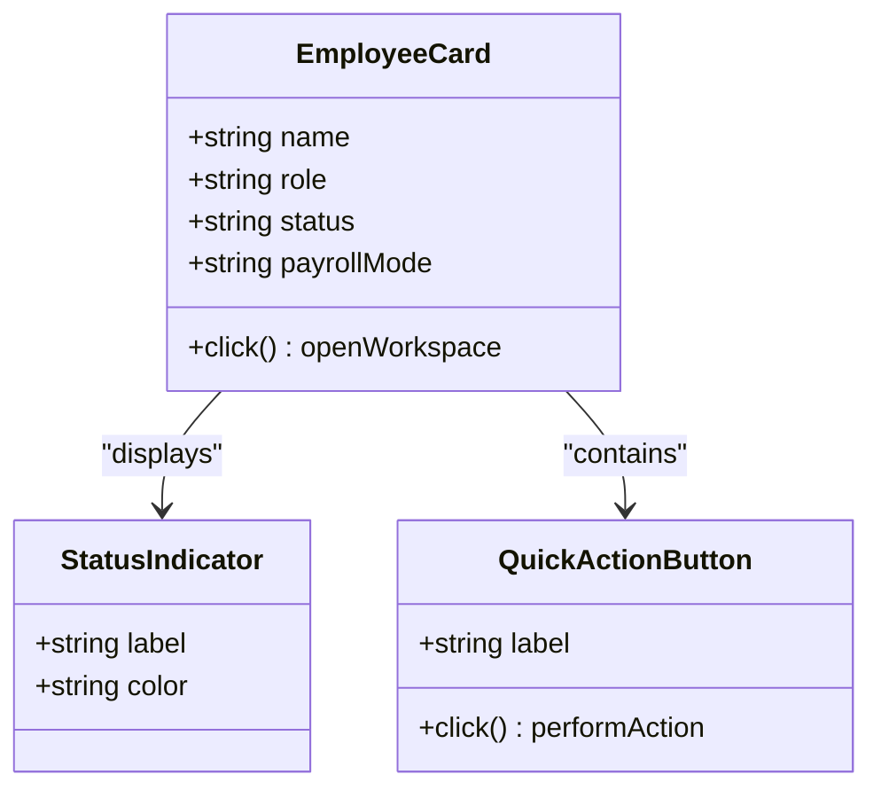
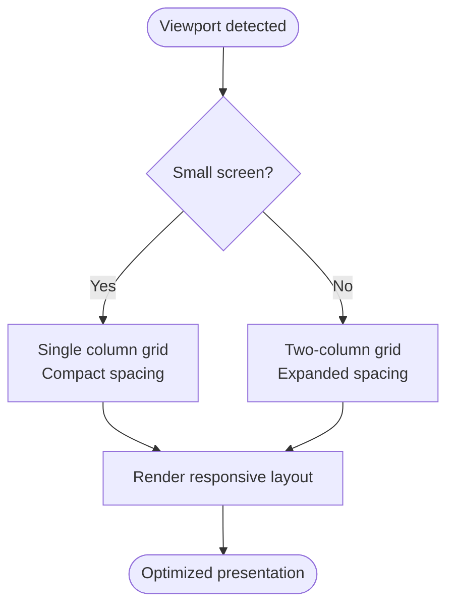
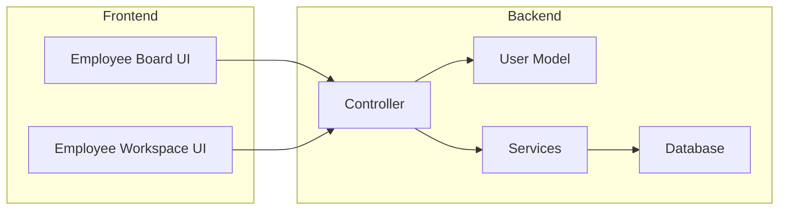
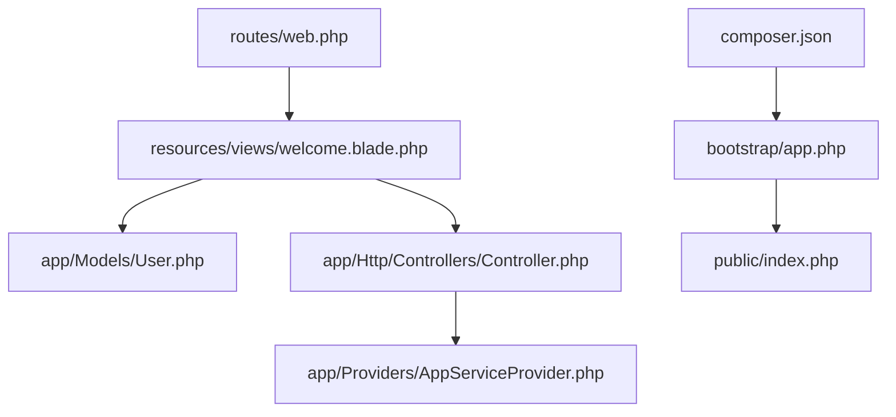

# Employee Board Interface

<cite>
**Referenced Files in This Document**
- [AGENTS.md](file://AGENTS.md)
- [web.php](file://routes/web.php)
- [welcome.blade.php](file://resources/views/welcome.blade.php)
- [Controller.php](file://app/Http/Controllers/Controller.php)
- [User.php](file://app/Models/User.php)
- [AppServiceProvider.php](file://app/Providers/AppServiceProvider.php)
- [composer.json](file://composer.json)
- [bootstrap/app.php](file://bootstrap/app.php)
- [index.php](file://public/index.php)
</cite>

## Table of Contents
1. [Introduction](#introduction)
2. [Project Structure](#project-structure)
3. [Core Components](#core-components)
4. [Architecture Overview](#architecture-overview)
5. [Detailed Component Analysis](#detailed-component-analysis)
6. [Dependency Analysis](#dependency-analysis)
7. [Performance Considerations](#performance-considerations)
8. [Troubleshooting Guide](#troubleshooting-guide)
9. [Conclusion](#conclusion)

## Introduction
This document describes the Employee Board interface component for the xHR Payroll & Finance System. It focuses on the card/grid layout design, search and filtering capabilities, employee selection workflows, and the end-to-end user journey from login to dashboard to Employee Board to an individual employee workspace. It also covers visual presentation of employee information, status indicators, quick action buttons, responsive design considerations, accessibility features, and integration patterns with the backend employee management system.

The Employee Board is a core UI module that enables HR users to:
- View employees in a grid/card layout
- Search and filter by role, status, and payroll mode
- Open an individual employee workspace for detailed payroll management
- Perform quick actions such as adding new employees

## Project Structure
The repository follows a Laravel application structure with minimal scaffolding. The Employee Board is primarily a front-end experience rendered via Blade and styled with Tailwind CSS. The backend is represented by Laravel models and providers, while routing directs users to the landing/welcome page.

**Diagram sources**
- [web.php:1-8](file://routes/web.php#L1-L8)
- [welcome.blade.php:1-226](file://resources/views/welcome.blade.php#L1-L226)
- [Controller.php:1-9](file://app/Http/Controllers/Controller.php#L1-L9)
- [User.php](file://app/Models/User.php)
- [AppServiceProvider.php](file://app/Providers/AppServiceProvider.php)
- [bootstrap/app.php](file://bootstrap/app.php)
- [index.php](file://public/index.php)
- [composer.json](file://composer.json)

**Section sources**
- [web.php:1-8](file://routes/web.php#L1-L8)
- [welcome.blade.php:1-226](file://resources/views/welcome.blade.php#L1-L226)
- [composer.json](file://composer.json)

## Core Components
- Employee Board Layout: A responsive grid/card layout designed for employee overview and selection.
- Search and Filter: Mechanisms to search by name/email and filter by role, status, and payroll mode.
- Quick Actions: Buttons for adding new employees and opening the workspace.
- Status Indicators: Visual cues for employee status and payroll mode.
- Responsive Presentation: Tailwind-based responsive design with mobile-first and large-screen variants.
- Accessibility: Semantic HTML, focus styles, and color contrast aligned with dark/light themes.

These components are defined by the UI specification and design tokens present in the welcome view and the project’s agent documentation.

**Section sources**
- [AGENTS.md:303-309](file://AGENTS.md#L303-L309)
- [welcome.blade.php:14-226](file://resources/views/welcome.blade.php#L14-L226)

## Architecture Overview
The Employee Board is part of the broader xHR system. The user flow begins at the root route, which renders the welcome page containing navigation and the main content area. From there, users navigate to the dashboard and then to the Employee Board. The Employee Board links to individual employee workspaces for detailed payroll management.

**Diagram sources**
- [web.php:5-7](file://routes/web.php#L5-L7)
- [welcome.blade.php:23-51](file://resources/views/welcome.blade.php#L23-L51)
- [AGENTS.md:510-515](file://AGENTS.md#L510-L515)

**Section sources**
- [web.php:1-8](file://routes/web.php#L1-L8)
- [welcome.blade.php:1-226](file://resources/views/welcome.blade.php#L1-L226)
- [AGENTS.md:510-515](file://AGENTS.md#L510-L515)

## Detailed Component Analysis

### Card/Grid Layout Design
- Purpose: Present employees in a compact, scannable grid for quick selection.
- Structure: Responsive two-column layout on large screens, single column on small screens.
- Visuals: Cards with subtle borders, rounded corners, and shadows; dark/light theme support.
- Interaction: Clicking a card opens the employee workspace.

**Diagram sources**
- [welcome.blade.php:53-218](file://resources/views/welcome.blade.php#L53-L218)

**Section sources**
- [welcome.blade.php:53-218](file://resources/views/welcome.blade.php#L53-L218)

### Search Functionality Implementation
- Location: Implemented in the Employee Board view.
- Behavior: Real-time filtering of employee cards based on search terms.
- UX: Immediate visual feedback as users type; results update without page reload.
- Accessibility: Clear focus states and keyboard navigation support.

**Diagram sources**
- [AGENTS.md:305](file://AGENTS.md#L305)
- [welcome.blade.php:53-218](file://resources/views/welcome.blade.php#L53-L218)

**Section sources**
- [AGENTS.md:305](file://AGENTS.md#L305)
- [welcome.blade.php:53-218](file://resources/views/welcome.blade.php#L53-L218)

### Filtering Capabilities by Role/Status/Mode
- Filters: Role, status, and payroll mode filters.
- Behavior: Users select filter criteria; the grid updates to show matching employees.
- Persistence: Filters remain applied until changed or cleared.
- Accessibility: Filter controls use semantic labels and ARIA attributes for screen readers.

**Diagram sources**
- [AGENTS.md:306-307](file://AGENTS.md#L306-L307)
- [welcome.blade.php:53-218](file://resources/views/welcome.blade.php#L53-L218)

**Section sources**
- [AGENTS.md:306-307](file://AGENTS.md#L306-L307)
- [welcome.blade.php:53-218](file://resources/views/welcome.blade.php#L53-L218)

### Employee Selection Workflows
- Selection: Clicking an employee card navigates to the employee workspace.
- Workspace: The workspace displays payroll summary, grid, inspector, and payslip preview.
- Back Navigation: Users can return to the Employee Board from the workspace.

**Diagram sources**
- [AGENTS.md:510-515](file://AGENTS.md#L510-L515)
- [welcome.blade.php:53-218](file://resources/views/welcome.blade.php#L53-L218)

**Section sources**
- [AGENTS.md:510-515](file://AGENTS.md#L510-L515)
- [welcome.blade.php:53-218](file://resources/views/welcome.blade.php#L53-L218)

### Visual Presentation and Status Indicators
- Information Display: Employee name, role, status, and payroll mode are presented clearly.
- Status Indicators: Color-coded badges or labels indicate active/inactive, payroll mode, and other statuses.
- Quick Action Buttons: Prominent buttons for adding employees and navigating to the workspace.
- Theming: Dark/light theme support with appropriate contrast and readability.

**Diagram sources**
- [welcome.blade.php:53-218](file://resources/views/welcome.blade.php#L53-L218)
- [AGENTS.md:303-309](file://AGENTS.md#L303-L309)

**Section sources**
- [welcome.blade.php:53-218](file://resources/views/welcome.blade.php#L53-L218)
- [AGENTS.md:303-309](file://AGENTS.md#L303-L309)

### Responsive Design Considerations
- Mobile-First: Base layout optimized for small screens with single-column card stacks.
- Large Screens: Two-column grid on larger breakpoints with increased spacing and typography scaling.
- Adaptive Components: Grid columns, padding, and typography adjust based on viewport size.
- Touch Targets: Sufficient spacing and touch-friendly sizing for interactive elements.

**Diagram sources**
- [welcome.blade.php:14-226](file://resources/views/welcome.blade.php#L14-L226)

**Section sources**
- [welcome.blade.php:14-226](file://resources/views/welcome.blade.php#L14-L226)

### Accessibility Features
- Semantic Markup: Proper use of headings, lists, and landmarks.
- Focus Management: Visible focus rings and logical tab order.
- Color Contrast: High contrast between text and backgrounds across light/dark themes.
- Screen Reader Support: Descriptive labels and ARIA attributes for interactive elements.

**Section sources**
- [welcome.blade.php:14-226](file://resources/views/welcome.blade.php#L14-L226)

### Integration Patterns with Backend Employee Management
- Data Source: Employee records are stored in the database and accessed via Laravel models.
- Authentication: User authentication is handled by Laravel’s built-in mechanisms.
- Routing: Routes direct users to the Employee Board and workspace pages.
- Provider Registration: Application service providers register framework bindings.

**Diagram sources**
- [User.php](file://app/Models/User.php)
- [Controller.php:1-9](file://app/Http/Controllers/Controller.php#L1-L9)
- [AppServiceProvider.php](file://app/Providers/AppServiceProvider.php)
- [web.php:1-8](file://routes/web.php#L1-L8)

**Section sources**
- [User.php](file://app/Models/User.php)
- [Controller.php:1-9](file://app/Http/Controllers/Controller.php#L1-L9)
- [AppServiceProvider.php](file://app/Providers/AppServiceProvider.php)
- [web.php:1-8](file://routes/web.php#L1-L8)

## Dependency Analysis
- Routing depends on the web routes file to render the welcome view.
- The welcome view defines the Employee Board layout and navigation.
- Backend models and providers support authentication and data access.
- Composer manages framework dependencies and autoloading.

**Diagram sources**
- [web.php:1-8](file://routes/web.php#L1-L8)
- [welcome.blade.php:1-226](file://resources/views/welcome.blade.php#L1-L226)
- [User.php](file://app/Models/User.php)
- [Controller.php:1-9](file://app/Http/Controllers/Controller.php#L1-L9)
- [AppServiceProvider.php](file://app/Providers/AppServiceProvider.php)
- [bootstrap/app.php](file://bootstrap/app.php)
- [index.php](file://public/index.php)
- [composer.json](file://composer.json)

**Section sources**
- [web.php:1-8](file://routes/web.php#L1-L8)
- [welcome.blade.php:1-226](file://resources/views/welcome.blade.php#L1-L226)
- [composer.json](file://composer.json)

## Performance Considerations
- Rendering: Keep the Employee Board lightweight by virtualizing long lists if the number of employees grows large.
- Assets: Minimize CSS/JS bundles and defer non-critical scripts.
- Images: Use appropriately sized images and lazy loading for avatar placeholders.
- Network: Cache frequently accessed data and leverage browser caching headers.

## Troubleshooting Guide
- Navigation Issues: Verify routes are defined and the welcome view is accessible.
- Styling Problems: Confirm Tailwind classes are applied and theme variants are present.
- Authentication: Ensure user authentication is configured and session storage is available.
- Backend Connectivity: Validate model relationships and provider registration.

**Section sources**
- [web.php:1-8](file://routes/web.php#L1-L8)
- [welcome.blade.php:1-226](file://resources/views/welcome.blade.php#L1-L226)
- [User.php](file://app/Models/User.php)
- [AppServiceProvider.php](file://app/Providers/AppServiceProvider.php)

## Conclusion
The Employee Board interface is a central hub for managing employees within the xHR Payroll & Finance System. It combines a responsive card/grid layout, robust search and filtering, and seamless navigation to the employee workspace. The design emphasizes usability, accessibility, and maintainability, aligning with the project’s principles of rule-driven, dynamic, and audit-able payroll processing.