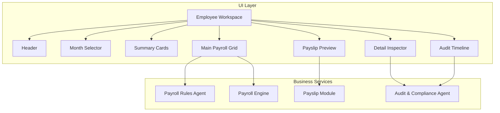
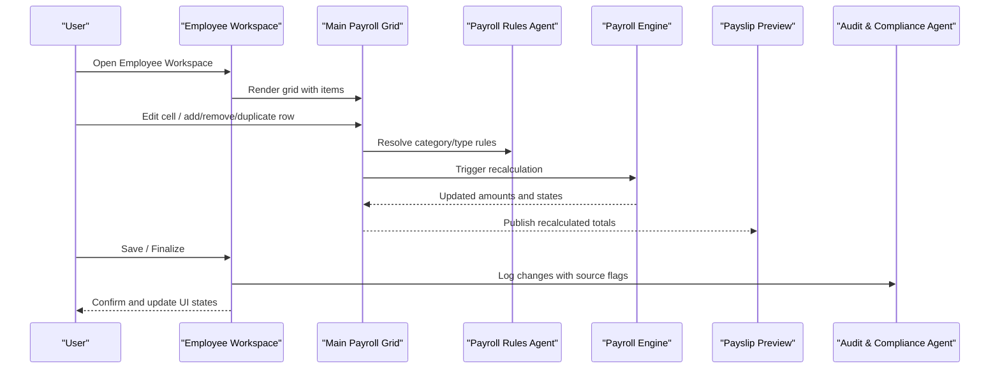
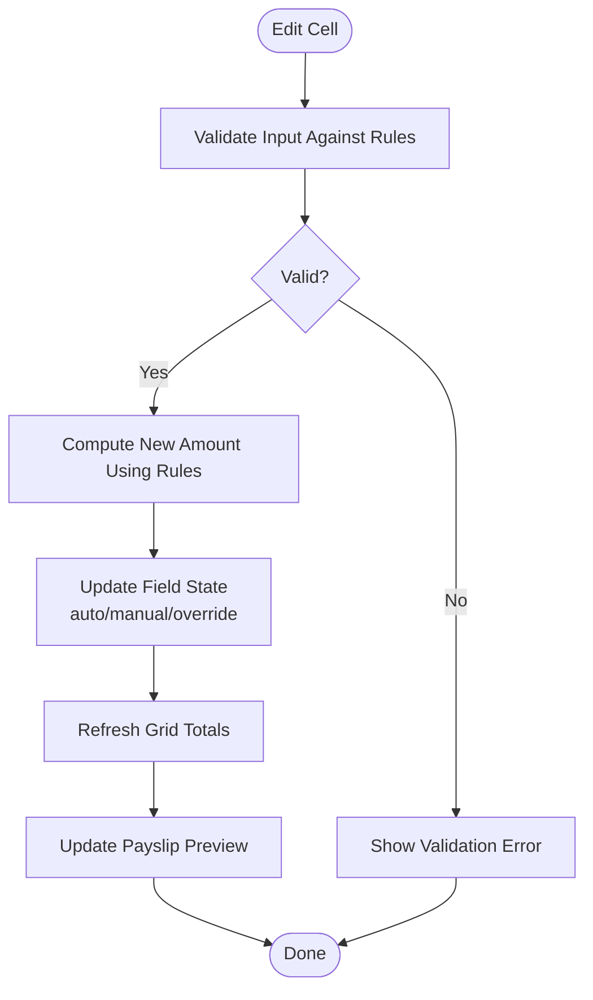
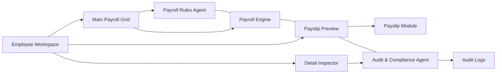

# Employee Workspace Interface

<cite>
**Referenced Files in This Document**
- [AGENTS.md](file://AGENTS.md)
</cite>

## Table of Contents
1. [Introduction](#introduction)
2. [Project Structure](#project-structure)
3. [Core Components](#core-components)
4. [Architecture Overview](#architecture-overview)
5. [Detailed Component Analysis](#detailed-component-analysis)
6. [Dependency Analysis](#dependency-analysis)
7. [Performance Considerations](#performance-considerations)
8. [Troubleshooting Guide](#troubleshooting-guide)
9. [Conclusion](#conclusion)

## Introduction
This document describes the Employee Workspace interface, the primary payroll processing interface for the xHR Payroll & Finance System. It documents the major UI components, dynamic behaviors, state management for field types, real-time calculation feedback, and audit tracking. The goal is to provide a comprehensive understanding of how payroll entry, editing, and validation work together to deliver a spreadsheet-like experience while maintaining strong data integrity, auditability, and maintainability.

## Project Structure
The Employee Workspace is part of the broader system’s UI/UX module and integrates with backend services for payroll calculation, rule enforcement, audit logging, and PDF generation. The system emphasizes:
- A single-page, spreadsheet-like editing experience
- Real-time recalculation and immediate preview
- Clear source tracking and state indicators
- Audit-ability for all changes

**Section sources**
- [AGENTS.md:222-244](file://AGENTS.md#L222-L244)
- [AGENTS.md:310-321](file://AGENTS.md#L310-L321)

## Core Components
The Employee Workspace comprises seven core components, each designed to support rapid, accurate payroll entry and review:

- Header: Provides navigation and context for the current employee and batch.
- Month Selector: Filters and sets the payroll period for calculations.
- Summary Cards: Displays high-level financial summaries derived from the grid.
- Main Payroll Grid: Inline-editable grid supporting add/remove/duplicate rows, dropdown categories, auto/manual/override modes, and instant recalculation.
- Detail Inspector: Shows row-level source, rule/formula provenance, monthly-only vs master flags, notes/reasons, and audit history.
- Payslip Preview: Live preview of the payslip built from finalized or snapshot data.
- Audit Timeline: Timeline of changes with who, what, when, and why for auditability.

**Section sources**
- [AGENTS.md:310-321](file://AGENTS.md#L310-L321)
- [AGENTS.md:516-546](file://AGENTS.md#L516-L546)

## Architecture Overview
The Employee Workspace orchestrates user actions across UI, business logic, and persistence layers. The flow follows a predictable pattern: edit grid → recalculate → preview → save → finalize.

**Diagram sources**
- [AGENTS.md:513-515](file://AGENTS.md#L513-L515)
- [AGENTS.md:528-538](file://AGENTS.md#L528-L538)

## Detailed Component Analysis

### Header Section
Responsibilities:
- Display current employee context and payroll batch
- Provide quick navigation to related modules (Employee Board, Payslip Preview, etc.)
- Indicate current month and status (draft/finalized)

Design notes:
- Keep minimal and contextual to reduce cognitive load during intensive editing
- Integrate with global navigation to avoid redundant controls

[No sources needed since this section describes conceptual UI behavior]

### Month Selector Functionality
Responsibilities:
- Select the payroll month/year for the current batch
- Filter visible payroll items by selected period
- Trigger recalculation when month changes

Behavioral characteristics:
- Supports quick switching between months
- Preserves user edits when possible across periods
- Triggers dependent recalculations and updates summary cards

**Section sources**
- [AGENTS.md:314-316](file://AGENTS.md#L314-L316)

### Summary Cards Display
Responsibilities:
- Present at-a-glance financial metrics (e.g., total income, total deductions, net pay)
- Reflect real-time updates from the grid
- Provide quick validation cues (e.g., color-coded totals)

Design notes:
- Use clear typography and color coding for positive/negative values
- Link to detailed breakdowns in the grid and payslip preview

**Section sources**
- [AGENTS.md:316](file://AGENTS.md#L316)

### Main Payroll Grid with Inline Editing
Responsibilities:
- Support inline editing of payroll item values
- Row lifecycle: add, remove, duplicate
- Category/type dropdowns mapped to rule configurations
- Auto/manual/override modes with real-time recalculation
- Source badges indicating origin (auto, manual, override, master)

Field state management:
- locked: value is immutable for the current mode
- auto: value computed by rules; user cannot edit directly
- manual: user-entered value; editable
- override: user-changed value that overrides auto-computed amount
- from_master: value originates from master profile
- rule_applied: indicates rule-derived computation applied
- draft/finalized: batch-level states affecting editing permissions

Real-time calculation feedback:
- Immediate recalculation after any edit
- Visual indicators for changed cells (e.g., highlight, badge)
- Optional tooltip with derivation details

Validation and permissions:
- Enforce rule-based constraints (e.g., OT requires enable flag)
- Restrict editing based on batch state (draft vs finalized)
- Prevent illegal reductions by moving adjustments to deduction side

**Section sources**
- [AGENTS.md:516-527](file://AGENTS.md#L516-L527)
- [AGENTS.md:528-538](file://AGENTS.md#L528-L538)
- [AGENTS.md:562-566](file://AGENTS.md#L562-L566)

### Detail Inspector Panel
Responsibilities:
- Show row-level provenance: source, formula/rule, monthly-only vs master
- Allow adding notes/reasons for overrides
- Display audit history for the selected row

User workflow:
- Click a grid row to open inspector
- View source flags and rule references
- Add reason for manual/override entries
- See chronological audit trail for that row

**Section sources**
- [AGENTS.md:539-546](file://AGENTS.md#L539-L546)

### Payslip Preview Area
Responsibilities:
- Render a live preview of the payslip based on current grid totals
- Enforce critical rule: reductions must appear in deductions, not by lowering base salary
- Snapshot rule: PDFs reference finalized snapshots, not live calculations

Rendering and export:
- Supports PDF export via DomPDF/Snappy
- Uses structured layout with company header, employee details, month, payment date, bank info, income/deduction columns, totals, and signatures

**Section sources**
- [AGENTS.md:550-573](file://AGENTS.md#L550-L573)

### Audit Timeline Component
Responsibilities:
- Track all significant changes with who, what, field, old/new values, action, timestamp, and optional reason
- Focus high-priority audit areas: salary profile changes, payroll item amounts, payslip finalize/unfinalize, rule/module/SO config changes

Integration:
- Linked to the Detail Inspector for row-level history
- Supports compliance reporting and rollback capability

**Section sources**
- [AGENTS.md:576-595](file://AGENTS.md#L576-L595)

## Dependency Analysis
The Employee Workspace depends on several agents and services to enforce correctness, maintain auditability, and provide a smooth user experience.

**Diagram sources**
- [AGENTS.md:196-221](file://AGENTS.md#L196-L221)
- [AGENTS.md:245-256](file://AGENTS.md#L245-L256)
- [AGENTS.md:257-271](file://AGENTS.md#L257-L271)

**Section sources**
- [AGENTS.md:196-221](file://AGENTS.md#L196-L221)
- [AGENTS.md:245-256](file://AGENTS.md#L245-L256)
- [AGENTS.md:257-271](file://AGENTS.md#L257-L271)

## Performance Considerations
- Minimize heavy computations during inline edits; defer complex validations to background or debounced handlers.
- Batch updates to the grid to reduce reflows and repaints.
- Use virtualization for large datasets to keep the grid responsive.
- Cache rule configurations and frequently accessed metadata to speed up recalculation.
- Debounce real-time previews to avoid excessive PDF generation requests.

[No sources needed since this section provides general guidance]

## Troubleshooting Guide
Common issues and resolutions:
- Validation errors after editing: Review rule constraints and ensure inputs meet thresholds (e.g., OT requires enable flag).
- Discrepancies between grid totals and preview: Verify that reductions are applied to deductions, not base salary.
- Audit gaps: Confirm that all manual/override actions include reasons and that audit logging is enabled.
- Permission denied: Ensure the batch is in draft state and the user has appropriate roles for editing.

**Section sources**
- [AGENTS.md:562-566](file://AGENTS.md#L562-L566)
- [AGENTS.md:578-587](file://AGENTS.md#L578-L587)

## Conclusion
The Employee Workspace is designed to combine the familiarity of a spreadsheet with the rigor of a modern payroll system. Through inline editing, real-time recalculation, clear state indicators, and comprehensive auditability, it enables efficient, accurate, and compliant payroll processing. The documented components and workflows provide a blueprint for building and extending the interface while preserving data integrity and maintainability.