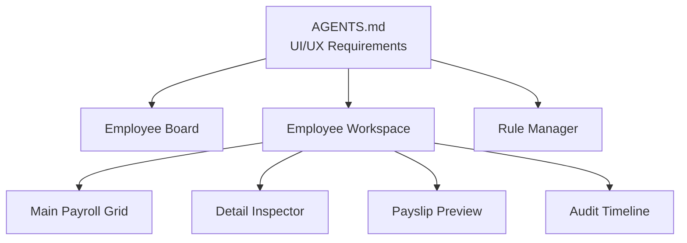
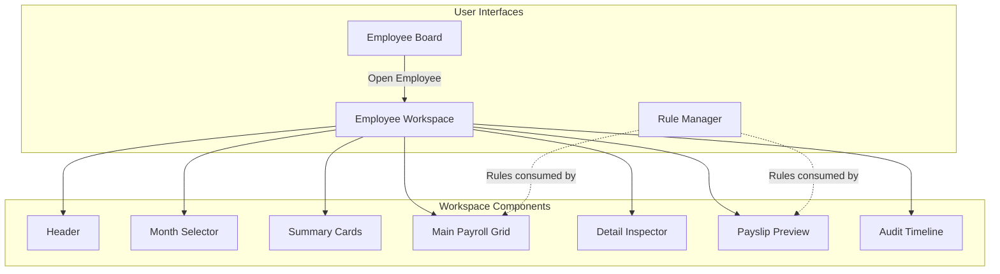
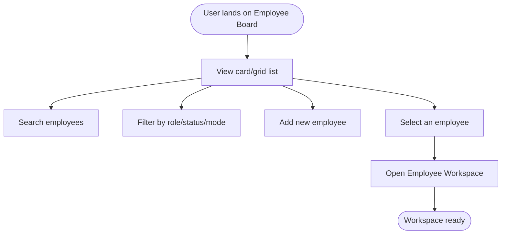
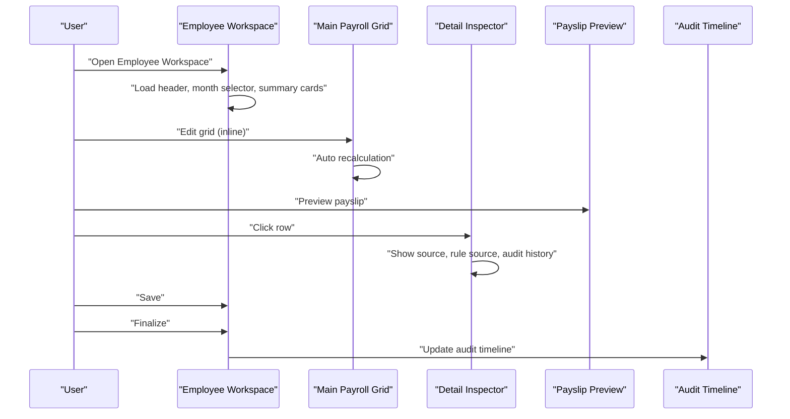
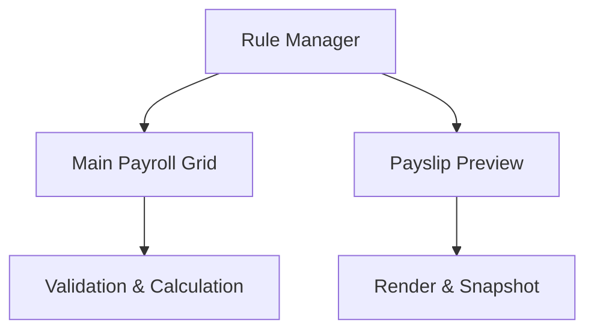
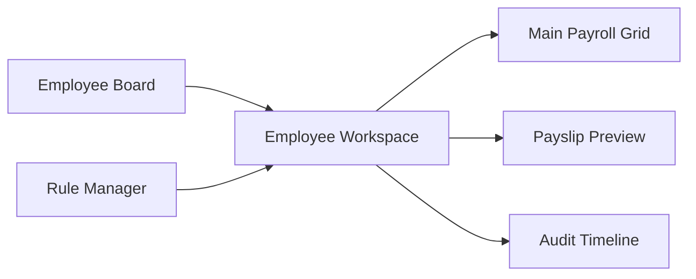

# Interface Components

<cite>
**Referenced Files in This Document**
- [AGENTS.md](file://AGENTS.md)
</cite>

## Table of Contents
1. [Introduction](#introduction)
2. [Project Structure](#project-structure)
3. [Core Components](#core-components)
4. [Architecture Overview](#architecture-overview)
5. [Detailed Component Analysis](#detailed-component-analysis)
6. [Dependency Analysis](#dependency-analysis)
7. [Performance Considerations](#performance-considerations)
8. [Troubleshooting Guide](#troubleshooting-guide)
9. [Conclusion](#conclusion)
10. [Appendices](#appendices)

## Introduction
This document describes the main interface components of the xHR Payroll system as defined in the project’s development guide. It focuses on three primary user interfaces:
- Employee Board: a card/grid layout for employees with search and filtering, plus navigation to the workspace.
- Employee Workspace: the primary payroll interface containing headers, month selector, summary cards, main payroll grid, detail inspector, payslip preview, and audit timeline.
- Rule Manager: the business configuration and settings management interface.

It also outlines component-specific styling guidelines, responsive design considerations, and integration patterns between components.

## Project Structure
The repository snapshot contains a single specification document that defines the system’s UI/UX expectations, feature sets, and behavioral rules. The UI components are described conceptually with clear roles and interactions.

**Diagram sources**
- [AGENTS.md](file://AGENTS.md)

**Section sources**
- [AGENTS.md](file://AGENTS.md)

## Core Components
This section summarizes the core interface components and their responsibilities, derived from the specification.

- Employee Board
  - Purpose: Browse employees via card/grid view, search, filter by role/status/mode, add new employees, and open the Employee Workspace.
  - Key capabilities: card/grid list, search, filter, add employee, open workspace.
  - Integration pattern: Clicking an employee navigates to the Employee Workspace for that individual.

- Employee Workspace
  - Purpose: Single-page payroll entry and review hub for a selected employee.
  - Core parts:
    - Header
    - Month selector
    - Summary cards
    - Main payroll grid
    - Detail inspector
    - Payslip preview
    - Audit timeline
  - Workflow: Edit grid → recalculate → preview slip → save → finalize.

- Rule Manager
  - Purpose: Manage business configuration and settings that drive payroll calculations and UI behavior.
  - Categories: attendance rules, OT rules, bonus rules, threshold rules, layer rate rules, SSO rules, tax rules, module toggles.

**Section sources**
- [AGENTS.md](file://AGENTS.md)

## Architecture Overview
The UI architecture centers on a user flow that starts from the Employee Board, transitions to the Employee Workspace for payroll entry, and integrates with Rule Manager for configuration. The payslip preview and audit timeline are tightly coupled to the workspace for transparency and compliance.

**Diagram sources**
- [AGENTS.md](file://AGENTS.md)

**Section sources**
- [AGENTS.md](file://AGENTS.md)

## Detailed Component Analysis

### Employee Board
- Layout and navigation
  - Card/grid list of employees.
  - Search and filter by role/status/mode.
  - Add employee action.
  - Open workspace for a selected employee.
- Interaction model
  - Clicking an employee opens the Employee Workspace for that employee.
- UX principles
  - Inline editing, instant recalculation, immediate preview, clear tagging and state indicators, and explicit source labeling.

**Section sources**
- [AGENTS.md](file://AGENTS.md)

### Employee Workspace
- Header
  - Displays current employee context and global actions.
- Month selector
  - Allows switching the payroll month being edited.
- Summary cards
  - High-level financial summaries for quick overview.
- Main payroll grid
  - Inline editing, add/remove/duplicate rows, dropdown categories/types, auto amount calculation, manual override, recalculation, and source badges.
- Detail inspector
  - On row click: shows source, formula/rule source, monthly-only vs master, allows notes/reasons, and shows audit history for that row.
- Payslip preview
  - Real-time preview of the payslip based on current state.
- Audit timeline
  - Timeline of changes and actions for traceability.

**Section sources**
- [AGENTS.md](file://AGENTS.md)

### Rule Manager
- Scope
  - Manage rules and configurations that govern payroll behavior and UI states.
- Categories
  - Attendance rules, OT rules, bonus rules, threshold rules, layer rate rules, SSO rules, tax rules, module toggles.
- Integration
  - Rules are consumed by the payroll grid and payslip preview to compute values and enforce constraints.

**Section sources**
- [AGENTS.md](file://AGENTS.md)

## Dependency Analysis
- Coupling
  - Employee Workspace depends on Rule Manager for rule-driven computation and UI state.
  - Employee Board is a navigation layer that triggers workspace loading.
  - Payslip Preview and Audit Timeline are tightly coupled to the workspace for transparency and compliance.
- Cohesion
  - Each component encapsulates a cohesive set of responsibilities aligned with the user tasks.
- External integration points
  - Rule Manager acts as a configuration provider for the payroll engine and UI behavior.

**Diagram sources**
- [AGENTS.md](file://AGENTS.md)

**Section sources**
- [AGENTS.md](file://AGENTS.md)

## Performance Considerations
- Instant recalculation
  - Keep grid recalculations efficient to maintain responsiveness during inline edits.
- Preview latency
  - Ensure payslip preview updates quickly after edits.
- Filtering and search
  - Optimize search/filter queries to avoid blocking the UI thread.
- Audit timeline rendering
  - Paginate or virtualize long audit histories to keep the interface responsive.

## Troubleshooting Guide
- Grid editing anomalies
  - Verify that state flags (locked, auto, manual, override, from_master, rule_applied, draft, finalized) are visible and consistent with user actions.
- Preview mismatch
  - Confirm that the payslip preview reads from the finalized snapshot and not live-calculated values.
- Audit gaps
  - Ensure that high-priority changes (salary profile, payroll item amount, payslip finalize/unfinalize, rule changes, module toggle changes, SSO config changes) are logged with who, what, when, old/new values, and optional reason.

**Section sources**
- [AGENTS.md](file://AGENTS.md)

## Conclusion
The xHR Payroll system’s interface components are designed around a clear user flow: browse employees, enter and manage payroll data in a single workspace, and configure business rules centrally. The specification emphasizes inline editing, instant recalculation, immediate preview, explicit state and source indicators, and strong auditability. Following the outlined integration patterns and performance considerations will help maintain a responsive, transparent, and compliant payroll interface.

## Appendices
- Styling guidelines
  - Clear tagging and label visibility.
  - Explicit state badges for fields and rows.
  - Consistent color semantics for statuses and actions.
- Responsive design
  - Card/grid lists should adapt to screen sizes.
  - Payroll grid should support horizontal scrolling and column prioritization on small screens.
  - Detail inspector and audit timeline should be collapsible or stacked on mobile.
- Integration patterns
  - Rule Manager updates should propagate to the grid and preview without requiring page reload.
  - Audit timeline should update reactively as changes occur.

**Section sources**
- [AGENTS.md](file://AGENTS.md)