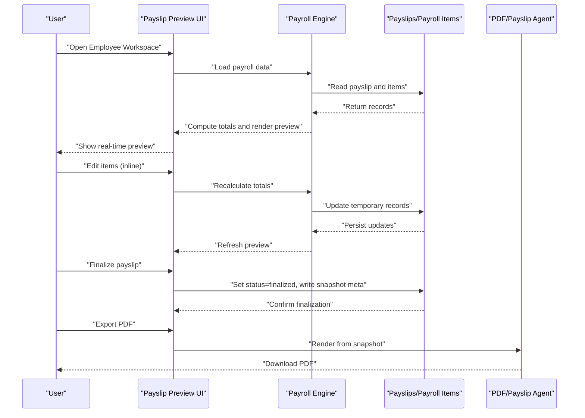
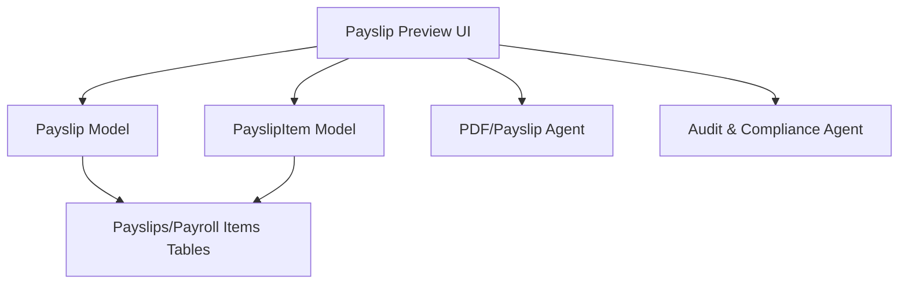

# Payslip Preview Interface

<cite>
**Referenced Files in This Document**
- [AGENTS.md](file://AGENTS.md)
- [0001_01_01_000009_create_payslips_tables.php](file://database/migrations/0001_01_01_000009_create_payslips_tables.php)
- [Payslip.php](file://app/Models/Payslip.php)
- [PayslipItem.php](file://app/Models/PayslipItem.php)
</cite>

## Table of Contents
1. [Introduction](#introduction)
2. [Project Structure](#project-structure)
3. [Core Components](#core-components)
4. [Architecture Overview](#architecture-overview)
5. [Detailed Component Analysis](#detailed-component-analysis)
6. [Dependency Analysis](#dependency-analysis)
7. [Performance Considerations](#performance-considerations)
8. [Troubleshooting Guide](#troubleshooting-guide)
9. [Conclusion](#conclusion)

## Introduction
This document describes the Payslip Preview interface component responsible for displaying and managing payslip generation and review processes. It explains the payslip layout structure, real-time preview functionality, editing capabilities before finalization, PDF export options, and the snapshot mechanism for finalized payslips. It also documents the relationship between preview data and the underlying payslip database records, validation processes, and the workflow from preview to finalization. Finally, it provides user guidance for reviewing payslip details and making corrections.

## Project Structure
The Payslip Preview interface integrates with the domain model and migration schema defined in the repository. The core data model consists of two primary entities:
- Payslip: represents a single payslip record with metadata, totals, and status.
- PayslipItem: represents individual income and deduction line items associated with a payslip.

These entities are persisted via dedicated database tables with foreign key relationships and constraints ensuring referential integrity and uniqueness.

```mermaid
erDiagram
PAYSLIPS {
bigint id PK
bigint employee_id FK
bigint payroll_batch_id
int month
int year
decimal total_income
decimal total_deduction
decimal net_pay
string status
timestamp finalized_at
bigint finalized_by
date payment_date
json meta
timestamps
}
PAYSLIP_ITEMS {
bigint id PK
bigint payslip_id FK
string category
string label
decimal amount
int sort_order
timestamps
}
PAYSLIPS ||--o{ PAYSLIP_ITEMS : "has many"
```

**Diagram sources**
- [0001_01_01_000009_create_payslips_tables.php:11-31](file://database/migrations/0001_01_01_000009_create_payslips_tables.php#L11-L31)
- [0001_01_01_000009_create_payslips_tables.php:33-43](file://database/migrations/0001_01_01_000009_create_payslips_tables.php#L33-L43)

**Section sources**
- [0001_01_01_000009_create_payslips_tables.php:11-51](file://database/migrations/0001_01_01_000009_create_payslips_tables.php#L11-L51)

## Core Components
The Payslip Preview interface relies on the following core components:

- Payslip Model
  - Stores payslip metadata including employee association, payroll batch linkage, month/year, financial totals, status, finalization details, payment date, and rendering metadata.
  - Provides relationships to Employee, PayrollBatch, and PayslipItem collections, including filtered collections for income and deductions ordered by sort order.

- PayslipItem Model
  - Represents individual line items with category (income/deduction), label, amount, and sort order.
  - Belongs to a Payslip and participates in the snapshot mechanism upon finalization.

- Database Schema
  - Enforces uniqueness of payslips per employee per month/year.
  - Maintains referential integrity via foreign keys.
  - Supports snapshot storage via JSON meta and cascading deletion for items.

**Section sources**
- [Payslip.php:9-56](file://app/Models/Payslip.php#L9-L56)
- [PayslipItem.php:9-20](file://app/Models/PayslipItem.php#L9-L20)
- [0001_01_01_000009_create_payslips_tables.php:11-51](file://database/migrations/0001_01_01_000009_create_payslips_tables.php#L11-L51)

## Architecture Overview
The Payslip Preview interface follows a structured workflow from data entry to finalization and export. The process emphasizes real-time preview, inline editing, instant recalculation, and immutable snapshots for finalized payslips.



**Diagram sources**
- [AGENTS.md:245-256](file://AGENTS.md#L245-L256)
- [AGENTS.md:354-359](file://AGENTS.md#L354-L359)
- [Payslip.php:27-56](file://app/Models/Payslip.php#L27-L56)

## Detailed Component Analysis

### Payslip Layout Structure
The payslip layout is designed around a clear separation of income and deductions, with supporting metadata and totals. The structure includes:
- Company header
- Employee details
- Month and payment date
- Bank/account information
- Left column for incomes
- Right column for deductions
- Totals section
- Signatures area

This structure ensures readability and compliance with typical payslip expectations while allowing customization via rendering metadata stored in the payslip record.

**Section sources**
- [AGENTS.md:551-561](file://AGENTS.md#L551-L561)

### Real-Time Preview Functionality
Real-time preview is achieved through immediate recalculation after inline edits. The system supports:
- Inline editing of items
- Instant recalculation of totals
- Immediate preview refresh
- Clear labeling of item sources and states

This enables users to validate changes quickly and maintain confidence in the accuracy of the payslip before finalization.

**Section sources**
- [AGENTS.md:237-244](file://AGENTS.md#L237-L244)
- [AGENTS.md:514](file://AGENTS.md#L514)

### Editing Capabilities Before Finalization
Editing during the draft phase supports:
- Adding/removing/updating items
- Manual overrides
- Category assignment (income/deduction)
- Sorting and ordering
- Source tagging (auto/manual/override/master)

These capabilities are enforced by the domain model’s relationships and the database schema’s sort order field, ensuring consistent ordering and categorization.

**Section sources**
- [Payslip.php:37-50](file://app/Models/Payslip.php#L37-L50)
- [PayslipItem.php:9-20](file://app/Models/PayslipItem.php#L9-L20)

### PDF Export Options
PDF export is performed by the PDF/Payslip Agent, which renders from the finalized snapshot. The agent:
- Reads payslips and payslip_items
- Renders according to organizational templates
- Generates PDFs with Thai language support
- Uses snapshot data to prevent retroactive changes

This ensures legal and audit-ready documents derived from immutable records.

**Section sources**
- [AGENTS.md:245-256](file://AGENTS.md#L245-L256)

### Snapshot Mechanism for Finalized Payslips
Upon finalization, the system creates a snapshot to preserve the state of the payslip:
- Copy items to payslip_items
- Store totals and rendering metadata
- Mark status as finalized with timestamp and author
- PDF rendering references snapshot data

This guarantees immutability and traceability for historical reporting and compliance.

**Section sources**
- [AGENTS.md:567-573](file://AGENTS.md#L567-L573)
- [Payslip.php:9-25](file://app/Models/Payslip.php#L9-L25)

### Relationship Between Preview Data and Database Records
Preview data originates from the payslip and its items:
- The payslip record holds metadata, totals, and status
- The items collection provides categorized entries ordered by sort order
- Relationships enable navigation from payslip to items and vice versa

This design ensures that previews reflect current database state and that edits propagate consistently.

**Section sources**
- [Payslip.php:27-56](file://app/Models/Payslip.php#L27-L56)
- [PayslipItem.php:16-20](file://app/Models/PayslipItem.php#L16-L20)

### Validation Processes
Validation is enforced through:
- Unique constraint on employee/month/year to prevent duplicates
- Foreign key constraints to maintain referential integrity
- Status transitions (draft to finalized) governed by business rules
- Audit logging for significant changes (per audit requirements)

These mechanisms protect data integrity and support compliance.

**Section sources**
- [0001_01_01_000009_create_payslips_tables.php:30](file://database/migrations/0001_01_01_000009_create_payslips_tables.php#L30)
- [AGENTS.md:578-595](file://AGENTS.md#L578-L595)

### Workflow From Preview to Finalization
The end-to-end workflow is:
- Load payroll data and render preview
- Review and edit items inline
- Recalculate and confirm totals
- Save draft
- Finalize payslip (snapshot creation)
- Export PDF from snapshot

This workflow aligns with the documented Employee Workspace and Payroll Entry Flow.

**Section sources**
- [AGENTS.md:514](file://AGENTS.md#L514)
- [AGENTS.md:318](file://AGENTS.md#L318)

### User Guidance for Reviewing Payslip Details and Making Corrections
Users should:
- Verify employee details and month/year
- Confirm income and deduction categories and amounts
- Check totals and payment date
- Use source badges to understand item origins
- Apply manual overrides only when necessary
- Review audit history for transparency
- Finalize only after confirming accuracy

This guidance ensures correctness and compliance.

**Section sources**
- [AGENTS.md:237-244](file://AGENTS.md#L237-L244)
- [AGENTS.md:539-546](file://AGENTS.md#L539-L546)

## Dependency Analysis
The Payslip Preview interface depends on:
- Payslip model for metadata and totals
- PayslipItem model for line items and ordering
- Database schema for persistence and constraints
- PDF/Payslip Agent for rendering finalized payslips
- Audit system for logging changes



**Diagram sources**
- [Payslip.php:27-56](file://app/Models/Payslip.php#L27-L56)
- [PayslipItem.php:16-20](file://app/Models/PayslipItem.php#L16-L20)
- [0001_01_01_000009_create_payslips_tables.php:11-51](file://database/migrations/0001_01_01_000009_create_payslips_tables.php#L11-L51)
- [AGENTS.md:257-271](file://AGENTS.md#L257-L271)

**Section sources**
- [Payslip.php:9-56](file://app/Models/Payslip.php#L9-L56)
- [PayslipItem.php:9-20](file://app/Models/PayslipItem.php#L9-L20)
- [0001_01_01_000009_create_payslips_tables.php:11-51](file://database/migrations/0001_01_01_000009_create_payslips_tables.php#L11-L51)
- [AGENTS.md:257-271](file://AGENTS.md#L257-L271)

## Performance Considerations
- Keep item counts reasonable to avoid heavy recalculation cycles.
- Use efficient queries leveraging the sort_order index and category filters.
- Minimize unnecessary re-renders by debouncing inline edits.
- Cache frequently accessed metadata to reduce database load.

## Troubleshooting Guide
Common issues and resolutions:
- Duplicate payslips: Ensure unique constraint prevents multiple records for the same employee/month/year.
- Missing items: Verify foreign key relationships and that items are ordered by sort_order.
- Finalization errors: Confirm audit logs and permissions; ensure snapshot creation completes successfully.
- PDF rendering failures: Validate snapshot meta and item completeness.

**Section sources**
- [0001_01_01_000009_create_payslips_tables.php:30](file://database/migrations/0001_01_01_000009_create_payslips_tables.php#L30)
- [AGENTS.md:567-573](file://AGENTS.md#L567-L573)

## Conclusion
The Payslip Preview interface provides a robust, auditable, and user-friendly pathway for generating, reviewing, editing, and finalizing payslips. Its design centers on real-time feedback, clear item categorization, immutable snapshots, and compliant PDF export. By adhering to the documented structure and workflow, users can confidently manage payslip processes while maintaining data integrity and compliance.